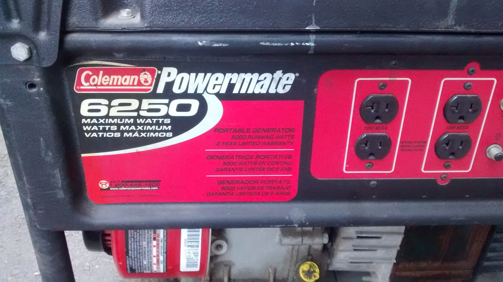
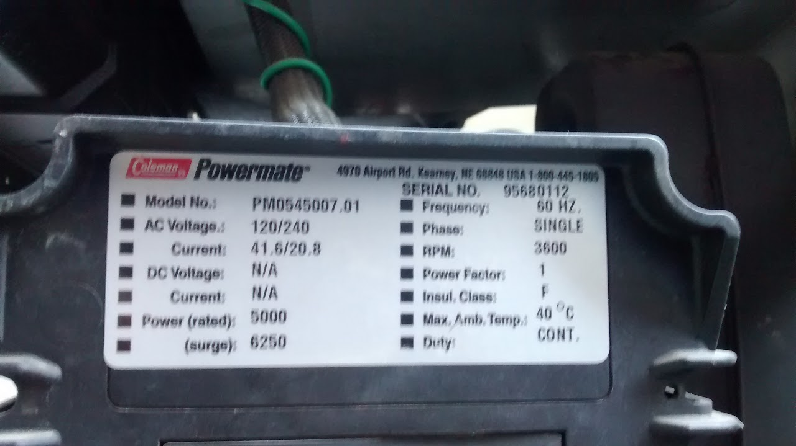

# generators

## SSCP - Generators

## Generators

### Honda Generator

When fuel is left in the carburetor it gets gummed up. At the end of a race when you are done running the generator you should run it out of fuel to prevent it from settling in the carburetor and getting gummed up. Simply turn the fuel line off and run the generator until it stops. Alternatively, you can turn the fuel line off, open the red door on the side of the generator, unscrew the set screw at the bottom of the generator and allow the fuel to drain out the drain tube. Make sure you close the set screw on the carburetor when you are finished. When you are about to store the generator for a long time drain all of the fuel from the fuel tank. Use the old fuel in the van and then store the generator dry. To start after the generator has been sitting clean the carburetor (use carburetor cleaner aerosol it’s mostly acetone), fuel lines, change the oil, and replace the fuel. The generator had seasonal maintenance performed in August 2012: fuel replaced, carburetor cleaned, fuel filter cleaned, spark arrester cleaned, carburetor tuned, spark plug check, oil check, choke cleaned, http://m.powerequipment.honda.com/pdf/manuals/31ZT7601.pdf&#x20;

Repaired in Santa Clara in early July, 2015. Repairs included fuel valve tuning, air filter replacement, oil change, general cleaning.&#x20;

