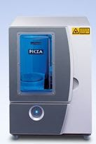
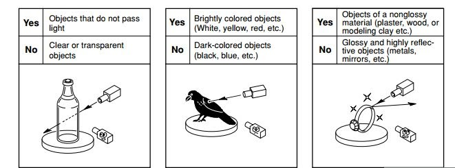
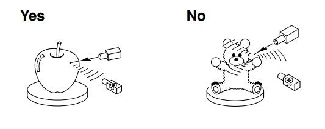
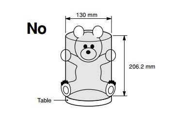
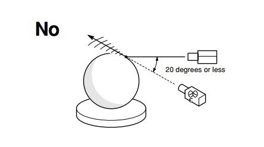

# SSCP - Roland LPX-1200DS

# Roland LPX-1200DS

Important limitations for the scanner:

1. No clear or translucent objects

2. Has to have a smooth surface.

3. Size

4. Cut off Angle ( the scanner seems to be able to do 10 degrees just fine, but you lose accuracy)

Installation of the software for  the LPX-1200.

1. Download the Roland LPX-1200ds folder from the ftp server under software.

2. Run the setup.exe inside the rapidform XOR3/XOR3_sp1  folder.

3. Follow the instructions in the legend folder to finish the installation of Rapidform.

4. Install the drivers for the scanner from the  RWD-070_V091_driver_lpx1200_x64 folder.

5. Install Roland Direct control  from the folder.

To use the scanner:

Place your object in the scanner. The scan start above the base, so if you want to measure an entire object you have to place it on something to lift it up and edit out the bottom later in software.

1. Open Rapidform  

2. Go to Insert/Scanner Direct Control/Roland LPX

3. Make sure the scanner is on and calibrated. Select the correct port and connect to the scanner

4. You have two options for the scanning: planar and normal circular

5. Set the height of the scan and adjust the resolution as necessary. 

6. Click the preview button to do a quick scan of the item to make sure the height set will scan the whole object. 

7. Start the final scan.

8.  Important: Make sure you run the wizard after the scan and smooth out the scan. Otherwise the surface will be very messy.

9. Export to Solidworks.

