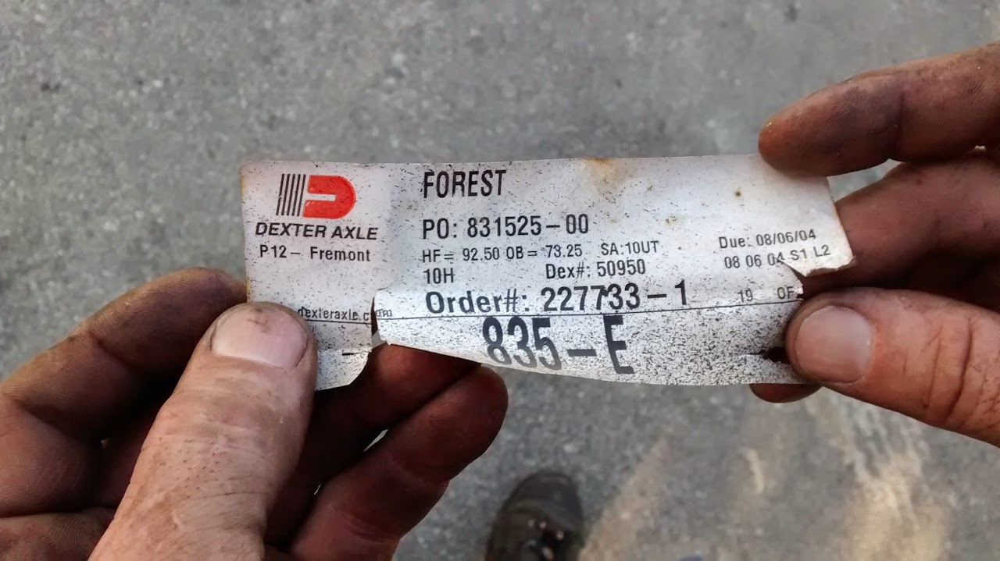

# SSCP - Trailer

# Trailer

History

The trailer was given to us out of pity by the DARPA Grand Challenge Team - we used to own the entirety of site 525 - when they stole a bay, they bought us a trailer to store our extra vehicles and stuff. The trailer was purchased in 2004. Details about the purchase are fuzzy. The team picked up the trailer in Oregon (There is a Continental Cargo Manufacturer in Oregon), but Continental Cargo told us that we purchased the trailer from Leisure Products in Florida based on the trailer's VIN number. 

This is the trailer that the team currently has

VIN 5NHUAPZ205T602525

License 4DJ1047

It is an Auto Plus Trailer. Records from Continental Cargo in Oregon say that it was originally purchased from Leisure Products in Florida. We picked up the trailer in Oregon, so I'm not sure why it was purchased through a dealer in Florida.

Here is an email from the Fleet Garage explaining why we can't register the trailer:

I spoke with the DMV again.  Their records on your trailer show that Stanford is not the legal owner.  It is owned by a private party.  If the private party is the one that the Racing Team acquired the trailer from, they never filed a transfer of ownership.  Unfortunately, due to California State Privacy Laws, the DMV is forbidden from revealing who the owner is.

Also, even if we had proof of ownership, there are several things we would have to do to get it registered.  We would have to get VIN Verification done.  We would have to tow the trailer to an official weigh station to get a Weight Certificate.  And, according to the DMV, we would have to pay registration fees, taxes, and late penalties that would amount to about $4000 to $5000.  Since we have no documentation or files on the trailer, we would not be able to complete the paperwork for the DMV.  Since the registration of the trailer means that we would get a title, you have to keep in mind that the DMV does not issue a title without complete and accurate information.

I have been working on trying to get some of the Grounds Department trailers registered.  These have been on campus for 10 to 15 years.  There are four for which we have no documentation, no files and no proof of ownership.  We have found that the only route left open to us is to scrap these trailers and buy new ones, making sure that the new trailers are properly registered from the beginning.

Fleet garage vehicle #975 is a trailer that the team once owned, but no longer owns. The trailer was stolen in 2004 or 2005 when the lock on the trailer was cut. The trailer was stolen with a solar car inside. (Fleet garage vehicle #987 is the solar car.)

Information on Wheels

* The wheel size is 15"x5". The bolt pattern is what they call 5 on 4.5 (5 bolts, with a bolt diameter of 4.5"). The center bore of the wheel is 3.3".
* The wheels currently on the trailer and used as backups are at least 11 years old as of June 2015. All appear in good condition as of last look-over. One wheel has been manually hammered back into shape near the outer rim. 
* The trailer currently has two 15x6 wheels in addition to our 5 15x5 wheels. 

The wheel size is 15"x5". The bolt pattern is what they call 5 on 4.5 (5 bolts, with a bolt diameter of 4.5"). The center bore of the wheel is 3.3".

The wheels currently on the trailer and used as backups are at least 11 years old as of June 2015. All appear in good condition as of last look-over. One wheel has been manually hammered back into shape near the outer rim. 

The trailer currently has two 15x6 wheels in addition to our 5 15x5 wheels. 

Information on Tires

* Tire size is 205/75 R15, Load class C at 1820 max lbsHistorically, the trailer has used load class C, 6-ply tires, at 50PSI for a load capacity of 1820lbs each. As of June 18, 2015, the trailer rolls on four 8-ply load class D 65PSI tires of the same size, an upgrade from the Load C 6-ply tires. ST tires are standard trailer tires, P tires are for passenger vehicles. ST are recommended as the trailer is loaded heavily sometimes.  ST tires have a maximum rated speed of 65 mph.  Recommend cruising at 60 mph and having 65 mph be a hard speed limit.  See other facts at http://www.discounttire.com/dtcs/infoTrailerTireFacts.do.More info on ST Tires: http://www.tirerack.com/tires/tiretech/techpage.jsp?techid=219
* Tire size is 205/75 R15, Load class C at 1820 max lbs
* Historically, the trailer has used load class C, 6-ply tires, at 50PSI for a load capacity of 1820lbs each. 
* As of June 18, 2015, the trailer rolls on four 8-ply load class D 65PSI tires of the same size, an upgrade from the Load C 6-ply tires. 
* ST tires are standard trailer tires, P tires are for passenger vehicles. ST are recommended as the trailer is loaded heavily sometimes.  ST tires have a maximum rated speed of 65 mph.  Recommend cruising at 60 mph and having 65 mph be a hard speed limit.  See other facts at http://www.discounttire.com/dtcs/infoTrailerTireFacts.do.
* More info on ST Tires: http://www.tirerack.com/tires/tiretech/techpage.jsp?techid=219

* Tire size is 205/75 R15, Load class C at 1820 max lbs
* Historically, the trailer has used load class C, 6-ply tires, at 50PSI for a load capacity of 1820lbs each. 
* As of June 18, 2015, the trailer rolls on four 8-ply load class D 65PSI tires of the same size, an upgrade from the Load C 6-ply tires. 
* ST tires are standard trailer tires, P tires are for passenger vehicles. ST are recommended as the trailer is loaded heavily sometimes.  ST tires have a maximum rated speed of 65 mph.  Recommend cruising at 60 mph and having 65 mph be a hard speed limit.  See other facts at http://www.discounttire.com/dtcs/infoTrailerTireFacts.do.
* More info on ST Tires: http://www.tirerack.com/tires/tiretech/techpage.jsp?techid=219

Tire size is 205/75 R15, Load class C at 1820 max lbs

Historically, the trailer has used load class C, 6-ply tires, at 50PSI for a load capacity of 1820lbs each. 

As of June 18, 2015, the trailer rolls on four 8-ply load class D 65PSI tires of the same size, an upgrade from the Load C 6-ply tires. 

ST tires are standard trailer tires, P tires are for passenger vehicles. ST are recommended as the trailer is loaded heavily sometimes.  ST tires have a maximum rated speed of 65 mph.  Recommend cruising at 60 mph and having 65 mph be a hard speed limit.  See other facts at http://www.discounttire.com/dtcs/infoTrailerTireFacts.do.

More info on ST Tires: http://www.tirerack.com/tires/tiretech/techpage.jsp?techid=219

Loading the Trailer

It is desired to have 10-12% of the trailer's weight on the tongue for optimal handling.  Having too much tongue weight will decrease the tow vehicle's handling and facilitate swaying.  Our trailer weights 3,095 pounds (not considering the team's additions. Fully loaded for test drives, we've estimated it to weigh 4,000 pounds.  When loading the trailer, use a tongue scale to make sure the tongue weight stays at 400 pounds.  Putting heavy items on the front shelves, such as the trailer tire spares, will ruin tongue weight.

Accident History

1. In June 2013, the trailer had a sudden tire explosion/flat. The team had to replace the tire on the side of the highway.
2. On June 17th and 18th, 2015, the trailer experience two tire blowouts. The first was a total rupture of the rear left tire. No information is known about this tire but it is theorized and likely that this tire was manufactured in 2011.
3. June 18th, 2015: The second tire blowout, on the right-front, was a  side wall rupture, which is usually caused by overloading or side impact. This tire was connected to the same axle as the first tire that blew out, and so may have been overloaded for however many miles it took to notice the first blowout. The second tire failed the day after the first. 

In June 2013, the trailer had a sudden tire explosion/flat. The team had to replace the tire on the side of the highway.

On June 17th and 18th, 2015, the trailer experience two tire blowouts. The first was a total rupture of the rear left tire. No information is known about this tire but it is theorized and likely that this tire was manufactured in 2011.

June 18th, 2015: The second tire blowout, on the right-front, was a  side wall rupture, which is usually caused by overloading or side impact. This tire was connected to the same axle as the first tire that blew out, and so may have been overloaded for however many miles it took to notice the first blowout. The second tire failed the day after the first. 

More Detailed Repair History

After our accident in June 2013, the trailer torque-flex rear axles was permanently bent upwards, leaving the trailer riding a few inches lower on the right-rear. As of August 10, the torque-flex axle has been ordered and repairs will be completed for a total of $1400+ or so by A&B Trailer Hitch, Inc. as recommended by the Stanford Fleet Garage. For future replacement of this torque-flex axle, use the part number below. Receipt for services completed is attached below.

### Embedded Google Drive File

Google Drive File: [Embedded Content](https://drive.google.com/embeddedfolderview?id=16pzbbKnLyny21aIOyXWNArjG1FuzGuFN#list)

<iframe width="100%" height="400" src="https://drive.google.com/embeddedfolderview?id=16pzbbKnLyny21aIOyXWNArjG1FuzGuFN#list" frameborder="0"></iframe>

