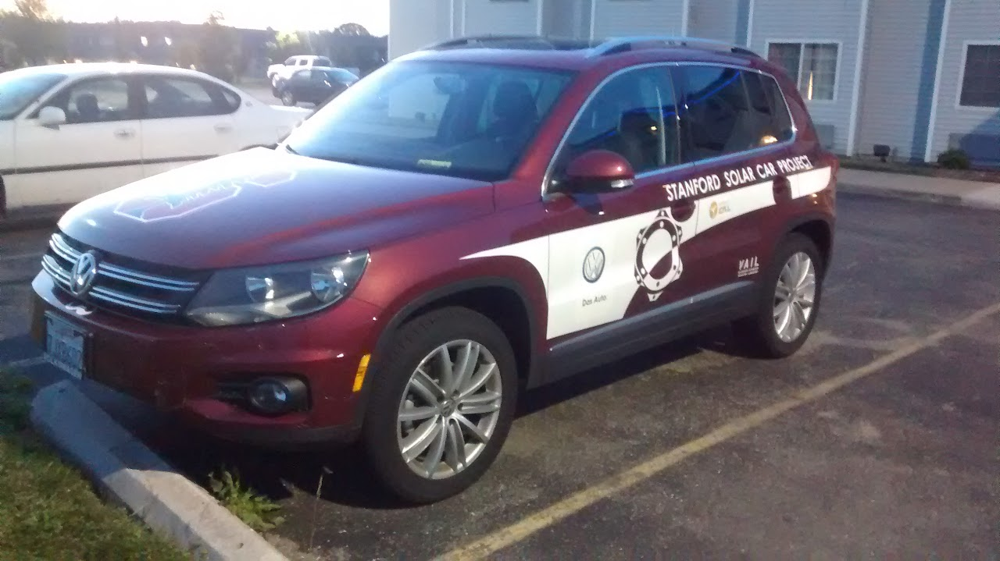
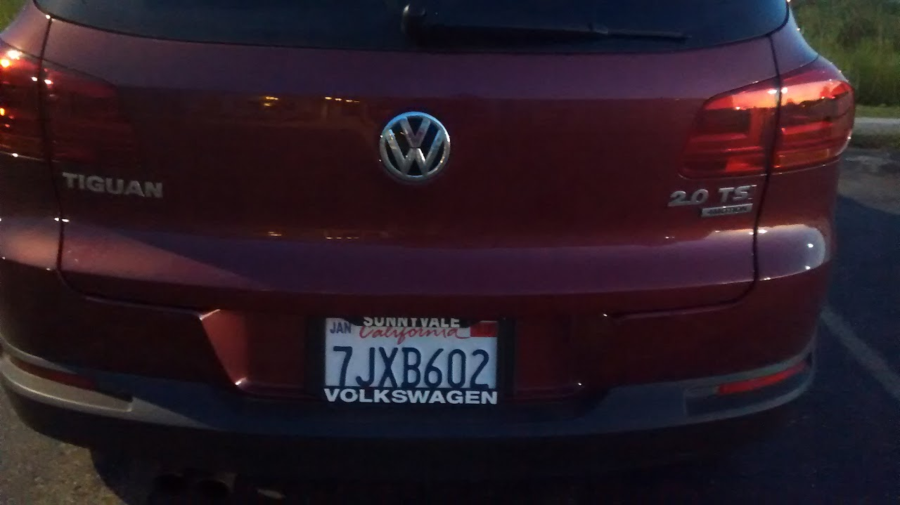
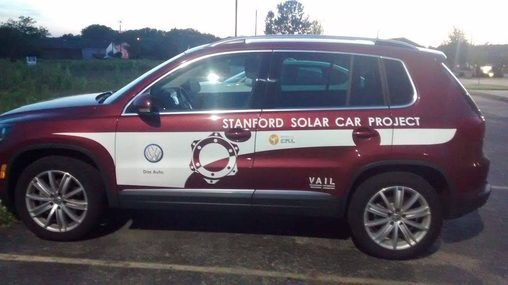

# volkswagen-tiguan

## SSCP - Volkswagen Tiguan

## Volkswagen Tiguan

The rules for the Tiguan are governed by the Stanford and VW policies attached to this page. Here are some additional Solar Car specific rules.&#x20;

1. It's really nice and basically brand new. Please don't beat it up, but just tell the Team Lead if there is any damage on the vehicle.
2. You must be 21 and have a valid drivers license to drive the Tiguan. This is an explicit part of our new contract with VW. This is really a big deal. If you drive the car and you're not 21 with a valid drivers license bad things will happen.
3. You cannot use the Tiguan for personal trips. We have to report all of the trips that we take to VW.
4. You cannot drive the team vehicles while under the influence of drugs or alcohol. Do not drive the team vehicles while sleep deprived or otherwise impaired.&#x20;
5. You need to fill out the attached form and send  a scanned image of your drivers license if you will drive either the van or the Tiguan at any point this year.
6. Please call, text, or email the Team Lead before you take either of the team vehicles to run errands for the team.
7. Drivers will be partially to fully, depending on the incident, responsible for traffic infractions and tickets while driving the team vehicles.
8. If you somehow get in an accident please let the Team Lead  know immediately. There is an accident report form in the vehicle that you will need to complete immediately, and we have to notify VW and the University within 24 hours.
9. Please don't remove the registration, insurance, and mileage log in the glove box.
10. Do not take the team vehicles out of the US. Especially don't take the vehicles into Mexico.
11. Abide by all laws and Stanford policies regarding vehicle use. We'll be asking for another four vehicles to use in Australia, so we don't want to create problems for the University or VW.
12. You must always wear seat belts while in team vehicles.
13. Please don't drive the team vehicles if you think you're a bad driver. :)
14. Make sure you read and comply with all of the documentation attached to this page.

Note: In 2013 the team had a Jetta Sportwagon TDI, in 2015 our car is a Tiguan. Same rules apply.&#x20;

License

CA 7JXB602

Mileage Log

* 1156 miles as of June 4 2015
* &#x20;6454 as of 9:15AM Mountain Time, June 24 2015

1156 miles as of June 4 2015

&#x20;6454 as of 9:15AM Mountain Time, June 24 2015

#### Embedded Google Drive File

Google Drive File: [Embedded Content](https://drive.google.com/embeddedfolderview?id=1DGsXngbu9NXbCSDGo8_AknE5OHUdX7GR#list)
