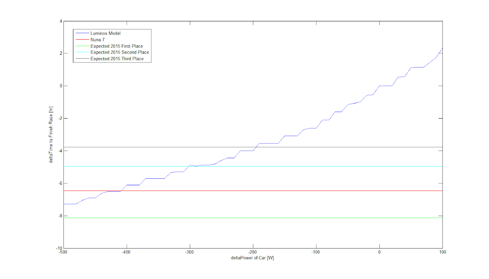

# design-metrics

## SSCP - Design Metrics

## Design Metrics

Luminos  - "The Numbers"

* 0.365 W / kg, or 2.74 kg / W (calculation at Luminos cruise speed. See this page on tires for the Crr value and explanation of Michelin tires)F\_crr = Crr \* m \* gP\_crr = F\_crr \* vP\_crr / m = Crr \* v \* g = (0.0013 \* 1.40 \* 0.976) \* 21 m/s \* 9.81 m/s^2 = 0.34 W/kgCrr scaled by 140% for road surface, 97.6% for temperature effectsUse this number carefully. As an example, 1kg could cost more than this nominal value because it causes the motor to change efficiency points, higher power draw during acceleration, etc. Gravity is a conservative force, but Crr losses are not - and thus weight is more detrimental than this value when the elevation profile has a non-zero area under it.
* F\_crr = Crr \* m \* g
* P\_crr = F\_crr \* v
* P\_crr / m = Crr \* v \* g = (0.0013 \* 1.40 \* 0.976) \* 21 m/s \* 9.81 m/s^2 = 0.34 W/kgCrr scaled by 140% for road surface, 97.6% for temperature effects
* Crr scaled by 140% for road surface, 97.6% for temperature effects
* Use this number carefully. As an example, 1kg could cost more than this nominal value because it causes the motor to change efficiency points, higher power draw during acceleration, etc. Gravity is a conservative force, but Crr losses are not - and thus weight is more detrimental than this value when the elevation profile has a non-zero area under it.
* 1.17 kW to drive at Luminos average cruise speed
* 41.3 kWh array power collected during WSC2013
* 43.8 kWh delivered to motors during WSC2013
* 2.73 kWh delivered to car electrical system during WSC2013
* 47.9 W average delivered to electrical systemEquivalent to 131 kg We broke down the power consumption of the electrical system. Here are the results.
* Equivalent to 131 kg&#x20;
* We broke down the power consumption of the electrical system. Here are the results.
* Array standing in the mornings yielded anywhere between 60-80% of the peak array power (about 1050W in South Australia), for approximately 1.75 hours.
* 25 degree sun angle from horizontal at 8AM, 30 degree sun angle from horizontal at 5pm
* 1kph \~= 32W for small deviations from 75kph cruise speed for LuminosAgain, this is based on Luminos' power to drive model, and is only true locally around 75kph
* Again, this is based on Luminos' power to drive model, and is only true locally around 75kph
* Aero Power Draw = 0.191&#x36;_&#x78;^3-4.947&#x31;_&#x78;^2+70.0898\*x+3.0538, calculated by subtracting theoretical Crr losses from the measured dataNot all factors are separated out in this model. Things still encompassed:Drivetrain inefficiencySpinning wheel dragBearing lossesHeavily dependent on Crr of tiresOnly should be considered between \~17-27 m/s (where power consumption was actually measured)
* Not all factors are separated out in this model. Things still encompassed:Drivetrain inefficiencySpinning wheel dragBearing losses
* Drivetrain inefficiency
* Spinning wheel drag
* Bearing losses
* Heavily dependent on Crr of tires
* Only should be considered between \~17-27 m/s (where power consumption was actually measured)
* 1.3 min / W - the change in power consumption of car vs. change in time to finish race. See "deltaTime\_vs\_deltaPower.m" in SVNBased on Luminos strategy simulations, changing a steady-state power draw. The 1.3 number is only true local to Luminos' performance in WSC. Figures over a wider range are shown belowQuantization caused by speed being represented as whole numbersExpected 2015 placings are based on a 5% improvement in finishing time over the 2013 podium finishers.
* Based on Luminos strategy simulations, changing a steady-state power draw.&#x20;
* The 1.3 number is only true local to Luminos' performance in WSC. Figures over a wider range are shown below
* Quantization caused by speed being represented as whole numbers
* Expected 2015 placings are based on a 5% improvement in finishing time over the 2013 podium finishers.

0.365 W / kg, or 2.74 kg / W (calculation at Luminos cruise speed. See this page on tires for the Crr value and explanation of Michelin tires)

[this](../../../../stanford.edu/testduplicationsscp/home/sscp-2012-2013/mechanical-2012-2013/mechanical-team-projects/tires/)

* F\_crr = Crr \* m \* g
* P\_crr = F\_crr \* v
* P\_crr / m = Crr \* v \* g = (0.0013 \* 1.40 \* 0.976) \* 21 m/s \* 9.81 m/s^2 = 0.34 W/kgCrr scaled by 140% for road surface, 97.6% for temperature effects
* Crr scaled by 140% for road surface, 97.6% for temperature effects
* Use this number carefully. As an example, 1kg could cost more than this nominal value because it causes the motor to change efficiency points, higher power draw during acceleration, etc. Gravity is a conservative force, but Crr losses are not - and thus weight is more detrimental than this value when the elevation profile has a non-zero area under it.

F\_crr = Crr \* m \* g

P\_crr = F\_crr \* v

P\_crr / m = Crr \* v \* g = (0.0013 \* 1.40 \* 0.976) \* 21 m/s \* 9.81 m/s^2 = 0.34 W/kg

* Crr scaled by 140% for road surface, 97.6% for temperature effects

Crr scaled by 140% for road surface, 97.6% for temperature effects

Use this number carefully. As an example, 1kg could cost more than this nominal value because it causes the motor to change efficiency points, higher power draw during acceleration, etc. Gravity is a conservative force, but Crr losses are not - and thus weight is more detrimental than this value when the elevation profile has a non-zero area under it.

1.17 kW to drive at Luminos average cruise speed

41.3 kWh array power collected during WSC2013

43.8 kWh delivered to motors during WSC2013

2.73 kWh delivered to car electrical system during WSC2013

47.9 W average delivered to electrical system

* Equivalent to 131 kg&#x20;
* We broke down the power consumption of the electrical system. Here are the results.

Equivalent to 131 kg&#x20;

We broke down the power consumption of the electrical system. Here are the results.

[Here](../../../../stanford.edu/testduplicationsscp/home/sscp-2012-2013/electrical-2012-2013/luminos-low-voltage-electrical-draw/)

Array standing in the mornings yielded anywhere between 60-80% of the peak array power (about 1050W in South Australia), for approximately 1.75 hours.

25 degree sun angle from horizontal at 8AM, 30 degree sun angle from horizontal at 5pm

1kph \~= 32W for small deviations from 75kph cruise speed for Luminos

* Again, this is based on Luminos' power to drive model, and is only true locally around 75kph

Again, this is based on Luminos' power to drive model, and is only true locally around 75kph

Aero Power Draw = 0.191&#x36;_&#x78;^3-4.947&#x31;_&#x78;^2+70.0898\*x+3.0538, calculated by subtracting theoretical Crr losses from the measured data

* Not all factors are separated out in this model. Things still encompassed:Drivetrain inefficiencySpinning wheel dragBearing losses
* Drivetrain inefficiency
* Spinning wheel drag
* Bearing losses
* Heavily dependent on Crr of tires
* Only should be considered between \~17-27 m/s (where power consumption was actually measured)

Not all factors are separated out in this model. Things still encompassed:

* Drivetrain inefficiency
* Spinning wheel drag
* Bearing losses

Drivetrain inefficiency

Spinning wheel drag

Bearing losses

Heavily dependent on Crr of tires

Only should be considered between \~17-27 m/s (where power consumption was actually measured)

1.3 min / W - the change in power consumption of car vs. change in time to finish race. See "deltaTime\_vs\_deltaPower.m" in SVN

* Based on Luminos strategy simulations, changing a steady-state power draw.&#x20;
* The 1.3 number is only true local to Luminos' performance in WSC. Figures over a wider range are shown below
* Quantization caused by speed being represented as whole numbers
* Expected 2015 placings are based on a 5% improvement in finishing time over the 2013 podium finishers.

Based on Luminos strategy simulations, changing a steady-state power draw.&#x20;

The 1.3 number is only true local to Luminos' performance in WSC. Figures over a wider range are shown below

Quantization caused by speed being represented as whole numbers

Expected 2015 placings are based on a 5% improvement in finishing time over the 2013 podium finishers.

* Average bearing of 162.5 degrees over the course of WSC2013's route. See "averageBearing.m" in SVNIf used for solar modeling, a better metric would factor in the change in intensity of sunlight, but this is a good starting point.Luminos' rim deflects 7mm under a load that is comparable to cornering. See this page..
* Average bearing of 162.5 degrees over the course of WSC2013's route. See "averageBearing.m" in SVNIf used for solar modeling, a better metric would factor in the change in intensity of sunlight, but this is a good starting point.
* If used for solar modeling, a better metric would factor in the change in intensity of sunlight, but this is a good starting point.
* Luminos' rim deflects 7mm under a load that is comparable to cornering. See this page..
* Average bearing of 162.5 degrees over the course of WSC2013's route. See "averageBearing.m" in SVNIf used for solar modeling, a better metric would factor in the change in intensity of sunlight, but this is a good starting point.
* If used for solar modeling, a better metric would factor in the change in intensity of sunlight, but this is a good starting point.
* Luminos' rim deflects 7mm under a load that is comparable to cornering. See this page..

Average bearing of 162.5 degrees over the course of WSC2013's route. See "averageBearing.m" in SVN

* If used for solar modeling, a better metric would factor in the change in intensity of sunlight, but this is a good starting point.

If used for solar modeling, a better metric would factor in the change in intensity of sunlight, but this is a good starting point.

Luminos' rim deflects 7mm under a load that is comparable to cornering. See this page..

[this](../../../../stanford.edu/testduplicationsscp/home/sscp-2014-2015/aero-2014-2015/aerobody-clearances/)

#### Embedded Google Drive File

Google Drive File: [Embedded Content](https://drive.google.com/embeddedfolderview?id=1_5GUgcqDnukPoJGd92svMB5QYk0Ts5YO#list)
