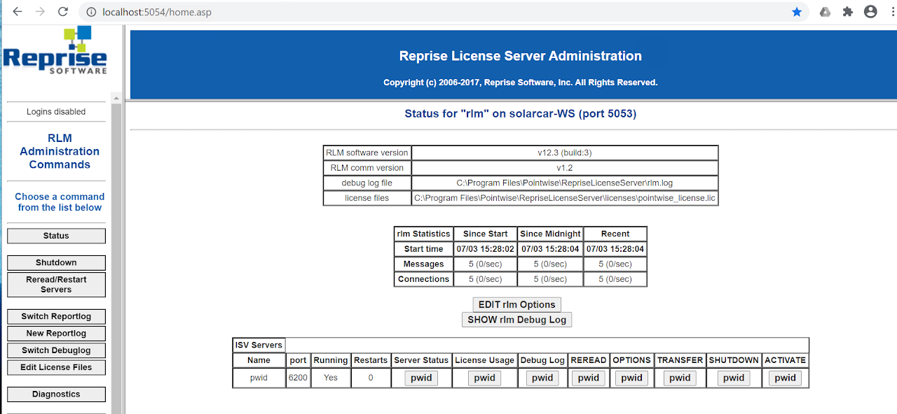
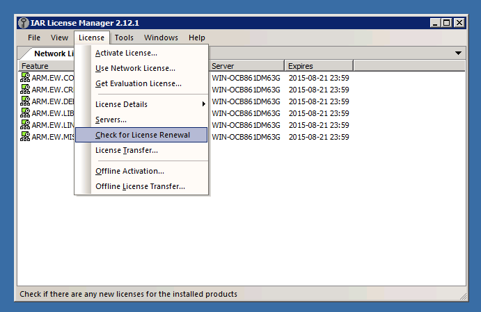
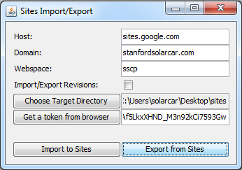
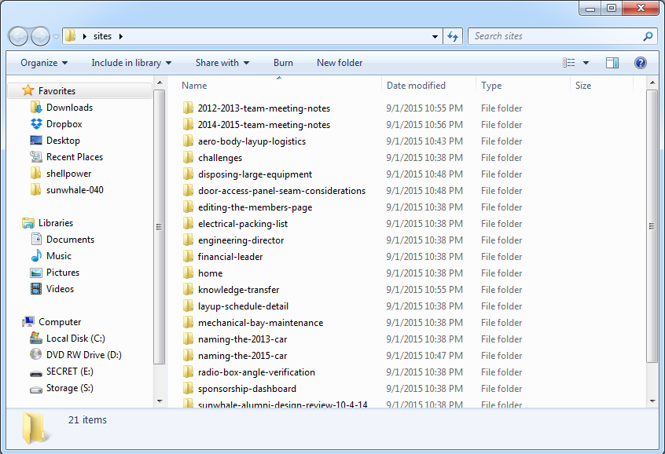

# SSCP - IT Administration

# IT Administration

Please Reach out to the server administrator in case of any questions / clarifications.

Current Server Administrator: Connor

Info about workstations: https://sites.google.com/a/stanfordsolarcar.com/sscp/home/capital-equipment/servers

[ https://sites.google.com/a/stanfordsolarcar.com/sscp/home/capital-equipment/servers](/stanford.edu/testduplicationsscp/home/capital-equipment/servers-and-workstations)

We have two servers. One running Windows and one running Linux. For information about the hardware see here.

[ see here](/stanford.edu/testduplicationsscp/home/capital-equipment/servers-and-workstations)

When making a windows server firewall rule, you'll also have to talk to School of Engineering IT to make a firewall rule. Our current contact is Alex Keller (axkeller@stanford.edu), he is awesome and super helpful ask the current team server administrator to make an introduction.

To create a local firewall exception. Go to "Windows Defender Firewall and Advanced Security" > New Rule. Look at the Pointwise-5053,6200 on sscp2 as an example

The Windows server runs our Windows-specific software. This includes the IAR license server, Pointwise license server, and the Solidworks PDM.

The Linux server runs our Wordpress blog, SVN, and SFTP. The linux server has a software firewall (ufw) enabled, so make sure to add any additional services to its rules list.

[uf](https://help.ubuntu.com/community/UFW)

TCPView is a useful tool to let you know what ports are being used in your computer and what software is utilising that port. This is a super useful tool for server debugging. On the software, click options > uncheck Resolve Addresses. Next sort by local Port (On host) or Remote host (On Client)

[TCPView](https://docs.microsoft.com/en-us/sysinternals/downloads/tcpview)

Update 5/6/15 - All of our servers and workstations are now behind the Stanford firewall. To access most of the solarcar services, you'll need to be on the Stanford network. If you're off-campus, you'll need to be connected to the Stanford VPN. This is the current Stanford firewall configuration:

[ you'll need to be connected to the Stanford VPN.](https://itservices.stanford.edu/service/vpn)

solarcar.stanford.edu

Stanford all network access:

81 TCP/UDP - SVN

3228 TCP/UDP - Squid

World access:

22 TCP/UDP - SSH

80 TCP/UDP - Our website

443 TCP/UDP - HTTPS (also SVN)

solarcar01.stanford.edu

Stanford all network access:

3389 TCP/UDP - Remote desktop

sscp2.stanford.edu

Stanford all network access:

3389 TCP/UDP - Remote desktop

5053 TCP - Pointwise Reprise License Manager

6200 TCP - Pointwise Client License Latch

27000 TCP - NX UGSLMD

28000 TCP - NX License Manager

sscp4.stanford.edu

Stanford all network access:

3389 TCP/UDP - Remote desktop

2000 TCP/UDP - PDM

30000 TCP/UDP - PDM

40000 TCP/UDP - PDM

World access:

5093 TCP/UDP - IAR licensing server (UDP)

solarcar02.stanford.edu

Currently used as the solarcar router.

[Old] Try to use the email address windowsvm@stanfordsolarcar.com for all for all license-related things.  Password: s0larpower.

[windowsvm@stanfordsolarcar.com](mailto:windowsvm@stanfordsolarcar.com)

[Update 7/3/20] Feel free to use your personal SUID emails. Just be sure to keep this page updated

## Windows Server I (sscp2.stanford.edu)

### What's here

* NX license serverPointwise license server
* Pointwise license server

NX license server

* Pointwise license server

Pointwise license server

### About

The Windows server runs Windows 10. The local hostname is solarcar-WS (NOTE: This is different from its global access name. Use sscp2.stanford.edu for licenses)

Security

Use as few ports as possible. Windows firewall is enabled, so when deploying new license servers, make sure that the correct ports and programs are being let through. To troubleshoot, disable the firewall and see if everything works. Make sure to enable it afterwards. As of May 2015, this server, along with everything else, is behind the Stanford firewall. In addition to making a windows firewall rule, you'll also have to talk to School of Engineering IT to make a firewall rule. 

### Access

To access the Windows server (sscp2.stanford.edu), connect via Remote Desktop. If you're using a Mac, look up "Microsoft Remote Desktop" on the App Store.

### Pointwise license server

Needs port 5053 and 6200 open. I had to manually create a firewall exception rule both on the local host machine and ask University IT to allow access through these ports. You can access the admin dashboard on localhost:5054/home.asp once on the server machine (Can also be found in the start menu under pointwise)

When installing new licenses, be sure to latch the client access port to 6200 (This is a port I filed an exception for, for this specific purpose). This is what the license file looks like and where each port number is entered:

HOST solarcar-WS 90b11c62d156 5053

ISV pwid port=6200

The general format is as below

HOST <license_server_name or ip_address> <license-server-hostid#> <main-rlm-server-port#>

ISV <isvname> <port=isv-port#>

Installation Steps:

1. Install Pointwise RLM as stated in the email instructions they will send you with the license key 

2. Edit license file on the admin dashboard and specify the main-rlm-server-port and isv-port

3. Next press the windows home button and type services. Locate "Pointwise RLM License Server"

4. Right click > stop > wait for a minute > start.

You're all set!

Siemens license server (NX)

Siemens uses the Flexnet license manager.

This is what the license file looks like:

SERVER solarcar-WS COMPOSITE=6AAD62A1D7F7 28000

VENDOR ugslmd

28000 is the port through which the host communicates with the server. Check out the NX Client installation page to see how this is relevant

[ NX Client installation page](/stanford.edu/testduplicationsscp/home/new-member-orientation/installing-software/installing-nx)

For installation steps, check out this google doc. It very extensively documents everything NX licenses

[ check out this google doc](https://docs.google.com/document/d/1DuBGXgYMtzHXC0DMMm8ze9pN6HBiqVJ014c2CXdCpiQ/edit)

## Windows Server II (sscp4.stanford.edu)

### What's here

* IAR license serverLotus SHARK license serverSolidworks PDM
* Lotus SHARK license server
* Solidworks PDM

IAR license server

* Lotus SHARK license server
* Solidworks PDM

Lotus SHARK license server

Solidworks PDM

### About

The Windows server runs Windows 2008R2. It has an SSD where the OS is installed. The PDM vault (and Google Drive) is currently symlinked to a 500GB hard drive.

Security

Use as few ports as possible. Windows firewall is enabled, so when deploying new license servers, make sure that the correct ports and programs are being let through. To troubleshoot, disable the firewall and see if everything works. Make sure to enable it afterwards. As of May 2015, this server, along with everything else, is behind the Stanford firewall. In addition to making a windows firewall rule, you'll also have to talk to School of Engineering IT to make a firewall rule.

### Access

To access the Windows server (sscp4.stanford.edu), connect via Remote Desktop. If you're using a Mac, look up "Microsoft Remote Desktop" on the App Store.

### IAR license server

Make sure to have the latest version of the license manager to be able to use the latest version of the IAR Workbench tool. Visit the server side website for updates

[ server side website](https://www.iar.com/support/tech-notes/licensing/iar-license-server-tools-lms2/)

If you get licensing error messages when trying to use the newest version of IAR, check for a license renewal, like so:

To check for newest version of IAR follow the below instructions and make sure the whole code team is upgraded to this version

1. Login to IAR MyPages
2. User: stanfordsolarcar@gmail.com Password: solarpower2021
3. Click on the Find Updates link by the most recent license tab to go to the installer download page
4. Download, unzip the files and install IAR.

Login to IAR MyPages

[MyPages](http://www.iar.com/mypages)

User: stanfordsolarcar@gmail.com Password: solarpower2021

Click on the Find Updates link by the most recent license tab to go to the installer download page

Download, unzip the files and install IAR.

### Lotus SHARK license server

Both Lotus and Pointwise use the flexnet license manager. This causes problems because they listen on the same port. See here for more details on how to fix this.

[ See here for more details on how to fix this.](https://knowledge.safe.com/articles/19460/specify-port-numbers-used-by-flexlm.html)

This is how it looks:

SERVER WIN-OCB861DM63G 08002719b44c 27001

VENDOR lesoftd port=28001

Ansys license server

Ansys also uses the Flexnet license manager. This causes problems because they listen on the same port.  See here for more details on how to fix this.

[See here for more details on how to fix this.](https://knowledge.safe.com/articles/19460/specify-port-numbers-used-by-flexlm.html)

To access license server got to localhost:1084/ANSYSLMCenter.html

Users connect using ansyslmd port: 49916 (TCP)

FlexLM port number: 1055

Customer portal: support.ansys.com/portal/site/AnsysCustomerPortal

username: mdrach@stanford.edu  (have requested change to windowsvm@stanfordsolarcar.com)

password: solarpower

ANSYS license files for 2017-2018 are attached at the bottom of this page.  The installation instructions may differ from those above.

Tecplot license server

The school of engineering has access to a site license of Tecplot Academic Suite. log in here for more info. 

[ log in here for more info. ](https://hpcc-intranet.stanford.edu/software/tecplot/)

License Server Name: hpcc-license.stanford.edu 

Port Number: 27100

### Backup

Crashplan is set up on the Windows Server.

## Linux Server (solarcar.stanford.edu)

### What's here

* WordPress site (you see this when navigate to solarcar.stanford.edu with your browser)
* SVN
* SFTP
* Owncloud

WordPress site (you see this when navigate to solarcar.stanford.edu with your browser)

SVN

SFTP

Owncloud

### About

The solarcar server runs Ubuntu 14.04. It has an SSD where the OS is installed. Everything else (the big data) should be stored on the ZFS volume.

ZFS

ZFS is running on 3x6TB hard drives. The 3 hard drives are set up in a 3-way mirror, so all 3 have to fail before data loss. If you're upgrading the solar car server, and everything breaks, ZFS is probably the reason. You'll need the ZFS on Linux package. The ZFS volume is mounted on /vol0 and stores everything on the WordPress blog, SVN, and SFTP. Automatic filesystem level snapshots are enabled via the zfs-auto-snapshot package.

[ZFS](http://en.wikipedia.org/wiki/ZFS)

[ ZFS on Linux package](https://launchpad.net/~zfs-native/+archive/ubuntu/stable)

[ zfs-auto-snapshot package](https://github.com/zfsonlinux/zfs-auto-snapshot)

Some ZFS commands:

sudo zfs list

sudo zpool status

sudo zpool history

sudo zfs list -t snapshot

Security

Since the solarcar server is exposed to the internet, as few public-facing services should be exposed as possible. If you run nmap on solarcar.stanford.edu, you should see only ssh, http, and https, (and squid).

fail2ban is installed to stop bruteforce attacks via SSH.

Symlinks

/var/www is symlinked to /vol0/http

SSL/Apache2

Configuration file located here: /etc/apache2/sites-available/sscp-ssl.conf

SSL keys and certificates are here: /etc/ssl/private

SSL key will expire 01-03-2021.  To renew, contact its-ssl-service@lists.stanford.edu and provide the .csr file.

See attached zip file below for a copy of the Apache2 config files

### Access

To access the Linux server (solarcar.stanford.edu), connect via SSH. Ask a current server admin for access (Currently Maisam).

### WordPress Site

The WordPress site is located in /vol0/http/80-website/wordpress

We use a Google Analytics wordpress plugin to track website traffic. After you log in to the wordpress site, you should see a dashboard that shows basic page view and geographic stats. For more detailed stats, you'll need to be added to the Google Analytics account for our site (ask a team lead).

### SVN

SVN is located in /vol0/http/81-svn

Authentication:

SVN uses kerberos authentication so Stanford students can log in with their SUID and password. If you're migrating the server, copy the Apache configuration or ask Sasha how this works.

Creating a new repository:

You'll need root access. First,

cd /vol0/http/443-svn/

Then run (creates an SVN repository)

sudo svnadmin create <name-of-repo-here>

Then run (updates the permissions of the new repository so the correct folks can commit to it)

sudo chmod -R www-data:www-data <name-of-repo-here>

Administration:

General Note: The following is a useful list of linux's subversion commands. It includes server side administration commands, such as viewing all currently held locks.

[ linux's subversion commands](http://svnbook.red-bean.com/en/1.7/svn.ref.html)

Adding Users:

To give folks SVN read access, add them to the svngroupusers.txt file inside of /vol0/http/. To give them write (aka commit) access add them to the svnauthz.txt file is the same directory. Please maintain the existing format. Note of caution: Please only give write access to folks who have demonstrated their trustworthiness. Folks with commit access can alter or delete generations of work!

### SFTP

SFTP is located in /vol0/ftp

There is a sscpftp user that owns all the files inside /vol0/ftp, but not /vol0/ftp itself. Since the sscpftp user has a public password, it has no shell access and is chrooted to /vol0/ftp. See the bottom of /etc/ssh/sshd_config for details:

    Match User sscpftp

    ChrootDirectory /vol0/ftp

    ForceCommand internal-sftp

    AllowTcpForwarding no

    X11Forwarding no

### Updating

Ubuntu 16.04 should receive security updates until April 2021. The unattended-upgrades package is installed, so updates should be automatically installed, rebooting as needed.

[ should receive security updates until April 2021](https://en.wikipedia.org/wiki/Ubuntu_version_history#Version_timeline)

[ unattended-upgrades package](https://help.ubuntu.com/community/AutomaticSecurityUpdates#Using_the_.22unattended-upgrades.22_package)

### Backup

This server is backed up with CrashPlan.

Our subscription expires in May 2017.

email: stanfordsolarcar@gmail.com

password: S0larpower1440

Detailed Intructions

[Detailed Intructions](http://support.code42.com/CrashPlan/Latest/Configuring/Using_CrashPlan_On_A_Headless_Computer)

## Workstation Administration

Our workstations have lots of RAM, small SSDs, and large hard drives. In order to save space on the SSDs:

1. Disable hibernation. Open an admin cmd console and type "powercfg.exe /hibernate off" For the beast workstation, this freed up 32GB of space.

2. Move the C:\Windows\Installer directory. It's 15GB+, and doesn't need to be on the SSD. I've symlinked it to E:\ drive.

3. Move the Google Drive and Dropbox folders to the E:\ drive.

## Google Site Backup

Backing up the internal Google site is useful when the team is away from reliable internet (e.g. during a test drive or the race).

google-sites-liberation is a Java application that is designed for just this task! However, there are many different versions floating around and many of them don't work. I've found that this version on Github works. This is the jar file.

[ this version on Github works.](https://github.com/sih4sing5hong5/google-sites-liberation)

1. Open the jar file. You'll need Java installed.

2. Enter the parameters for host, domain, and webspace as below:

3. Click "Get a token from browser". This will pop up a browser window and ask for your Google login. Use the login you use to log on to the google site.

4. Copy the text from the browser and paste the token into the field.

5. Click "Export from Sites" to begin the download. This will take an hour or two. Expect around 1.2 GB of data.

6. The site should be downloaded. Here is some example output:

## Help

Contact previous server admins if you need help migrating/setting things up. We're here to help!

* Maisam Pyarali - maisampyarali@gmail.comSasha Zborzek - s.zbrozek@gmail.comMax Drach - maxdrach@gmail.com 
* Sasha Zborzek - s.zbrozek@gmail.com
* Max Drach - maxdrach@gmail.com 

Maisam Pyarali - maisampyarali@gmail.com

* Sasha Zborzek - s.zbrozek@gmail.com
* Max Drach - maxdrach@gmail.com 

Sasha Zborzek - s.zbrozek@gmail.com

Max Drach - maxdrach@gmail.com 

### Embedded Google Drive File

Google Drive File: [Embedded Content](https://drive.google.com/embeddedfolderview?id=1J8iJDJl9JmcAN5VrA_7YGP84XAldjgJw#list)

<iframe width="100%" height="400" src="https://drive.google.com/embeddedfolderview?id=1J8iJDJl9JmcAN5VrA_7YGP84XAldjgJw#list" frameborder="0"></iframe>

