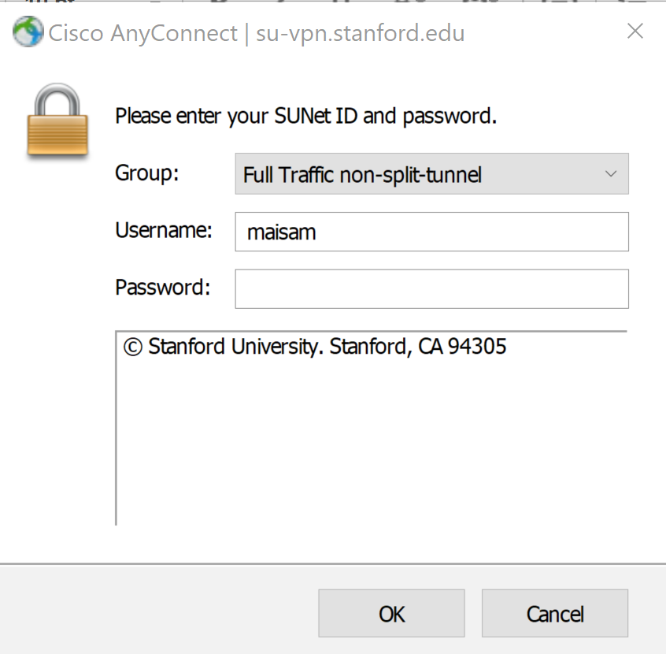
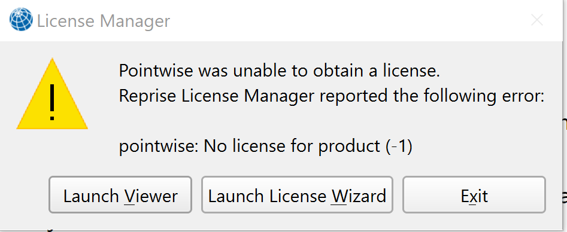
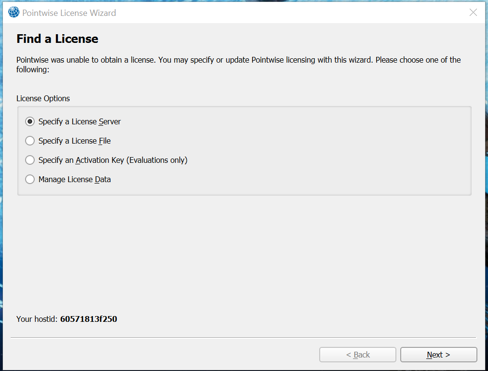
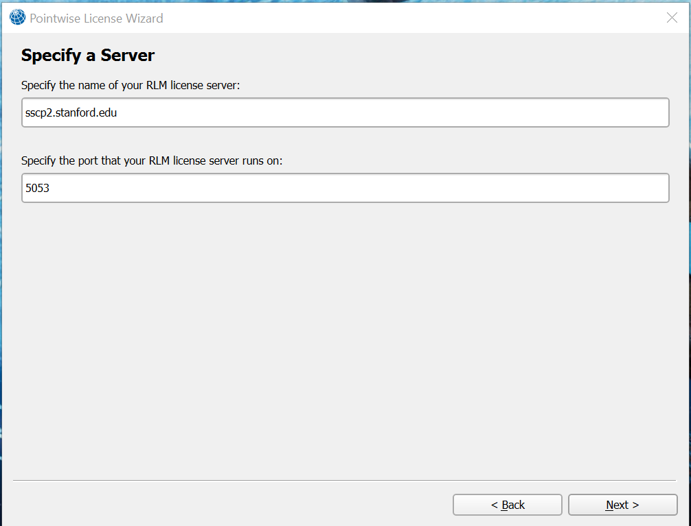

# SSCP - Installing Pointwise

# Installing Pointwise

Pointwise is the meshing software we use in our aero pipeline, and can be installed on Windows (64 Bit), OSX or Linux. We have 5 floating licenses, which means up to 5 users can have Pointwise opened on their computers at any given time.

There are 2 parts to this installation. If you are planning on using the software while you are off campus follow step 1 and 2. If you will only be using it while on campus (on Stanford WiFi), only step 2 is required

Step 1:

Go to https://uit.stanford.edu/service/vpn and download the VPN that's relevant for your system (Mac or Windows)

[https://uit.stanford.edu/service/vpn](https://uit.stanford.edu/service/vpn)

Launch the software and wait for it to boot up. If your PC interrupts the installation. Click run anyway

Once it is installed go ahead and select the "Full Traffic non-split-tunnel" option in the group tab. Enter your SUID Username and password and you should be good to move on to step 2. Update the VPN software if it prompts you to.

Step 2:

You can download it from the sftp server. It is located in '/Software/Pointwise/pw-V18.3-win64-jre.exe' 

To use Pointwise, first make sure your computer is a 64-bit machine and can handle it because like Solidworks it can be pretty computationally intensive (2GB free space and 2GB RAM at an absolute minimum, see more notes here). After downloading and launching, Pointwise will fail to find license, select the option to pick a license server on the License Wizard.

[ here](http://www.pointwise.com/support/release-notes-V18R2.html)

 Now enter the RLM license server name sscp2.stanford.edu and the port 5053. Pointwise should remember these values upon future launches.

