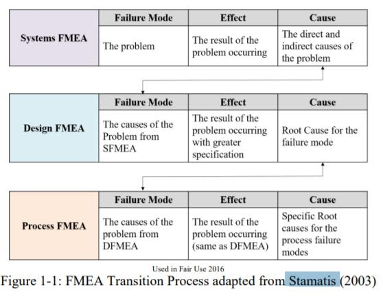
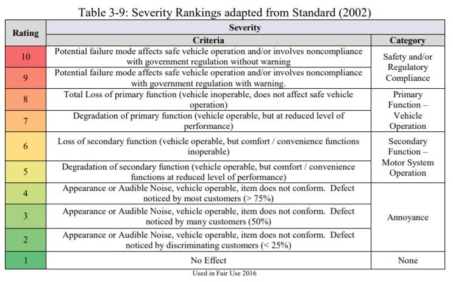
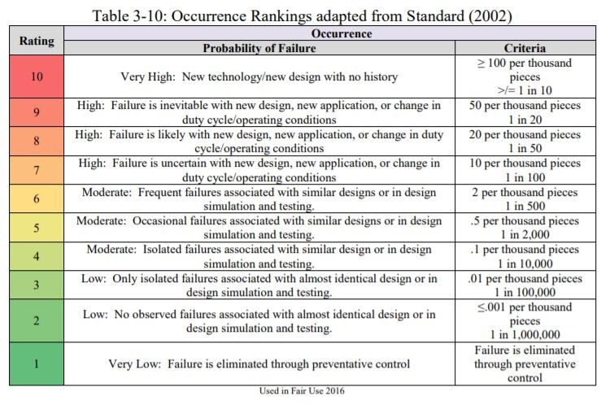
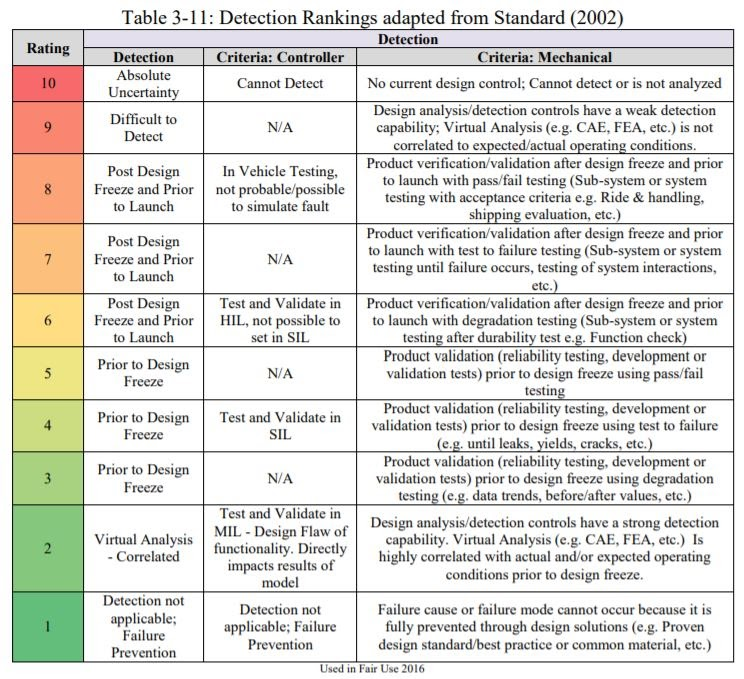
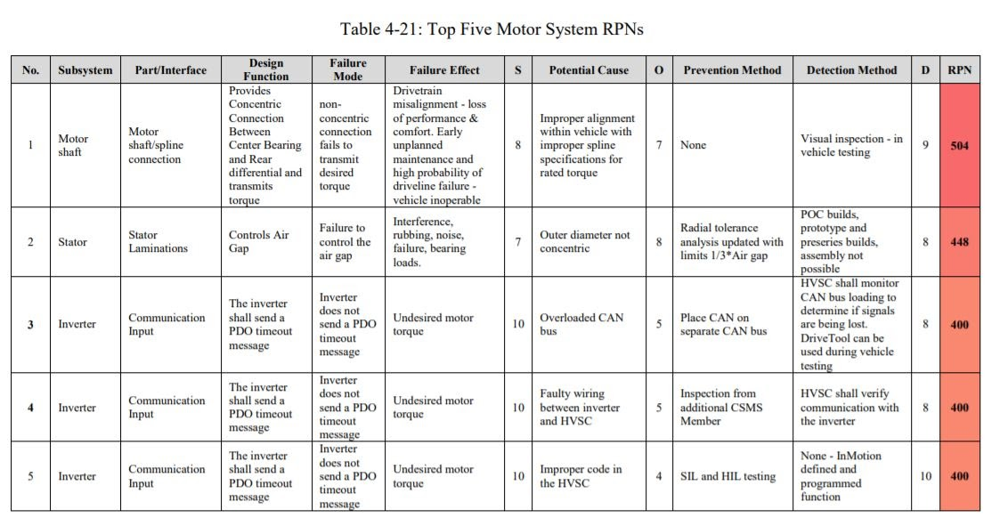
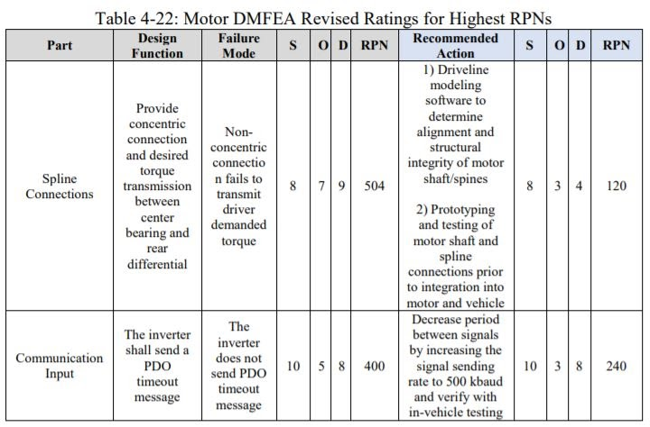
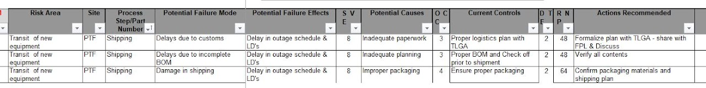
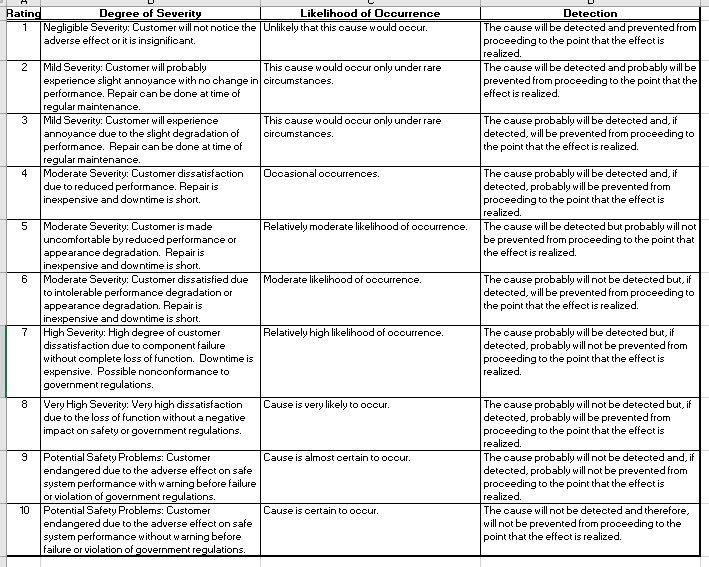

# failure-modes-and-effects-analysis-fmea

## SSCP - Failure Modes and Effects Analysis (FMEA)

## Failure Modes and Effects Analysis (FMEA)

FMEA is an important tool used to identify, rate, and mitigate potential sources of failure in a system or component.  They can be extremely useful in organizations like solar car, where there are a lot of unknowns associated with building a prototype vehicle, as well as many complex systems and not nearly enough time and resources to completely perfect every single one of them.  There are different types of FMEAs, you will most likely spend most time with the Design FMEA.

An FMEA is typically a spreadsheet with categories for Subsystem, Part, Function, Potential Failure Mode, Potential Effects of Failure, Severity, Potential Cause/Mechanism of Failure, Occurrence, Current Design Controls – Prevention Method, Current Design Controls – Detection Method, Detection, Risk Priority Number, and finally Recommended Actions.  Each column can be described as follows (taken from FMEA\_thesis):

Subsystem: The subsystem for this DFMEA is defined as the specific assembly of components. These subsystems will collectively make up the entire system being analyzed by the FMEA team. Ex: Mechanical, Electrical, Code, etc.

Part/Interface: The part for this DFMEA is defined as the isolated component being analyzed for both the mechanical and controller classified subsystem parts.  Ex: uprights, light board, tires, etc.  If needed, you can go another step further for organization: Mechanical>suspension>rear suspension>trailing arm.  There can also be multiple entries for the part.

Function: The design function for this DFMEA is defined as the task that the system, design, process, component, subsystem, or service must perform.The function of the part is to be analyzed to meet the design intent and any information regarding operational ranges such as temperature, pressure, and power limits should be included. For parts with more than one function and those functions with various failure modes, the functions are to be listed separately on a new risk line (Standard 2002).

Potential Failure Mode: The potential failure mode for this DFMEA is defined as the physical manner in which the failure occurs (Stamatis 2003). This failure is the inability of the design to meet specified design intentions.

Effects of Failure: The potential effects of failure for this DFMEA are defined as the outcome or consequence of the failure (Stamatis 2003). These outcomes should be considered when possible at first a local level, then a global level.

Severity: The severity for this DFMEA is defined as the analysis of the significance of the effect. The severity should be assigned to the effect alone, not the potential failure mode or relevant system. This is a number ranging from 1 to 10.

These tables describe values which relate to hybrid vehicles produced en mass, modify for your specific application.

Cause/Mechanism of Failure: The potential cause of the failure for this DFMEA is defined as the root cause of the listed failure. The potential cause of the failure should be specific to the failure mode, not the cause of the listed effect. Normal failures include situations of: incorrect material specified, over-stressing, or improper connection procedures.

Occurrence: The occurrence of the failure for this DFMEA is defined as the likelihood that the mechanism of failure or potential cause will occur. This is a number from 1 to 10.

These tables describe values which relate to hybrid vehicles produced en mass, modify for your specific application.

Prevention Method: The prevention method of the failure for this DFMEA is defined as the methods that are being enacted by the team to reduce how often the failure occurs.

Detection Method: The detection method of the failure for this DFMEA is defined as the methods that can be implemented by the team to detect when a failure occurs.

Detection: For mechanical risks the detection is defined as the ability of the current design controls to detect the cause of the failure.  This is a number from 1 to 10.

These tables describe values which relate to hybrid vehicles produced en mass, modify for your specific application.

RPN: The risk priority number for a given potential failure is the product of the severity (S), occurrence (O), and detection (D) values. The RPN is the end result of an effective DFMEA that allows for the entire team to understand the relative risk of potential failures within a given system. - Read the thesis section 3.5.12 for a description of criticality and threshold numbers.  When determining which RPNs are too high and which are acceptable, it is important to understand what space you are working in.  Since you are creating a prototype vehicle that you or one of your friends will drive, you need to realize that death (severity = 10) is a possible outcome of some failures and this should be taken very seriously.  Even if one of these failures is attributed a low occurrence or detection score, you should know that crazy things happen in solar racing and addressing failures that slow your car down or keep it from finishing the race is not your #1 priority with an FMEA.

Recommended Actions:  This is probably the most important section of the FMEA.  Once you pin point which failure modes need to be addressed (due to large RPN and/or severity), you must brainstorm ways in which you can lower these numbers.  This is why an FMEA is an important Design tool; finding failures in the early stages of CAD work allows you to address them before you get to the point of manufacturing.  An FMEA is not complete until you reevaluate the RPN of the failure mode with the recommended change in place - then if this RPN is sufficiently low, you must actually implement this change.

Attached is an example FMEA carried out for the trailing arm components, do note that is was quickly thrown together as a teaching example.  Recommended actions do not need to be provided for all failure modes, only the ones that need to be addressed.  I added a note about how the recommended action would effect the new RPN, but did not calculate it - you should calculate it.

Below are examples of FMEAs:

There are a lot of unknowns when filling out an FMEA, since most of it is speculation.  One of the biggest things that can trip teams up is quarreling about what numbers to associate with failures and how to fudge them to lower RPNs to make less work for themselves.  When it comes to assigning values, the most important thing is that you are consistent and honest with yourselves.  You must understand that failures that lead to the loss of control of the vehicle are the most severe, especially ones in which the direction of the car is affected.  One of the few deaths attributed to solar racing was of a Blue Sky team member who lost control and swerved into oncoming traffic, resulting in the driver's death.  Do not put your teammates in danger by lowering the O or D numbers for these failures because you don't want to put in the time to fix them.

When the team sits down to fill out FMEAs, it should not be exclusive to any 1 subteam, everyone should know the ways in which the car might fail.  This can be a long process, so specific meetings involving the whole team, or at least all leads should be scheduled early on in the design cycle, even in the off summer to help with things like catamaran vs bullet car decisions.  This will help rating be consistent between different subsystem FMEAs that will be mostly completed by the different subteam leads (Mech and Electrical should understand each other's severity ratings, etc.).

#### Embedded Google Drive File

Google Drive File: [Embedded Content](https://drive.google.com/embeddedfolderview?id=1msnm54FcjSTJC-5x5PPywe9Ojrwo5vJs#list)
