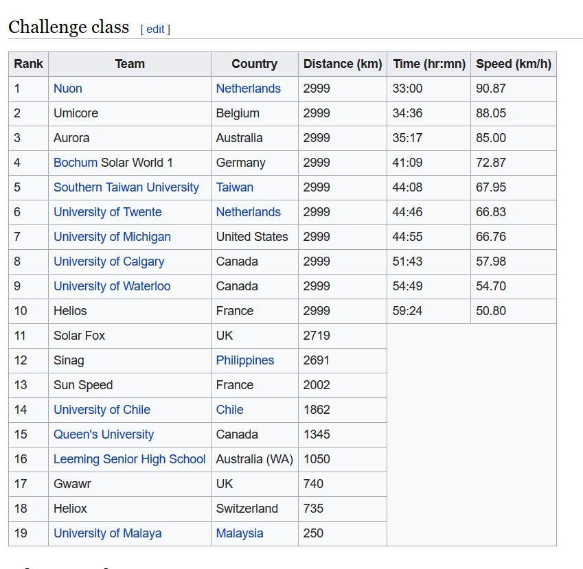

# SSCP - Previous WSC Results

# Previous WSC Results

This page serves as an archive for Challenger class race results from previous cycles. Images, links, and pdfs included where applicable. I strongly recommend that the 2019 Australia race crew/those planning on staying on for 2021 grab links or screenshots of any and all scrutineering and results information that is available during the race, WSC is inconsistent in how much they preserve after the fact. Note that if you complete the race in Challenger WSC lists your average speed in kph, and if you have to trailer or fall behind in the control stops and complete the race in Adventure, WSC lists either the distance in km you survived before getting booted or the distance in km you had to trailer.

Stanford has consistently competed in WSC since 2009, and has "officially" finished the race 3 of those 5 times, though in 2017 Stanford was one of two teams embroiled in a dispute over the Alice Springs control stop. The officials changed the control stop end time but were unable to communicate this to all teams on the road. The 2017 race crew chose to trailer the vehicle with this incomplete information, then arrived in Alice Springs, heard of the changes, and (successfully) fought to be reinstated in the race alongside another team that had dropped, but the decision (understandably so) did not go down well with other solar car teams. Since the information passed down as well as the decisions made for each team were inconsistent, WSC tried to cover up entirely/basically denied and instructed us to deny that the two teams had ever trailered. Likely due to all the confusion and anger surrounding the official placings, WSC has removed the Challenger class results from their webpage, but they're still available via archive.

2019 (Black Mamba/Sunrise)

2017 (Sundae/Sundae)

Link to an archive of the now-deleted results page.

[ results page](https://web.archive.org/web/20180515171816/https://www.worldsolarchallenge.org/dashboard/timing)

2015 (Arctan/Sunwhale)

Full pdf attached to the bottom of this webpage.

2013 (Luminos/Sunflower)

Full pdf attached to the bottom of this webpage.

2011 (Xenith/Sunbad)

Full pdf attached to the bottom of this webpage.

2009 (Apogee/No code name)

Full pdf attached to the bottom of this webpage.

2007 (No entry)

Only record I could find from the Challenger class from 2007 was here on Wikipedia.

[ here on Wikipedia](https://en.wikipedia.org/wiki/World_Solar_Challenge_2007)

### Embedded Google Drive File

Google Drive File: [Embedded Content](https://drive.google.com/embeddedfolderview?id=18YqJMTW9XF0iYu3VQD0Tkv5GNAT-jlxs#list)

<iframe width="100%" height="400" src="https://drive.google.com/embeddedfolderview?id=18YqJMTW9XF0iYu3VQD0Tkv5GNAT-jlxs#list" frameborder="0"></iframe>

