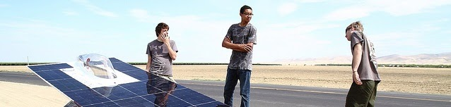

# new-member-orientation

## SSCP - New Member Orientation

## New Member Orientation

(Photo Credit Andreas Pena Doll)

Welcome new members - we're excited to have to as part of our team! Here are several ways that you can get involved with solar car:

* Join our mailing list here.&#x20;
* If you want to get in touch with us you can email us at contactsolarcar@lists.stanford.edu
* Bookmark our website at http://solarcar.stanford.edu/
* Complete the VAIL safety training at VAIL Access
* Get access to the Team Drive folder where much of our team documentation is located
* Check out the new member orientation document below!

Join our mailing list here.&#x20;

[here](https://mailman.stanford.edu/mailman/listinfo/solarpower)

If you want to get in touch with us you can email us at contactsolarcar@lists.stanford.edu

[contactsolarcar@lists.stanford.edu](mailto:contactsolarcar@lists.stanford.edu)

Bookmark our website at http://solarcar.stanford.edu/

[http://solarcar.stanford.edu/](http://solarcar.stanford.edu/)

Complete the VAIL safety training at VAIL Access

[VAIL Access](../../../../stanford.edu/testduplicationsscp/home/new-member-orientation/vail-access/)

Get access to the Team Drive folder where much of our team documentation is located

Check out the new member orientation document below!

Here are contact details for some of the members of our team who went to WSC if you want to start talking with them about their sub-fields. Many members of our team are involved in multiple sub-teams, but I listed their primary fields here. Please send them a slack to introduce yourself if you are interested in their sub-team.

[WSC](https://en.wikipedia.org/wiki/World_Solar_Challenge)

Jasmine Sumpter  - Team Lead & Aerodynamics Lead

Maisam Pyarali  - Engineering Director

Erik Roise - Director of Production

Simon Acker - Electrical Lead

Lydia Chan  - Code Co-Lead

Cameron Haynesworth  - Mechanical Lead

Julia Gordon  - Business & Marketing Lead

Christopher Wong - Financial Officer and Code Co-Lead

Suhas Sastry - Battery Lead

Some of you may still be wondering what our team does. You'll learn a lot by coming to our weekly meetings, which are held Sundays at 1PM and Wednesdays at 7:30PM. In addition, you can check out some stuff online. Here are some links to start with:

* First go to this link.
* Here is information about the race that we compete in, the World Solar Challenge: http://www.worldsolarchallenge.org/
* Videos from our 2015 build cycle: youtube.com/susolarcar
* Photos from our last build cycle: picasaweb.com/stanfordsolar
* Want to sound like a veteran member? Read this document. &#x20;

First go to this link.

[this link.](http://www.youtube.com/watch?v=JYWnNLxk-Ds)

Here is information about the race that we compete in, the World Solar Challenge: http://www.worldsolarchallenge.org/

[http://www.worldsolarchallenge.org/](http://www.worldsolarchallenge.org/)

Videos from our 2015 build cycle: youtube.com/susolarcar

[youtube.com/susolarcar](http://www.youtube.com/susolarcar)

Photos from our last build cycle: picasaweb.com/stanfordsolar

[picasaweb.com/stanfordsolar](http://picasaweb.com/stanfordsolar)

Want to sound like a veteran member? Read this document. &#x20;

[this document](http://www.worldsolarchallenge.org/files/1504_2017_bwsc_regulations_final_release_version_11.pdf)

One last thing: Here is a list of all of our websites in case you want to see more of what we have done over the past two years building Sundae, before that Arctan, before that Luminos, and before that Xenith.

&#x20;

solarcar.stanford.edu

[solarcar.stanford.edu](http://solarcar.stanford.edu/)

facebook.com/stanfordsolarcar

[facebook.com/stanfordsolarcar](http://facebook.com/stanfordsolarcar)

twitter.com/susolarcar

[twitter.com/susolarcar](http://twitter.com/susolarcar)

flickr.com/susolarcar

[flickr.com/susolarcar](http://flickr.com/susolarcar)

youtube.com/susolarcar

[youtube.com/susolarcar](http://youtube.com/susolarcar)
