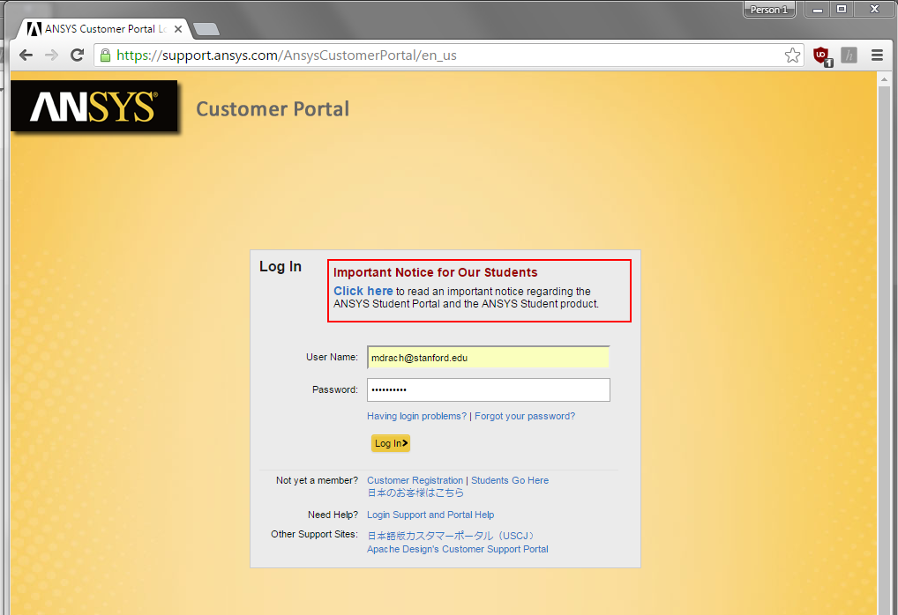
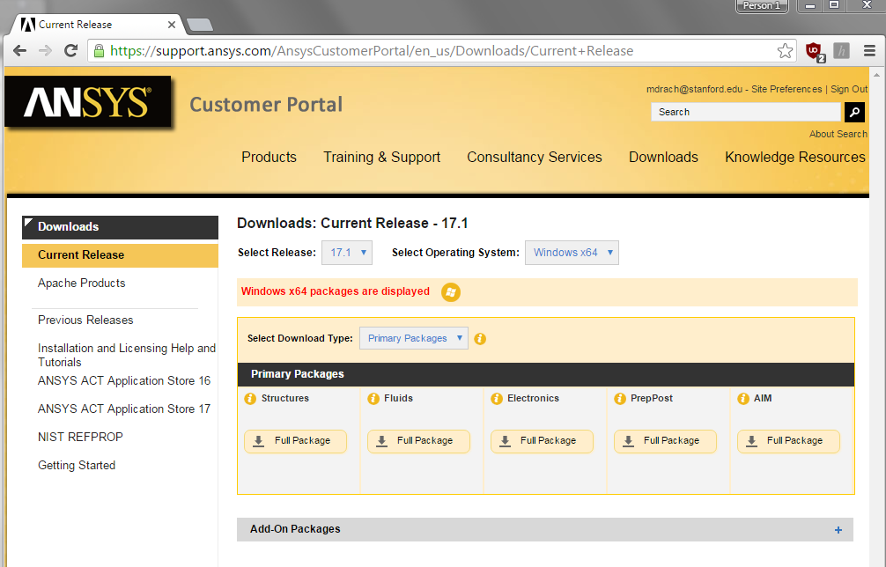
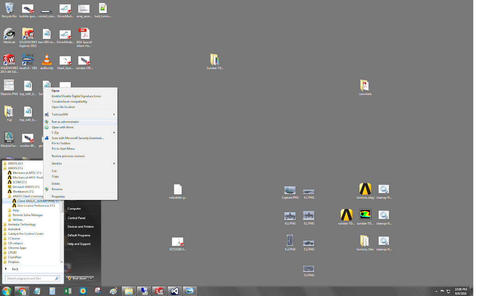
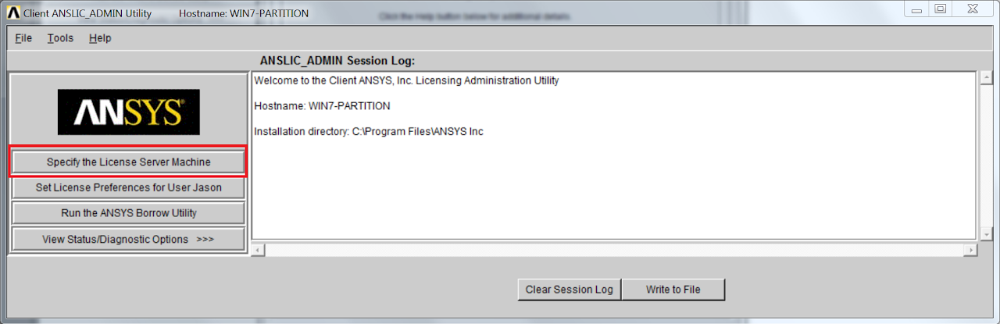
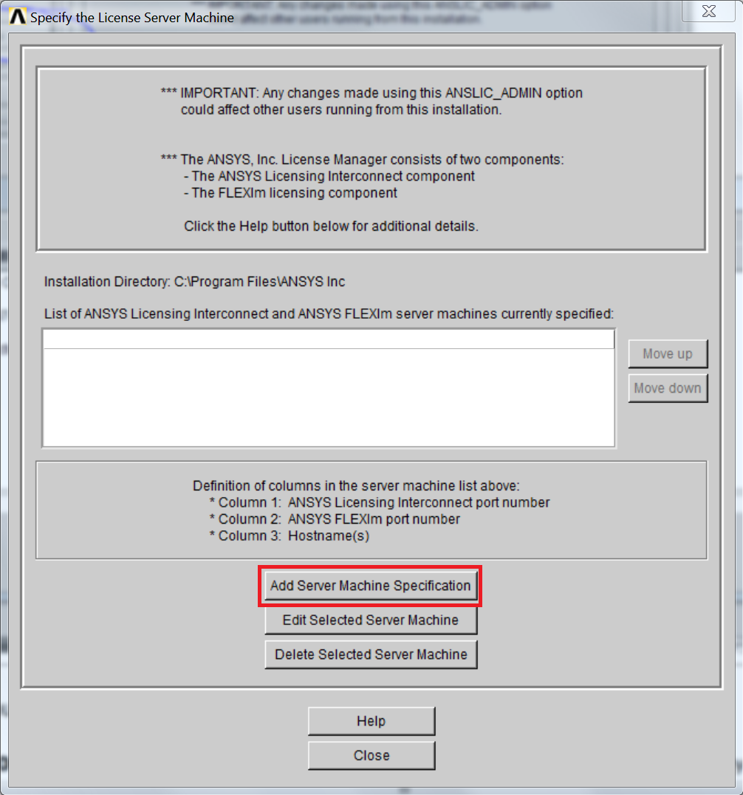
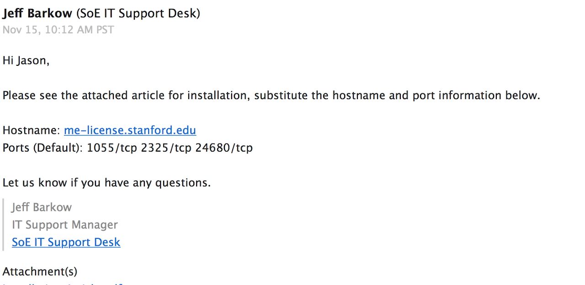

# SSCP - Installing ANSYS

# Installing ANSYS

All righty.  Here's how to install ANSYS.

First log into the customer portal.

[ customer portal](https://support.ansys.com/AnsysCustomerPortal/en_us)

Create your own account using your Stanford email.

Follow instructions for creating an account here.

[ here](https://stanford.service-now.com/it_services?id=kb_article&sys_id=acf4ef1bdbde0b4cd90af1651d9619d7)

Next click "Downloads" at the top and download your required software. If you just need Ansys Mechanical, download "Structures".

If during install it asks you for license information, see next step.

If it doesn't, then after you have downloaded and installed you need to set the license information manually.  Navigate to "Client ANSLIC_ADMIN" and RUN AS ADMINISTRATOR.

Click on "Specify the License Server Machine":

Select "Add Server Machine Specification":

Add the hostname and ports, as in the screenshot below:

Now you are all set to run your software!

Ansys will only work on the Stanford network or on the Stanford VPN.  Happy Analysis.

### Embedded Google Drive File

Google Drive File: [Embedded Content](https://drive.google.com/embeddedfolderview?id=1dqdAGCK6_HbHboZvqbZu3JKB-2s7jXre#list)

<iframe width="100%" height="400" src="https://drive.google.com/embeddedfolderview?id=1dqdAGCK6_HbHboZvqbZu3JKB-2s7jXre#list" frameborder="0"></iframe>

