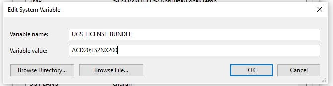

# SSCP - Installing Fibersim

# Installing Fibersim

First install NX.

[ NX](/home/new-member-orientation/installing-software/installing-nx)

Download the Fibersim folder from sftp.  Located at '/Software/Siemens/Fibersim 15' .

[sftp](/home/new-member-orientation/sftp-access)

License: 27002@sscp4.stanford.edu

To make NX not ask you to add a license bundle each time, do this:

In Windows, click Start>right click My Computer>Properties>Advanced System Settings (in left sidebar)>Environment Variables

Then Add a new environment variable name "UGS_LICENSE_BUNDLE" value: "ACD20;FS2NX200"

