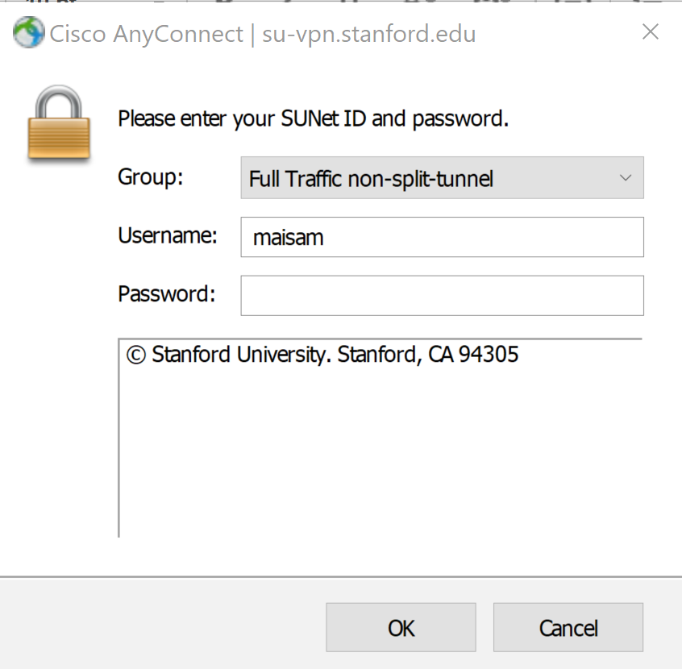
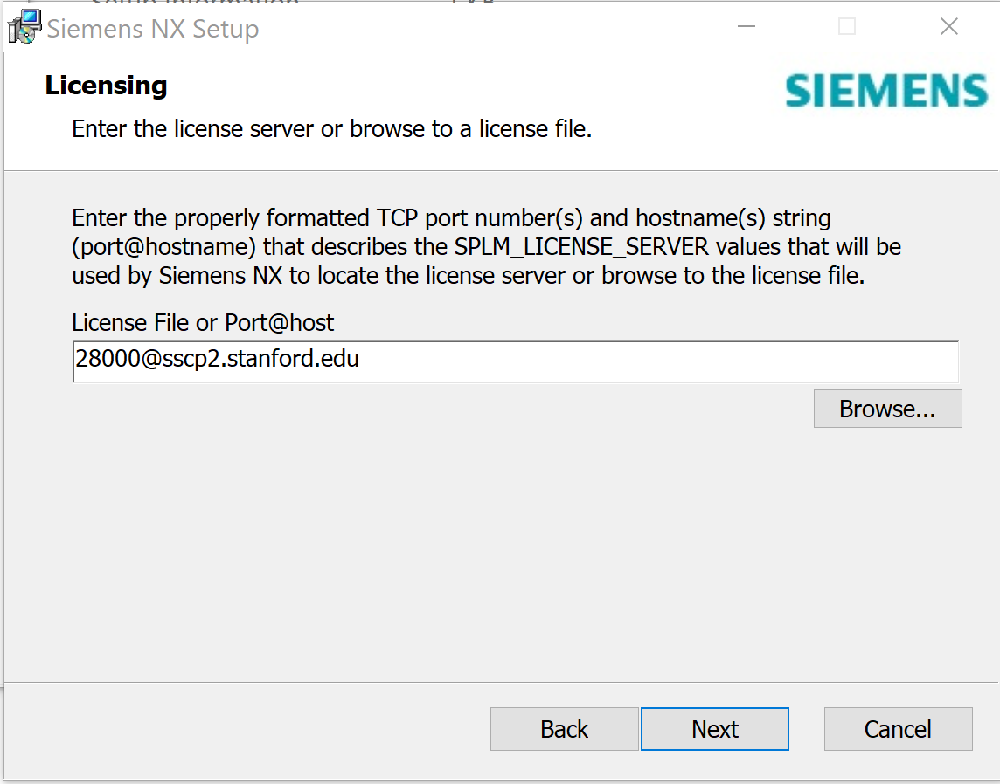
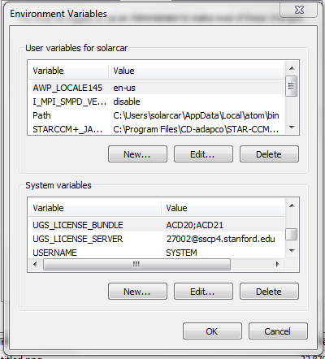

# SSCP - Installing NX

# Installing NX

You can install on Windows (64 Bit), OSX, or Linux.

There are 2 parts to this installation. If you are planning on using the software while you are off campus follow step 1 and 2. If you will only be using it while on campus (on Stanford WiFi), only step 2 is required

Step 1:

Go to https://uit.stanford.edu/service/vpn and download the VPN that's relevant for your system (Mac or Windows)

[https://uit.stanford.edu/service/vpn](https://uit.stanford.edu/service/vpn)

Launch the software and wait for it to boot up. If your PC interrupts the installation. Click run anyway

Once it is installed go ahead and select the "Full Traffic non-split-tunnel" option in the group tab. Enter your SUID Username and password and you should be good to move on to step 2. Update the VPN software if it prompts you to.

Step 2:

You can download NX from the sftp server. It is located in '/Software/Siemens/NX 1911'

Be sure to download the entire folder and not just the .exe file. Click Launch.exe and choose to install NX.

License server: 28000@sscp2.stanford.edu

Options for Windows

Setting the License Bundle

This should happen automatically, but if not you will need to set the license bundle manually:

When NX starts, you can do File>Utilities>Select Bundles, and then select your bundle.

If NX bugs you every time, you will need to set your UGS_LICENSE_BUNDLE system variable.

In Windows, click Start>right click My Computer>Properties>Advanced System Settings (in left sidebar)>Environment Variables

Then add a new environment variable name "UGS_LICENSE_BUNDLE" with the value: "ACD30;ACD31"

Setting the License Manager

If you enter the wrong license server during installation, enter the Environment Variables manager as above:

In Windows, click Start>right click My Computer>Properties>Advanced System Settings (in left sidebar)>Environment Variables

Then, modify the values of all variables with with the wrong license server values.

Now that you've installed, go check out the tutorial videos!

[ tutorial videos](/stanford.edu/testduplicationsscp/home/sscp-2018-2019/aero-2018-2019/nx-tutorial-videos)

