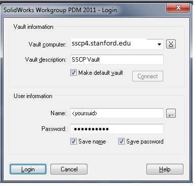

# SSCP - PDM Access

# PDM Access

## What is Workgroup PDM?

Workgroup PDM is a version control system built into Solidworks that we use. It allows to keep a revision history of our parts and makes collaboration easier.

## Getting Workgroup PDM

* To check whether it is installed, open Solidworks. Go to Tools -> Add-Ins...If "Solidworks Workgroup PDM 2015" is there, check the boxes on both sides. You're almost ready to go! If not, follow the instructions below:
* To check whether it is installed, open Solidworks. Go to Tools -> Add-Ins...
* If "Solidworks Workgroup PDM 2015" is there, check the boxes on both sides. You're almost ready to go! If not, follow the instructions below:

* To check whether it is installed, open Solidworks. Go to Tools -> Add-Ins...
* If "Solidworks Workgroup PDM 2015" is there, check the boxes on both sides. You're almost ready to go! If not, follow the instructions below:

To check whether it is installed, open Solidworks. Go to Tools -> Add-Ins...

If "Solidworks Workgroup PDM 2015" is there, check the boxes on both sides. You're almost ready to go! If not, follow the instructions below:

 

[ ](http://goog_89959713)

## How to get the PDM Add-in on your existing Solidworks Installation 

1. Close all Solidworks windows

2. Open Control Panel > Programs and Features > Uninstall a Program

3. Locate the Solidworks file, right click, then press Change.

4. Click Modify the individual installation on the installation Manager, then click next.

* Then proceed to do as instructed on #6 onward in the next section (Installing Solidworks with PDM Add-in).

## Installing Solidworks with PDM Add-in

* Save your Solidworks settings (instruction here).Follow these instructions to do a complete uninstall of Solidworks.Download the installation manager located in the SFTP folder named "Solidworks 17 SP5.0 IM". (Instructions on accessing SFTP here).Do not download the folder named "Solidworks 17" - it will not work.
* Save your Solidworks settings (instruction here).
* Follow these instructions to do a complete uninstall of Solidworks.
* Download the installation manager located in the SFTP folder named "Solidworks 17 SP5.0 IM". (Instructions on accessing SFTP here).Do not download the folder named "Solidworks 17" - it will not work.
* Do not download the folder named "Solidworks 17" - it will not work.

1. Save your Solidworks settings (instruction here).
2. Follow these instructions to do a complete uninstall of Solidworks.
3. Download the installation manager located in the SFTP folder named "Solidworks 17 SP5.0 IM". (Instructions on accessing SFTP here).Do not download the folder named "Solidworks 17" - it will not work.
4. Do not download the folder named "Solidworks 17" - it will not work.

Save your Solidworks settings (instruction here).

[ here](http://help.solidworks.com/2017/english/solidworks/sldworks/c_copy_settings_wizard.htm)

Follow these instructions to do a complete uninstall of Solidworks.

[these instructions](http://help.solidworks.com/2017/english/Installation/install_guide/hid_state_products_to_remove.htm)

Download the installation manager located in the SFTP folder named "Solidworks 17 SP5.0 IM". (Instructions on accessing SFTP here).

[ here](/stanford.edu/testduplicationsscp/home/new-member-orientation/sftp-access)

* Do not download the folder named "Solidworks 17" - it will not work.

Do not download the folder named "Solidworks 17" - it will not work.

1. Run the setup.

Run the setup.

    5. On the Welcome page, select Individual installation.

* Troubleshooting:If you have updated your Solidworks installation past SP3.0, the installer included in the "Solidworks 17" folder on the SFTP server will not work (see screenshot below).As of 4/8/2018, you must use an installation manager for the current Service Pack, SP5.0. Be sure to download the SFTP folder named "Solidworks 17 SP5.0 IM."
* Troubleshooting:If you have updated your Solidworks installation past SP3.0, the installer included in the "Solidworks 17" folder on the SFTP server will not work (see screenshot below).As of 4/8/2018, you must use an installation manager for the current Service Pack, SP5.0. Be sure to download the SFTP folder named "Solidworks 17 SP5.0 IM."
* If you have updated your Solidworks installation past SP3.0, the installer included in the "Solidworks 17" folder on the SFTP server will not work (see screenshot below).
* As of 4/8/2018, you must use an installation manager for the current Service Pack, SP5.0. Be sure to download the SFTP folder named "Solidworks 17 SP5.0 IM."

* Troubleshooting:If you have updated your Solidworks installation past SP3.0, the installer included in the "Solidworks 17" folder on the SFTP server will not work (see screenshot below).As of 4/8/2018, you must use an installation manager for the current Service Pack, SP5.0. Be sure to download the SFTP folder named "Solidworks 17 SP5.0 IM."
* If you have updated your Solidworks installation past SP3.0, the installer included in the "Solidworks 17" folder on the SFTP server will not work (see screenshot below).
* As of 4/8/2018, you must use an installation manager for the current Service Pack, SP5.0. Be sure to download the SFTP folder named "Solidworks 17 SP5.0 IM."

Troubleshooting:

* If you have updated your Solidworks installation past SP3.0, the installer included in the "Solidworks 17" folder on the SFTP server will not work (see screenshot below).
* As of 4/8/2018, you must use an installation manager for the current Service Pack, SP5.0. Be sure to download the SFTP folder named "Solidworks 17 SP5.0 IM."

If you have updated your Solidworks installation past SP3.0, the installer included in the "Solidworks 17" folder on the SFTP server will not work (see screenshot below).

As of 4/8/2018, you must use an installation manager for the current Service Pack, SP5.0. Be sure to download the SFTP folder named "Solidworks 17 SP5.0 IM."

##     6. On the Serial Number page, check the "Solidworks Workgroup PDM" box at the bottom.  Enter the same license number as shown below.

    6. On the Product Selection page, click "More" at the upper right corner of the first section and select all of the PDM related check boxes, some of which are hidden in further drop down menus.

        Check the “Solidworks Explorer/Workgroup PDM” option. Expand this and select all subcategories on the list as listed below:

* Solidworks Explorer/Workgroup PDMSolidworks ExplorerSolidworks Workgroup PDM Add-inSolidworks Workgroup PDM Add-inSolidworks Workgroup PDM Client Add-in         
* Solidworks Explorer/Workgroup PDMSolidworks ExplorerSolidworks Workgroup PDM Add-inSolidworks Workgroup PDM Add-inSolidworks Workgroup PDM Client Add-in         
* Solidworks Explorer/Workgroup PDM
* Solidworks ExplorerSolidworks Workgroup PDM Add-in
* Solidworks Workgroup PDM Add-in
* Solidworks Workgroup PDM Add-in
* Solidworks Workgroup PDM Client Add-in         

* Solidworks Explorer/Workgroup PDMSolidworks ExplorerSolidworks Workgroup PDM Add-inSolidworks Workgroup PDM Add-inSolidworks Workgroup PDM Client Add-in         
* Solidworks Explorer/Workgroup PDM
* Solidworks ExplorerSolidworks Workgroup PDM Add-in
* Solidworks Workgroup PDM Add-in
* Solidworks Workgroup PDM Add-in
* Solidworks Workgroup PDM Client Add-in         

* Solidworks Explorer/Workgroup PDM
* Solidworks ExplorerSolidworks Workgroup PDM Add-in
* Solidworks Workgroup PDM Add-in
* Solidworks Workgroup PDM Add-in
* Solidworks Workgroup PDM Client Add-in         

Solidworks Explorer/Workgroup PDM

Solidworks Explorer

* Solidworks Workgroup PDM Add-in

Solidworks Workgroup PDM Add-in

Solidworks Workgroup PDM Add-in

Solidworks Workgroup PDM Client Add-in         

        Check the "Solidworks PDM Client" option. Expand this and select all subcategories on the list as listed below:

* Solidworks PDM ClientItem Explorer
* Solidworks PDM ClientItem Explorer
* Solidworks PDM Client
* Item Explorer

* Solidworks PDM ClientItem Explorer
* Solidworks PDM Client
* Item Explorer

* Solidworks PDM Client
* Item Explorer

Solidworks PDM Client

Item Explorer

    7. Restart your computer

##     8. Open Solidworks. In the Tools dropdown, select Add-Ins.

    9. Check BOTH checkboxes for Solidworks Workgroup PDM.

    10. Restart Solidworks

### Note for off campus users:

* In order to access the Solidworks license server, PDM, and Solidworks when you are off the Stanford campus you will need to use a VPN connection. Visit this link for instructions on installing Cisco VPN to access the Stanford network when you are off campus.

In order to access the Solidworks license server, PDM, and Solidworks when you are off the Stanford campus you will need to use a VPN connection. Visit this link for instructions on installing Cisco VPN to access the Stanford network when you are off campus.

[this link](http://itservices.stanford.edu/service/vpn)

## Logging into the Workgroup PDM Server

Note: If you do not already have a login email we will add you

When opening Solidworks, you should be prompted for a login - enter the details as below:

* If the prompt does not come up, you may need to uninstall and reinstall again. Make sure that ALL boxes are checked in the add-in selection page.
* If the prompt does not come up, you may need to uninstall and reinstall again. Make sure that ALL boxes are checked in the add-in selection page.

* If the prompt does not come up, you may need to uninstall and reinstall again. Make sure that ALL boxes are checked in the add-in selection page.

If the prompt does not come up, you may need to uninstall and reinstall again. Make sure that ALL boxes are checked in the add-in selection page.

Your login will be your SUID, and your password will be solarpower (unless you've requested a specific password)

## Accessing the Solar Car Vault

To access the vault, click the little blue folder on the right hand side

To check out a file, right click on something that looks interesting, and click "check out."

You should get a window that looks like this. Unless you know what you're doing, don't check "Take Ownership." If you do check this, it means that you're able to edit a file. In general, you should either own the project that you're working on or ask Nathan HS or Greg for approval beforehand.

## Checking things into the Vault

Now it gets more complicated. To check things into the vault, go through the following checklist. 

You must follow this checklist or your parts will be flagged and possibly deleted by the Vault Admins.

1. Are all of my parts and assemblies named something intelligent, readable, and following the Vault convention?

* Examples of good names: xenith_battery_pack or rodend_HXAM-7T
* Examples of good names: xenith_battery_pack or rodend_HXAM-7T

* Examples of good names: xenith_battery_pack or rodend_HXAM-7T

Examples of good names: xenith_battery_pack or rodend_HXAM-7T

2. Are there folders and sub-folders in the Vault that match the parts in my assemblies?

* All off-the-shelf parts go in "Sunbad Repository/Parts Library."
* Assemblies go in the requisite folder. If there isn't a folder that matches your category, right click on the parent folder and click Add a Subproject. The naming convention for sub-projects is, for example, bearings for the name, and Bearings for the description.

All off-the-shelf parts go in "Sunbad Repository/Parts Library."

Assemblies go in the requisite folder. If there isn't a folder that matches your category, right click on the parent folder and click Add a Subproject. The naming convention for sub-projects is, for example, bearings for the name, and Bearings for the description.

3. While the assembly is opened in SW, right click on the project into which your assembly will be saved and click "Check in current document

4. Fill out the information in the check in pop-up. 

* Remember to chose the project for each sub-part. 
* Make sure the main assembly is checked into the proper project. 
* Add a description that might be useful when someone is searching the Vault and click apply. 
* Select Development 00 if the part is in development, or Released 00 if the part is an off-the-shelf component or has been sent out for fabrication. Do this for all parts.

Remember to chose the project for each sub-part. 

Make sure the main assembly is checked into the proper project. 

Add a description that might be useful when someone is searching the Vault and click apply. 

Select Development 00 if the part is in development, or Released 00 if the part is an off-the-shelf component or has been sent out for fabrication. Do this for all parts.

5. Check the part in, make sure that everything is where it should be, and that you have released ownership of the parts.

* Other people will know that it's you that has ownership of a part, and will be unhappy if they need to edit a part and can't. 
* Other people will know that it's you that has ownership of a part, and will be unhappy if they need to edit a part and can't. 

* Other people will know that it's you that has ownership of a part, and will be unhappy if they need to edit a part and can't. 

Other people will know that it's you that has ownership of a part, and will be unhappy if they need to edit a part and can't. 

## Ownership in WorkgroupPDM

If a file looks like this, it means you own it and can edit it:

This means that someone else has locked the part and (in theory) is editing it:

This means that no-one owns the file at the moment

You can change the status of a part by right clicking a part in the Vault and clicking "Take Ownership" or "Release Ownership"

Managing the file tree

Managing the file tree in PDM is onerous, tedious, and possibly cruel and unusual. First, verify that you are a vault admin. Then, launch the "Solidworks Workgroup 2017 VaultAdmin" application and login with your PDM credentials. Note that this is NOT the "Solidworks PDM Administration" application, even though that application uses the PDM image we're accustomed to as its logo.

Then, select the "Projects" tab:

The "Project information" section shows SSCP's project tree. Each folder on the PDM browser on Solidworks represents a project. However, the VaultAdmin application shows "Project names" on its tree, while the PDM browser shows "Project descriptions". In our PDM repository, they are often not the same. For example:

To make a new folder in PDM, you have to create a new project. Please use the same string for "Project Name" and "Project Description"! Select the parent folder under the "Parent" drop-down menu.

