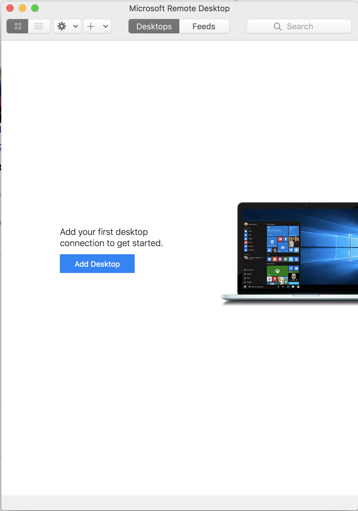
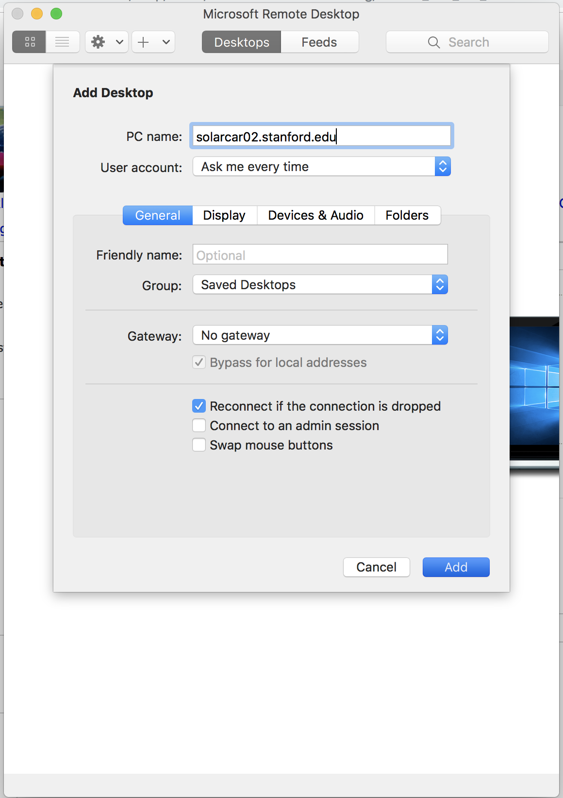
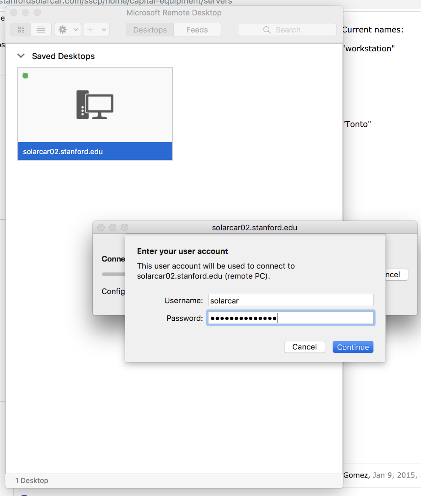

# SSCP - Remoting into VAIL workstation

# Remoting into VAIL workstation

1. Download Microsoft Remote Desktop (from App Store on Mac)

2. Click "Add Desktop"

3. Under PC name type:

    - for right workstation: "solarcar02.stanford.edu"

4. Click on the new desktop you just created under "Saved Desktops"

5. Enter the username and password for that desktop.

    - for right workstation (as of 5/21/19)

        Username: solarcar

        Password: solarpower2019

6. Congrats! You have successfully remoted into a VAIL workstation.

### Embedded Google Drive File

Google Drive File: [Embedded Content](https://drive.google.com/embeddedfolderview?id=1cRu9EYdlDcQ74VqY25DVRgqQaobEuOIb#list)

<iframe width="100%" height="400" src="https://drive.google.com/embeddedfolderview?id=1cRu9EYdlDcQ74VqY25DVRgqQaobEuOIb#list" frameborder="0"></iframe>

