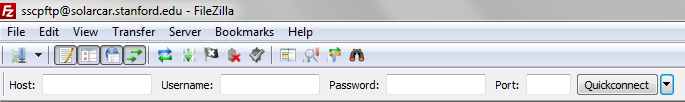
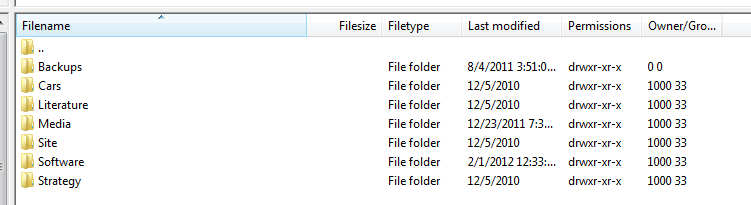

# SSCP - SFTP Access

# SFTP Access

How to access the FTP server:

1. Acquire Filezilla

Download the Filezilla FTP client from this link. Install.

[this link.](http://filezilla-project.org/download.php?type=client)

Note: The installer from Sourceforge now installs adware if you're not careful. Make sure you decline offers to install adware.

2. Open FileZilla and Enter Credentials

In the fields at the top of the screen, shown below:

We've updated to from FTP to SFTP, which is an extension of SSH.

Host: sftp://solarcar.stanford.edu        Username: sscpftp        Password: solarpower

Leave Port blank. If that doesn't work, try "22".

press 'Quickconnect'

3. Save these credentials

If you used it once, you'll probably use it again. FileZilla has a handy "Site Manager" feature so you don't have to go searching for the login info on this page every time you use them.

Just press Ctrl+S (or cmnd+S), and the Site Manager will appear.

Click "New Site" (near the bottom left of the window)

Under "Protocol", select "SFTP"

Fill in the hostname, user, and password with the info from step 2.

Select a background color (if you'd like)

* Recommended especially for Aero folks

* You will (probably) be using FileZilla with more than just our SFTP server (e.g. with Sabalcore or Rice)

* It's useful to set background colors such that they remind you which server you're logged in to

Click "Ok"! 

3. Profit

you should see the following directory listing in the middle right pane:

4. FAQs

1) For future reference, you must have the most recent version of FileZilla to download/upload files.

* If FileZilla is not letting you download/upload stuff, the problem might be that you do not have the most up to date version of FileZilla. Update FileZilla and hopefully the problem will be resolved.

* FileZilla is updated pretty often, so it might be handy to keep this in mind.

2) [Include your own FAQs here...]

