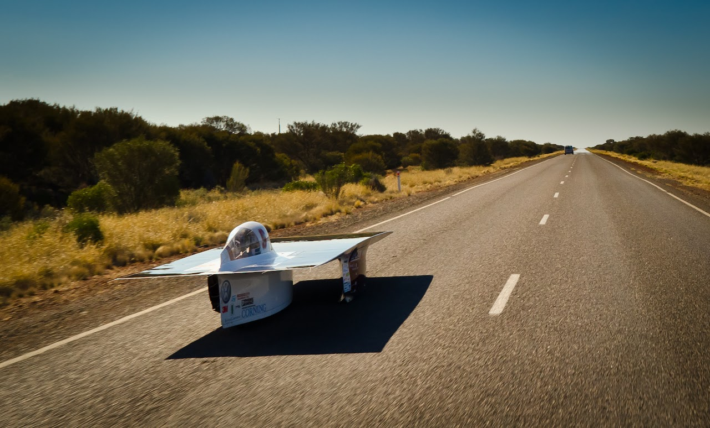

# personal-wsc-planning-and-packing-tips

## SSCP - Personal WSC Planning and Packing Tips

## Personal WSC Planning and Packing Tips

Thoughts on traveling to Australia.

If this is your first time traveling abroad then there is a lot that you will need to plan in advance. If you have traveled internationally before there is still a lot of work you need to do, but things may not be as foreign to you.&#x20;

### Passport and Visa

* You will need a passport to travel outside the US. The State Department's website is the best place to start. Getting a passport can be difficult, and it is always time consuming. I'm not going to fill this document with step by step directions on how to get a passport since there are many resources online. Getting your passport should be your first step in your travel plans.Once you have a passport you will need to get visas to the countries that you plan to travel to. The Aussies make it pretty easy easy for Americans to get visas to Australia. You can apply for a visa through the Department of Immigration and Citizenship. If you plan to travel to other countries you will need to get a separate visa for each country. You will have to check with the national immigration offices, domestic consulate, or domestic embassy for additional details. Some countries take months to issue a visa to you. Other countries take significantly shorter time.&#x20;
* You will need a passport to travel outside the US. The State Department's website is the best place to start. Getting a passport can be difficult, and it is always time consuming. I'm not going to fill this document with step by step directions on how to get a passport since there are many resources online. Getting your passport should be your first step in your travel plans.
* Once you have a passport you will need to get visas to the countries that you plan to travel to. The Aussies make it pretty easy easy for Americans to get visas to Australia. You can apply for a visa through the Department of Immigration and Citizenship. If you plan to travel to other countries you will need to get a separate visa for each country. You will have to check with the national immigration offices, domestic consulate, or domestic embassy for additional details. Some countries take months to issue a visa to you. Other countries take significantly shorter time.&#x20;
* You will need a passport to travel outside the US. The State Department's website is the best place to start. Getting a passport can be difficult, and it is always time consuming. I'm not going to fill this document with step by step directions on how to get a passport since there are many resources online. Getting your passport should be your first step in your travel plans.
* Once you have a passport you will need to get visas to the countries that you plan to travel to. The Aussies make it pretty easy easy for Americans to get visas to Australia. You can apply for a visa through the Department of Immigration and Citizenship. If you plan to travel to other countries you will need to get a separate visa for each country. You will have to check with the national immigration offices, domestic consulate, or domestic embassy for additional details. Some countries take months to issue a visa to you. Other countries take significantly shorter time.&#x20;

You will need a passport to travel outside the US. The State Department's website is the best place to start. Getting a passport can be difficult, and it is always time consuming. I'm not going to fill this document with step by step directions on how to get a passport since there are many resources online. Getting your passport should be your first step in your travel plans.

[State Department](http://travel.state.gov/passport/get/get_4855.html)

Once you have a passport you will need to get visas to the countries that you plan to travel to. The Aussies make it pretty easy easy for Americans to get visas to Australia. You can apply for a visa through the Department of Immigration and Citizenship. If you plan to travel to other countries you will need to get a separate visa for each country. You will have to check with the national immigration offices, domestic consulate, or domestic embassy for additional details. Some countries take months to issue a visa to you. Other countries take significantly shorter time.&#x20;

[Department of Immigration and Citizenship](http://www.immi.gov.au/visawizard/)

### Applying for a leave of absence:

* If you go to Australia in the fall you will need to submit a leave of absence before the first day of the quarter. Once you submit a leave of absence you will not need to pay any fees or tuition on campus. The process for applying for a leave of absence is described here. The process can take from 30 min to a couple of days. You will need to find a couple administrators on campus to get their signatures.
* If you go to Australia in the fall you will need to submit a leave of absence before the first day of the quarter. Once you submit a leave of absence you will not need to pay any fees or tuition on campus. The process for applying for a leave of absence is described here. The process can take from 30 min to a couple of days. You will need to find a couple administrators on campus to get their signatures.
* If you go to Australia in the fall you will need to submit a leave of absence before the first day of the quarter. Once you submit a leave of absence you will not need to pay any fees or tuition on campus. The process for applying for a leave of absence is described here. The process can take from 30 min to a couple of days. You will need to find a couple administrators on campus to get their signatures.

If you go to Australia in the fall you will need to submit a leave of absence before the first day of the quarter. Once you submit a leave of absence you will not need to pay any fees or tuition on campus. The process for applying for a leave of absence is described here. The process can take from 30 min to a couple of days. You will need to find a couple administrators on campus to get their signatures.

[here](http://studentaffairs.stanford.edu/registrar/students/leave)

### Booking Flights

* For 2013 everyone will need to be in Melbourne Australia by September 15th local time. Remember that flights across the pacific often take a day and you cross the international date line. Therefore you may need to leave the US on Friday September 13th (Pacific Time) to arrive in Melbourne on Sunday September 15th.I will be arriving in Melbourne closer to September 9th, and anyone is welcome to come with me to Australia early. We'll probably hang out in the communities around Melbourne. The relaxed week before the car arrived in 2011 was one of the highlights of the last trip to Australia. If you are trying to get the best prices for flights here are a few tips.Shop around travel sites like Expedia, Travelocity etc, but also visit the direct websites of airlines themselves like United, Air New Zealand, Quantas etc.Be sure to clear your cookies periodically. Travel sites like Expedia monitor how many times you check prices for the same flight. If you check the flight prices repeated they will raise the flight price to get you to panic and buy immediately. This may not happen in all scenarios but if you want to try for yourself check a flight on Expedia through Firefox after checking the exact same flight repeated over a few weeks through Chrome.Using travel miles might be a good betBooking through a travel agency may be helpfulBooking in groups may be helpfulBeing flexible in your actual travel dates. Flight dates that are popular with international business customers will be priced differently than days that are popular for family vacation travel.Buying fully refundable tickets will be way more expensive than buying tickets that have restrictive refund policies.Buying the optional flight insurance policies is up to personal risk preference(Rachel) I booked through STA and didn't find their in-person service to be very good, but their website is very good for searching for flights and their flights are much cheaper.  (In person they failed to find cheap flights that I had found on their website.)  Getting an Australian visa online is very easy, but if you're going to other countries you should start looking at visa processes now. With STA if you want a flight out of a country you have to go to their website for that country--for instance, go to the New Zealand form of their website to get a flight out of Christchurch.(Alice) Last year, a bunch of us booked using STA Travel. They used to have an office in Palo Alto, but it closed so I'm not sure where the closest one is anymore. There's a $30-ish fee to be a STA student for a year, but if you book with them in person, they take care of your Australia visa fee which is around $30 as well. I didn't end up comparing flight prices to other places, but it was certainly convenient to just tell them the cities I wanted to go to and the general dates. I /think/ the prices are generally cheaper because they are priced similar to 1/2 round trip, rather than single ended.  For what it's worth, I paid $2650 for the following flights..SFO->MelbourneMelbourne->ChristchurchChirstchurch->ManilaManila->TaiwanTaiwan->ShanghaiShanghai->BeijingBeijing->SFO
* For 2013 everyone will need to be in Melbourne Australia by September 15th local time. Remember that flights across the pacific often take a day and you cross the international date line. Therefore you may need to leave the US on Friday September 13th (Pacific Time) to arrive in Melbourne on Sunday September 15th.
* I will be arriving in Melbourne closer to September 9th, and anyone is welcome to come with me to Australia early. We'll probably hang out in the communities around Melbourne. The relaxed week before the car arrived in 2011 was one of the highlights of the last trip to Australia.&#x20;
* If you are trying to get the best prices for flights here are a few tips.Shop around travel sites like Expedia, Travelocity etc, but also visit the direct websites of airlines themselves like United, Air New Zealand, Quantas etc.Be sure to clear your cookies periodically. Travel sites like Expedia monitor how many times you check prices for the same flight. If you check the flight prices repeated they will raise the flight price to get you to panic and buy immediately. This may not happen in all scenarios but if you want to try for yourself check a flight on Expedia through Firefox after checking the exact same flight repeated over a few weeks through Chrome.Using travel miles might be a good betBooking through a travel agency may be helpfulBooking in groups may be helpfulBeing flexible in your actual travel dates. Flight dates that are popular with international business customers will be priced differently than days that are popular for family vacation travel.Buying fully refundable tickets will be way more expensive than buying tickets that have restrictive refund policies.Buying the optional flight insurance policies is up to personal risk preference
* Shop around travel sites like Expedia, Travelocity etc, but also visit the direct websites of airlines themselves like United, Air New Zealand, Quantas etc.
* Be sure to clear your cookies periodically. Travel sites like Expedia monitor how many times you check prices for the same flight. If you check the flight prices repeated they will raise the flight price to get you to panic and buy immediately. This may not happen in all scenarios but if you want to try for yourself check a flight on Expedia through Firefox after checking the exact same flight repeated over a few weeks through Chrome.
* Using travel miles might be a good bet
* Booking through a travel agency may be helpful
* Booking in groups may be helpful
* Being flexible in your actual travel dates. Flight dates that are popular with international business customers will be priced differently than days that are popular for family vacation travel.
* Buying fully refundable tickets will be way more expensive than buying tickets that have restrictive refund policies.
* Buying the optional flight insurance policies is up to personal risk preference
* (Rachel) I booked through STA and didn't find their in-person service to be very good, but their website is very good for searching for flights and their flights are much cheaper.  (In person they failed to find cheap flights that I had found on their website.)  Getting an Australian visa online is very easy, but if you're going to other countries you should start looking at visa processes now. With STA if you want a flight out of a country you have to go to their website for that country--for instance, go to the New Zealand form of their website to get a flight out of Christchurch.
* (Alice) Last year, a bunch of us booked using STA Travel. They used to have an office in Palo Alto, but it closed so I'm not sure where the closest one is anymore. There's a $30-ish fee to be a STA student for a year, but if you book with them in person, they take care of your Australia visa fee which is around $30 as well. I didn't end up comparing flight prices to other places, but it was certainly convenient to just tell them the cities I wanted to go to and the general dates. I /think/ the prices are generally cheaper because they are priced similar to 1/2 round trip, rather than single ended.  For what it's worth, I paid $2650 for the following flights..SFO->MelbourneMelbourne->ChristchurchChirstchurch->ManilaManila->TaiwanTaiwan->ShanghaiShanghai->BeijingBeijing->SFO
* SFO->MelbourneMelbourne->ChristchurchChirstchurch->ManilaManila->TaiwanTaiwan->ShanghaiShanghai->BeijingBeijing->SFO
* SFO->Melbourne
* Melbourne->Christchurch
* Chirstchurch->Manila
* Manila->Taiwan
* Taiwan->Shanghai
* Shanghai->Beijing
* Beijing->SFO
* For 2013 everyone will need to be in Melbourne Australia by September 15th local time. Remember that flights across the pacific often take a day and you cross the international date line. Therefore you may need to leave the US on Friday September 13th (Pacific Time) to arrive in Melbourne on Sunday September 15th.
* I will be arriving in Melbourne closer to September 9th, and anyone is welcome to come with me to Australia early. We'll probably hang out in the communities around Melbourne. The relaxed week before the car arrived in 2011 was one of the highlights of the last trip to Australia.&#x20;
* If you are trying to get the best prices for flights here are a few tips.Shop around travel sites like Expedia, Travelocity etc, but also visit the direct websites of airlines themselves like United, Air New Zealand, Quantas etc.Be sure to clear your cookies periodically. Travel sites like Expedia monitor how many times you check prices for the same flight. If you check the flight prices repeated they will raise the flight price to get you to panic and buy immediately. This may not happen in all scenarios but if you want to try for yourself check a flight on Expedia through Firefox after checking the exact same flight repeated over a few weeks through Chrome.Using travel miles might be a good betBooking through a travel agency may be helpfulBooking in groups may be helpfulBeing flexible in your actual travel dates. Flight dates that are popular with international business customers will be priced differently than days that are popular for family vacation travel.Buying fully refundable tickets will be way more expensive than buying tickets that have restrictive refund policies.Buying the optional flight insurance policies is up to personal risk preference
* Shop around travel sites like Expedia, Travelocity etc, but also visit the direct websites of airlines themselves like United, Air New Zealand, Quantas etc.
* Be sure to clear your cookies periodically. Travel sites like Expedia monitor how many times you check prices for the same flight. If you check the flight prices repeated they will raise the flight price to get you to panic and buy immediately. This may not happen in all scenarios but if you want to try for yourself check a flight on Expedia through Firefox after checking the exact same flight repeated over a few weeks through Chrome.
* Using travel miles might be a good bet
* Booking through a travel agency may be helpful
* Booking in groups may be helpful
* Being flexible in your actual travel dates. Flight dates that are popular with international business customers will be priced differently than days that are popular for family vacation travel.
* Buying fully refundable tickets will be way more expensive than buying tickets that have restrictive refund policies.
* Buying the optional flight insurance policies is up to personal risk preference
* (Rachel) I booked through STA and didn't find their in-person service to be very good, but their website is very good for searching for flights and their flights are much cheaper.  (In person they failed to find cheap flights that I had found on their website.)  Getting an Australian visa online is very easy, but if you're going to other countries you should start looking at visa processes now. With STA if you want a flight out of a country you have to go to their website for that country--for instance, go to the New Zealand form of their website to get a flight out of Christchurch.
* (Alice) Last year, a bunch of us booked using STA Travel. They used to have an office in Palo Alto, but it closed so I'm not sure where the closest one is anymore. There's a $30-ish fee to be a STA student for a year, but if you book with them in person, they take care of your Australia visa fee which is around $30 as well. I didn't end up comparing flight prices to other places, but it was certainly convenient to just tell them the cities I wanted to go to and the general dates. I /think/ the prices are generally cheaper because they are priced similar to 1/2 round trip, rather than single ended.  For what it's worth, I paid $2650 for the following flights..SFO->MelbourneMelbourne->ChristchurchChirstchurch->ManilaManila->TaiwanTaiwan->ShanghaiShanghai->BeijingBeijing->SFO
* SFO->MelbourneMelbourne->ChristchurchChirstchurch->ManilaManila->TaiwanTaiwan->ShanghaiShanghai->BeijingBeijing->SFO
* SFO->Melbourne
* Melbourne->Christchurch
* Chirstchurch->Manila
* Manila->Taiwan
* Taiwan->Shanghai
* Shanghai->Beijing
* Beijing->SFO

For 2013 everyone will need to be in Melbourne Australia by September 15th local time. Remember that flights across the pacific often take a day and you cross the international date line. Therefore you may need to leave the US on Friday September 13th (Pacific Time) to arrive in Melbourne on Sunday September 15th.

I will be arriving in Melbourne closer to September 9th, and anyone is welcome to come with me to Australia early. We'll probably hang out in the communities around Melbourne. The relaxed week before the car arrived in 2011 was one of the highlights of the last trip to Australia.&#x20;

If you are trying to get the best prices for flights here are a few tips.

* Shop around travel sites like Expedia, Travelocity etc, but also visit the direct websites of airlines themselves like United, Air New Zealand, Quantas etc.
* Be sure to clear your cookies periodically. Travel sites like Expedia monitor how many times you check prices for the same flight. If you check the flight prices repeated they will raise the flight price to get you to panic and buy immediately. This may not happen in all scenarios but if you want to try for yourself check a flight on Expedia through Firefox after checking the exact same flight repeated over a few weeks through Chrome.
* Using travel miles might be a good bet
* Booking through a travel agency may be helpful
* Booking in groups may be helpful
* Being flexible in your actual travel dates. Flight dates that are popular with international business customers will be priced differently than days that are popular for family vacation travel.
* Buying fully refundable tickets will be way more expensive than buying tickets that have restrictive refund policies.
* Buying the optional flight insurance policies is up to personal risk preference

Shop around travel sites like Expedia, Travelocity etc, but also visit the direct websites of airlines themselves like United, Air New Zealand, Quantas etc.

Be sure to clear your cookies periodically. Travel sites like Expedia monitor how many times you check prices for the same flight. If you check the flight prices repeated they will raise the flight price to get you to panic and buy immediately. This may not happen in all scenarios but if you want to try for yourself check a flight on Expedia through Firefox after checking the exact same flight repeated over a few weeks through Chrome.

Using travel miles might be a good bet

Booking through a travel agency may be helpful

Booking in groups may be helpful

Being flexible in your actual travel dates. Flight dates that are popular with international business customers will be priced differently than days that are popular for family vacation travel.

Buying fully refundable tickets will be way more expensive than buying tickets that have restrictive refund policies.

Buying the optional flight insurance policies is up to personal risk preference

(Rachel) I booked through STA and didn't find their in-person service to be very good, but their website is very good for searching for flights and their flights are much cheaper.  (In person they failed to find cheap flights that I had found on their website.)  Getting an Australian visa online is very easy, but if you're going to other countries you should start looking at visa processes now. With STA if you want a flight out of a country you have to go to their website for that country--for instance, go to the New Zealand form of their website to get a flight out of Christchurch.

(Alice) Last year, a bunch of us booked using STA Travel. They used to have an office in Palo Alto, but it closed so I'm not sure where the closest one is anymore. There's a $30-ish fee to be a STA student for a year, but if you book with them in person, they take care of your Australia visa fee which is around $30 as well. I didn't end up comparing flight prices to other places, but it was certainly convenient to just tell them the cities I wanted to go to and the general dates. I /think/ the prices are generally cheaper because they are priced similar to 1/2 round trip, rather than single ended.  For what it's worth, I paid $2650 for the following flights..

* SFO->MelbourneMelbourne->ChristchurchChirstchurch->ManilaManila->TaiwanTaiwan->ShanghaiShanghai->BeijingBeijing->SFO
* SFO->Melbourne
* Melbourne->Christchurch
* Chirstchurch->Manila
* Manila->Taiwan
* Taiwan->Shanghai
* Shanghai->Beijing
* Beijing->SFO
* SFO->Melbourne
* Melbourne->Christchurch
* Chirstchurch->Manila
* Manila->Taiwan
* Taiwan->Shanghai
* Shanghai->Beijing
* Beijing->SFO

SFO->Melbourne

Melbourne->Christchurch

Chirstchurch->Manila

Manila->Taiwan

Taiwan->Shanghai

Shanghai->Beijing

Beijing->SFO

### Applying for Winter Quarter housing:

* I would recommend submitting a housing draw application before the May 5th deadline even if you are taking the fall quarter off to go to Australia. Submitting your application now gives you priority over students who wait until the summer or the fall to apply for winter or spring quarter housing. If you get a really high draw number you are likely to get your top housing choice. If you draw a mediocre draw number you may get a low choice on your list. However, eventually the housing process turns into waiting list/rolling assignments. Stanford housing will run out of normal spaces to assign based on the normal draw system, so they will have to wait for rooms to open up to assign students. In the latter case you could theoretically get a really great room even with a low draw number if a good room opens up when you're next on the waiting list. There are more details in the paragraphs below. It is up to you on how you want to play the game (I applied before the May deadline in 2011 FWIW).You should also consider what housing tier you want to use. If you're missing a quarter from campus it might be worthwhile to use your tier three housing. However if you plan to preassign, serve on dorm staff or otherwise give yourself special housing priority in future years then you could consider saving your tier three housing for a later year.Everyone's situation will differ. Let me know if you have any questions about the draw process when you take a leave of absence.
* I would recommend submitting a housing draw application before the May 5th deadline even if you are taking the fall quarter off to go to Australia. Submitting your application now gives you priority over students who wait until the summer or the fall to apply for winter or spring quarter housing. If you get a really high draw number you are likely to get your top housing choice. If you draw a mediocre draw number you may get a low choice on your list. However, eventually the housing process turns into waiting list/rolling assignments. Stanford housing will run out of normal spaces to assign based on the normal draw system, so they will have to wait for rooms to open up to assign students. In the latter case you could theoretically get a really great room even with a low draw number if a good room opens up when you're next on the waiting list. There are more details in the paragraphs below. It is up to you on how you want to play the game (I applied before the May deadline in 2011 FWIW).
* You should also consider what housing tier you want to use. If you're missing a quarter from campus it might be worthwhile to use your tier three housing. However if you plan to preassign, serve on dorm staff or otherwise give yourself special housing priority in future years then you could consider saving your tier three housing for a later year.
* Everyone's situation will differ. Let me know if you have any questions about the draw process when you take a leave of absence.
* I would recommend submitting a housing draw application before the May 5th deadline even if you are taking the fall quarter off to go to Australia. Submitting your application now gives you priority over students who wait until the summer or the fall to apply for winter or spring quarter housing. If you get a really high draw number you are likely to get your top housing choice. If you draw a mediocre draw number you may get a low choice on your list. However, eventually the housing process turns into waiting list/rolling assignments. Stanford housing will run out of normal spaces to assign based on the normal draw system, so they will have to wait for rooms to open up to assign students. In the latter case you could theoretically get a really great room even with a low draw number if a good room opens up when you're next on the waiting list. There are more details in the paragraphs below. It is up to you on how you want to play the game (I applied before the May deadline in 2011 FWIW).
* You should also consider what housing tier you want to use. If you're missing a quarter from campus it might be worthwhile to use your tier three housing. However if you plan to preassign, serve on dorm staff or otherwise give yourself special housing priority in future years then you could consider saving your tier three housing for a later year.
* Everyone's situation will differ. Let me know if you have any questions about the draw process when you take a leave of absence.

I would recommend submitting a housing draw application before the May 5th deadline even if you are taking the fall quarter off to go to Australia. Submitting your application now gives you priority over students who wait until the summer or the fall to apply for winter or spring quarter housing. If you get a really high draw number you are likely to get your top housing choice. If you draw a mediocre draw number you may get a low choice on your list. However, eventually the housing process turns into waiting list/rolling assignments. Stanford housing will run out of normal spaces to assign based on the normal draw system, so they will have to wait for rooms to open up to assign students. In the latter case you could theoretically get a really great room even with a low draw number if a good room opens up when you're next on the waiting list. There are more details in the paragraphs below. It is up to you on how you want to play the game (I applied before the May deadline in 2011 FWIW).

You should also consider what housing tier you want to use. If you're missing a quarter from campus it might be worthwhile to use your tier three housing. However if you plan to preassign, serve on dorm staff or otherwise give yourself special housing priority in future years then you could consider saving your tier three housing for a later year.

Everyone's situation will differ. Let me know if you have any questions about the draw process when you take a leave of absence.

### Cell and Internet Phones in Australia:

* You will probably want to get a Telstra SIM card and Telstra pay as you go phone talk and data plan while you are in Australia. Telstra is the only carrier with any mentionable coverage in the Outback. With Telstra there will be a dozen outposts during the race where you will magically have 3G while for three minutes while we roll through. Don't expect to coverage during the vast majority of the race, but at least Telstra will let you batch download and upload all of your email twice a day during the race. Telstra will give you perfectly fine coverage near the coast when we are in Melbourne, Adelaide, Darwin, etc.You can buy a phone, SIM card, and plan when you arrive in Australia. If you happen to have an unlocked GSM/GPRS phone (you would likely have AT\&T or T-Mobile as your carrier) here in the US you should bring it with you otherwise you will have to buy on in Australia. I don't think CDMA phones (You would likely have Sprint or Verizon) will work. The team will likely buy a prepaid 4G WiFi base station for general team use. However, you will not be allowed to use the team internet for bandwidth intensive purposes (e.g. no Skype, no music streaming, no large downloads, no YouTube). This will mainly be for email and Reddit.Pro tip: Skype uses bandwidth even when you're not actively using it (peer-to-peer setup).  Don't just avoid actively using skype--log out and uninstall it or in some other way make sure it's not running.
* You will probably want to get a Telstra SIM card and Telstra pay as you go phone talk and data plan while you are in Australia. Telstra is the only carrier with any mentionable coverage in the Outback. With Telstra there will be a dozen outposts during the race where you will magically have 3G while for three minutes while we roll through. Don't expect to coverage during the vast majority of the race, but at least Telstra will let you batch download and upload all of your email twice a day during the race. Telstra will give you perfectly fine coverage near the coast when we are in Melbourne, Adelaide, Darwin, etc.
* You can buy a phone, SIM card, and plan when you arrive in Australia. If you happen to have an unlocked GSM/GPRS phone (you would likely have AT\&T or T-Mobile as your carrier) here in the US you should bring it with you otherwise you will have to buy on in Australia. I don't think CDMA phones (You would likely have Sprint or Verizon) will work.&#x20;
* The team will likely buy a prepaid 4G WiFi base station for general team use. However, you will not be allowed to use the team internet for bandwidth intensive purposes (e.g. no Skype, no music streaming, no large downloads, no YouTube). This will mainly be for email and Reddit.Pro tip: Skype uses bandwidth even when you're not actively using it (peer-to-peer setup).  Don't just avoid actively using skype--log out and uninstall it or in some other way make sure it's not running.
* Pro tip: Skype uses bandwidth even when you're not actively using it (peer-to-peer setup).  Don't just avoid actively using skype--log out and uninstall it or in some other way make sure it's not running.
* You will probably want to get a Telstra SIM card and Telstra pay as you go phone talk and data plan while you are in Australia. Telstra is the only carrier with any mentionable coverage in the Outback. With Telstra there will be a dozen outposts during the race where you will magically have 3G while for three minutes while we roll through. Don't expect to coverage during the vast majority of the race, but at least Telstra will let you batch download and upload all of your email twice a day during the race. Telstra will give you perfectly fine coverage near the coast when we are in Melbourne, Adelaide, Darwin, etc.
* You can buy a phone, SIM card, and plan when you arrive in Australia. If you happen to have an unlocked GSM/GPRS phone (you would likely have AT\&T or T-Mobile as your carrier) here in the US you should bring it with you otherwise you will have to buy on in Australia. I don't think CDMA phones (You would likely have Sprint or Verizon) will work.&#x20;
* The team will likely buy a prepaid 4G WiFi base station for general team use. However, you will not be allowed to use the team internet for bandwidth intensive purposes (e.g. no Skype, no music streaming, no large downloads, no YouTube). This will mainly be for email and Reddit.Pro tip: Skype uses bandwidth even when you're not actively using it (peer-to-peer setup).  Don't just avoid actively using skype--log out and uninstall it or in some other way make sure it's not running.
* Pro tip: Skype uses bandwidth even when you're not actively using it (peer-to-peer setup).  Don't just avoid actively using skype--log out and uninstall it or in some other way make sure it's not running.

You will probably want to get a Telstra SIM card and Telstra pay as you go phone talk and data plan while you are in Australia. Telstra is the only carrier with any mentionable coverage in the Outback. With Telstra there will be a dozen outposts during the race where you will magically have 3G while for three minutes while we roll through. Don't expect to coverage during the vast majority of the race, but at least Telstra will let you batch download and upload all of your email twice a day during the race. Telstra will give you perfectly fine coverage near the coast when we are in Melbourne, Adelaide, Darwin, etc.

[Telstra pay as you go phone talk and data plan](http://www.telstra.com.au/mobile-phones/prepaid-mobiles/)

You can buy a phone, SIM card, and plan when you arrive in Australia. If you happen to have an unlocked GSM/GPRS phone (you would likely have AT\&T or T-Mobile as your carrier) here in the US you should bring it with you otherwise you will have to buy on in Australia. I don't think CDMA phones (You would likely have Sprint or Verizon) will work.&#x20;

The team will likely buy a prepaid 4G WiFi base station for general team use. However, you will not be allowed to use the team internet for bandwidth intensive purposes (e.g. no Skype, no music streaming, no large downloads, no YouTube). This will mainly be for email and Reddit.

[prepaid 4G WiFi base station](http://www.telstra.com.au/internet/mobile-broadband/prepaid/get-started/?\&red=/internet/mobile-broadband-prepaid/get-started/\&red=/bigpond-internet/mobile-broadband/pre-paid-mobile-broadband/get-started/index.htm)

* Pro tip: Skype uses bandwidth even when you're not actively using it (peer-to-peer setup).  Don't just avoid actively using skype--log out and uninstall it or in some other way make sure it's not running.

Pro tip: Skype uses bandwidth even when you're not actively using it (peer-to-peer setup).  Don't just avoid actively using skype--log out and uninstall it or in some other way make sure it's not running.

### Packing vs Packing Light:

* Our team will have limited space in Australia. In 2011 we had to put the entirety of 21 people's personal bags in the (small) pickup bed of our Amarok. To do so we had to create a precarious tower of baggage. You will have to pack light to fit your things in our truck.Everyone should plan on having one backpacking backpack (or a duffle bag) and a daypack. Soft bags make it easier to arrange everything in the truck. Having a backpacking backpack will also mean you will be all ready for hiking wherever you go after Australia. Having a separate small day pack is convenient for cruising around the cities.  If you bring your laptop you may want to bring it with you everywhere you go, so make sure your small pack has room for that.
* Our team will have limited space in Australia. In 2011 we had to put the entirety of 21 people's personal bags in the (small) pickup bed of our Amarok. To do so we had to create a precarious tower of baggage. You will have to pack light to fit your things in our truck.
* Everyone should plan on having one backpacking backpack (or a duffle bag) and a daypack. Soft bags make it easier to arrange everything in the truck. Having a backpacking backpack will also mean you will be all ready for hiking wherever you go after Australia. Having a separate small day pack is convenient for cruising around the cities.  If you bring your laptop you may want to bring it with you everywhere you go, so make sure your small pack has room for that.
* Our team will have limited space in Australia. In 2011 we had to put the entirety of 21 people's personal bags in the (small) pickup bed of our Amarok. To do so we had to create a precarious tower of baggage. You will have to pack light to fit your things in our truck.
* Everyone should plan on having one backpacking backpack (or a duffle bag) and a daypack. Soft bags make it easier to arrange everything in the truck. Having a backpacking backpack will also mean you will be all ready for hiking wherever you go after Australia. Having a separate small day pack is convenient for cruising around the cities.  If you bring your laptop you may want to bring it with you everywhere you go, so make sure your small pack has room for that.

Our team will have limited space in Australia. In 2011 we had to put the entirety of 21 people's personal bags in the (small) pickup bed of our Amarok. To do so we had to create a precarious tower of baggage. You will have to pack light to fit your things in our truck.

Everyone should plan on having one backpacking backpack (or a duffle bag) and a daypack. Soft bags make it easier to arrange everything in the truck. Having a backpacking backpack will also mean you will be all ready for hiking wherever you go after Australia. Having a separate small day pack is convenient for cruising around the cities.  If you bring your laptop you may want to bring it with you everywhere you go, so make sure your small pack has room for that.

### Other tips:

* Do let your family and close friends know where you plan to travel. During the time that you are abroad you should call home to check in periodically and give your friends and family an update on your expected travel plans. However, don't let people expect you to make daily or weekly calls like clockwork. If you happen to be unable to call home one random day the interwebs may try to "save" you.Try to be sleep deprived just before your flight (but after you have done all of your packing). You'll crash during most of the flight and you'll hopefully wake up in the right time zone to be in Australia. Alternatively, just stay on Solar Car Time. We seem to sync our clocks with Australian Central Standard Time all year round.Be sure to call your banks before you go to Australia. Let them know that you will be traveling internationally and that they should not freeze your card or accounts when they see purchases abroad. They will probably want to know the exact dates that you will be in each country.You will pay 1-3% fees on international purchases by credit card with most banks. You could maybe get a local bank account while you are in Australia, but it may not be worth the hassle. In Australia they check your signature against your credit card, and they will think you're sketch if you try to take your card back immediately after they swipe it.Do not ever use TravelEx or similar in AirPort currency exchanges to convert your cash. Their exchange rates and fees are inhumane. Plan ahead and order Australian Dollars from your local bank before you leave. They should exchange at market rates and the fees will be small. However, you will need to order cash a few days in advance. If you go to go to other counties you can get some currency in advance, but you probably don't want to be traveling with thousands of dollars in cash. Cool fact: If you travel in countries that fix their currency to the US dollar like China you can go to any government sponsored bank and exchange cash at parity rates with no fees!When you leave Australia just bring your cash back to your bank or buy a bunch of souvenirs. Bring multiple ways to access funds. If you only have one bank and one credit card you will be stuck if that bank freezes your card. Getting a second bank may be wise. If you have two debit cards with the same bank the will likely cancel both of your cards if you have the same "suspicious" spending behavior on both cards.Check with your health insurance and other insurance providers to make sure you understand your coverage and benefits while you are abroad. If you end up in a hospital or need medical treatment beyond the services that our first aid kits can provide you will need to pay for those expenses yourself. WSC provides some benefits, but you will need health coverage during the rest of the race as well. If you get bitten by a spider and need to be air lifted by the Royal Flying Doctor Service of Australia when you are 100 miles from Woomera it will cost an arm and a leg: figuratively or literally depending on what your health insurance and you can pay.If you are traveling abroad you will want to make sure you have all of the appropriate vaccinations for whatever countries you will visit. The Vaden Travel Clinic is the easiest way to get your shots for most people. Make sure you make an appointment early in the summer. Some vaccinations require multiple rounds of dosing before you can safely travel abroad.
* Do let your family and close friends know where you plan to travel. During the time that you are abroad you should call home to check in periodically and give your friends and family an update on your expected travel plans. However, don't let people expect you to make daily or weekly calls like clockwork. If you happen to be unable to call home one random day the interwebs may try to "save" you.
* Try to be sleep deprived just before your flight (but after you have done all of your packing). You'll crash during most of the flight and you'll hopefully wake up in the right time zone to be in Australia. Alternatively, just stay on Solar Car Time. We seem to sync our clocks with Australian Central Standard Time all year round.
* Be sure to call your banks before you go to Australia. Let them know that you will be traveling internationally and that they should not freeze your card or accounts when they see purchases abroad. They will probably want to know the exact dates that you will be in each country.
* You will pay 1-3% fees on international purchases by credit card with most banks. You could maybe get a local bank account while you are in Australia, but it may not be worth the hassle.&#x20;
* In Australia they check your signature against your credit card, and they will think you're sketch if you try to take your card back immediately after they swipe it.
* Do not ever use TravelEx or similar in AirPort currency exchanges to convert your cash. Their exchange rates and fees are inhumane. Plan ahead and order Australian Dollars from your local bank before you leave. They should exchange at market rates and the fees will be small. However, you will need to order cash a few days in advance. If you go to go to other counties you can get some currency in advance, but you probably don't want to be traveling with thousands of dollars in cash. Cool fact: If you travel in countries that fix their currency to the US dollar like China you can go to any government sponsored bank and exchange cash at parity rates with no fees!
* Cool fact: If you travel in countries that fix their currency to the US dollar like China you can go to any government sponsored bank and exchange cash at parity rates with no fees!
* When you leave Australia just bring your cash back to your bank or buy a bunch of souvenirs.&#x20;
* Bring multiple ways to access funds. If you only have one bank and one credit card you will be stuck if that bank freezes your card. Getting a second bank may be wise. If you have two debit cards with the same bank the will likely cancel both of your cards if you have the same "suspicious" spending behavior on both cards.
* Check with your health insurance and other insurance providers to make sure you understand your coverage and benefits while you are abroad. If you end up in a hospital or need medical treatment beyond the services that our first aid kits can provide you will need to pay for those expenses yourself. WSC provides some benefits, but you will need health coverage during the rest of the race as well. If you get bitten by a spider and need to be air lifted by the Royal Flying Doctor Service of Australia when you are 100 miles from Woomera it will cost an arm and a leg: figuratively or literally depending on what your health insurance and you can pay.
* If you are traveling abroad you will want to make sure you have all of the appropriate vaccinations for whatever countries you will visit. The Vaden Travel Clinic is the easiest way to get your shots for most people. Make sure you make an appointment early in the summer. Some vaccinations require multiple rounds of dosing before you can safely travel abroad.
* Do let your family and close friends know where you plan to travel. During the time that you are abroad you should call home to check in periodically and give your friends and family an update on your expected travel plans. However, don't let people expect you to make daily or weekly calls like clockwork. If you happen to be unable to call home one random day the interwebs may try to "save" you.
* Try to be sleep deprived just before your flight (but after you have done all of your packing). You'll crash during most of the flight and you'll hopefully wake up in the right time zone to be in Australia. Alternatively, just stay on Solar Car Time. We seem to sync our clocks with Australian Central Standard Time all year round.
* Be sure to call your banks before you go to Australia. Let them know that you will be traveling internationally and that they should not freeze your card or accounts when they see purchases abroad. They will probably want to know the exact dates that you will be in each country.
* You will pay 1-3% fees on international purchases by credit card with most banks. You could maybe get a local bank account while you are in Australia, but it may not be worth the hassle.&#x20;
* In Australia they check your signature against your credit card, and they will think you're sketch if you try to take your card back immediately after they swipe it.
* Do not ever use TravelEx or similar in AirPort currency exchanges to convert your cash. Their exchange rates and fees are inhumane. Plan ahead and order Australian Dollars from your local bank before you leave. They should exchange at market rates and the fees will be small. However, you will need to order cash a few days in advance. If you go to go to other counties you can get some currency in advance, but you probably don't want to be traveling with thousands of dollars in cash. Cool fact: If you travel in countries that fix their currency to the US dollar like China you can go to any government sponsored bank and exchange cash at parity rates with no fees!
* Cool fact: If you travel in countries that fix their currency to the US dollar like China you can go to any government sponsored bank and exchange cash at parity rates with no fees!
* When you leave Australia just bring your cash back to your bank or buy a bunch of souvenirs.&#x20;
* Bring multiple ways to access funds. If you only have one bank and one credit card you will be stuck if that bank freezes your card. Getting a second bank may be wise. If you have two debit cards with the same bank the will likely cancel both of your cards if you have the same "suspicious" spending behavior on both cards.
* Check with your health insurance and other insurance providers to make sure you understand your coverage and benefits while you are abroad. If you end up in a hospital or need medical treatment beyond the services that our first aid kits can provide you will need to pay for those expenses yourself. WSC provides some benefits, but you will need health coverage during the rest of the race as well. If you get bitten by a spider and need to be air lifted by the Royal Flying Doctor Service of Australia when you are 100 miles from Woomera it will cost an arm and a leg: figuratively or literally depending on what your health insurance and you can pay.
* If you are traveling abroad you will want to make sure you have all of the appropriate vaccinations for whatever countries you will visit. The Vaden Travel Clinic is the easiest way to get your shots for most people. Make sure you make an appointment early in the summer. Some vaccinations require multiple rounds of dosing before you can safely travel abroad.

Do let your family and close friends know where you plan to travel. During the time that you are abroad you should call home to check in periodically and give your friends and family an update on your expected travel plans. However, don't let people expect you to make daily or weekly calls like clockwork. If you happen to be unable to call home one random day the interwebs may try to "save" you.

[the interwebs may try to "save" you](http://www.huffingtonpost.com/2011/08/20/jacob-boehm-missing-stanford-student-malaysia-found_n_932012.html)

Try to be sleep deprived just before your flight (but after you have done all of your packing). You'll crash during most of the flight and you'll hopefully wake up in the right time zone to be in Australia. Alternatively, just stay on Solar Car Time. We seem to sync our clocks with Australian Central Standard Time all year round.

Be sure to call your banks before you go to Australia. Let them know that you will be traveling internationally and that they should not freeze your card or accounts when they see purchases abroad. They will probably want to know the exact dates that you will be in each country.

You will pay 1-3% fees on international purchases by credit card with most banks. You could maybe get a local bank account while you are in Australia, but it may not be worth the hassle.&#x20;

In Australia they check your signature against your credit card, and they will think you're sketch if you try to take your card back immediately after they swipe it.

Do not ever use TravelEx or similar in AirPort currency exchanges to convert your cash. Their exchange rates and fees are inhumane. Plan ahead and order Australian Dollars from your local bank before you leave. They should exchange at market rates and the fees will be small. However, you will need to order cash a few days in advance. If you go to go to other counties you can get some currency in advance, but you probably don't want to be traveling with thousands of dollars in cash.&#x20;

* Cool fact: If you travel in countries that fix their currency to the US dollar like China you can go to any government sponsored bank and exchange cash at parity rates with no fees!

Cool fact: If you travel in countries that fix their currency to the US dollar like China you can go to any government sponsored bank and exchange cash at parity rates with no fees!

When you leave Australia just bring your cash back to your bank or buy a bunch of souvenirs.&#x20;

Bring multiple ways to access funds. If you only have one bank and one credit card you will be stuck if that bank freezes your card. Getting a second bank may be wise. If you have two debit cards with the same bank the will likely cancel both of your cards if you have the same "suspicious" spending behavior on both cards.

Check with your health insurance and other insurance providers to make sure you understand your coverage and benefits while you are abroad. If you end up in a hospital or need medical treatment beyond the services that our first aid kits can provide you will need to pay for those expenses yourself. WSC provides some benefits, but you will need health coverage during the rest of the race as well. If you get bitten by a spider and need to be air lifted by the Royal Flying Doctor Service of Australia when you are 100 miles from Woomera it will cost an arm and a leg: figuratively or literally depending on what your health insurance and you can pay.

If you are traveling abroad you will want to make sure you have all of the appropriate vaccinations for whatever countries you will visit. The Vaden Travel Clinic is the easiest way to get your shots for most people. Make sure you make an appointment early in the summer. Some vaccinations require multiple rounds of dosing before you can safely travel abroad.

[Vaden Travel Clinic](http://vaden.stanford.edu/travel/)

### A Sample Packing List.&#x20;

This list is more inclusive of the things you will probably need and things that you may want if you travel after Australia. Make sure you remember to pack light.

Electronics

* LaptopOnly bring a laptop if you really need it.  In most cases your phone will be just as good for internet access.  A laptop is one more thing that you have to worry about, and you will frequently need to pay for wifi access anyway.  Most hostels have computers that you can use for brief periods of time if you really want to check your email, and you will find that when you're away from stanford and its mailing lists you won't need to check your email every five minutes.Kensington type laptop lock (This can be useful in hostels. It is best to never leave your laptop away from you, but eventually you'll have to take a shower. Remember that locks only deter honest people).Carrying case for laptopMP3 player or phoneBatteries for things that need batteries?Stuff to do on the plane: Book to read or a Kindle. A way to charge laptop and other electronics?Lots of hostels have really cool "take-one-leave-one" shelves for books.  You can Two pairs of earphones so you don't get uncomfortable wearing your favorite pairA headlamp and batteries. Get one that is bright. Your teammates will appreciate you if you buy one that has a red led night light.
* LaptopOnly bring a laptop if you really need it.  In most cases your phone will be just as good for internet access.  A laptop is one more thing that you have to worry about, and you will frequently need to pay for wifi access anyway.  Most hostels have computers that you can use for brief periods of time if you really want to check your email, and you will find that when you're away from stanford and its mailing lists you won't need to check your email every five minutes.
* Only bring a laptop if you really need it.  In most cases your phone will be just as good for internet access.  A laptop is one more thing that you have to worry about, and you will frequently need to pay for wifi access anyway.  Most hostels have computers that you can use for brief periods of time if you really want to check your email, and you will find that when you're away from stanford and its mailing lists you won't need to check your email every five minutes.
* Kensington type laptop lock (This can be useful in hostels. It is best to never leave your laptop away from you, but eventually you'll have to take a shower. Remember that locks only deter honest people).
* Carrying case for laptop
* MP3 player or phone
* Batteries for things that need batteries?
* Stuff to do on the plane: Book to read or a Kindle. A way to charge laptop and other electronics?Lots of hostels have really cool "take-one-leave-one" shelves for books.  You can&#x20;
* Lots of hostels have really cool "take-one-leave-one" shelves for books.  You can&#x20;
* Two pairs of earphones so you don't get uncomfortable wearing your favorite pair
* A headlamp and batteries. Get one that is bright. Your teammates will appreciate you if you buy one that has a red led night light.
* LaptopOnly bring a laptop if you really need it.  In most cases your phone will be just as good for internet access.  A laptop is one more thing that you have to worry about, and you will frequently need to pay for wifi access anyway.  Most hostels have computers that you can use for brief periods of time if you really want to check your email, and you will find that when you're away from stanford and its mailing lists you won't need to check your email every five minutes.
* Only bring a laptop if you really need it.  In most cases your phone will be just as good for internet access.  A laptop is one more thing that you have to worry about, and you will frequently need to pay for wifi access anyway.  Most hostels have computers that you can use for brief periods of time if you really want to check your email, and you will find that when you're away from stanford and its mailing lists you won't need to check your email every five minutes.
* Kensington type laptop lock (This can be useful in hostels. It is best to never leave your laptop away from you, but eventually you'll have to take a shower. Remember that locks only deter honest people).
* Carrying case for laptop
* MP3 player or phone
* Batteries for things that need batteries?
* Stuff to do on the plane: Book to read or a Kindle. A way to charge laptop and other electronics?Lots of hostels have really cool "take-one-leave-one" shelves for books.  You can&#x20;
* Lots of hostels have really cool "take-one-leave-one" shelves for books.  You can&#x20;
* Two pairs of earphones so you don't get uncomfortable wearing your favorite pair
* A headlamp and batteries. Get one that is bright. Your teammates will appreciate you if you buy one that has a red led night light.

Laptop

* Only bring a laptop if you really need it.  In most cases your phone will be just as good for internet access.  A laptop is one more thing that you have to worry about, and you will frequently need to pay for wifi access anyway.  Most hostels have computers that you can use for brief periods of time if you really want to check your email, and you will find that when you're away from stanford and its mailing lists you won't need to check your email every five minutes.

Only bring a laptop if you really need it.  In most cases your phone will be just as good for internet access.  A laptop is one more thing that you have to worry about, and you will frequently need to pay for wifi access anyway.  Most hostels have computers that you can use for brief periods of time if you really want to check your email, and you will find that when you're away from stanford and its mailing lists you won't need to check your email every five minutes.

Kensington type laptop lock (This can be useful in hostels. It is best to never leave your laptop away from you, but eventually you'll have to take a shower. Remember that locks only deter honest people).

Carrying case for laptop

MP3 player or phone

Batteries for things that need batteries?

Stuff to do on the plane: Book to read or a Kindle. A way to charge laptop and other electronics?

* Lots of hostels have really cool "take-one-leave-one" shelves for books.  You can&#x20;

Lots of hostels have really cool "take-one-leave-one" shelves for books.  You can&#x20;

Two pairs of earphones so you don't get uncomfortable wearing your favorite pair

A headlamp and batteries. Get one that is bright. Your teammates will appreciate you if you buy one that has a red led night light.

* Aussie power adapter like this or an international one

Aussie power adapter like this or an international one

[this](http://www.amazon.com/VP-Adapter-Plug-Australian-Argentina/dp/B000XJSDFC/ref=sr_1_4?ie=UTF8\&qid=1367736317\&sr=8-4\&keywords=australian+power+adapter)

[international one](http://www.amazon.com/Insten-Universal-Travel-Charger-Adapter/dp/B000YN01X4/ref=sr_1_12?ie=UTF8\&qid=1367736317\&sr=8-12\&keywords=australian+power+adapter)

Clothing

* Hiking PantsComfortable shoesLight weight shortsNon-cotton shirtsFleece jacketPajamasSportswearSynthetic Underwear and socksBeltFlip flopsRain JacketA warm coatHat (or buy a Kangaroo hat in Melbourne)Lightweight, and light colored clothing to stay cool. A white long sleeved top may keep you cooler than a t-shirt in the sun in the desert. T-shirts will be handy in the tropicsGloves for warmthGloves for hikingLong underwearWarm socksSunglassesSwim suits and gogglesStuff sac or compression sac for clothesA water bottle or camel bakWater filterFood storage containersStove and fuelSleeping padSleeping bag
* Hiking Pants
* Comfortable shoes
* Light weight shorts
* Non-cotton shirts
* Fleece jacket
* Pajamas
* Sportswear
* Synthetic Underwear and socks
* Belt
* Flip flops
* Rain Jacket
* A warm coat
* Hat (or buy a Kangaroo hat in Melbourne)
* Lightweight, and light colored clothing to stay cool. A white long sleeved top may keep you cooler than a t-shirt in the sun in the desert. T-shirts will be handy in the tropics
* Gloves for warmth
* Gloves for hiking
* Long underwear
* Warm socks
* Sunglasses
* Swim suits and goggles
* Stuff sac or compression sac for clothes
* A water bottle or camel bak
* Water filter
* Food storage containers
* Stove and fuel
* Sleeping pad
* Sleeping bag
* Hiking Pants
* Comfortable shoes
* Light weight shorts
* Non-cotton shirts
* Fleece jacket
* Pajamas
* Sportswear
* Synthetic Underwear and socks
* Belt
* Flip flops
* Rain Jacket
* A warm coat
* Hat (or buy a Kangaroo hat in Melbourne)
* Lightweight, and light colored clothing to stay cool. A white long sleeved top may keep you cooler than a t-shirt in the sun in the desert. T-shirts will be handy in the tropics
* Gloves for warmth
* Gloves for hiking
* Long underwear
* Warm socks
* Sunglasses
* Swim suits and goggles
* Stuff sac or compression sac for clothes
* A water bottle or camel bak
* Water filter
* Food storage containers
* Stove and fuel
* Sleeping pad
* Sleeping bag

Hiking Pants

Comfortable shoes

Light weight shorts

Non-cotton shirts

Fleece jacket

Pajamas

Sportswear

Synthetic Underwear and socks

Belt

Flip flops

Rain Jacket

A warm coat

Hat (or buy a Kangaroo hat in Melbourne)

Lightweight, and light colored clothing to stay cool. A white long sleeved top may keep you cooler than a t-shirt in the sun in the desert. T-shirts will be handy in the tropics

Gloves for warmth

Gloves for hiking

Long underwear

Warm socks

Sunglasses

Swim suits and goggles

Stuff sac or compression sac for clothes

A water bottle or camel bak

Water filter

Food storage containers

Stove and fuel

Sleeping pad

Sleeping bag

Toiletries: (remember you can buy more stuff when you get there)

* TowelSoapToothbrushFirst aid-kitLotionFace washHand sanitizerDental flossDeodorantShaving creamBug bite creamBug repellentSunscreenRazorShampoo, conditioner, body wash in small bottlesContact lens stuffChapstickFingernail clippersLotionAny medicines you need. If you are bringing prescription medications make sure you bring copies of your prescriptions. You may need to buy additional medicine while you are abroad if you lose your original batch and the customs officials may question why you are bringing prescription drugs into the country.Cold and flu medicine (or just buy it there)SunblockZip log bagsPocket knife (Make sure it complies with the weapon laws in whatever countries you are visiting. Don't carry it on the plane)
* Towel
* Soap
* Toothbrush
* First aid-kit
* Lotion
* Face wash
* Hand sanitizer
* Dental floss
* Deodorant
* Shaving cream
* Bug bite cream
* Bug repellent
* Sunscreen
* Razor
* Shampoo, conditioner, body wash in small bottles
* Contact lens stuff
* Chapstick
* Fingernail clippers
* Lotion
* Any medicines you need. If you are bringing prescription medications make sure you bring copies of your prescriptions. You may need to buy additional medicine while you are abroad if you lose your original batch and the customs officials may question why you are bringing prescription drugs into the country.
* Cold and flu medicine (or just buy it there)
* Sunblock
* Zip log bags
* Pocket knife (Make sure it complies with the weapon laws in whatever countries you are visiting. Don't carry it on the plane)
* Towel
* Soap
* Toothbrush
* First aid-kit
* Lotion
* Face wash
* Hand sanitizer
* Dental floss
* Deodorant
* Shaving cream
* Bug bite cream
* Bug repellent
* Sunscreen
* Razor
* Shampoo, conditioner, body wash in small bottles
* Contact lens stuff
* Chapstick
* Fingernail clippers
* Lotion
* Any medicines you need. If you are bringing prescription medications make sure you bring copies of your prescriptions. You may need to buy additional medicine while you are abroad if you lose your original batch and the customs officials may question why you are bringing prescription drugs into the country.
* Cold and flu medicine (or just buy it there)
* Sunblock
* Zip log bags
* Pocket knife (Make sure it complies with the weapon laws in whatever countries you are visiting. Don't carry it on the plane)

Towel

Soap

Toothbrush

First aid-kit

Lotion

Face wash

Hand sanitizer

Dental floss

Deodorant

Shaving cream

Bug bite cream

Bug repellent

Sunscreen

Razor

Shampoo, conditioner, body wash in small bottles

Contact lens stuff

Chapstick

Fingernail clippers

Lotion

Any medicines you need. If you are bringing prescription medications make sure you bring copies of your prescriptions. You may need to buy additional medicine while you are abroad if you lose your original batch and the customs officials may question why you are bringing prescription drugs into the country.

Cold and flu medicine (or just buy it there)

Sunblock

Zip log bags

Pocket knife (Make sure it complies with the weapon laws in whatever countries you are visiting. Don't carry it on the plane)

Stuff for on the plane

* Snacks for the plane
* Sandwiches&#x20;
* Label luggage on inside and outside with name, home, address, destination abroad

Snacks for the plane

Sandwiches&#x20;

Label luggage on inside and outside with name, home, address, destination abroad

Other

* Photocopy of SSN card, birth certificate, copy of auto insurance, bank ATM/credit/debit card, driver’s license, health insurance, prescription cards, visas, passport, insurance cards, travel itinerary, insurance information, travelers checks (maybe), etc.
* Photocopy of SSN card, birth certificate, copy of auto insurance, bank ATM/credit/debit card, driver’s license, health insurance, prescription cards, visas, passport, insurance cards, travel itinerary, insurance information, travelers checks (maybe), etc.
* Photocopy of SSN card, birth certificate, copy of auto insurance, bank ATM/credit/debit card, driver’s license, health insurance, prescription cards, visas, passport, insurance cards, travel itinerary, insurance information, travelers checks (maybe), etc.

Photocopy of SSN card, birth certificate, copy of auto insurance, bank ATM/credit/debit card, driver’s license, health insurance, prescription cards, visas, passport, insurance cards, travel itinerary, insurance information, travelers checks (maybe), etc.

Things that might be relevant if you go hiking elsewhere after Australia.

* IodineWaterproof Matches and lighterWater purifierTent, rain fly, ground stakes, polesBug netHead lamp and batteriesProtective case or maps or just buy zip lock bags when you get thereWhistleTrekking polesMetal utensilLightweight potSporkCooking stuffHiking bootsOne pair of warm hiking socks
* Iodine
* Waterproof Matches and lighter
* Water purifier
* Tent, rain fly, ground stakes, poles
* Bug net
* Head lamp and batteries
* Protective case or maps or just buy zip lock bags when you get there
* Whistle
* Trekking poles
* Metal utensil
* Lightweight pot
* Spork
* Cooking stuff
* Hiking boots
* One pair of warm hiking socks
* Iodine
* Waterproof Matches and lighter
* Water purifier
* Tent, rain fly, ground stakes, poles
* Bug net
* Head lamp and batteries
* Protective case or maps or just buy zip lock bags when you get there
* Whistle
* Trekking poles
* Metal utensil
* Lightweight pot
* Spork
* Cooking stuff
* Hiking boots
* One pair of warm hiking socks

Iodine

Waterproof Matches and lighter

Water purifier

Tent, rain fly, ground stakes, poles

Bug net

Head lamp and batteries

Protective case or maps or just buy zip lock bags when you get there

Whistle

Trekking poles

Metal utensil

Lightweight pot

Spork

Cooking stuff

Hiking boots

One pair of warm hiking socks

* Other International Power Adapters

Other International Power Adapters
