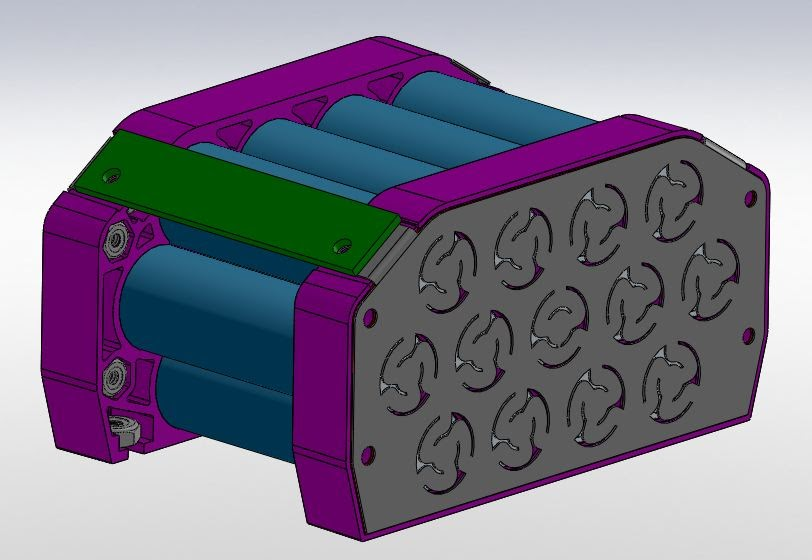
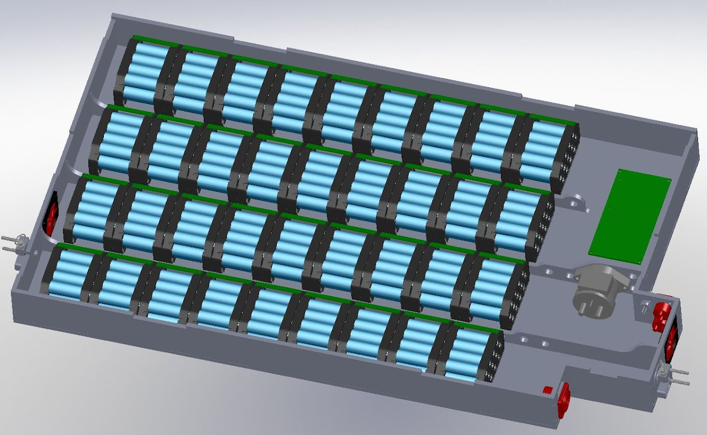
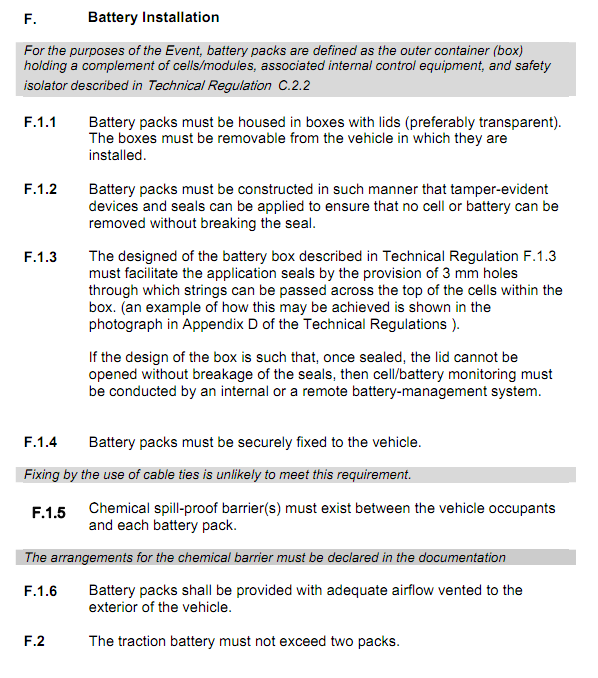

# SSCP - Xenith/Apogee Battery Pack

# Xenith/Apogee Battery Pack

Description: 

The goal of this project is to get new members to design a new battery pack for Xenith/Apogee, giving us a second generation battery pack. This will:

1. Teach new members how to use and get an intro to:Basic prototyping and sketchingSolidworks, workgroupPDM Design reviewsBasic machiningCNC machiningIntro composites/gluing stuff for beginners
2. Basic prototyping and sketchingSolidworks, workgroupPDM Design reviewsBasic machiningCNC machiningIntro composites/gluing stuff for beginners
3. Basic prototyping and sketching
4. Solidworks, workgroupPDM 
5. Design reviews
6. Basic machining
7. CNC machining
8. Intro composites/gluing stuff for beginners

Teach new members how to use and get an intro to:

1. Basic prototyping and sketchingSolidworks, workgroupPDM Design reviewsBasic machiningCNC machiningIntro composites/gluing stuff for beginners
2. Basic prototyping and sketching
3. Solidworks, workgroupPDM 
4. Design reviews
5. Basic machining
6. CNC machining
7. Intro composites/gluing stuff for beginners

1. Basic prototyping and sketching
2. Solidworks, workgroupPDM 
3. Design reviews
4. Basic machining
5. CNC machining
6. Intro composites/gluing stuff for beginners

Basic prototyping and sketching

Solidworks, workgroupPDM 

Design reviews

Basic machining

CNC machining

Intro composites/gluing stuff for beginners

* High Voltage Electrical SafetyHigh Voltage system architecture (Xenith and Apogee)Vibe and shock testing
* High Voltage Electrical SafetyHigh Voltage system architecture (Xenith and Apogee)Vibe and shock testing
* High Voltage system architecture (Xenith and Apogee)
* Vibe and shock testing

1. High Voltage Electrical SafetyHigh Voltage system architecture (Xenith and Apogee)Vibe and shock testing
2. High Voltage system architecture (Xenith and Apogee)
3. Vibe and shock testing

High Voltage Electrical Safety

[High Voltage Electrical Safety](/home/sscp-2012-2013/electrical-2012-2013/electrical-fundamentals/high-voltage-safety)

1. High Voltage system architecture (Xenith and Apogee)
2. Vibe and shock testing

High Voltage system architecture (Xenith and Apogee)

Vibe and shock testing

1. Get us a battery pack for Apogee, so we can drag race our solar cars.
2. Test out the idea of using bent and powdercoated copper bus bars for HV

Get us a battery pack for Apogee, so we can drag race our solar cars.

Test out the idea of using bent and powdercoated copper bus bars for HV

Battery Module Design

Xenith Pack Design, Revision 1

Key Deadlines:

* TBD
* TBD

* TBD

TBD

Design Requirements:

* Must fit and function in both Xenith and ApogeeMust be designed for 35 Xenith Li-ion modulesMust use copper bus bars (CNC'd) between modules[INSERT DRAWING OF OVERALL DIMENSIONS][ATTACH MODELS OF BATTERY MODULE][ATTACH MODEL OF BOARD]
* Must fit and function in both Xenith and Apogee
* Must be designed for 35 Xenith Li-ion modules
* Must use copper bus bars (CNC'd) between modules
* [INSERT DRAWING OF OVERALL DIMENSIONS]
* [ATTACH MODELS OF BATTERY MODULE]
* [ATTACH MODEL OF BOARD]

1. Must fit and function in both Xenith and Apogee
2. Must be designed for 35 Xenith Li-ion modules
3. Must use copper bus bars (CNC'd) between modules
4. [INSERT DRAWING OF OVERALL DIMENSIONS]
5. [ATTACH MODELS OF BATTERY MODULE]
6. [ATTACH MODEL OF BOARD]

Must fit and function in both Xenith and Apogee

Must be designed for 35 Xenith Li-ion modules

Must use copper bus bars (CNC'd) between modules

[INSERT DRAWING OF OVERALL DIMENSIONS]

[ATTACH MODELS OF BATTERY MODULE]

[ATTACH MODEL OF BOARD]

Applicable Race Regulations

* In addition to the below, see section E of the WSC 2011 rules about allowed battery weights:LiFePO4 40 kg                   Pb-acid  125 kg Li-polymer  22 kg                        Ni-Zn  75 kg Li-ion  21 kg                       Ag-Zn  40 kg NiMH  70 kg                           Ni-Fe  100 kg 
* In addition to the below, see section E of the WSC 2011 rules about allowed battery weights:
* LiFePO4 40 kg                   Pb-acid  125 kg 
* Li-polymer  22 kg                        Ni-Zn  75 kg 
* Li-ion  21 kg                       Ag-Zn  40 kg 
* NiMH  70 kg                           Ni-Fe  100 kg 

* In addition to the below, see section E of the WSC 2011 rules about allowed battery weights:
* LiFePO4 40 kg                   Pb-acid  125 kg 
* Li-polymer  22 kg                        Ni-Zn  75 kg 
* Li-ion  21 kg                       Ag-Zn  40 kg 
* NiMH  70 kg                           Ni-Fe  100 kg 

In addition to the below, see section E of the WSC 2011 rules about allowed battery weights:

LiFePO4 40 kg                   Pb-acid  125 kg 

Li-polymer  22 kg                        Ni-Zn  75 kg 

Li-ion  21 kg                       Ag-Zn  40 kg 

NiMH  70 kg                           Ni-Fe  100 kg 

Loading Conditions

* Vibe test - 8g in X, Y, and Z
* Vibe test - 8g in X, Y, and Z

* Vibe test - 8g in X, Y, and Z

Vibe test - 8g in X, Y, and Z

Design Notes

* [USE THIS SPACE FOR NOTES ABOUT THE DESIGN - INCLUDE DESIGN IDEAS, PICTURES OF PROTOTYPES, LINKS TO PARTS, PART NUMBERS, EXPERIMENTS]
* [USE THIS SPACE FOR NOTES ABOUT THE DESIGN - INCLUDE DESIGN IDEAS, PICTURES OF PROTOTYPES, LINKS TO PARTS, PART NUMBERS, EXPERIMENTS]

* [USE THIS SPACE FOR NOTES ABOUT THE DESIGN - INCLUDE DESIGN IDEAS, PICTURES OF PROTOTYPES, LINKS TO PARTS, PART NUMBERS, EXPERIMENTS]

[USE THIS SPACE FOR NOTES ABOUT THE DESIGN - INCLUDE DESIGN IDEAS, PICTURES OF PROTOTYPES, LINKS TO PARTS, PART NUMBERS, EXPERIMENTS]

Manufacturing Plan

* Sandwich panels Are water-jet cut by KellerSandwich panels are glued together with DP-420 (see Minnesota's guide to composites on this page Composites Fundamentals and Planning)Finished with spray acrylic or polyurethane (keeps moisture out)Edges filled with microbubbles and epoxy (Made with West 105 Epoxy), sandedBattery Mounting:Aluminum/plastic bars are machined, etched, and glued into sandwich panel with DP-420Battery end-plates:3D printed (Shapeways) or CNC'dBus BarsCNC'd out of copper, powder coated/shrink wrapped. How they are attached to the box is an open questionPCB mountingMachined aluminium threaded pieces are etched, glued into placeElectrical Connections (See guide here #TODO)
* Sandwich panels Are water-jet cut by KellerSandwich panels are glued together with DP-420 (see Minnesota's guide to composites on this page Composites Fundamentals and Planning)Finished with spray acrylic or polyurethane (keeps moisture out)Edges filled with microbubbles and epoxy (Made with West 105 Epoxy), sanded
* Are water-jet cut by Keller
* Sandwich panels are glued together with DP-420 (see Minnesota's guide to composites on this page Composites Fundamentals and Planning)
* Finished with spray acrylic or polyurethane (keeps moisture out)
* Edges filled with microbubbles and epoxy (Made with West 105 Epoxy), sanded
* Battery Mounting:Aluminum/plastic bars are machined, etched, and glued into sandwich panel with DP-420
* Aluminum/plastic bars are machined, etched, and glued into sandwich panel with DP-420
* Battery end-plates:3D printed (Shapeways) or CNC'd
* 3D printed (Shapeways) or CNC'd
* Bus BarsCNC'd out of copper, powder coated/shrink wrapped. How they are attached to the box is an open question
* CNC'd out of copper, powder coated/shrink wrapped. 
* How they are attached to the box is an open question
* PCB mountingMachined aluminium threaded pieces are etched, glued into place
* Machined aluminium threaded pieces are etched, glued into place
* Electrical Connections (See guide here #TODO)

* Sandwich panels Are water-jet cut by KellerSandwich panels are glued together with DP-420 (see Minnesota's guide to composites on this page Composites Fundamentals and Planning)Finished with spray acrylic or polyurethane (keeps moisture out)Edges filled with microbubbles and epoxy (Made with West 105 Epoxy), sanded
* Are water-jet cut by Keller
* Sandwich panels are glued together with DP-420 (see Minnesota's guide to composites on this page Composites Fundamentals and Planning)
* Finished with spray acrylic or polyurethane (keeps moisture out)
* Edges filled with microbubbles and epoxy (Made with West 105 Epoxy), sanded
* Battery Mounting:Aluminum/plastic bars are machined, etched, and glued into sandwich panel with DP-420
* Aluminum/plastic bars are machined, etched, and glued into sandwich panel with DP-420
* Battery end-plates:3D printed (Shapeways) or CNC'd
* 3D printed (Shapeways) or CNC'd
* Bus BarsCNC'd out of copper, powder coated/shrink wrapped. How they are attached to the box is an open question
* CNC'd out of copper, powder coated/shrink wrapped. 
* How they are attached to the box is an open question
* PCB mountingMachined aluminium threaded pieces are etched, glued into place
* Machined aluminium threaded pieces are etched, glued into place
* Electrical Connections (See guide here #TODO)

Sandwich panels 

* Are water-jet cut by Keller
* Sandwich panels are glued together with DP-420 (see Minnesota's guide to composites on this page Composites Fundamentals and Planning)
* Finished with spray acrylic or polyurethane (keeps moisture out)
* Edges filled with microbubbles and epoxy (Made with West 105 Epoxy), sanded

Are water-jet cut by Keller

Sandwich panels are glued together with DP-420 (see Minnesota's guide to composites on this page Composites Fundamentals and Planning)

[Composites Fundamentals and Planning](/home/sscp-2012-2013/composites-2012-2013/composites-fundamentals)

Finished with spray acrylic or polyurethane (keeps moisture out)

Edges filled with microbubbles and epoxy (Made with West 105 Epoxy), sanded

Battery Mounting:

* Aluminum/plastic bars are machined, etched, and glued into sandwich panel with DP-420

Aluminum/plastic bars are machined, etched, and glued into sandwich panel with DP-420

Battery end-plates:

* 3D printed (Shapeways) or CNC'd

3D printed (Shapeways) or CNC'd

Bus Bars

* CNC'd out of copper, powder coated/shrink wrapped. 
* How they are attached to the box is an open question

CNC'd out of copper, powder coated/shrink wrapped. 

How they are attached to the box is an open question

PCB mounting

* Machined aluminium threaded pieces are etched, glued into place

Machined aluminium threaded pieces are etched, glued into place

Electrical Connections (See guide here #TODO)

Test Plan

* TBD by New Members
* TBD by New Members

* TBD by New Members

TBD by New Members

Bill of Materials

[USE THIS SPACE TO MAKE A LIST OF ALL THE COMPONENTS IN YOUR ASSEMBLY. THIS IS VERY IMPORTANT FOR MAKING SURE THAT EVERY PART OF YOUR ASSEMBLY HAS BEEN ORDERED. IT'S ALSO KEY TO MAKE SURE THAT ALL REPLACEMENT PARTS ARE READY FOR THE RACE. EXAMPLE COMPONENTS HAVE BEEN FILLED IN FOR YOU]

 Part Description

 Brake Pedal

 Axle

 Battery Modules   

BMS Sense Nuts

 BMS Sense Bolts

 Battery Module Nuts

 Module-Module Nuts

 Module-Module bolts

 ADD STUFF HERE!!!!!

 ADD STUFF HERE!!!!!

 

 Wire Clamp 

 Recessed Pull Handle

 

 

 Part Number

 NA

 K23424J

 SSCP

 Quantity 

1 

 2

 35

 40

 40

 140

 140

 140

 

 

 

1 pack    

 

 2

 

 

 Material

 5052 Sheet Al

 Bearing Steel

 Mixed

 Zinc-plated Steel

 Stainless steel

 Stainless Steel

 Zinc-plated steel

 Stainless Steel

 

 

 

 Nylon    

 Acetal

 

 

 Manufacturer

 CMS

 Misumi

 SSCP

 McMaster

 McMaster

 McMaster

 McMaster

 McMaster

 

 

 

McMaster 

 McMaster        

 

 

 Supplier

 NA

 Misumi

 SSCP

 McMaster

 McMaster

 McMaster

 McMaster

 McMaster

 

 

 

McMaster 

McMaster 

 

 

 Revision No.

 4

 2

 3

 

 

 

 

 

 

 

 

 

 

 

 

 Replacement on hand

 N

 Y

 Y

 y

 

 

 

 

 

 

 

 

 

 

 

90631A005

[90631A005](http://www.mcmaster.com/#90631A005)

92949A106

[92949A106](http://www.mcmaster.com/#92949A106)

94785A007

[94785A007](http://www.mcmaster.com/#94785A007)

90631A005

[90631A005](http://www.mcmaster.com/#90631A005)

92196A114

[92196A114](http://www.mcmaster.com/#92196A114)

2978T68

[2978T68](http://www.mcmaster.com/#2978T68)

 

13155A24  

[13155A24](http://www.mcmaster.com/#13155A24)

 

 

Conclusions

[WHAT WORKED, WHAT DIDN'T. FILL THIS IN AFTER LOTS OF TESTING OR A RACE]

Attachments (0)

Attach a file: 

### Comments

 

Add comment

Recent Site Activity  |  Revision History  |  Terms  |  Report Abuse  |  Print page  |  Remove Access  |  Powered by Google Sites

[Recent Site Activity](https://sites.google.com/site/susolarcar/system/app/pages/recentChanges)

[Revision History](https://sites.google.com/site/susolarcar/system/app/pages/admin/revisions?wuid=wuid:gx:b9f17ea90edc74a)

[Report Abuse](https://sites.google.com/site/susolarcar/system/app/pages/reportAbuse?src=/home/mechanical/suspension)

[Remove Access](https://sites.google.com/site/susolarcar/system/app/pages/removeAccess)

[Google Sites](http://sites.google.com/)

Suspension

draft saved at 13:46

### Embedded Google Drive File

Google Drive File: [Embedded Content](https://drive.google.com/embeddedfolderview?id=1o8YR3BVnqv_KGLJjQIGLbOTHO8qLmATb#list)

<iframe width="100%" height="400" src="https://drive.google.com/embeddedfolderview?id=1o8YR3BVnqv_KGLJjQIGLbOTHO8qLmATb#list" frameborder="0"></iframe>

