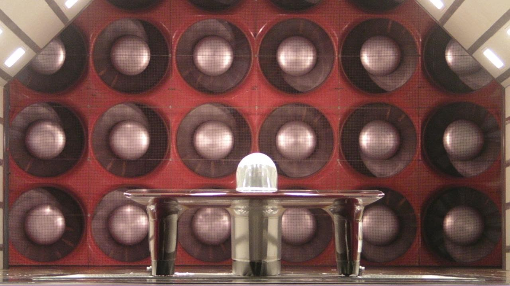

# SSCP - Aerodyn Visit 2012

# Aerodyn Visit 2012

## Summary

On June 20, 2012, SSCP visited the Aerodyn Windtunnel near Charlotte, North Carolina to do benchmarking tests on Xenith.

A number of tests were performed, and the data are summarized in the "customer.xlsx" excel file attached to this page.

## Best Practices

The SSCP members who went to the windtunnel were asked to share the bits of wisdom from the visit to the windtunnel. They are below:

Nathan Hall-Snyder:

Notes from smoke tests:

* the bubble was very clean - no separationthe fillets were very cleanthe edges needed some work - curling air over the edges, while looking cool, caused problemsThe reason to do angled sides nuna 5 style is to get rid of the separation at one of the leading edge corners during yaw testsSmoke wand tests are awesome. Next time we should have a microphoneThe flow around the outside of the fairings does not converge pointing straight back
* the bubble was very clean - no separation
* the fillets were very clean
* the edges needed some work - curling air over the edges, while looking cool, caused problems
* The reason to do angled sides nuna 5 style is to get rid of the separation at one of the leading edge corners during yaw tests
* Smoke wand tests are awesome. Next time we should have a microphone
* The flow around the outside of the fairings does not converge pointing straight back

* the bubble was very clean - no separation
* the fillets were very clean
* the edges needed some work - curling air over the edges, while looking cool, caused problems
* The reason to do angled sides nuna 5 style is to get rid of the separation at one of the leading edge corners during yaw tests
* Smoke wand tests are awesome. Next time we should have a microphone
* The flow around the outside of the fairings does not converge pointing straight back

the bubble was very clean - no separation

the fillets were very clean

the edges needed some work - curling air over the edges, while looking cool, caused problems

The reason to do angled sides nuna 5 style is to get rid of the separation at one of the leading edge corners during yaw tests

Smoke wand tests are awesome. Next time we should have a microphone

The flow around the outside of the fairings does not converge pointing straight back

General Windtunnel Advice:

* There are two types of windtunnel tests. Benchmarking and development. They are different sorts of visitsMake sure that the e-brake is off and there is minimum friction if there are wheels touchingGet the car heights ready (including angle of attack measurements, maybe with an internal IMU or just a sheet of paper) beforehand.Make sure the tires don't touch. Put adjustable rigid bars in the suspension to prevent wheels from touching if the plan is not to use rollers...don't try to ratchet strap the suspension.Skirts are a royal pain in the ass. 
* There are two types of windtunnel tests. Benchmarking and development. They are different sorts of visits
* Make sure that the e-brake is off and there is minimum friction if there are wheels touching
* Get the car heights ready (including angle of attack measurements, maybe with an internal IMU or just a sheet of paper) beforehand.
* Make sure the tires don't touch. Put adjustable rigid bars in the suspension to prevent wheels from touching if the plan is not to use rollers...don't try to ratchet strap the suspension.
* Skirts are a royal pain in the ass. 

* There are two types of windtunnel tests. Benchmarking and development. They are different sorts of visits
* Make sure that the e-brake is off and there is minimum friction if there are wheels touching
* Get the car heights ready (including angle of attack measurements, maybe with an internal IMU or just a sheet of paper) beforehand.
* Make sure the tires don't touch. Put adjustable rigid bars in the suspension to prevent wheels from touching if the plan is not to use rollers...don't try to ratchet strap the suspension.
* Skirts are a royal pain in the ass. 

There are two types of windtunnel tests. Benchmarking and development. They are different sorts of visits

Make sure that the e-brake is off and there is minimum friction if there are wheels touching

Get the car heights ready (including angle of attack measurements, maybe with an internal IMU or just a sheet of paper) beforehand.

Make sure the tires don't touch. Put adjustable rigid bars in the suspension to prevent wheels from touching if the plan is not to use rollers...don't try to ratchet strap the suspension.

Skirts are a royal pain in the ass. 

General Notes on Xenith:

* The top shell oscillated in the smooth flow of the wind tunnel. Our best guess is that the impulse provided by the vortexes in the back caused the top shell to rock back and forth on its loose latches.As expected, the Xenith had marginally less drag in a crosswind situation due to the lift provided by the fairings. The large effect that angle of attack had on drag differed from what was predicted by Ansys. 
* The top shell oscillated in the smooth flow of the wind tunnel. Our best guess is that the impulse provided by the vortexes in the back caused the top shell to rock back and forth on its loose latches.
* As expected, the Xenith had marginally less drag in a crosswind situation due to the lift provided by the fairings. 
* The large effect that angle of attack had on drag differed from what was predicted by Ansys. 

* The top shell oscillated in the smooth flow of the wind tunnel. Our best guess is that the impulse provided by the vortexes in the back caused the top shell to rock back and forth on its loose latches.
* As expected, the Xenith had marginally less drag in a crosswind situation due to the lift provided by the fairings. 
* The large effect that angle of attack had on drag differed from what was predicted by Ansys. 

The top shell oscillated in the smooth flow of the wind tunnel. Our best guess is that the impulse provided by the vortexes in the back caused the top shell to rock back and forth on its loose latches.

As expected, the Xenith had marginally less drag in a crosswind situation due to the lift provided by the fairings. 

The large effect that angle of attack had on drag differed from what was predicted by Ansys. 

Nathan Golshan:

General Thoughts:

* Skirts make for a very long setup period in the tunnel, unless the exact ride height and angle of attack are known and set up on a flat surface beforehand, with skirts trimmed to the correct length.Changing the angle of attack almost always involves trimming the skirts, if the skirts are riding as low as they should in the neutral position. This is a pain in the ass and takes forever, and when you're paying 1K per hour, shit can't take forever. Mathematically speaking this would cost infinite money, which of course is pretty expensive.The mounts that were devised for the front end worked well.Something to keep in mind for the next car - we don't want to make any real sacrifices just to fit the next design in the Aerodyn tunnel, but we can't cut holes in things like we did for Xenith just to get the car mounted. Now that we know the dimensions and setup of the tunnel, this is something that needs to be thought about.
* Skirts make for a very long setup period in the tunnel, unless the exact ride height and angle of attack are known and set up on a flat surface beforehand, with skirts trimmed to the correct length.
* Changing the angle of attack almost always involves trimming the skirts, if the skirts are riding as low as they should in the neutral position. This is a pain in the ass and takes forever, and when you're paying 1K per hour, shit can't take forever. Mathematically speaking this would cost infinite money, which of course is pretty expensive.
* The mounts that were devised for the front end worked well.
* Something to keep in mind for the next car - we don't want to make any real sacrifices just to fit the next design in the Aerodyn tunnel, but we can't cut holes in things like we did for Xenith just to get the car mounted. Now that we know the dimensions and setup of the tunnel, this is something that needs to be thought about.

* Skirts make for a very long setup period in the tunnel, unless the exact ride height and angle of attack are known and set up on a flat surface beforehand, with skirts trimmed to the correct length.
* Changing the angle of attack almost always involves trimming the skirts, if the skirts are riding as low as they should in the neutral position. This is a pain in the ass and takes forever, and when you're paying 1K per hour, shit can't take forever. Mathematically speaking this would cost infinite money, which of course is pretty expensive.
* The mounts that were devised for the front end worked well.
* Something to keep in mind for the next car - we don't want to make any real sacrifices just to fit the next design in the Aerodyn tunnel, but we can't cut holes in things like we did for Xenith just to get the car mounted. Now that we know the dimensions and setup of the tunnel, this is something that needs to be thought about.

Skirts make for a very long setup period in the tunnel, unless the exact ride height and angle of attack are known and set up on a flat surface beforehand, with skirts trimmed to the correct length.

Changing the angle of attack almost always involves trimming the skirts, if the skirts are riding as low as they should in the neutral position. This is a pain in the ass and takes forever, and when you're paying 1K per hour, shit can't take forever. Mathematically speaking this would cost infinite money, which of course is pretty expensive.

The mounts that were devised for the front end worked well.

Something to keep in mind for the next car - we don't want to make any real sacrifices just to fit the next design in the Aerodyn tunnel, but we can't cut holes in things like we did for Xenith just to get the car mounted. Now that we know the dimensions and setup of the tunnel, this is something that needs to be thought about.

Thoughts on Aero Design:

* Xenith performed almost exactly as we expected from simulation at the optimal angle of attack and zero yaw angle. We saw unreasonably huge increases in drag for very small adjustments, to the point where minuscule changes to the car that shouldn't have had an affect on the drag numbers (such as bumping up the front by less than a quarter inch to make sure tires aren't touching) had a large enough effect to necessitate a new baseline measurement. I'm no aerodynamicist, but I think the test cleanly trashed the trade-off we made in aero design for Xenith - namely, a sub-optimal Cd offset by an insanely low frontal area. This necessitated the design that we see in Xenith - lots of long, thin sections, overlapping front and rear fairings, and the insanely sharp main foil. This made for a phenomenal drag number in the smooth, straight flow of the tunnel with the car bolted into the perfect position, but means that if the car points just a little bit away from this optimal position, we're fucked. Unfortunately, while Australia is extremely flat and smooth and consistent on the macro scale, it is quite terrifyingly imperfect in so many ways on the scale of the car itself. The amount of time the car spent pointing precisely in the right direction relative to the wind vector in smooth flow without oscillation had to have been very very close to zero.Things that we saw in the wind tunnel that explain why we were so fucked in Australia:We never had a proper angle of attack. I believe (?) we were riding nose up the entire race, due to an unfortunate error in the rear suspension originating in an improperly welded rollcage. Refer to the data to see just how much drag this induces. However, according to the sensitivity we saw to imperfect angles of attack (a 20% increase in drag for 1 degree), the oscillation with the stiff suspension would have screwed us anyway. Xenith would destroy everyone if it had a fully active suspension. If we're going to go there, we might as well do boundary layer suction. And throw some plasma actuators on there for good measure. Probably concentrators, too, in a giant tilting array.We almost never had a consistent airflow with no effective yaw angle. The drag was nonlinear in response to yaw, but for 0 > x > 5 degrees the numbers seemed to be a drag (yes, that's a pun). In the smoke wand test, it was evident that there was a large amount of flow separation and pressure drag off of the edge of the main foil that was yawed away from the airstream. Other aero designs (i.e. tokai) seem to solve this by having a fatter but far more rounded profile from this angle, which will help to keep the flow attached at these yaw angles compared to our relatively sharp edges. Fluid doesn't like being asked to turn sharp corners.We still haven't quantified the effect that the leading edge oscillation caused by the stiff suspension had on the attachment of flow over the whole car.Seems to me the moral of the story is this: We designed a great aerobody for the sanitary environment of Ansys and the wind tunnel that ate shit when put on trial in the very messy real world. Our task for the next car is difficult - to maintain this (relative) level of simulation and tunnel performance, while learning and thinking and iterating and testing as much as we can on all of the things that will make the aero design extremely forgiving to inconsistent conditions.Final thought: WE NEED TO FIND SOME GOOD AERODYNAMICISTS TO HAVE SERIOUS DESIGN REVIEWS WITH. We've made huge strides, but aero design is stil by far our weakest point. It seems we have strings to pull with VW to get access to some industry engineers. Audi knows the dark magic, and we really really need some.
* Xenith performed almost exactly as we expected from simulation at the optimal angle of attack and zero yaw angle. We saw unreasonably huge increases in drag for very small adjustments, to the point where minuscule changes to the car that shouldn't have had an affect on the drag numbers (such as bumping up the front by less than a quarter inch to make sure tires aren't touching) had a large enough effect to necessitate a new baseline measurement. 
* I'm no aerodynamicist, but I think the test cleanly trashed the trade-off we made in aero design for Xenith - namely, a sub-optimal Cd offset by an insanely low frontal area. This necessitated the design that we see in Xenith - lots of long, thin sections, overlapping front and rear fairings, and the insanely sharp main foil. This made for a phenomenal drag number in the smooth, straight flow of the tunnel with the car bolted into the perfect position, but means that if the car points just a little bit away from this optimal position, we're fucked. Unfortunately, while Australia is extremely flat and smooth and consistent on the macro scale, it is quite terrifyingly imperfect in so many ways on the scale of the car itself. The amount of time the car spent pointing precisely in the right direction relative to the wind vector in smooth flow without oscillation had to have been very very close to zero.
* Things that we saw in the wind tunnel that explain why we were so fucked in Australia:We never had a proper angle of attack. I believe (?) we were riding nose up the entire race, due to an unfortunate error in the rear suspension originating in an improperly welded rollcage. Refer to the data to see just how much drag this induces. However, according to the sensitivity we saw to imperfect angles of attack (a 20% increase in drag for 1 degree), the oscillation with the stiff suspension would have screwed us anyway. Xenith would destroy everyone if it had a fully active suspension. If we're going to go there, we might as well do boundary layer suction. And throw some plasma actuators on there for good measure. Probably concentrators, too, in a giant tilting array.We almost never had a consistent airflow with no effective yaw angle. The drag was nonlinear in response to yaw, but for 0 > x > 5 degrees the numbers seemed to be a drag (yes, that's a pun). In the smoke wand test, it was evident that there was a large amount of flow separation and pressure drag off of the edge of the main foil that was yawed away from the airstream. Other aero designs (i.e. tokai) seem to solve this by having a fatter but far more rounded profile from this angle, which will help to keep the flow attached at these yaw angles compared to our relatively sharp edges. Fluid doesn't like being asked to turn sharp corners.We still haven't quantified the effect that the leading edge oscillation caused by the stiff suspension had on the attachment of flow over the whole car.
* We never had a proper angle of attack. I believe (?) we were riding nose up the entire race, due to an unfortunate error in the rear suspension originating in an improperly welded rollcage. Refer to the data to see just how much drag this induces. However, according to the sensitivity we saw to imperfect angles of attack (a 20% increase in drag for 1 degree), the oscillation with the stiff suspension would have screwed us anyway. Xenith would destroy everyone if it had a fully active suspension. If we're going to go there, we might as well do boundary layer suction. And throw some plasma actuators on there for good measure. Probably concentrators, too, in a giant tilting array.
* We almost never had a consistent airflow with no effective yaw angle. The drag was nonlinear in response to yaw, but for 0 > x > 5 degrees the numbers seemed to be a drag (yes, that's a pun). In the smoke wand test, it was evident that there was a large amount of flow separation and pressure drag off of the edge of the main foil that was yawed away from the airstream. Other aero designs (i.e. tokai) seem to solve this by having a fatter but far more rounded profile from this angle, which will help to keep the flow attached at these yaw angles compared to our relatively sharp edges. Fluid doesn't like being asked to turn sharp corners.
* We still haven't quantified the effect that the leading edge oscillation caused by the stiff suspension had on the attachment of flow over the whole car.
* Seems to me the moral of the story is this: We designed a great aerobody for the sanitary environment of Ansys and the wind tunnel that ate shit when put on trial in the very messy real world. Our task for the next car is difficult - to maintain this (relative) level of simulation and tunnel performance, while learning and thinking and iterating and testing as much as we can on all of the things that will make the aero design extremely forgiving to inconsistent conditions.
* Final thought: WE NEED TO FIND SOME GOOD AERODYNAMICISTS TO HAVE SERIOUS DESIGN REVIEWS WITH. We've made huge strides, but aero design is stil by far our weakest point. It seems we have strings to pull with VW to get access to some industry engineers. Audi knows the dark magic, and we really really need some.

* Xenith performed almost exactly as we expected from simulation at the optimal angle of attack and zero yaw angle. We saw unreasonably huge increases in drag for very small adjustments, to the point where minuscule changes to the car that shouldn't have had an affect on the drag numbers (such as bumping up the front by less than a quarter inch to make sure tires aren't touching) had a large enough effect to necessitate a new baseline measurement. 
* I'm no aerodynamicist, but I think the test cleanly trashed the trade-off we made in aero design for Xenith - namely, a sub-optimal Cd offset by an insanely low frontal area. This necessitated the design that we see in Xenith - lots of long, thin sections, overlapping front and rear fairings, and the insanely sharp main foil. This made for a phenomenal drag number in the smooth, straight flow of the tunnel with the car bolted into the perfect position, but means that if the car points just a little bit away from this optimal position, we're fucked. Unfortunately, while Australia is extremely flat and smooth and consistent on the macro scale, it is quite terrifyingly imperfect in so many ways on the scale of the car itself. The amount of time the car spent pointing precisely in the right direction relative to the wind vector in smooth flow without oscillation had to have been very very close to zero.
* Things that we saw in the wind tunnel that explain why we were so fucked in Australia:We never had a proper angle of attack. I believe (?) we were riding nose up the entire race, due to an unfortunate error in the rear suspension originating in an improperly welded rollcage. Refer to the data to see just how much drag this induces. However, according to the sensitivity we saw to imperfect angles of attack (a 20% increase in drag for 1 degree), the oscillation with the stiff suspension would have screwed us anyway. Xenith would destroy everyone if it had a fully active suspension. If we're going to go there, we might as well do boundary layer suction. And throw some plasma actuators on there for good measure. Probably concentrators, too, in a giant tilting array.We almost never had a consistent airflow with no effective yaw angle. The drag was nonlinear in response to yaw, but for 0 > x > 5 degrees the numbers seemed to be a drag (yes, that's a pun). In the smoke wand test, it was evident that there was a large amount of flow separation and pressure drag off of the edge of the main foil that was yawed away from the airstream. Other aero designs (i.e. tokai) seem to solve this by having a fatter but far more rounded profile from this angle, which will help to keep the flow attached at these yaw angles compared to our relatively sharp edges. Fluid doesn't like being asked to turn sharp corners.We still haven't quantified the effect that the leading edge oscillation caused by the stiff suspension had on the attachment of flow over the whole car.
* We never had a proper angle of attack. I believe (?) we were riding nose up the entire race, due to an unfortunate error in the rear suspension originating in an improperly welded rollcage. Refer to the data to see just how much drag this induces. However, according to the sensitivity we saw to imperfect angles of attack (a 20% increase in drag for 1 degree), the oscillation with the stiff suspension would have screwed us anyway. Xenith would destroy everyone if it had a fully active suspension. If we're going to go there, we might as well do boundary layer suction. And throw some plasma actuators on there for good measure. Probably concentrators, too, in a giant tilting array.
* We almost never had a consistent airflow with no effective yaw angle. The drag was nonlinear in response to yaw, but for 0 > x > 5 degrees the numbers seemed to be a drag (yes, that's a pun). In the smoke wand test, it was evident that there was a large amount of flow separation and pressure drag off of the edge of the main foil that was yawed away from the airstream. Other aero designs (i.e. tokai) seem to solve this by having a fatter but far more rounded profile from this angle, which will help to keep the flow attached at these yaw angles compared to our relatively sharp edges. Fluid doesn't like being asked to turn sharp corners.
* We still haven't quantified the effect that the leading edge oscillation caused by the stiff suspension had on the attachment of flow over the whole car.
* Seems to me the moral of the story is this: We designed a great aerobody for the sanitary environment of Ansys and the wind tunnel that ate shit when put on trial in the very messy real world. Our task for the next car is difficult - to maintain this (relative) level of simulation and tunnel performance, while learning and thinking and iterating and testing as much as we can on all of the things that will make the aero design extremely forgiving to inconsistent conditions.
* Final thought: WE NEED TO FIND SOME GOOD AERODYNAMICISTS TO HAVE SERIOUS DESIGN REVIEWS WITH. We've made huge strides, but aero design is stil by far our weakest point. It seems we have strings to pull with VW to get access to some industry engineers. Audi knows the dark magic, and we really really need some.

Xenith performed almost exactly as we expected from simulation at the optimal angle of attack and zero yaw angle. We saw unreasonably huge increases in drag for very small adjustments, to the point where minuscule changes to the car that shouldn't have had an affect on the drag numbers (such as bumping up the front by less than a quarter inch to make sure tires aren't touching) had a large enough effect to necessitate a new baseline measurement. 

I'm no aerodynamicist, but I think the test cleanly trashed the trade-off we made in aero design for Xenith - namely, a sub-optimal Cd offset by an insanely low frontal area. This necessitated the design that we see in Xenith - lots of long, thin sections, overlapping front and rear fairings, and the insanely sharp main foil. This made for a phenomenal drag number in the smooth, straight flow of the tunnel with the car bolted into the perfect position, but means that if the car points just a little bit away from this optimal position, we're fucked. Unfortunately, while Australia is extremely flat and smooth and consistent on the macro scale, it is quite terrifyingly imperfect in so many ways on the scale of the car itself. The amount of time the car spent pointing precisely in the right direction relative to the wind vector in smooth flow without oscillation had to have been very very close to zero.

Things that we saw in the wind tunnel that explain why we were so fucked in Australia:

* We never had a proper angle of attack. I believe (?) we were riding nose up the entire race, due to an unfortunate error in the rear suspension originating in an improperly welded rollcage. Refer to the data to see just how much drag this induces. However, according to the sensitivity we saw to imperfect angles of attack (a 20% increase in drag for 1 degree), the oscillation with the stiff suspension would have screwed us anyway. Xenith would destroy everyone if it had a fully active suspension. If we're going to go there, we might as well do boundary layer suction. And throw some plasma actuators on there for good measure. Probably concentrators, too, in a giant tilting array.
* We almost never had a consistent airflow with no effective yaw angle. The drag was nonlinear in response to yaw, but for 0 > x > 5 degrees the numbers seemed to be a drag (yes, that's a pun). In the smoke wand test, it was evident that there was a large amount of flow separation and pressure drag off of the edge of the main foil that was yawed away from the airstream. Other aero designs (i.e. tokai) seem to solve this by having a fatter but far more rounded profile from this angle, which will help to keep the flow attached at these yaw angles compared to our relatively sharp edges. Fluid doesn't like being asked to turn sharp corners.
* We still haven't quantified the effect that the leading edge oscillation caused by the stiff suspension had on the attachment of flow over the whole car.

We never had a proper angle of attack. I believe (?) we were riding nose up the entire race, due to an unfortunate error in the rear suspension originating in an improperly welded rollcage. Refer to the data to see just how much drag this induces. However, according to the sensitivity we saw to imperfect angles of attack (a 20% increase in drag for 1 degree), the oscillation with the stiff suspension would have screwed us anyway. Xenith would destroy everyone if it had a fully active suspension. If we're going to go there, we might as well do boundary layer suction. And throw some plasma actuators on there for good measure. Probably concentrators, too, in a giant tilting array.

We almost never had a consistent airflow with no effective yaw angle. The drag was nonlinear in response to yaw, but for 0 > x > 5 degrees the numbers seemed to be a drag (yes, that's a pun). In the smoke wand test, it was evident that there was a large amount of flow separation and pressure drag off of the edge of the main foil that was yawed away from the airstream. Other aero designs (i.e. tokai) seem to solve this by having a fatter but far more rounded profile from this angle, which will help to keep the flow attached at these yaw angles compared to our relatively sharp edges. Fluid doesn't like being asked to turn sharp corners.

We still haven't quantified the effect that the leading edge oscillation caused by the stiff suspension had on the attachment of flow over the whole car.

Seems to me the moral of the story is this: We designed a great aerobody for the sanitary environment of Ansys and the wind tunnel that ate shit when put on trial in the very messy real world. Our task for the next car is difficult - to maintain this (relative) level of simulation and tunnel performance, while learning and thinking and iterating and testing as much as we can on all of the things that will make the aero design extremely forgiving to inconsistent conditions.

Final thought: WE NEED TO FIND SOME GOOD AERODYNAMICISTS TO HAVE SERIOUS DESIGN REVIEWS WITH. We've made huge strides, but aero design is stil by far our weakest point. It seems we have strings to pull with VW to get access to some industry engineers. Audi knows the dark magic, and we really really need some.

Rachel Fenichel:

Setting up took longer than we expected, but it didn't actually take that long.  Everyone knew what their job was, so that went fairly smoothly and most of the time was spent making many small adjustments.  That was good.  We can probably cut that time down more for next time, though.

The fixturing went pretty well, but we probably should have already known that our tires would be touching and figured out what to do ahead of time.

We made an insanely sensitive car.  Holy crap!  That means that repeatability of our test configurations is really important.  Having a few specific measurements to check against really helps with that--here we had front height, tail height, and ram heights, and we always had the same person measuring.  The same thing should happen next time.

This time we had problems with a test because one wheel was barely touching and it fouled.  In the future there should be one person who is the last part of our team out of the wind tunnel and is just responsible for checking that nothing is fouled.  (Or any other analogous checks.)

One person should be responsible for media and nothing else--both taking pictures/video when we are in the tunnel and managing Aerodyn's cameras when we are running tests.

One or two people should probably be allocated just to running errands/getting tools.  This helps with making sure we never leave any tools in the wind tunnel during a run.

We should take the car to the wind tunnel in what would be the race configuration if we had to race that week.  That means batteries in the car and weights replacing the driver.  We don't know what the dependencies are in our car, and we're better off if we can standardize as many things as possible.  This applies beyond weights and to aero setup and tires as well, even if we know that aero will change as a result of our visit.

Can't think of anything else right now.  Overall I thought it went fairly well.

Abaho:

What went well for me is that we learned quite a bit about what we can focus on for the next car aerodynamically. I think as a team we gain a little bit of a general and valuable intuition on how different parts can be aerodynamically affected. We also learned, this may be Xenith specific, that changes we perceived to be trivial actually have a noticeable effect i.e the attitude changes during the yaw angle tests. I think we should have come up with more add ons like the tabs that we could quickly test with one trial so that we can see what we can integrate into the next car. I'm not sure if anyone will agree, but i think we wasted some time running the wind tunnel as the guy tested if one of the fairings was touching the floor.

Graham Dudley

* Overall wind tunnel testing proved to be very valuable, and definitely worth driving across the country.We MUST develop an way of quickly and accurately determining the angle of attack of the car, especially on uneven surfaces.  Seeing how often we adjusted the suspension and tire pressure during the race, it would be reasonable to guess that our effective angle of attack varied at least a degree each day of the race, and yet we only ever measured the angle of attack once, the night before the race. Even in the wind tunnel our repeatability on the same pitch (and yaw too) was very poor.  The results of the wind tunnel, however, show us that the car (and to a degree any solar car) are extremely sensitive to changes in pitch.  Therefore, as with wheel alignment and tire pressure, this should be verified very frequently during the race.  We must at least develop a way to do this while the car is stopped;  it would be epic if this could be done over telemetry (along with wheel alignment).  This goes hand in hand with developing a method to easily change the angle of attack.The car should be tested fully weighted down as it was in the race.  Because it was so light weight, the car vibrated differently depending on where and how much weight was in the car.  I believe a lot of this had to do with the fact that the rear of the car was unsecured, allowing the rear to vibrate up and down on the tire, while the front was fully rigid in x and y.  If it is possible to get our car next year onto the rollers (or at leas onto the rotating pad)  pitch and yaw adjustments will be both easier to do and far more accurate, giving us time to do small adjustments, which will in turn help solve such mysteries as the 3 degree yaw problem.As we changed angle of attack the clearance of the car from the ground changed, for example, while at neutral angle and +1 degrees, the skirts were all about 1/2 an inch from the ground.  However, when we were at -1 degrees, because of the limitations on how far down the front could go without hitting the ground, the skirts on all fairings were a full two inches off of the ground.  We need to come up with a better way of changing the angle of attack for the next time we are in a wind tunnel.  This method should mimic or be the same as the way we change angle of attack on the road.  Changing the yaw angle was similarly flawed.  While the front of the car could move around on the table, the rear of the car had to be lifted up, introducing irregularity in the placement of the wheel, which could have resulted in the funky data that we were getting for drag in yawSkirts proved to be not only ineffective but difficult to deal with, both in WSC and in the wind tunnel.  If possible we should test the car at different speeds to see if the car does anything funky at anything other than 55 (vibrations of the top shell, for example, did increase with speed).  In WSC we varied greatly from our average speed, so we should at least look at the behavior at different speeds.Kansas, Oklahoma, Texas would all be excellent for testing on the way over.It would have been nice to have fit in a tuft test
* Overall wind tunnel testing proved to be very valuable, and definitely worth driving across the country.
* We MUST develop an way of quickly and accurately determining the angle of attack of the car, especially on uneven surfaces.  Seeing how often we adjusted the suspension and tire pressure during the race, it would be reasonable to guess that our effective angle of attack varied at least a degree each day of the race, and yet we only ever measured the angle of attack once, the night before the race. Even in the wind tunnel our repeatability on the same pitch (and yaw too) was very poor.  The results of the wind tunnel, however, show us that the car (and to a degree any solar car) are extremely sensitive to changes in pitch.  Therefore, as with wheel alignment and tire pressure, this should be verified very frequently during the race.  We must at least develop a way to do this while the car is stopped;  it would be epic if this could be done over telemetry (along with wheel alignment).  This goes hand in hand with developing a method to easily change the angle of attack.
* The car should be tested fully weighted down as it was in the race.  Because it was so light weight, the car vibrated differently depending on where and how much weight was in the car.  I believe a lot of this had to do with the fact that the rear of the car was unsecured, allowing the rear to vibrate up and down on the tire, while the front was fully rigid in x and y.  
* If it is possible to get our car next year onto the rollers (or at leas onto the rotating pad)  pitch and yaw adjustments will be both easier to do and far more accurate, giving us time to do small adjustments, which will in turn help solve such mysteries as the 3 degree yaw problem.
* As we changed angle of attack the clearance of the car from the ground changed, for example, while at neutral angle and +1 degrees, the skirts were all about 1/2 an inch from the ground.  However, when we were at -1 degrees, because of the limitations on how far down the front could go without hitting the ground, the skirts on all fairings were a full two inches off of the ground.  We need to come up with a better way of changing the angle of attack for the next time we are in a wind tunnel.  This method should mimic or be the same as the way we change angle of attack on the road.  
* Changing the yaw angle was similarly flawed.  While the front of the car could move around on the table, the rear of the car had to be lifted up, introducing irregularity in the placement of the wheel, which could have resulted in the funky data that we were getting for drag in yaw
* Skirts proved to be not only ineffective but difficult to deal with, both in WSC and in the wind tunnel.  
* If possible we should test the car at different speeds to see if the car does anything funky at anything other than 55 (vibrations of the top shell, for example, did increase with speed).  In WSC we varied greatly from our average speed, so we should at least look at the behavior at different speeds.
* Kansas, Oklahoma, Texas would all be excellent for testing on the way over.
* It would have been nice to have fit in a tuft test

* Overall wind tunnel testing proved to be very valuable, and definitely worth driving across the country.
* We MUST develop an way of quickly and accurately determining the angle of attack of the car, especially on uneven surfaces.  Seeing how often we adjusted the suspension and tire pressure during the race, it would be reasonable to guess that our effective angle of attack varied at least a degree each day of the race, and yet we only ever measured the angle of attack once, the night before the race. Even in the wind tunnel our repeatability on the same pitch (and yaw too) was very poor.  The results of the wind tunnel, however, show us that the car (and to a degree any solar car) are extremely sensitive to changes in pitch.  Therefore, as with wheel alignment and tire pressure, this should be verified very frequently during the race.  We must at least develop a way to do this while the car is stopped;  it would be epic if this could be done over telemetry (along with wheel alignment).  This goes hand in hand with developing a method to easily change the angle of attack.
* The car should be tested fully weighted down as it was in the race.  Because it was so light weight, the car vibrated differently depending on where and how much weight was in the car.  I believe a lot of this had to do with the fact that the rear of the car was unsecured, allowing the rear to vibrate up and down on the tire, while the front was fully rigid in x and y.  
* If it is possible to get our car next year onto the rollers (or at leas onto the rotating pad)  pitch and yaw adjustments will be both easier to do and far more accurate, giving us time to do small adjustments, which will in turn help solve such mysteries as the 3 degree yaw problem.
* As we changed angle of attack the clearance of the car from the ground changed, for example, while at neutral angle and +1 degrees, the skirts were all about 1/2 an inch from the ground.  However, when we were at -1 degrees, because of the limitations on how far down the front could go without hitting the ground, the skirts on all fairings were a full two inches off of the ground.  We need to come up with a better way of changing the angle of attack for the next time we are in a wind tunnel.  This method should mimic or be the same as the way we change angle of attack on the road.  
* Changing the yaw angle was similarly flawed.  While the front of the car could move around on the table, the rear of the car had to be lifted up, introducing irregularity in the placement of the wheel, which could have resulted in the funky data that we were getting for drag in yaw
* Skirts proved to be not only ineffective but difficult to deal with, both in WSC and in the wind tunnel.  
* If possible we should test the car at different speeds to see if the car does anything funky at anything other than 55 (vibrations of the top shell, for example, did increase with speed).  In WSC we varied greatly from our average speed, so we should at least look at the behavior at different speeds.
* Kansas, Oklahoma, Texas would all be excellent for testing on the way over.
* It would have been nice to have fit in a tuft test

Overall wind tunnel testing proved to be very valuable, and definitely worth driving across the country.

We MUST develop an way of quickly and accurately determining the angle of attack of the car, especially on uneven surfaces.  Seeing how often we adjusted the suspension and tire pressure during the race, it would be reasonable to guess that our effective angle of attack varied at least a degree each day of the race, and yet we only ever measured the angle of attack once, the night before the race. Even in the wind tunnel our repeatability on the same pitch (and yaw too) was very poor.  The results of the wind tunnel, however, show us that the car (and to a degree any solar car) are extremely sensitive to changes in pitch.  Therefore, as with wheel alignment and tire pressure, this should be verified very frequently during the race.  We must at least develop a way to do this while the car is stopped;  it would be epic if this could be done over telemetry (along with wheel alignment).  This goes hand in hand with developing a method to easily change the angle of attack.

The car should be tested fully weighted down as it was in the race.  Because it was so light weight, the car vibrated differently depending on where and how much weight was in the car.  I believe a lot of this had to do with the fact that the rear of the car was unsecured, allowing the rear to vibrate up and down on the tire, while the front was fully rigid in x and y.  

If it is possible to get our car next year onto the rollers (or at leas onto the rotating pad)  pitch and yaw adjustments will be both easier to do and far more accurate, giving us time to do small adjustments, which will in turn help solve such mysteries as the 3 degree yaw problem.

As we changed angle of attack the clearance of the car from the ground changed, for example, while at neutral angle and +1 degrees, the skirts were all about 1/2 an inch from the ground.  However, when we were at -1 degrees, because of the limitations on how far down the front could go without hitting the ground, the skirts on all fairings were a full two inches off of the ground.  We need to come up with a better way of changing the angle of attack for the next time we are in a wind tunnel.  This method should mimic or be the same as the way we change angle of attack on the road.  

Changing the yaw angle was similarly flawed.  While the front of the car could move around on the table, the rear of the car had to be lifted up, introducing irregularity in the placement of the wheel, which could have resulted in the funky data that we were getting for drag in yaw

Skirts proved to be not only ineffective but difficult to deal with, both in WSC and in the wind tunnel.  

If possible we should test the car at different speeds to see if the car does anything funky at anything other than 55 (vibrations of the top shell, for example, did increase with speed).  In WSC we varied greatly from our average speed, so we should at least look at the behavior at different speeds.

Kansas, Oklahoma, Texas would all be excellent for testing on the way over.

It would have been nice to have fit in a tuft test

Wind Tunnel Logistics

From Wesley:

Aerodyn:

Our two most important contacts at Aerodyn are Ryan Thigpen (rthigpen@aerodynwindtunnel.com 704-201-2757) and Gary Romberg (gromberg@aerodynwindtunnel.com 704-799-1856). Ryan coordinated the logistics of the visit and Gary was probably the most insightful person on the visit. 

Aerodyn't regular rate was $1,700 per hour, but they let us use their facilities for $1,000 per hour

Getting an evening session is best because there is a chance that the Aerodyn staff will let you go late into the evening and they may even buy you dinner.

Transportation:

Our group considered multiple transportation options. Shipping our car alone was prohibitively expensive ($4,500 quote plus extra fees for a crate. Craters and Freighters seemed to be the most competent option). Shipping the car in our trailer would also be prohibitively expensive.

We decided to trailer the solar car with our van and trailer. Be sure to get the van and trailer serviced well in advance of the trip. This year, the fleet garage called our van in for quarterly service the week before the trip. They had our van disassembled when we wanted to leave, so we started the trip behind schedule.

We left the day after finals. Don't expect to leave before 4pm.

Ensure that the solar car is well restrained in the trailer. You should be able to flip the trailer without damaging the car.

We spent five days of driving. Day one to the CA border, Day two to Albuquerque, Day three beyond Fort Smith, Day four to Knoxville, Day five to Charlotte

For the return trip Intersolar and SEMI arranged to transport our trailer back through Schneker, TWI, and Crane. This was mostly unnecessary. Just drive the trailer back

Accommodations:

We stayed at America's Best Value Inn. Look for a hotel with cheap rates, air conditioning, a free breakfast, free shuttles to the airport, and high speed internet. America's Best Inn's internet was slow and their driveway was too steep to park our trailer in.

You can park the trailer in the Charlotte Airport Long Term Parking Lot 4.

Try to find homes to stay in on during the drive. Staying in rest stops in the west isn't bad, but the mosquitoes and heat are a bit more oppressive in the southwest and south.

Incomplete Packing List:

Tabs

Harddrive for receiving data and photos

Velcro for mounting the tabs

Solvents

Skirts

An ultrasonic microphone

fairings

skirts

VHB

tinsel

various tape

fairing tapes

double stick tape

shock replacement

jack

wheel box (check content)

motor box (check contents)

channel lock pliers

mallet

new fixtures

camera, tripod

extension cord

surge protector

adhesives

lug wrench

solvents

Allen keys

box wrenches

open ended crescent wrench

socket wrenches

Jack, tire irons, channel locks, screw drivers, mallets, allen wrenches, box wrenches, needle nose pliers, grease gun, Tinsel, tape, mount, fixtures, camera and tripod, the spare van key, extension cord, wheel blocks, wood and tools to secure the solar car in a trailer, aux input cord Fairing tape, extra metal, and stuff to machine things,  Ian's fixtures, and components to improvise, quick curing glue, VHB, MEK, cleaners, paper towels, tape and string, Sean's tabs, skirts, camera, VHB, lug wrench, acetone, fairing tabs, scissors, cardboard, tape, A notebook to record car configurations, radios

Incomplete List of Tasks

Design and manufacture fixtures for mounting the car in the wind tunnel

Hire Aerodyn to manufacture a load plate for the rear wheel

Cut holes in skirts or fairings for fixtures

Cut string and put it on the car

Clean the bugs off the car

Bring scrap cardboard

Have people sign waivers 

Assign clear tasks for work during the wind tunnel testing

Practice the steps of adjusting the car

Have one person assigned to recording car configuration at all times

Have one person assigned to media work

Charge radios so you can relay messages between the control room and the wind tunnel

Tabs need velcro

Cut tuffs

Check smoke wand

Take pictures

Make sure people sign waivers

Bring cardboard

Take gas springs out

Make sure e-brake is off

Things that went poorly:

Sleeping in the van in the south is a  bit too hot

Set up in the wind tunnel took an hour

Cutting the fairings while the fairings were on the car took too long

Occasionally the fairings were touching the ground

### Embedded Google Drive File

Google Drive File: [Embedded Content](https://drive.google.com/embeddedfolderview?id=1jL_FFRGA_U_QjMMrxk9vKBPbmVQxDXBg#list)

<iframe width="100%" height="400" src="https://drive.google.com/embeddedfolderview?id=1jL_FFRGA_U_QjMMrxk9vKBPbmVQxDXBg#list" frameborder="0"></iframe>

