# SSCP - Sunbad  Iterations

# Sunbad  Iterations

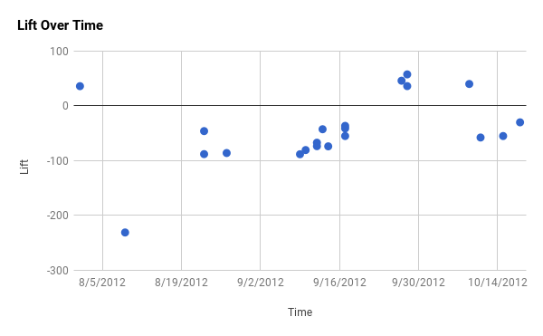

### Embedded Content

Embedded content: [Embedded Content]()

<iframe width="100%" height="400" src="" frameborder="0"></iframe>

## NACA66v2

### Pressure Contours:

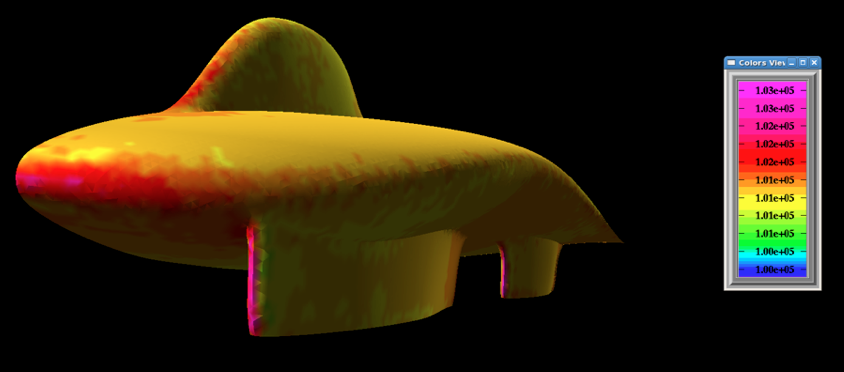

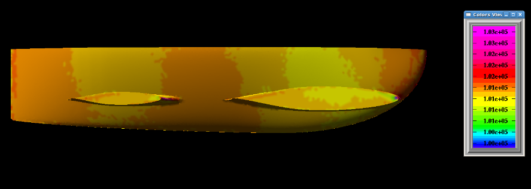

### Ian's Comments:

I have some results for naca66v2.  Attached you'll find a graph of the lift/drag that was reached.   The x axis corresponds to iterations and the z axis corresponds to the value of lift/drag.  Red is in the direction parallel to the ground (x axis), green is perpendicular (z axis).  Using the right hand rule and the converged numbers you can conclude that the naca66v2 design has 28 Newtons of drag in the direction of the free stream and nearly 18 N of lift in the z-direction.

## Morelli V3

### Pressure Contours

### Ian's Comments

In the direction parallel to the surface(and by surface I mean ground), i.e the direction the car will be moving forward in, the MorelliV3 shape causes a drag of 32N in turbulent conditions.

In the direction perpendicular to the ground, the MorelliV3 shape causes a negative lift of roughly 232N in turbulent conditions.  This means that the MorelliV3 shape will not fly, but that it will also induce a larger force of friction on the tires.

## NACA63 

### Pressure Contours

### Greg's Comments

* The excessive camber line clearly creates some very bad 3d effects as there is separation on the inside of the front fairings and lots of vortex shedding 
* The excessive camber line clearly creates some very bad 3d effects as there is separation on the inside of the front fairings and lots of vortex shedding 

* The excessive camber line clearly creates some very bad 3d effects as there is separation on the inside of the front fairings and lots of vortex shedding 

The excessive camber line clearly creates some very bad 3d effects as there is separation on the inside of the front fairings and lots of vortex shedding 

## NACA67 

### Pressure Contours

TsAGI Foil Concept

Streamlines

low pressure region inside the front fairing causes the flow off the back to move inwards, crossing over, and effectively putting rear faring at angle of attack

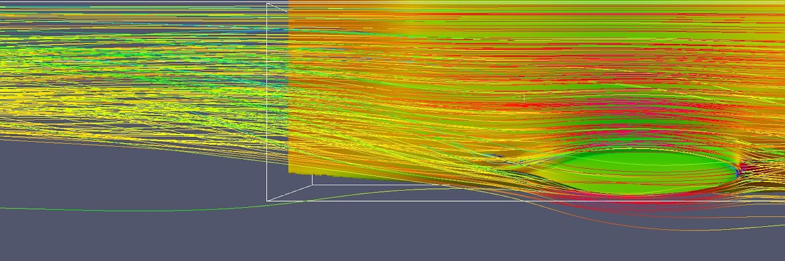

same is happening off the rear fairing. the flow coming off the rear of the car should be straight.

## Blended Body Concept

Note: Drag Results Now For Body Instead of Half

### Pressure Contours

## Nathan Golshan's Updates on Fairing Foils

You said we should design for 5-7 degrees. After doing some math, this seems to be too little to me - at 90km/h ground speed, this is a crosswind at about 11km/h (about 6mph). We definitely saw crosswinds higher than that during the race - just from memory, I would estimate 10 to 15 miles per hour.

We probably shouldn't go off of intuition, so I found some data: http://www.wunderground.com/history/airport/YBAS/2011/10/15/WeeklyHistory.html

The average wind speed listed there for alice springs for the week of the race in 2011 is 10mph, with max gusts of 28mph. That's more in line with what I remember - It was really windy, the whole time, and smaller gusts weren't exactly uncommon. 

The worst thing would be to build a car with fairings that seperate if the wind turns out to be bad during the race. Also, if you have a crosswind, your fairings angle of attack gets larger as your windspeed gets lower - and both of these make seperation more likely. Since it may be hard to achieve 90km/h with these new designs (not yet determined), it may make sense to be a bit conservative.

So, what i'm now designing for is to avoid any separation with a groundspeed of 90km/h and a fully perpendicular crosswind at 19.3km/h (12mph). This works out to be equivalent to a flow speed of 92km/h at a 12.1 degree angle of attack on the fairings, and I can get a reynolds number from there. Does that sound reasonable?

## Sunbad Fat 1.0 (Full)

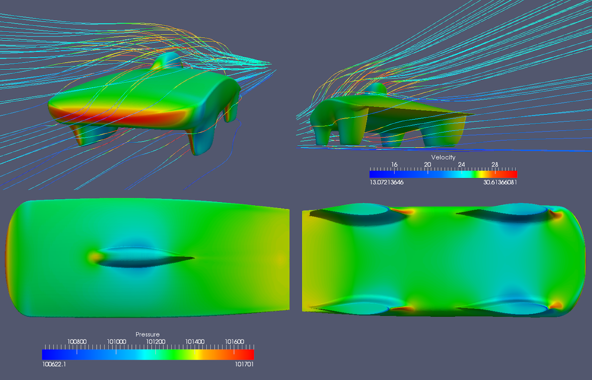

## Sunbad Thin 1.0 (Full)

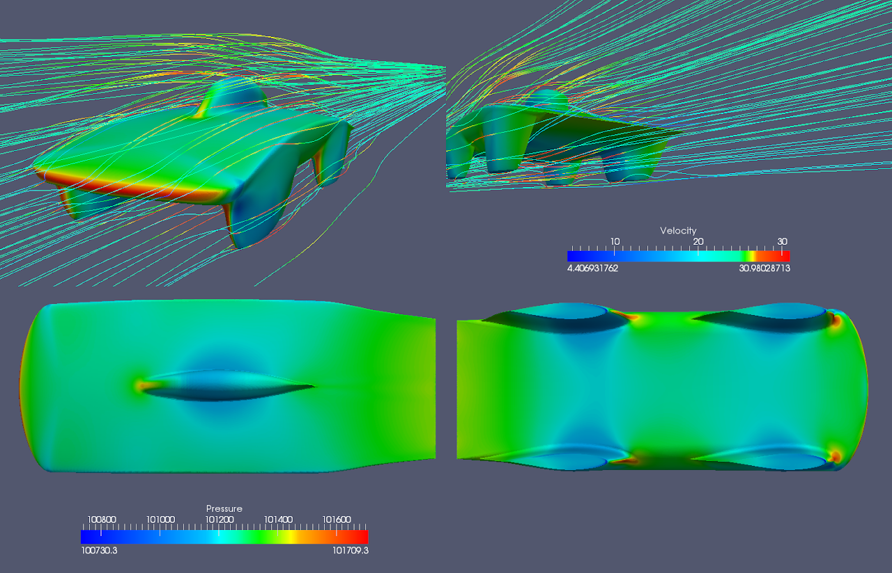

## Sunbad Thin 1.0 (with 1 degree angle of attack)

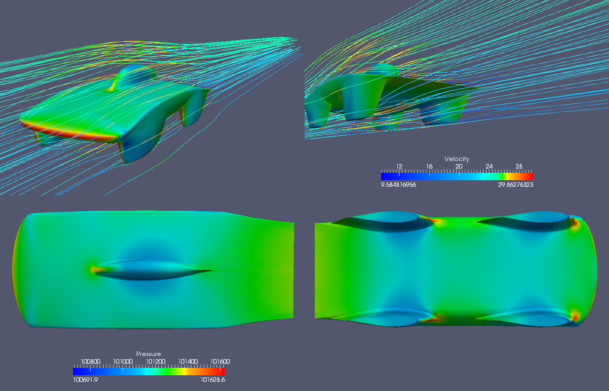

### Sunbad Fat 1.0 (with 1 degree angle of attack)

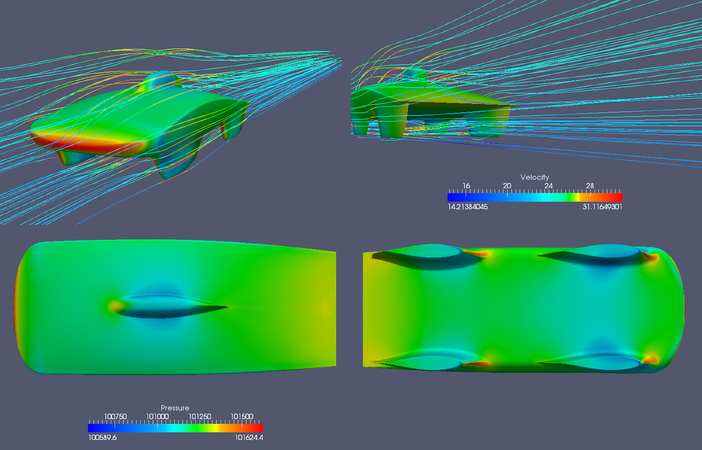

### Comments

You'll find that the 1 degree angle of attack improves the lift and drag performance slightly.

...

Its really helpful to see these results and somewhat comforting to know that the aerobody appears to be fairly insensitive to angle of attack though our simulations showed the same thing for Xenith, but this did not appear to be the case in the wind tunnel. 

It looks like we are going to have to do another iteration with the main foil to get rid of most of the downforce. A bit of downforce is probably a good thing as it keeps the car from flying off the road when it gets hit with the massive pressure waves from road trains, but 60-70N might be a bit excessive. 

...

You have to remember that wind tunnel drag data is representative of drag from a combination of turbulent and laminar flow, whereas the CFD results use a turbulent model. The transition from laminar to turbulent on the NACA66 and 67 is more sensitive to angle-of-attack than the lesser NACA60 series, so I'm not surprised to have seen the drag on Xenith change non-trivially at different angles of attack in the wind tunnel - a turbulent boundary layer can be 2-3x as much drag, so changing that transition point has a noticeable effect - for all we know, our current models might also be more sensitive than the CFD simulations, in the wind tunnel. 

A bit of downforce for insurance is probably a good thing, I wouldn't want to hover too close to zero in CFD and wind tunnel testing, only for it to turn out that it has some lift in actual race conditions. But as you mentioned, 60-70N is still too much. At least one more iteration will probably be needed.

## Sunbad Thin 1 Degree Angle of Attack and 5 Degree Yaw

## Sunbad Fat 1 Degree Angle of Attack and 5 Degree Yaw

### Ian on Sailing: 

Well, when you look at the z-axis numbers, you see that the values are negative.  Since z is perpendicular to the ground, we know that we are not achieving positive lift.  The positive x and y numbers just mean that the force is going along the axes.  You can use right hand rule to determine the direction of the y axis by shooting z upwards from the ground to the car and x from the front of the car to the back of the car.  

Long sotry short, no sailing, still drag, just in x and y now because the flow is approaching the car from an angle.

## Sunbad Thin 2.0

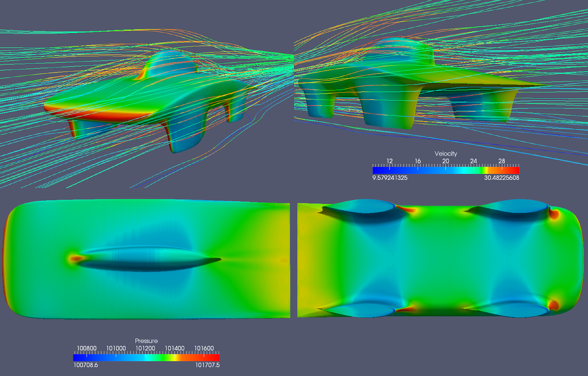

## Sunbad Thin 2.0 (with 1 degree angle of attack)

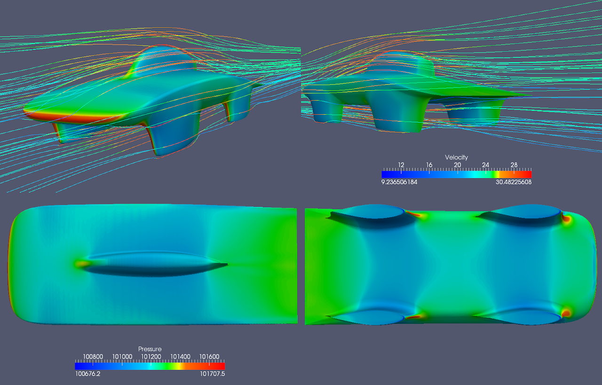

### Sunbad Thin 2.0 1 Degree Angle of Attack and 5 Degree Yaw

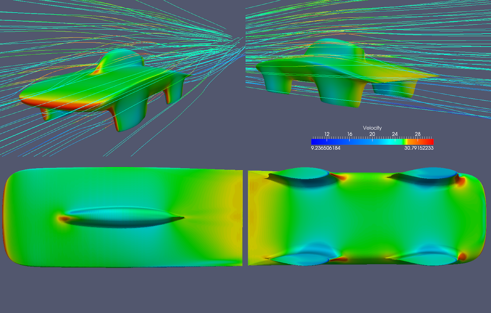

Nathan's Update on Iterations

i've started a model that mirrors the changes i made to sunbad_fat, but holding off on the polish until we hear from ian that the changes i made weren't a complete failure. *fingers crossed*

in short, the pending changes are front wheel steering and the fairing changes that entails, revised bubble to try to reduce wetted area, about a .2-.3 increase in design Cl of the starting foil, and a return to a lower ride height to reduce wetted area (shorter fairings). the car will still have a flat bottom side, just lower.

basically, all the changes are geared toward reducing wetted area. i got rid of >2m^2 on sunbad_fat, which is about a 10% reduction. the data we already have (if you ignore the outliers which had flow seperation) shows a very distinct relationship between drag and wetted area, far more clear than any other factor. It seems that reducing it is the absolute fastest and easiest way to bring down our drag number. This makes all kinds of sense, given everything we've read and seen in the past.

just to make sure you know what's going on, ian is currently beasting 4 models at once - i gave him 4 versions of sunbad_fat, with the body height at 7, 8, 9, and 10% of chord length. once we get the data back, we fit a line through the 4 points, and get a body height which should give us something very close to zero. 

## Sunbad Fat 2.0-9

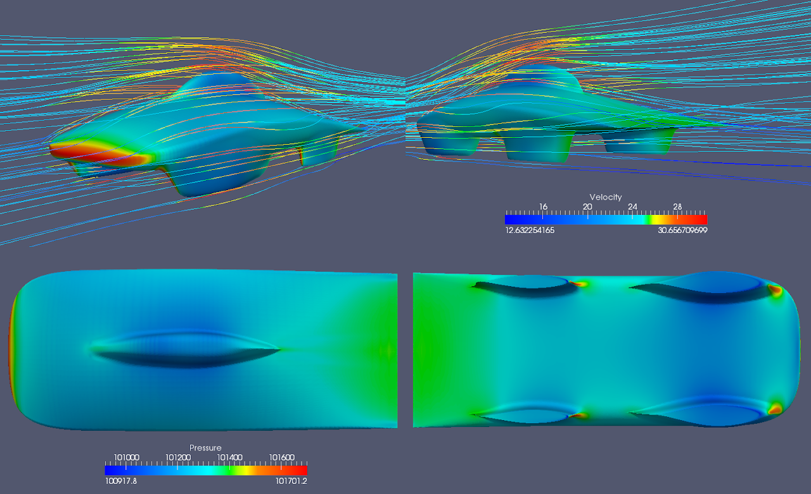

## Sunbad Fat 2.0-10

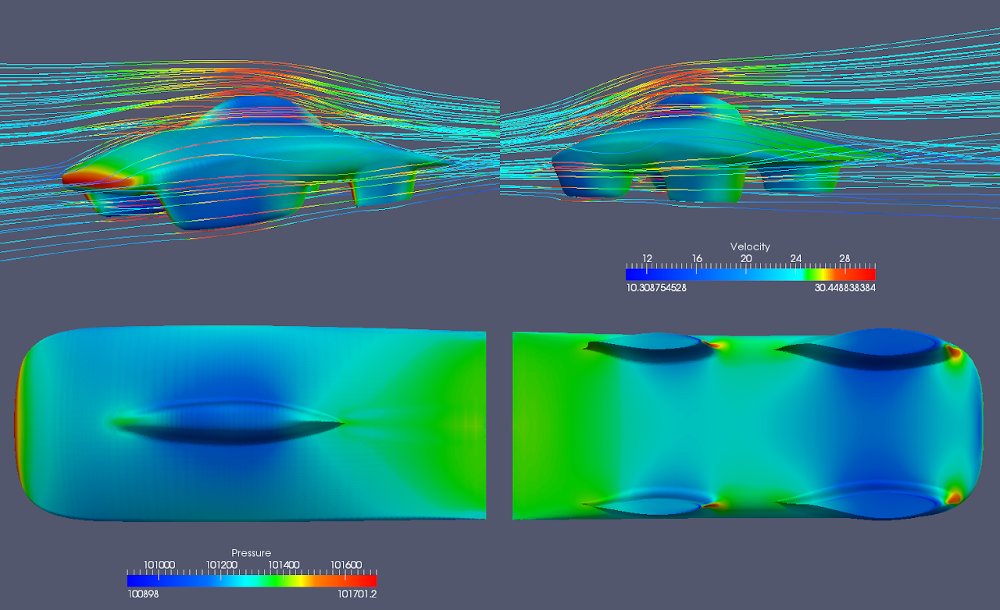

### Advice from Gary Romberg at Aerodyn

Interesting problem.  The general shape looks good.  Here is what I recommend.  Look at the lift and drag (integrated pressure and friction(Rn)).  Minimize lift by changing the upper or lower shape and/or pitching the vehicle nose down.  No rear spoilers.  CFD pressure distributions will help.  Also look at the side force, if any, generated by the wheel fairings.  Minimize same by changing the airfoil shapes.  Look at the effect of moving the rear wheels out from behind the front wheels.  All this is a lot of work.  Calculate how much drag is profile and how much is friction.  Vortex generators may help the friction drag. Good luck

Gary Romberg

## Sunbad 6 or 7?

Sam's simulations in Ansys: CFX says 47.8N drag, 131N downforce at 55M/S (Downforce numbers are likely wrong since the simulation was run at 55 meters per second instead of 55 miles per hour) no corsswind. It looks like there is some seperation on the back of the canopy and there are small vortecies generated by the trailing edge. Also, there might be a small amount of sadness behind the front fairing.

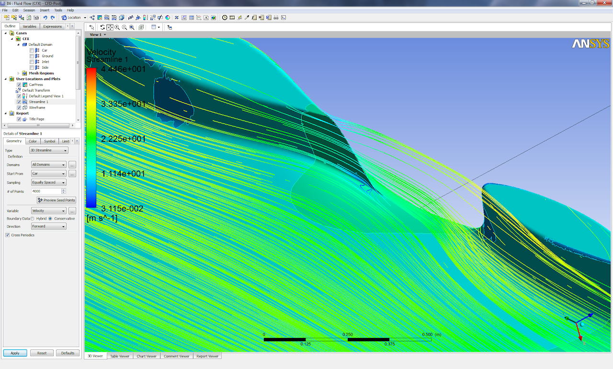

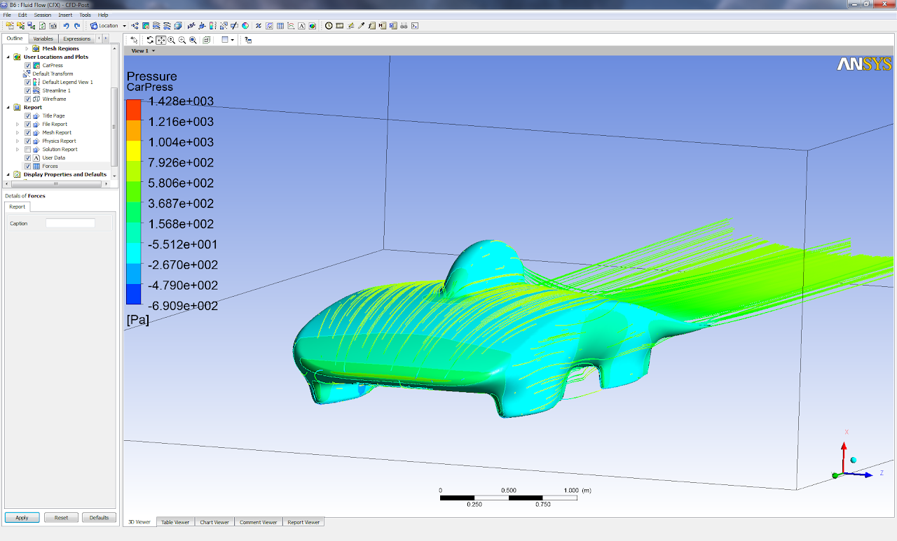

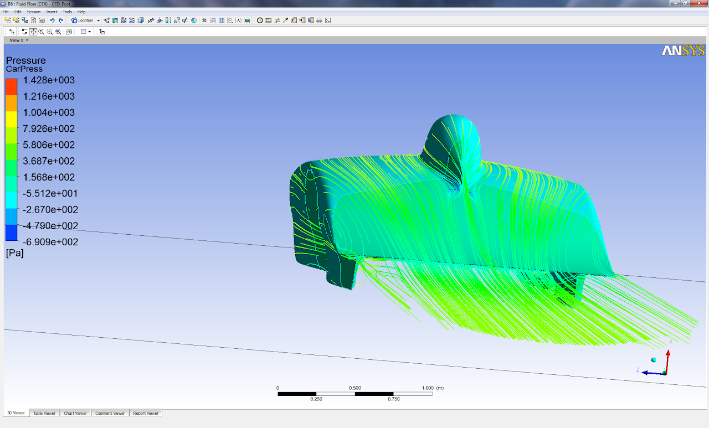

## General Response from Danny

1. There is more to a CFD simulation than just dropping the car into the program and hitting run. The results you get depend on what boundary layer and turbulence model you choose to use. Also, you have to set parameters for those models correctly. I used a k-omega turbulence model for my runs, and had calculated the turbulent intensity and dissipation rate carefully back when I was running simulations on Xenith.  I used those same settings for the Sunbad run. Turbulent intensity for a good wind tunnel should be closer to 1%, not 5%. The length scale of the turbulence is also important. I chose to simulate the car to the tunnel, not to the road, because the road is so unpredictable and I wanted correlation to a solid data set we would get from tunnel testing. The initial settings in Fluent are completely wrong for a solar car and have to be changed. They depend on model size, expected Reynolds number, and flow speed. CFX is going to be the same. Back when I ran Xenith in both Fluent and CFX, they agreed quite well.

2. I did not see much sadness in Sam's simulation around the back of the front fairing. There are a couple of streamlines that look kinda funky, but they are very well contained, and they are not in a region that I would expect to see separation, since they are on the high pressure side of the foil. I would chalk this one up to some localized flow simulation weirdness, not an actual problem. I don't know how this adaptive meshing works in CFX, but it sounds suspect to me. It takes some effort to get a clean mesh with solid prism layers around the car. I wouldn't trust a program to automatically achieve that. ICEM certainly doesn't get it right the first time without some intervention.

3. Australia was a shit show. There is no other way to put it. We all ran it like a 1st grader would run a science experiment. There was no control set, we were changing things on the fly based on hunches and guesses with no data to back it up. Tires, tire pressures, angle of attack, and skirts were all changing continuously and all at the same time. We have absolutely no way to tell which change did what to the car. As far as I'm concerned, the Australia road data is not very useful on this front. I trust the wind tunnel data far more.

4. We don't know exactly how much drag Nuna or Michigan had in the outback on the road. We know that Nuna was operating somewhere around 31-32N of drag in a wind tunnel that did not have a rolling road and with their wheels stationary. We just know that they probably didn't see near as big an increase from the wind tunnel to road conditions as we did. But again, we don't really know what was causing that with Xenith.

