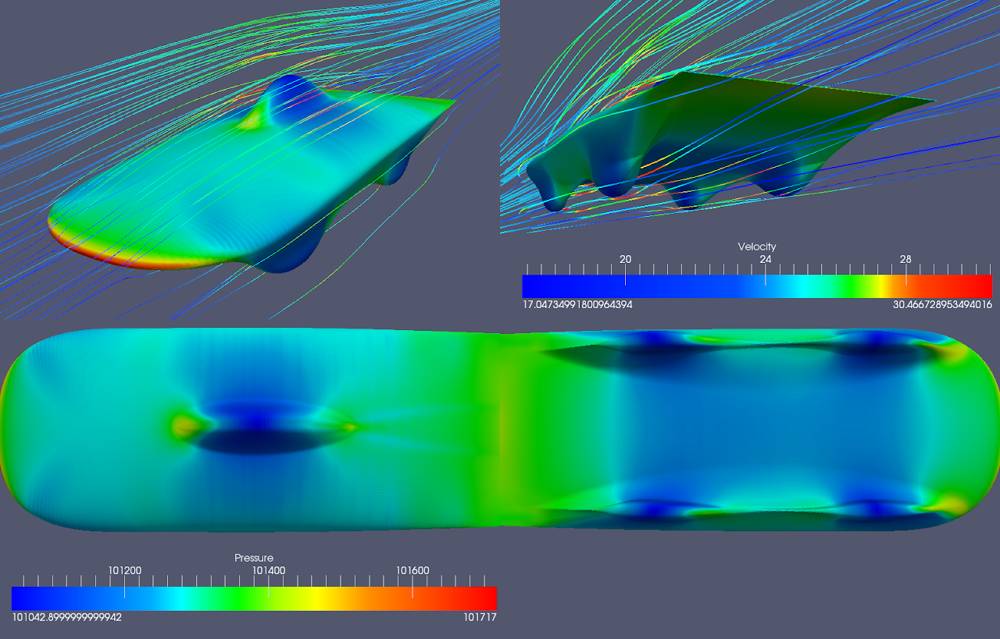
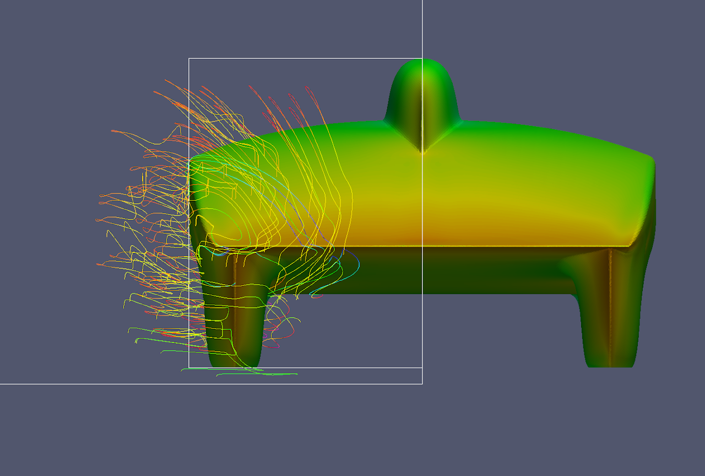

# lift-drag-and-lateral-force-results-only

## SSCP - Lift, Drag, and Lateral Force Results Only

## Lift, Drag, and Lateral Force Results Only

#### Embedded Content

Embedded content: [Embedded Content](lift-drag-and-lateral-force-results-only.md)

### NACA66v2

#### Pressure Contours:

#### Numerical Drag Numbers:

#### Ian's Comments:

I have some results for naca66v2.  Attached you'll find a graph of the lift/drag that was reached.   The x axis corresponds to iterations and the z axis corresponds to the value of lift/drag.  Red is in the direction parallel to the ground (x axis), green is perpendicular (z axis).  Using the right hand rule and the converged numbers you can conclude that the naca66v2 design has 28 Newtons of drag in the direction of the free stream and nearly 18 N of lift in the z-direction.

### Morelli V3

#### Pressure Contours

#### Numerical Results

#### Ian's Comments

In the direction parallel to the surface(and by surface I mean ground), i.e the direction the car will be moving forward in, the MorelliV3 shape causes a drag of 32N in turbulent conditions.

In the direction perpendicular to the ground, the MorelliV3 shape causes a negative lift of roughly 232N in turbulent conditions.  This means that the MorelliV3 shape will not fly, but that it will also induce a larger force of friction on the tires.

### NACA63&#x20;

#### Numerical Results

#### Pressure Contours

#### Greg's Comments

* The excessive camber line clearly creates some very bad 3d effects as there is separation on the inside of the front fairings and lots of vortex shedding&#x20;
* The excessive camber line clearly creates some very bad 3d effects as there is separation on the inside of the front fairings and lots of vortex shedding&#x20;
* The excessive camber line clearly creates some very bad 3d effects as there is separation on the inside of the front fairings and lots of vortex shedding&#x20;

The excessive camber line clearly creates some very bad 3d effects as there is separation on the inside of the front fairings and lots of vortex shedding&#x20;

### NACA67&#x20;

#### Numerical Results

#### Pressure Contours

TsAGI Foil Concept

Streamlines

low pressure region inside the front fairing causes the flow off the back to move inwards, crossing over, and effectively putting rear faring at angle of attack

same is happening off the rear fairing. the flow coming off the rear of the car should be straight.

### Blended Body Concept

Note: Drag Results Now For Body Instead of Half

#### Numerical Results

#### Pressure Contours

### Nathan Golshan's Updates on Fairing Foils

You said we should design for 5-7 degrees. After doing some math, this seems to be too little to me - at 90km/h ground speed, this is a crosswind at about 11km/h (about 6mph). We definitely saw crosswinds higher than that during the race - just from memory, I would estimate 10 to 15 miles per hour.

We probably shouldn't go off of intuition, so I found some data: http://www.wunderground.com/history/airport/YBAS/2011/10/15/WeeklyHistory.html

The average wind speed listed there for alice springs for the week of the race in 2011 is 10mph, with max gusts of 28mph. That's more in line with what I remember - It was really windy, the whole time, and smaller gusts weren't exactly uncommon.&#x20;

The worst thing would be to build a car with fairings that seperate if the wind turns out to be bad during the race. Also, if you have a crosswind, your fairings angle of attack gets larger as your windspeed gets lower - and both of these make seperation more likely. Since it may be hard to achieve 90km/h with these new designs (not yet determined), it may make sense to be a bit conservative.

So, what i'm now designing for is to avoid any separation with a groundspeed of 90km/h and a fully perpendicular crosswind at 19.3km/h (12mph). This works out to be equivalent to a flow speed of 92km/h at a 12.1 degree angle of attack on the fairings, and I can get a reynolds number from there. Does that sound reasonable?

### Sunbad Fat 1.0 (Full)

### Sunbad Thin 1.0 (Full)

### Sunbad Thin 1.0 (with 1 degree angle of attack)

#### Sunbad Fat 1.0 (with 1 degree angle of attack)

#### Comments

You'll find that the 1 degree angle of attack improves the lift and drag performance slightly.

...

Its really helpful to see these results and somewhat comforting to know that the aerobody appears to be fairly insensitive to angle of attack though our simulations showed the same thing for Xenith, but this did not appear to be the case in the wind tunnel.&#x20;

It looks like we are going to have to do another iteration with the main foil to get rid of most of the downforce. A bit of downforce is probably a good thing as it keeps the car from flying off the road when it gets hit with the massive pressure waves from road trains, but 60-70N might be a bit excessive.&#x20;

...

You have to remember that wind tunnel drag data is representative of drag from a combination of turbulent and laminar flow, whereas the CFD results use a turbulent model. The transition from laminar to turbulent on the NACA66 and 67 is more sensitive to angle-of-attack than the lesser NACA60 series, so I'm not surprised to have seen the drag on Xenith change non-trivially at different angles of attack in the wind tunnel - a turbulent boundary layer can be 2-3x as much drag, so changing that transition point has a noticeable effect - for all we know, our current models might also be more sensitive than the CFD simulations, in the wind tunnel.&#x20;

A bit of downforce for insurance is probably a good thing, I wouldn't want to hover too close to zero in CFD and wind tunnel testing, only for it to turn out that it has some lift in actual race conditions. But as you mentioned, 60-70N is still too much. At least one more iteration will probably be needed.

### Sunbad Thin 1 Degree Angle of Attack and 5 Degree Yaw

### Sunbad Fat 1 Degree Angle of Attack and 5 Degree Yaw

#### Ian on Sailing:&#x20;

Well, when you look at the z-axis numbers, you see that the values are negative.  Since z is perpendicular to the ground, we know that we are not achieving positive lift.  The positive x and y numbers just mean that the force is going along the axes.  You can use right hand rule to determine the direction of the y axis by shooting z upwards from the ground to the car and x from the front of the car to the back of the car. &#x20;

Long sotry short, no sailing, still drag, just in x and y now because the flow is approaching the car from an angle.
