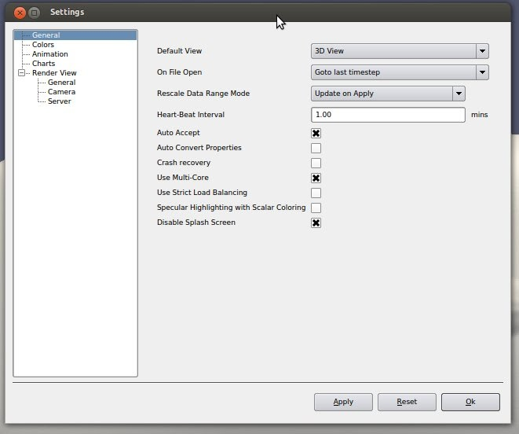
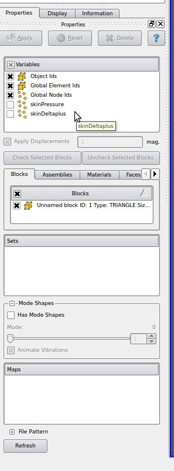

# using-paraview

## SSCP - Using Paraview

## Using Paraview

### Opening the Model

First open the car.exo file which can be found on the server.

### Changing Settings

Files edit settings change the on file open to goto last time stamp and enable multi core. If the goto last timestep option is not selected on the upper right corner of the menu hitting the fast forward button will take things to the last timestep.&#x20;

#### Displaying the Model

The&#x20;

* Click on the blended body car in the left pannel and under the properties tab under variables check skin pressure boxColor by skin pressure in the display tabUnder color by click the choose preset tab and pick the Ranbow Blended Gray OptionFilters->alphabetical->reflect mirror on y to give whole car
* Click on the blended body car in the left pannel and under the properties tab under variables check skin pressure box
* Color by skin pressure in the display tab
* Under color by click the choose preset tab and pick the Ranbow Blended Gray Option
* Filters->alphabetical->reflect mirror on y to give whole car

1. Click on the blended body car in the left pannel and under the properties tab under variables check skin pressure box
2. Color by skin pressure in the display tab
3. Under color by click the choose preset tab and pick the Ranbow Blended Gray Option
4. Filters->alphabetical->reflect mirror on y to give whole car

Click on the blended body car in the left pannel and under the properties tab under variables check skin pressure box

Color by skin pressure in the display tab

Under color by click the choose preset tab and pick the Ranbow Blended Gray Option

Filters->alphabetical->reflect mirror on y to give whole car

Repeat similar     steps with the CarFluid.exo to show&#x20;

#### To show Streamlines

* on the menu click streamtracer display by velocity and choose presetTo recenter streams point mouse at center of car and hit p then change the radius to control how far apprt the streamlines are
* on the menu click streamtracer&#x20;
* display by velocity and choose preset
* To recenter streams point mouse at center of car and hit p then change the radius to control how far apprt the streamlines are

1. on the menu click streamtracer&#x20;
2. display by velocity and choose preset
3. To recenter streams point mouse at center of car and hit p then change the radius to control how far apprt the streamlines are

on the menu click streamtracer&#x20;

display by velocity and choose preset

To recenter streams point mouse at center of car and hit p then change the radius to control how far apprt the streamlines are
