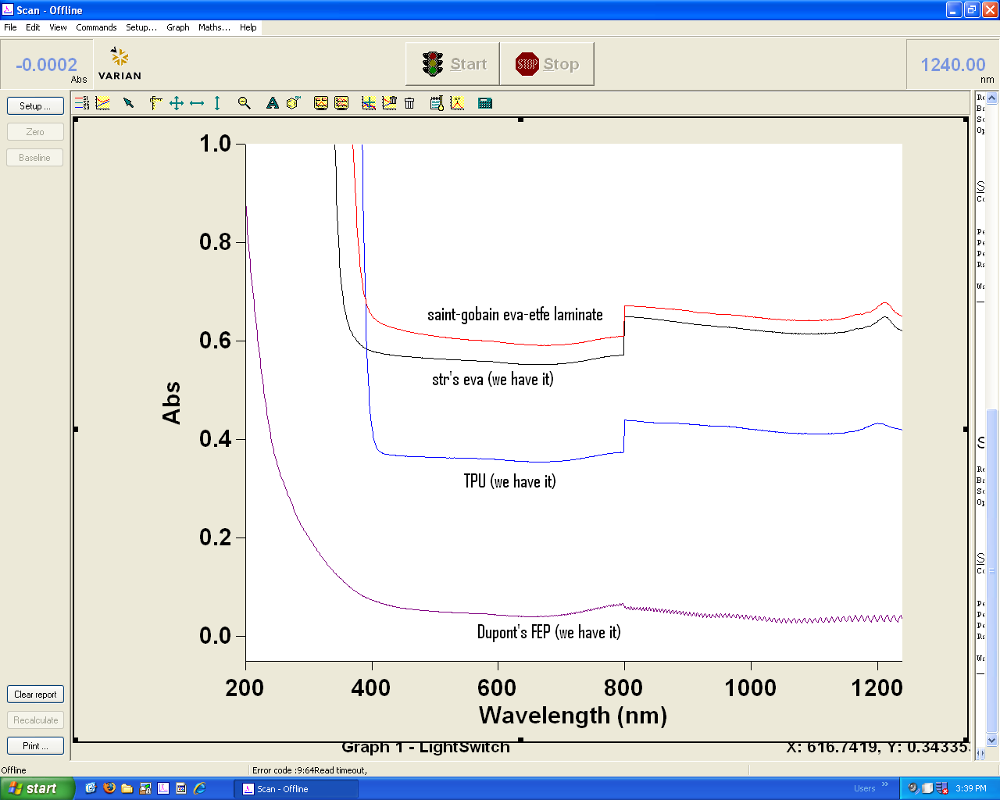

# SSCP - Absorption Data For Solar Materials

# Absorption Data For Solar Materials

Hello,

I finally got around to measuring the UV-Vis spectra of some of the module materials and found that the STR EVA has a UV-cutoff at 380nm, The TPU has a UV-cutoff of 408nm, and the FEP has a cutoff of 340 nm. The worst material that I tested was Saint Gobain's ETFE-EVA laminate. The high, broadband absorption is due to scattering and I think that the only thing that's useful from the measurements is the UV cutoff.

The plot is in wavelength versus absorption. An absorption of 1 means that 10% of the initial light was transmitted. I = Io*10^(-absorption)

The steep drop off that you see at 800 nm is a change in the detector of the UV-Vis and has nothing to do with the material.

The data suggest that EVA and FEP are better materials to use unless there's processability issues that we run into.

I've put the .csv data on the google site and I will be at the shop from at least 11:15am to 1:00pm on Saturday. I look forward to discussing the data further.

Sincerely, 

### Embedded Google Drive File

Google Drive File: [Embedded Content](https://drive.google.com/embeddedfolderview?id=1NVQ6qc4f_rqm0rX8igD32jAbd7Qh4Z9q#list)

<iframe width="100%" height="400" src="https://drive.google.com/embeddedfolderview?id=1NVQ6qc4f_rqm0rX8igD32jAbd7Qh4Z9q#list" frameborder="0"></iframe>

