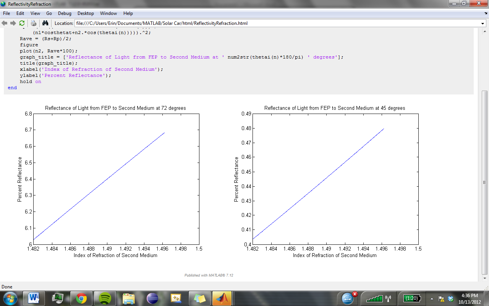
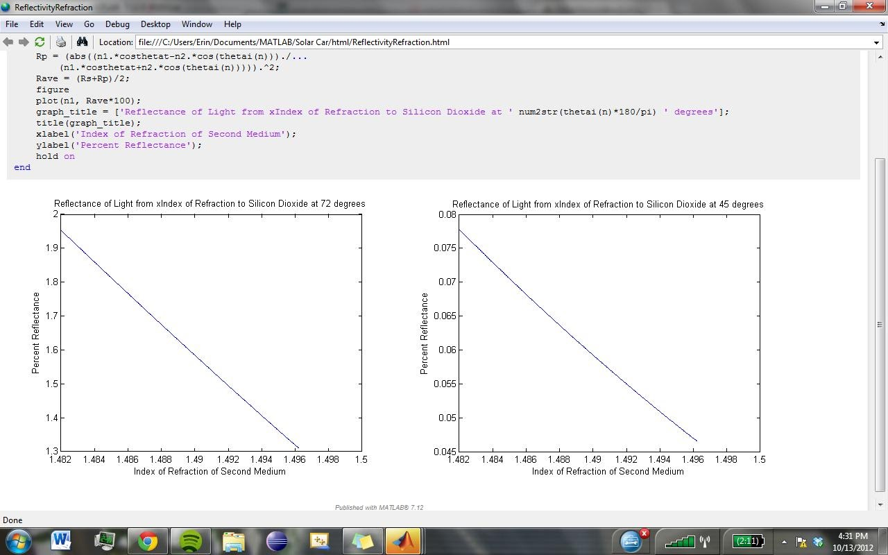

# index-matching-tpu-vs-eva

## SSCP - Index matching, TPU vs EVA

## Index matching, TPU vs EVA

EVA has an index of refraction of 1.482, TPU has an IOR of 1.4962, FEP has an IOR of 1.344, SiO2 (surface of sunpower cells) has an IOR of 1.544.&#x20;

EVA has better index matching with FEP, but worse index matching with SiO2. However, the graphs show that the change in percent reflectance between the two materials is minimal-- with light at 72 degrees incidence angle, EVA performed.2% better at the transition from FEP, and TPU performed .7% better at the transition to SiO2, both of which seem minimal compared to the extended range of the EVA transmission.

