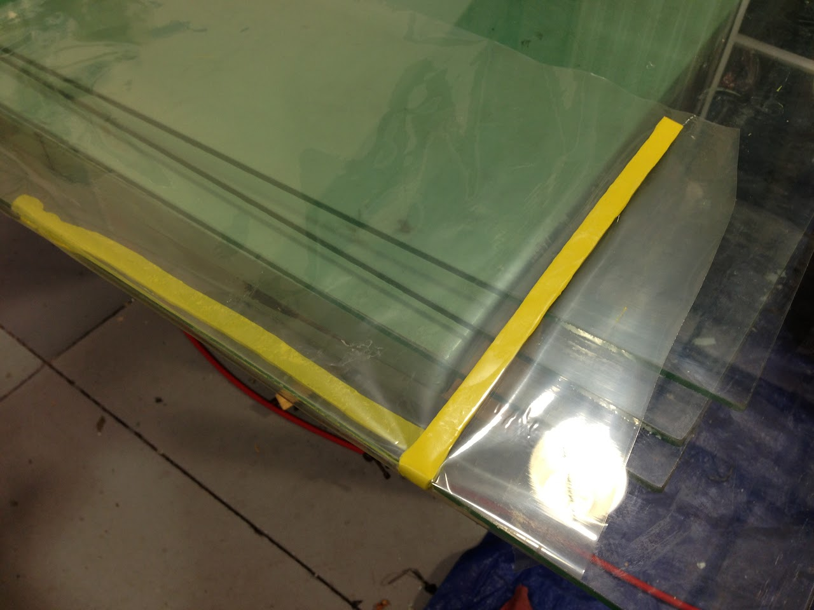
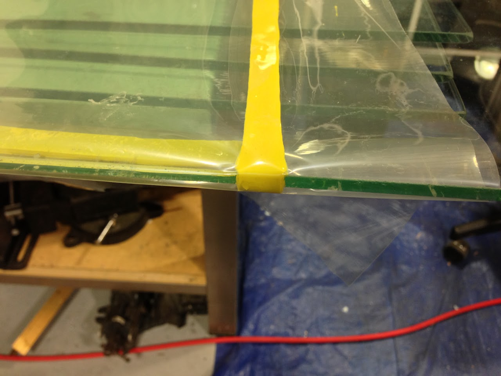
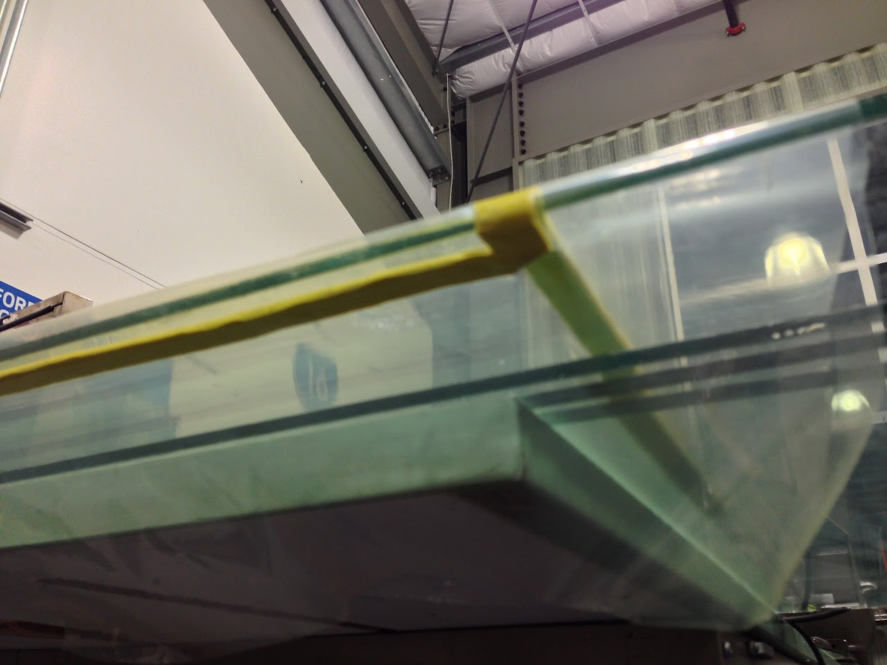

# array-fundamentals-and-planning

## SSCP - Array Fundamentals and Planning

## Array Fundamentals and Planning

#### Embedded Content

Embedded content: [Embedded Content](./)

This is the VHB that we use to attach the array to the car McMaster part number 8127A83

[8127A83](http://www.mcmaster.com)

The PDFs and excel sheet below are from a class and may be useful in understand how position of cells can make a difference

#### Tip on vacuum bagging large modules

If the substrate glass is too large to comfortably fit your modules you can wrap the vacuum bag under the substrate glass and tape the vacuum bag from below. This will give you more space on the top of the substrate glass while still maintaing a good vacuum seal. Just make sure the vacuum tape doesn't stick to the oven.

#### Embedded Google Drive File

Google Drive File: [Embedded Content](https://drive.google.com/embeddedfolderview?id=1XfHqw5nf3lNe-Y-aD3NDYVwBJzuzLSpf#list)
