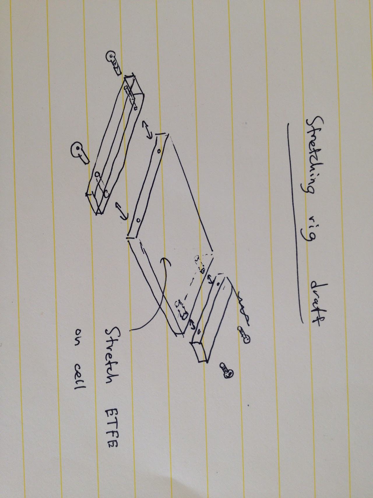

# 2012\_09\_15-module-results-from-d2

## SSCP - 2012\_09\_15 Module Results from D2

## 2012\_09\_15 Module Results from D2

Hello,

Here's a summary of what we (me, Paul D, and Zubair) did at D2. when you have a chance, can you please check it for accuracy because I would like to send this to solarcore and post it on the google site. Also, if you took any pictures at D2, can you please send those to me too?

* We made 3 different modules at D2

1. Saint Gobain's ETFE/TPU/cell/TPU/Madico Reflekt
2. Saint Gobain's ETFE-EVA laminate/cell/STR's EVA/Madico Reflekt
3. Saint Gobain's ETFE/ STR's EVA / cell / STR's EVA/ Madico Reflekt

Last week when we encapsulated modules #1 and #3 at D2, we experienced a problem with wrinkling. Later that week, one of the technicians (Julie) at D2 solar did some flexible encapsulation and was able to get rid of the wrinkles. She did this by encapsulating the cell face down in the laminator. We tried to encapsulate face down; however, we saw more wrinkles than we saw last week in modules #1, #2 and #3 all showed wrinkles. I was surprised to see that Saint-Gobain's ETFE-EVA laminate wrinkled just as badly as the other EVA.

We also discussed bypass diodes and how to implement them in our next module. Steve would not recommend busing wire around the edges of the cells because it could lead to shorts. He recommended putting the diodes underneath the top sheet. He showed us some cool, high-current bypass diodes from microsemi, part numbers MSC SFDS 10451 and MSC SFDS 1045Le3 1217G2&#x20;

Things that we want to have within the next two weeks which is likely when we would be at D2 again&#x20;

1. A stretching jig to stretch out the module materials \[Paul and Zubair]
2. A good recipe for using our FEP from Dupont in a laminator \[Toby]
3. A module made at VAIL to see if the problem with D2 is in their laminator \[Zubair]

Please let me know if I missed anything.

Thanks,

Toby

#### Embedded Content

Embedded content: [Embedded Content](2012_09_15-module-results-from-d2.md)

#### Embedded Google Drive File

Google Drive File: [Embedded Content](https://drive.google.com/embeddedfolderview?id=1MXAcBvxVDcfImTovHG2RnMYeYwsEtggQ#list)
