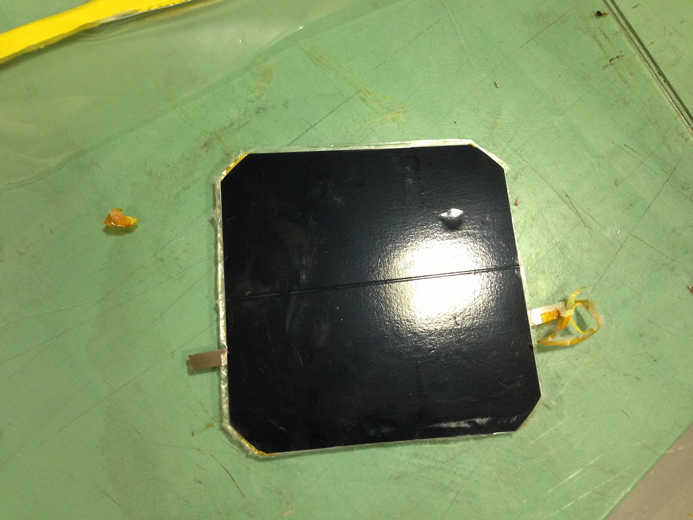
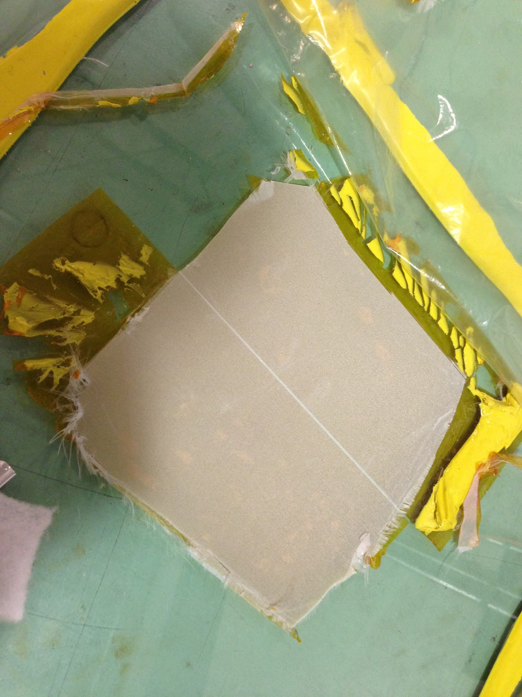

# 2012\_10\_27

## SSCP - 2012\_10\_27

## 2012\_10\_27

The array team worked on eliminating wrinkles in the array when using the thin thread Econolease peel ply. Previous encapsulation attempts had resulted in the thin peel ply folding on itself while baking producing wrinkles in the array.

[Econolease](https://www.airtechonline.com/htm/defaultnetscape.htm)

The team attempted to use double sided acrylic tape to tape down the thin peel ply.&#x20;

Taping down the peel ply did eliminate wrinkles, but it produced some new problems.&#x20;

In some places, the peel ply was not completely tacked down to the tape below. In each of these places there was a small bubble of air trapped under the peel ply. These bubbles created dimples on the array top sheet and encapsulant.&#x20;

Additionally, the strips of double sided acrylic tape had small gaps between them. These gaps produced ridges in the array where the encapsulants flowed into the small void left by the missing tape.

Suggestions for later encapsulations:

* Do some tests to see if the thin peel ply produces comparable array power output at high and low angles of incidence. Try an encapsulation with thin peel ply againensure that there are not gaps and no overlap between the strips of double sided acrylic tapeEnsure that you squeeze out all bubbles trapped below the peel ply before encapsulating.
* Do some tests to see if the thin peel ply produces comparable array power output at high and low angles of incidence.&#x20;
* Try an encapsulation with thin peel ply againensure that there are not gaps and no overlap between the strips of double sided acrylic tapeEnsure that you squeeze out all bubbles trapped below the peel ply before encapsulating.
* ensure that there are not gaps and no overlap between the strips of double sided acrylic tape
* Ensure that you squeeze out all bubbles trapped below the peel ply before encapsulating.
* Do some tests to see if the thin peel ply produces comparable array power output at high and low angles of incidence.&#x20;
* Try an encapsulation with thin peel ply againensure that there are not gaps and no overlap between the strips of double sided acrylic tapeEnsure that you squeeze out all bubbles trapped below the peel ply before encapsulating.
* ensure that there are not gaps and no overlap between the strips of double sided acrylic tape
* Ensure that you squeeze out all bubbles trapped below the peel ply before encapsulating.

Do some tests to see if the thin peel ply produces comparable array power output at high and low angles of incidence.&#x20;

Try an encapsulation with thin peel ply again

* ensure that there are not gaps and no overlap between the strips of double sided acrylic tape
* Ensure that you squeeze out all bubbles trapped below the peel ply before encapsulating.

ensure that there are not gaps and no overlap between the strips of double sided acrylic tape

Ensure that you squeeze out all bubbles trapped below the peel ply before encapsulating.
