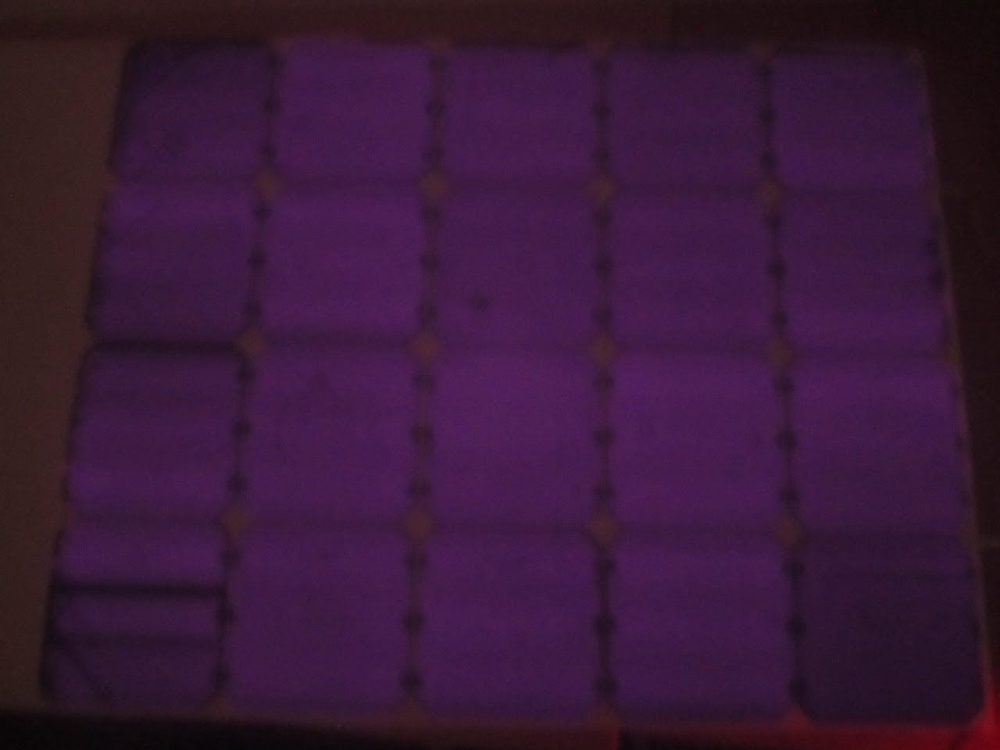
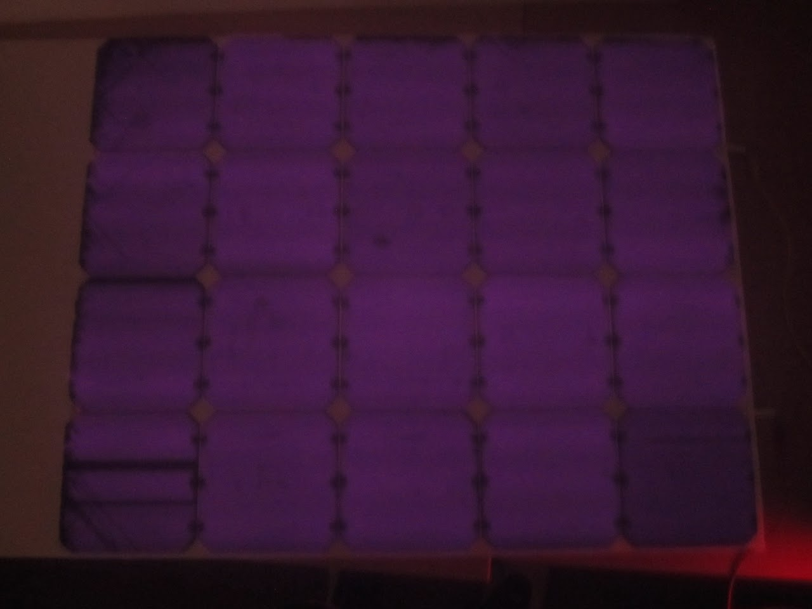

# 2013\_01\_12-jan-12-2013

## SSCP - 2013\_01\_12 jan 12 2013

## 2013\_01\_12 jan 12 2013

Erin, Amy, and Toby Present

* Erin and Amy put the handles on the box that we will use to store cells
* Erin and Amy Cut a stencil for the EVA

Made a 4 x5 module

* wesley recommends putting tape on individual cells to make them structurally more stable

The 4 x 5 fit in the oven just fine. I kind of screwed up peeling the module from the substrate.&#x20;

Made a new checklist for the new array. See the front page of the array site.&#x20;

&#x20;Our array didn't have many cracks, which is good. It looks like all of the cells were hooked up correctly too.

