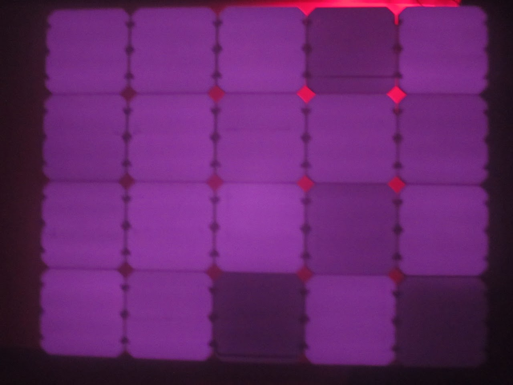
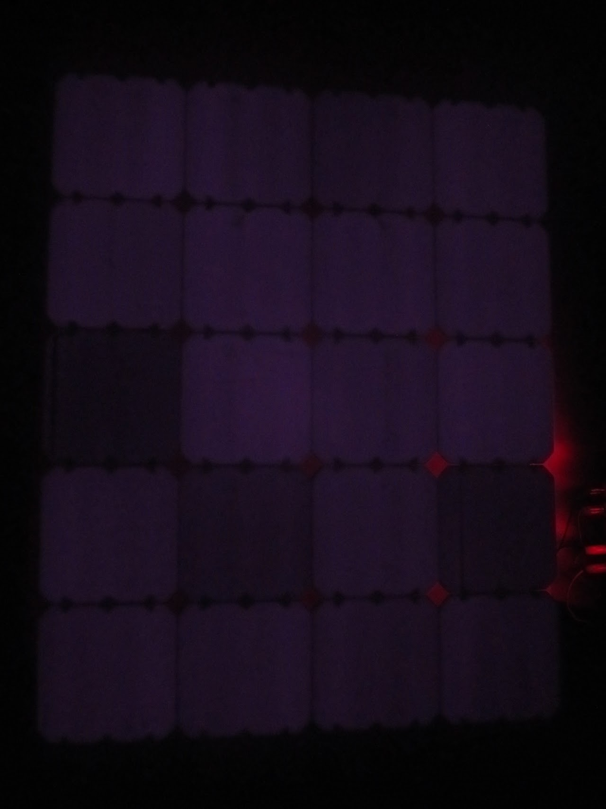

# SSCP - 2013_01_28

# 2013_01_28

Thank you to Guillermo and Matthew for all of your help on the module today! 

We made a 4 x 5 with the "bad ETFE" which is actually pretty good.

I (toby)_ took some EL images of the module 

I noticed that some of the cells were dark so I tried to replace the one in the lower right corner. This required reworking and was a pain in the ass but it paid off

I stuck the modules in when the oven was at 130C and I allowed them to reach a temperature (measured by the IR thermometer of 110C) It took the module 30 minutes to get there. I also didn't use the FEP as a release sheet.

The module was excellent. 

