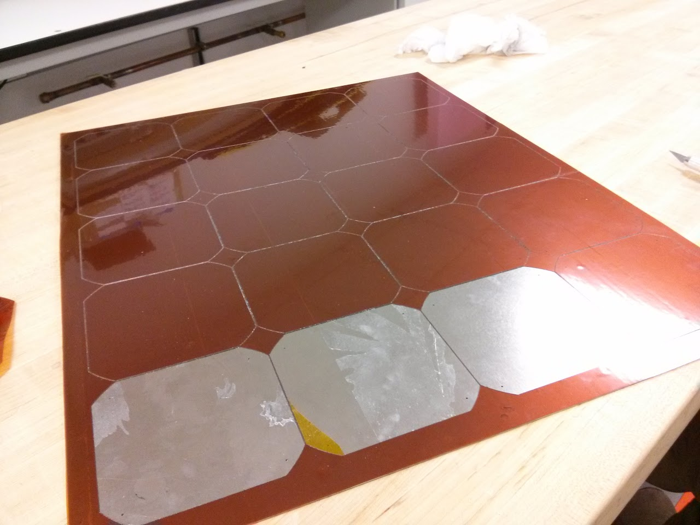

# SSCP - 2013_02_28

# 2013_02_28

New Array Soldering Jig

It's critical to peel the stickers with as tight a radius as possible, with the motion exactly 180 degrees from the remaining sticker, as parallel to the metal as possible. If done correctly the orange tape doesn't delaminate.

If I were to do this again I'd add assertive lives in the middle of cell cut outs, account for the kerf, and possibly use a less aggressive adhesive.

On the whole, however, this is a major process success.

typed via touchscreen

