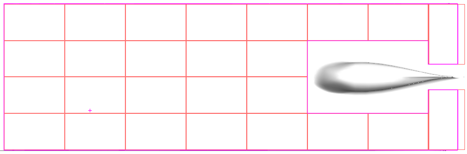
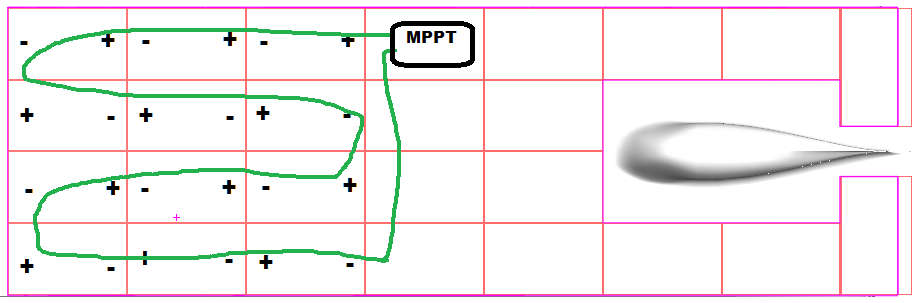

# SSCP - Array Wiring

# Array Wiring

## Xenith Array Layout

## Proper Module Placement

Xenith Should have been wired this way: 

When glaceing modules on the car it is important to consider the orientation of each module to minimize the amount of wire used to create the strings of cells which go to the MPPT. This reduces I^2R losses, makes the array easier to wire, reduces weight, and mitigates the opportunity for bad soldering. 

### Wiring ribbon to use

Bridgeport Magnetics EBC0250x0375 0.005" with Kapton Tape covering

Do not use silicone products that are not rated for electronics. The acetic acid released when silicone cures can eat through copper.

