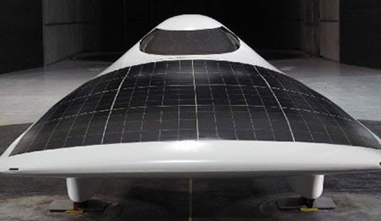
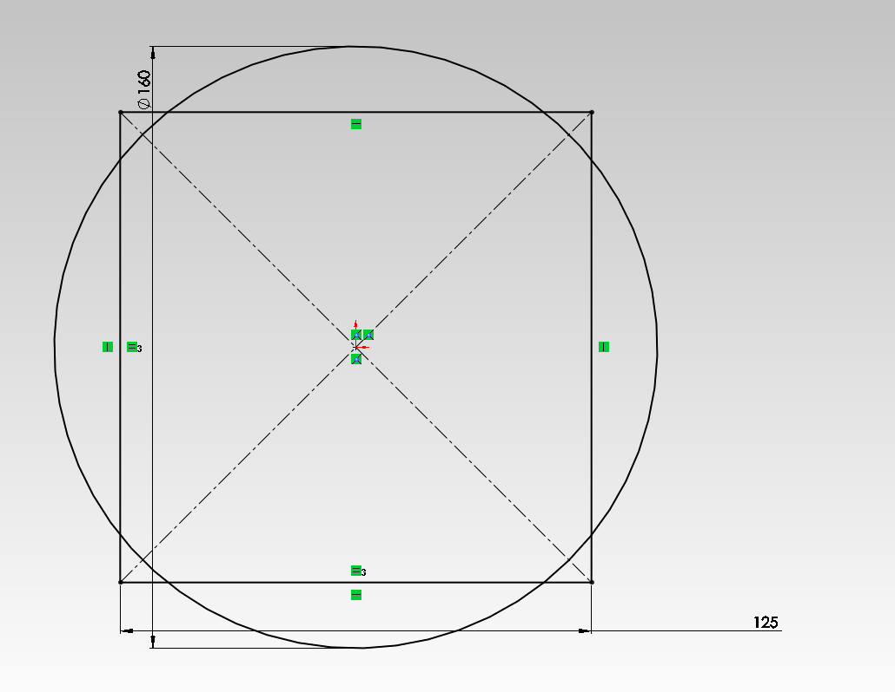
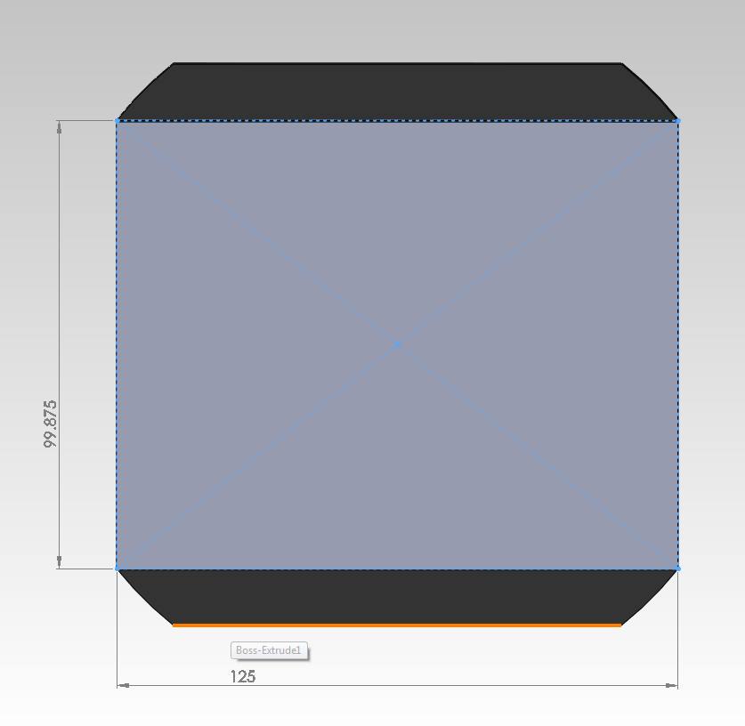
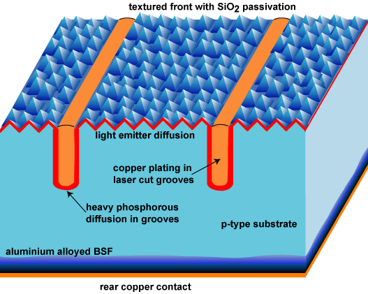
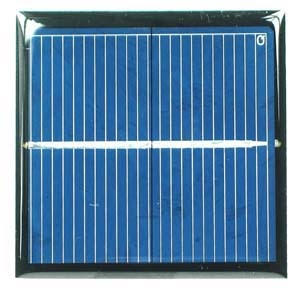
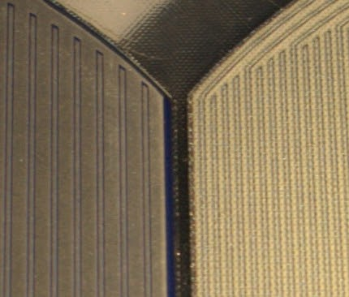

# SSCP - Cell Dicing

# Cell Dicing

Introduction

Many competitive teams choose to dice their cells in order to square off the corners of their cells. The dicing is usually done by the cell module maker (either Suncat or Gocherman) in order to achieve the following. Diced cells allow teams to improve the packing factor of their array which means that they need less surface area on top of their car to fit the 6 m^2 of solar area allowed by the rules. Since aerodynamic drag in a well designed solarcar can be roughly approximated by the amount of wetted area on the body. Shown below is the 2009 MIT car which featured diced sunpower cells sourced from Suncat solar. 

## Wetted Area Reduction

### Sunpower Cell Mechanical Construction

Sunpower cells are constructed on circular wafers and then cut to be rectangular. The size of the starting wafer is the 100mm plus the series number of the cells. So, for example C60 sunpower cells are constructed from a 160mm wafer, whereas C50 cells are constructed from a 150mm wafer. A sketch of the diced geometry is shown below: 

A solidworks sketch of a diced cell is shown below. The cell is diced as a rectangle to prevent cutting off the soldering tabs.

## Cell losses due to dicing

Solar cells are P-N junction diodes. Sunpower cells have long strips of P-type doping on an N-type base. The exposed edges and faces of Sunpower cells are passivated with silicon nitride and occasionally silicon dioxide. This prevents charge carriers from hitting "traps" in the lattice imperfections. More sophisticated schemes are available, but are not used in production cells.

Cutting a cell exposes raw silicon, increasing the opportunity to lose charge carriers, resulting in an efficiency penalty. This is a big problem in topside-connected cells, less of a problem in older Sunpower cells, and even less of a problem in newer Sunpower cells.

 

Cutting this cell perpendicular to the fingers will result in greater losses than cutting parallel to the fingers. This is because the fingers and bus bars can deliver current to the imperfect edges. Further, dicing perpendicular to the fingers and doing so such that the cut edge is half the inter-finger spacing or more from the next finger will reduce recombination losses.

Sunpower cells utilize backside connections for both P and N junctions. Further, the spacing of these junctions is very tight, allowing for low doping (and thus low conductivity). The net result is that cutting the edge of a Sunpower cell has less effect than cutting the edge of a traditional cell. Further, Sunpower has been moving toward tighter spacings over the years as a mechanism to improve efficiency.

On the left is a B50 cell and on the right is a C50 cell. The B-type cell has a finger pair spacing of ~2.4mm while the C-series cell has a period of ~1.2mm. If you dice a B-type cell on both edges, and you lose all of the production from the nearest interval that means a worst-case loss of 3.8%. That becomes 1.9% on the C-type cell. In reality, those numbers are likely conservative and are probably roughly halved yet again.

### Embedded Content

Embedded content: [Custom embed]()

<iframe width="100%" height="400" src="" frameborder="0"></iframe>

## Electrical Efficiency vs Dicing

### Embedded Content

Embedded content: [Custom embed]()

<iframe width="100%" height="400" src="" frameborder="0"></iframe>

### MPPT Efficiency Change

Using the efficiency curves from the single channel Photon trackers used during WSC 2011 the efficiency change due to the decreased boost ratio and decreased I^2 R losses. The results are shown in the numeric calculations table and are based on the voltage increase and current decrease calculated using the reduced size of the diced cell. 

[efficiency curves](/stanford.edu/testduplicationsscp/home/sscp-2012-2013/electrical-2012-2013/electrical-systems/sam-mppt)

### Wiring I²R losses

I²R losses in the cell are invariant with cell size because the cells are current sources with current proportional to cell area. If you cut the cell in half it produces half as much current, but now you have half as much metal in parallel and twice as much in series so the total panel resistance goes up by a factor of four. The I²R losses in the cell-size-invariant parts of the array will, however, change.

Historically we have used 14 gauge wire with a resistance of approximately 8.3milliohms/meter.

## Numeric Results

Table assumed 1mm distance between cells and 3mm distance from cell to edge of encapsulation. It's also worth noting that going from undiced C50 cells to undiced C60 cells is a -2.02% improvement on its own. Going from undiced C50 cells (Apogee) to diced C60 cells is a -2.93% improvement in drag.

All calculations preformed using solidworks. 

The drag calculation is preformed with the following assumptions: that drag increases linearly with wetted area and that the 'default' wetted area of a solarcar is 20m^2 which is slightly more than Xenith and about what our 2013 entry will be.

The power calculation uses Xenith's wind tunnel drag number of 7lbs as a reference which in real life was probably significantly higher. Thus the numbers are probably understate the power effect of dicing cells.

The electrical power loss numbers are calculated using data gained from the University of Michegan solar (-0.9% performance after dicing a C60 cell). While not proven in any way, it is assumed a C50 cell will be roughly twice as bad due to its higher inter-digit spacing. (explained in the next section)

## Cell Dicing Methods

### Score and break

Uses a diamond scribe and a straightedge to break the cell, much like cutting glass. This is extremely risky, as most solar cells' edges are 90 degrees off of their crystalline direction, making it very easy to break the cell in the wrong direction. A solar car team that tries to dice cells in this manner is foolish.

### Wire Saw

Uses a diamond-infused wire saw to cut through the cell. If done poorly, it can create microcracks in the cell that can leak current or create opportunities for carrier leakage. Solar car teams report good results with this method, but only with specialized equipment. Alain Chuzel of Suncat Solar uses this method.

### Infared Laser

American Dicing uses infrared laser cutters to slice cells. This gives excellent edge quality, but diffuses the PN junction to be a short circuit (!!) at the edge. The problem is that the cell is being melted as it is being cut. Under no circumstances should this method be used - it can drop a 22% cell down to 17%. This is a reasonable way of cutting raw wafers prior to being turned in to cells, but once a junction is made this method is suicide.

### UV Laser

This method is like the infrared laser method except that it uses a much higher energy beam. The absorption depth of UV light in a silicon wafer is extremely low and the localized heating power is thus extremely high. This results in nearly instant vaporization of the silicon near the focus of the beam. The benefit is that you get a clean edge without shorting the cell, and if done in a nitrogen atmosphere the edge even becomes passivated. Unfortunately this method is expensive, easily costing $30-40/cell.

### Embedded Content

Embedded content: [Custom embed]()

<iframe width="100%" height="400" src="" frameborder="0"></iframe>

