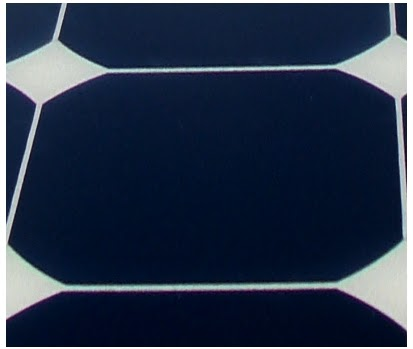
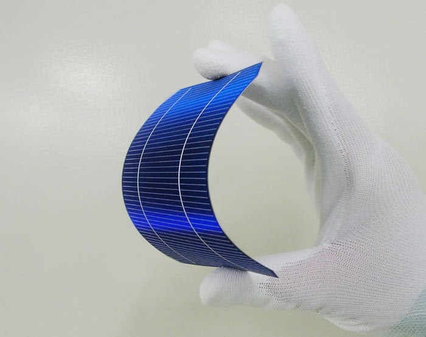

# cell-manufacture-selection

## SSCP - Cell Manufacture Selection

## Cell Manufacture Selection

### Introduction

Most teams that have run silicon since the 90's choose cells make by Sunpower for their raw efficiency. Top teams like Nuon and the University of Michegan have used them exclusively on their cars. Fortunately for us Sunpower was founded by a Stanford professor and is a local company.&#x20;

#### Sunpower Cell

Shown below is a back contact C50 series sunpower cell. They are the highest efficiency production cell in the world.&#x20;

#### SCM C60 Pictures

Screenprinted silver

#### Sayno (now Panasonic) HIT Cells

Low efficiency than sunpower cells, but feature a better temperature coefficent. The 2011 WSC winner Tokai had custom HIT cells engineered for them by Panasonic.&#x20;

#### UNSW Perl Cells

Produced in a research lab at UNSW (which has a very good solar car team) these cells are the highest effiency silicon cells in the world. Unfortunatly, they are made in a lab and are inaccessible to solarcar teams due to their extremely high cost and low rate of production. The 2003 UNSW car featured Perl cells, but the team crashed their trailer on the way to Darwin and the car never raced.&#x20;

### Calculations and References

#### HIT vs Sunpower

Erin Antono, eantono@stanford.edu made some calculations comparing Sanyo HIT cells vs. SunPower cells.&#x20;

The temperature coefficient is a measure of the percentage decrease in cell efficiency for every degree above 25 Celcius, which follows this equation:

Efficiency = (Efficiency@25C)(1-thermal efficiency coefficient)^(degrees above 25C)

E\_HIT(1-TC\_HIT)^n=E\_sunpower(1-TC\_sunpower)^n E\_HIT/E\_sunpower=((1-TC\_sunpower)/(-TC\_HIT))^n

From that equation, the number of degrees above 25 C for the efficiencies of the two cells to be equal expressed as a function of the 25C efficiencies and thermal coefficients of the two cells to be compared is as follows: n=ln(E\_HIT/E\_sunpower)/ln((1-TC\_sunpower)/(1-TC\_HIT))

Sunpower efficiency: 23.5% (from Toby)

Sunpower thermal coeff: -.38%/K from Sunpower E20 data sheet:

http://www.ffsolar.com/products/pdf/modules\_sunpower\_spr-327-333-WHT\_en.pdf

[http://www.ffsolar.com/products/pdf/modules\_sunpower\_spr-327-333-WHT\_en.pdf](http://www.ffsolar.com/products/pdf/modules_sunpower_spr-327-333-WHT_en.pdf)

HIT efficiency: 23% (see paper), 20.2% on SANYO 225A data sheet:

http://us.sanyo.com/dynamic/product/Downloads/Panasonic%20HIT%20225A%20Data%20Sheet\_WEB-43340040.pdf

[http://us.sanyo.com/dynamic/product/Downloads/Panasonic%20HIT%20225A%20Data%20Sheet\_WEB-43340040.pdf](http://us.sanyo.com/dynamic/product/Downloads/Panasonic%20HIT%20225A%20Data%20Sheet_WEB-43340040.pdf)

HIT thermal coeff: -.23%/K (see paper), -.336%/K on SANYO 225A data sheet

Sunpower vs SANYO 225A

n=ln(20.2/23.5)/ln((1-.0038)/(1-.00336))= 340 degrees over 25C

with higher efficiency but same thermal coefficient

n=ln(22.5/23.5)/ln((1-.0038)/(1-.00336))=98.5 degrees over 25C

Sunpower vs SANYO R\&D data

n=ln(23/23.5)/ln((1-.0038)/(1-.0023)) = 14 degrees over 25C

#### Embedded Google Drive File

Google Drive File: [Embedded Content](https://drive.google.com/embeddedfolderview?id=17A8sDrKBGjzBlVqFDm5vlhw9MilVfbkl#list)
