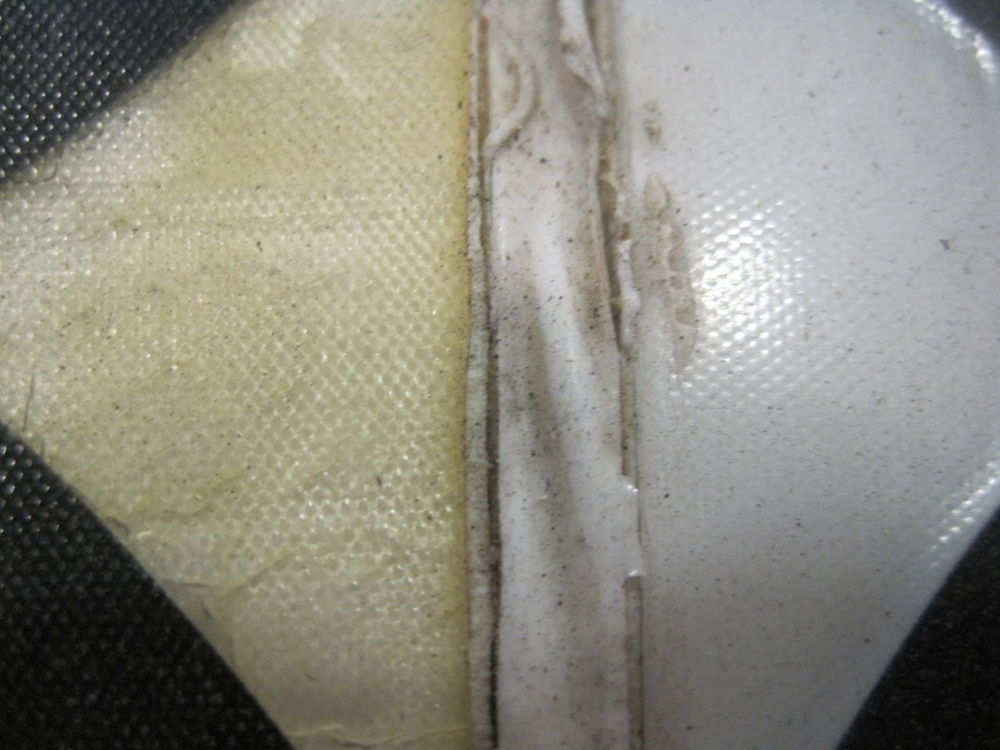

# SSCP - Encapsulation Selection

# Encapsulation Selection

## Encapsulation Stack

### General Stack Properties

UV Stability

Any top sheet must be reasonably UV stable or the array will yellow and degrade after time and this effects both the appearance of the panels and the light transmittance. Gocherman Panels have an epoxy based top sheet which yellows with time which is one reason all of the teams purchase a new array each cycle. Most adhesive materials cannot be assumed to be uv stable unless they are specifically designed for the solar industry or are otherwise marked in their material datasheet. For example, most TPU is not UV stable. On Apogee due to sourcing issues some of the TPU used was for ballistic glass rather than solar and consequently aged significantly by turning yellow even though Apogee did not spend significant amounts of time besides during WSC 2009 and ASC 2009. Shown below is the corner crop showing the amount of yellowing of the ballistic tpu compared to solar tpu.

Aerodynamic Considerations

Since the array is exposed to outside airflow its smoothness and the quality of the seams made can greatly influence the amount of skin drag experienced by the top of the car. The following are some figures from The Leading Edge which quantify the effect. H in the drawings is the unit of width used which in our case is meters. 

Using the calculated CdA for Xenith taken from the wind tunnel data collected at Aerodyne yields a CdA ~ .127 * .68 = .086 

[wind tunnel data](/home/sscp-2012-2013/aero-2012-2013/aerodyn-visit-2012)

Assuming the h in the case of any surface imperfection is 1mm the following table lists the drag penalties for a car with the same number of seams as Xenith (9) that is the full 1.8m wide yields the following numbers

[number of seams](/home/sscp-2012-2013/array-2012-2013/array-wiring)

### Embedded Content

Embedded content: [Custom embed]()

<iframe width="100%" height="400" src="" frameborder="0"></iframe>

Material Index Matching

Index of Common Encapsulents 

### Embedded Content

Embedded content: [Custom embed]()

<iframe width="100%" height="400" src="" frameborder="0"></iframe>

Array Weight

Absorption Spectrum

Although a material may look clear to the human eye it might not to a Sunpower solarcell which absorbs light outside the visible spectrum. Most types of glass and arcyrilic will absorb in both the UV and IR regions that the cell is still fairly efficient in. The absorption spectrum of a Sunpower A300, an older 21.5 cell is shown below. 

Thermal Resistance

Mechanical Integrity

It is possible to bend silicon cells in one axis, but it is impossible to bend them in two axes. The image shows an example of the bend radii that we could use with our C60 cells. However, we don't necessarily know that the cells in the image below are not cracked. Chris Bonner at Sunpower said that even ~1-2 cm deflections should be tolerable – but it also depends on your encapsulation stack and processing. 

## Sunpower Cells

### Negotiations with Sunpower for E60 cells as of September 2012

Chris Bonner at Sunpower said: we don’t even sell the E60 produce in bare cells.   For reference, high performance C60 parts (~3.42 W/wafer) would cost about $1.60 Euros / Wp at a volume of 1200 parts… ~$ 8K USD.  (More $ for fewer parts.)...As a policy, we very infrequently sell bare cells...would you consider use of parts that saw a manufacturing defect which resulted in a reliability failure?  They would perform well at first, but likely degrade ~5% or more after the first year of exposure to UV.

Chris provided some information on the manufacturing timeline and efficiency of their E60 cells, but the details are confidential. Talk to Wesley (twford@stanford.edu) if you need details on the E60 cells.

## Top Sheet

### Introduction

The top layer traditionally has presented the greatest challenge to designers of encapsulents. To be successful it must be light, flexible, weather resistant, aerodynamic, and anti reflective.

### Xenith Seams

The spacing on xeniths seams were formed by seperatating the glass panels with very thin shim stock. The spacking was the minimum choosen taking into account the measured magnitude of top shell flexing and the CTE of the panels. The glass is sensitive to cracks when bumped on an edge so small factor of safety was added in as well. From the above table it can be estimated that the array seams on Xenith cost less than a watt in total drag. 

[ CTE](http://en.wikipedia.org/wiki/Thermal_expansion)

Apogee Seams

Apogee seams were made after the panels were laid down in Australia right before the start of WSC 2009. The cells were masked off and silicone was applied in the gap, as a consequence the worst type of seam was formed: an outward grove. In addition in a vain attempt to smooth the silicone release film was smoothed over the joint. This had the unfortunate effect of creating a significant amount of surface roughness. In total the power increase due to bad seems on apogee can safely be estimate at somewhere between 10-70W!!!!

### Weathering 

Australian Weather

Australia is a nasty place. The top sheet must be able to withstand the terror that is the Australian outback. Even if your top sheet increases performance by 10%,  if it impossible to clean it will not do well in OZ. Where brush fires and dust storms are commonplace. Shown below is Nuon (who has Gocherman panels) in 2011 WSC during the day of brush fires. Our Asian driver for the day came out of the car white because she was covered in ash.

### Antireflective Coatings

Numeric Background

At normal incidence a material with an index of refraction of 1.5 (TPU, EVA, GLASS) will reflect 4% of light. Besides seam quality, a good anti reflective coatings is one of the best ways to improve the performance of the solar array. Its also one of the areas SSCP strugges with in comparison to its competitors. Shown below is the results of month long tests of our modules against ones with the same cells from Suncat and Gocherman. At high angles of incidence our panels from Xenith were over 20% worse than those from Gocherman which were on Tokai and Nuon! Not only does this effect end of the day performance, but on cloudy/hazy days where the light is more diffuse performance will also suffer.  Unfortunately the test did not measure the panels within 20 degrees of normal where Xenith's AR coating is the most effective and is the angle that the sun stays in the sky through most of the day.  

Interference Based Coatings

Based on the quarter wavelength interference effect these coatings are easy to apply to most flat plastics, and glass with vacuum deposition and can be applied to thin rolls of plastics with roll to roll vacuum depositors. They can offer very low reflectance, at specific angles but due to their quarter wavelength nature can increase reflectance at other angles. If a 1/4 wavelength coating is to be used it one curve specifying performance at a specific angle should not be relied upon. The only reliable test is to build a test module and test it against a reference over a range of conditions. 

Xenith featured a 7 layer coating with a 8th hard hydrophobic layer which made the AR far easier to clean. (see attached information) The coating was applied by JDSU Custom Optics through a distributor, IGS Glass. The reflection measured was class leading at a normal angle was class leading and no encapsulation loss was measured at normal angles. Shown below is our rudimentary test trying to measure encapsulation loss and a scan of the AR coating on a piece of Xenith glass. 

[ JDSU Custom Optics](http://www.jdsu.com/en-us/Custom-Optics/Pages/custom-optics.aspx)

[ IGS Glass](http://www.igsglass.com/)

Indexed Matched Coatings

Microstructure Coatings

### Common Topsheets

Glass

TPU

ETFE

3M Proprietary Films

3M makes a number of anti reflective films across several different product lines which might be suitable for encapsulation. Lines include their solar ultra barrier which was designed for solar applications and their Vitivi line of films which are mictrostructure films originally designed for the display industry. In addition, 3M has legendary R&D which and the University of Minnesota can be counted on to be sporting each cycle. 

## Adhesive Layer

### Sillicone

### TPU

### EVA

### Ionomer Based

## Backsheet

### Embedded Google Drive File

Google Drive File: [Embedded Content](https://drive.google.com/embeddedfolderview?id=1YqSIo2dpQJs6xqjYt8InQqs-_3MdrlZL#list)

<iframe width="100%" height="400" src="https://drive.google.com/embeddedfolderview?id=1YqSIo2dpQJs6xqjYt8InQqs-_3MdrlZL#list" frameborder="0"></iframe>

