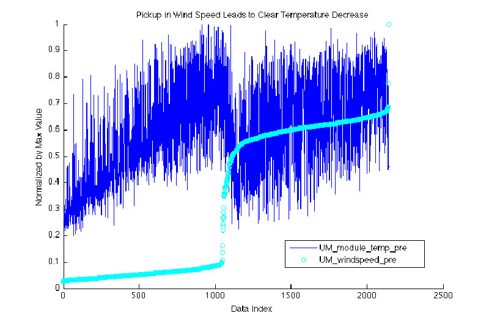

# SSCP - NREL Xenith Panel Test

# NREL Xenith Panel Test

MATLAB scripting tools available at svn/sunbad/array/NREL

[svn/sunbad/array/NREL](https://solarcar.stanford.edu:81/svn/sunbad/array/NREL/)

After WSC Michigan was curious about array performance and sent modules from both suncat solar (Alain Chuzel) and Gochermann for testing. Preliminary analysis preformed by the tester at NREL showed that the panels preformed the same up to about 60 degrees in incidence angle where the gocherman ones were significantly better. In addition the Xenith panels 

## Notes from Olivia:

Hey guys, so here's what I gathered:

0a) First off, I believe we want to run regressions against modeled_pmax, not pmp_corr. The corrected power at max pwr pt gives some normalized value with a near-flat response to any variable. R-squared values for those regressions were extremely low -- from 0.1 to 0.3.

0b) irradiance_pre and "Pyranometer 1" are the same measurements. I've attached data for regressions run against the average of Pyranom 1 and 2. I can run again on just Pyranometer 1 if you'd like, as well, but these numbers should be comparable. I ran these for pmp_corr last night, and found the numbers to be mostly the same (but keep in mind all numbers were on such a small scale for that run).

### 1) modeled_pmax_vs_module_temp

Suncat:    0.876*x - 16.9

Stanford:  0.833*x - 15.7

UM:          0.626*x - 12.7

Linear plots? Check!

UM having a shallower slope (lower power)? Perhaps has to do with cell dicing? See plot.

### 2) Multiple Regression

Matlab's B = regress(y, x) method returns the data given in ANOVA.xlsx

Coefficients of Stanford's regression of modeled_pmax against 6 factors are shown below. Note that though the R-squared values for these runs hover around 0.99 (nice!), we also see relatively large error variance and an absurd F statistic? I'm not familiar with F statistics, but it seems our values (4000-5000) are astronomical (?). See more, and a p-value of 0, in ANOVA.xlxs.

Constant (Intercept) 3.6017

Average Irradiance (Pyranometer 1,2) 0.0385

Wind Speed 0.2195

Spa Array AOI 0.0091

Spa AMU -0.8646

Outdoor Temperature -0.0519

### 3) Other 2d scatter plots are included for reference.

Thoughts? Questions? Concerns?

"pmax.zip" is the one you want.

"pmp_corr_FOR_REFERENCE.zip" is the mostly-flat regression against pmp_corr. You can likely disregard this, but I included it for completeness.

### Embedded Google Drive File

Google Drive File: [Embedded Content](https://drive.google.com/embeddedfolderview?id=1WQIpmWjtc5SOcz5wHHu_Uh4OKoUyD956#list)

<iframe width="100%" height="400" src="https://drive.google.com/embeddedfolderview?id=1WQIpmWjtc5SOcz5wHHu_Uh4OKoUyD956#list" frameborder="0"></iframe>

