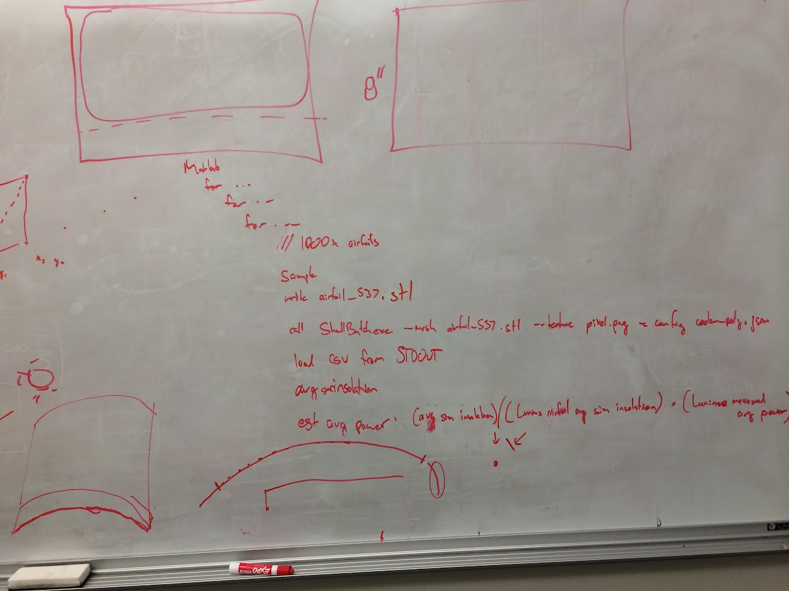
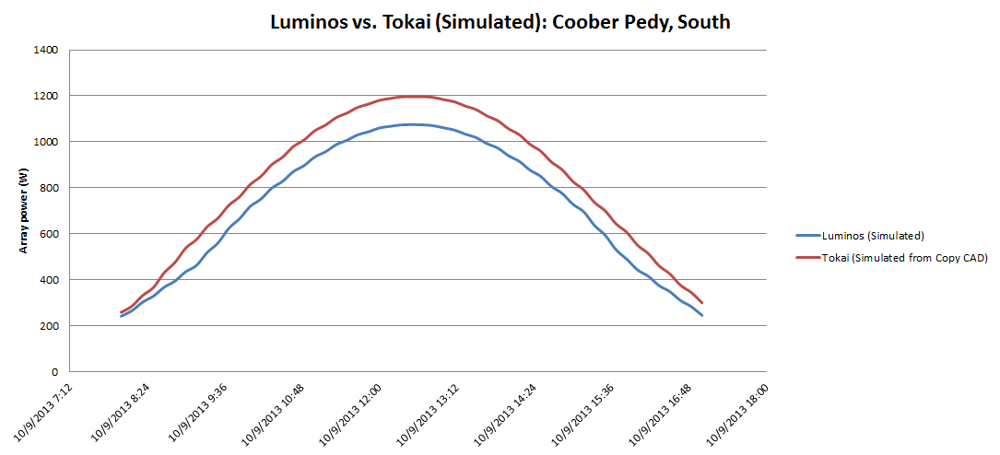
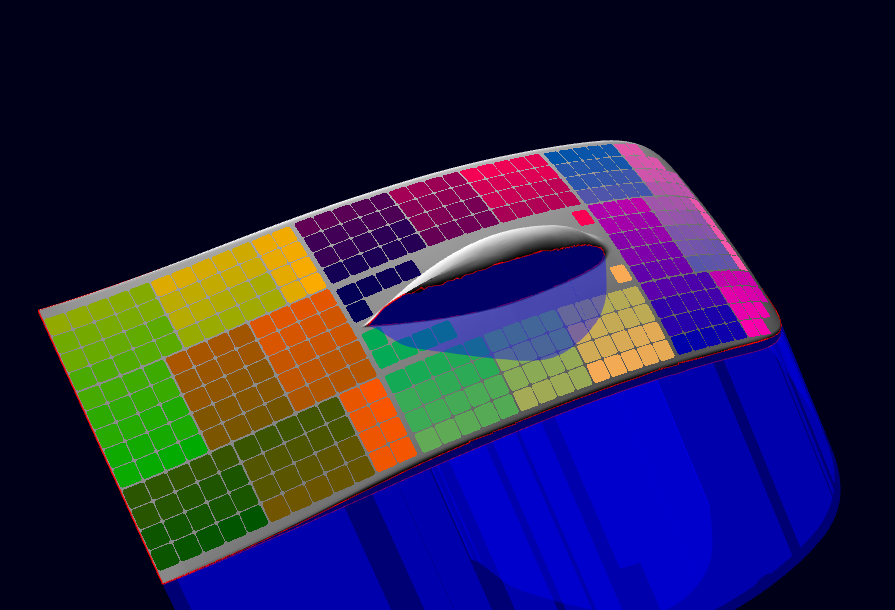
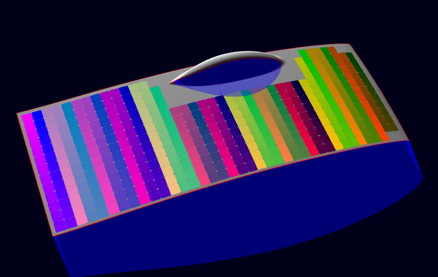
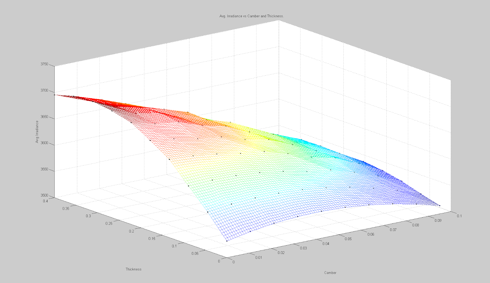

# SSCP - ShellPower

# ShellPower

ShellPower was started by DC Posch for a senior project. 

Its repository is hosted on GitHub: https://github.com/dcposch/shellpower

Helpful tip: if files will not load, try exporting in ASCII both from Solidworks and MeshLab.

2/17/2014

* DC is working on a command line interface for ShellPower that will let us feed in different meshes and will output array power over the course of the day.
* We will write MATLAB to generate NACA airfoils, create meshes from the 2d airfoils, run ShellPower on the meshes, and fit array output to the input parameters for the NACA airfoils
* We will call the entire top surface of the car one airfoil: stringing, bubble shading, etc are all ignored - assuming that the effects of these things will not vary between different airfoils.
* We wouldn't realistically put cells over the first ~10% of the airfoil because it is too curved. Only should export the portion of the array that would have cells over it. Make sure that the arc length is constant over all models that we are generating.
* MAX: Need to look up the actual weather from Luminos on the day in Coober Pedy so we can "calibrate" the results to real world data. 
* Will generate the airfoil shapes in MATLAB (as a new member project) based on the NACA 6 series equations
* Will use stlwrite (if it works) to create the airfoils
* DARREN: flip Luminos' model by 90 degrees clockwise and re-generate the STL file. 
* MAX: create a side-by-side of Tokai and Luminos over the course of one day.

DC is working on a command line interface for ShellPower that will let us feed in different meshes and will output array power over the course of the day.

We will write MATLAB to generate NACA airfoils, create meshes from the 2d airfoils, run ShellPower on the meshes, and fit array output to the input parameters for the NACA airfoils

We will call the entire top surface of the car one airfoil: stringing, bubble shading, etc are all ignored - assuming that the effects of these things will not vary between different airfoils.

We wouldn't realistically put cells over the first ~10% of the airfoil because it is too curved. Only should export the portion of the array that would have cells over it. Make sure that the arc length is constant over all models that we are generating.

MAX: Need to look up the actual weather from Luminos on the day in Coober Pedy so we can "calibrate" the results to real world data. 

Will generate the airfoil shapes in MATLAB (as a new member project) based on the NACA 6 series equations

Will use stlwrite (if it works) to create the airfoils

DARREN: flip Luminos' model by 90 degrees clockwise and re-generate the STL file. 

MAX: create a side-by-side of Tokai and Luminos over the course of one day.

2/18/14

Some things to note:

Tokai's car only shades in the morning, until about 9AM - you can see that our array power values are well-matched with theirs at the start of the day, but they have an advantage at the end of the day because of the asymmetric design.

Our peak production is significantly less than theirs at noon. The only difference between our model and theirs is curvature - array area, cell efficiency, etc are identical

Take this with a grain of salt. Known problems include the below list, but the good news is that both of our models will be affected equally by many of these factors:

We have not dialed in the "fudge factors" yet - so qualitative differences are the important part of this graph. We're in the 100-150 watt range of what we actually measured on Day 4 of WSC, though.

Incorrect bearing (average is more like 134 degrees on Day 4 of WSC, not the 180 degrees due south that we simulated with)

Greg's model is a work in progress

I have no idea how Tokai strings and bypasses their panels. I made 13 lateral strings because that seemed consistent with what we know about their large number of trackers

Special thanks to DC (for putting in a lot of work to ShellPower) and Greg (for making the Tokai model)! We're close to being able to run a bunch of airfoil shapes through ShellPower and use the results to jointly optimize Aero/Array while picking a 2D main airfoil.

Some eye-candy - Luminos and Tokai at the same location, time of day, and bearing. Note how much less shading Tokai has...

Luminos

Tokai

2/26/14

A run of NACA 4 digit airfoils suggests that there is a certain thickness which maximizes the insolation that the car receives. I will run this again for 6 digit airfoils manipulating all the parameters, as well as investigating the effects of compound curvature.

2/28/14

I had a prior analysis of 6 digit airfoil results here and realized that I drew conclusions from incorrectly generated airfoils (the results of the analysis are, however, similar. The 6 digit parameters are not as intuitive as 4 digit parameters). It's likely not worth the time to go through generating the same plot as for the 4 digit series, so I will just try to draw a couple of conclusions from the 4 digit plot. 

The difference in best and worst case airfoils (for reasonable values in the design space) is on the order of a couple hundred W/m^2, or on the order of 50W array output. This is reasonable in the context of the Luminos/Tokai array comparison.

Warning! Don't go around making decisive statements based on what you're about to read! It's really rough, and is for the sake of having a rough metric rather than speculation! 

Some back of the envelope math says that going from the worst to best array simulated would be equivalent to a difference in speed of 1kph, or approximately a drag of  in drag of 2-3N (based on aero power = force * drag, with a difference in aero power of 100W and Luminos' drag model) . The array performance is definitely non-linear with respect to car thickness and camber - but maybe a good approximation to get us in the ballpark is that for a given value of camber, average array output is increased by approximately 1-2W/% thickness from 0 to 30% thickness, and decreases at -1.5W/%thickness after 30% thickness. Similarly for a given thickness, array power output is increased approximately by 1-2W/% camber. Zero camber is ideal except in very flat cars. Note that when we call a car "thick" on the team, we are often referring to it having large camber.

Based on some of the design metric takeaways from Luminos, two cars with the same aero and the best and worst arrays simulated here would only vary in overall race speed by ~2kph. This analysis also does not include the benefit of array standing from a more flat car.

[ design metric takeaways](/home/general-design-principles/design-metrics)

10/28/14

Below is an email with some analysis I did to check if we would get much worse array performance with Sunwhale-030 being curvier than Sunwhale-029.

Hi Team,

I fired up ShellPower and did a VERY rough approximation of how much insolation each of these models will see. (DC, who wrote the software, and Charlie, who is working on detailed solar models for the software, could do a much better job finding out how the power breaks down with a real solar array)

I placed the same sized rectangle on -029 and -030 spanning the entire length of the car so I could see the percent difference in total insolation due to curvature difference in the models - bottom line: it doesn't matter, there would be 0.3% worse peak array output for -030.

Of course, all of this is very rough and doesn't factor in how we string the array, where we place cells, shading, etc...I just wanted to get a sense of how the same surface area of solar array would perform on different curvatures.

And here's a comparison of the two main foils side-by-side:

### Embedded Google Drive File

Google Drive File: [Embedded Content](https://drive.google.com/embeddedfolderview?id=1Lih9KmL4VtY_3VXp5INrgPYTJBPCCI_h#list)

<iframe width="100%" height="400" src="https://drive.google.com/embeddedfolderview?id=1Lih9KmL4VtY_3VXp5INrgPYTJBPCCI_h#list" frameborder="0"></iframe>

