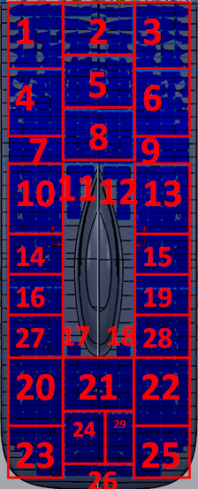
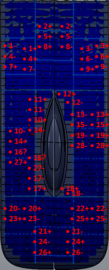
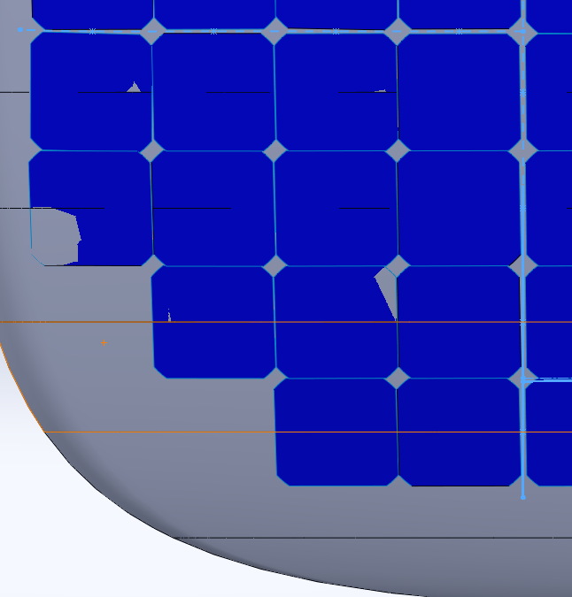

# sunbad-array-layout

## SSCP - Sunbad Array Layout

## Sunbad Array Layout

Luminos' Array Stringing (what we ran for WSC2013) is attached as "Sunbad Array Wiring.jpg"

1: 1, 2, 3

2: 4, 5, 6, 7, 8, 9

3: 12, 13, 15, 18, 19, 28

4: 8?, 10, 11, 14, 16, 17

5: 20, 21, 22

6: 23, 24, 25, 26

### Visual Array Layout       Wire Through Top Shell&#x20;

### Array Panel Quantities

### (391 total cells)

### &#x20;

#### Embedded Content

Embedded content: [Custom embed](./)

#### Embedded Content

Embedded content: [Embedded Content](./)

Remember: These options were only considered for the car. To see the final wiring see the attached image. Also listed below:

#### Embedded Google Drive File

Google Drive File: [Embedded Content](https://drive.google.com/embeddedfolderview?id=1Q5b5LsHSyVjcYXMbhliNa5E1eLmyOFXS#list)
