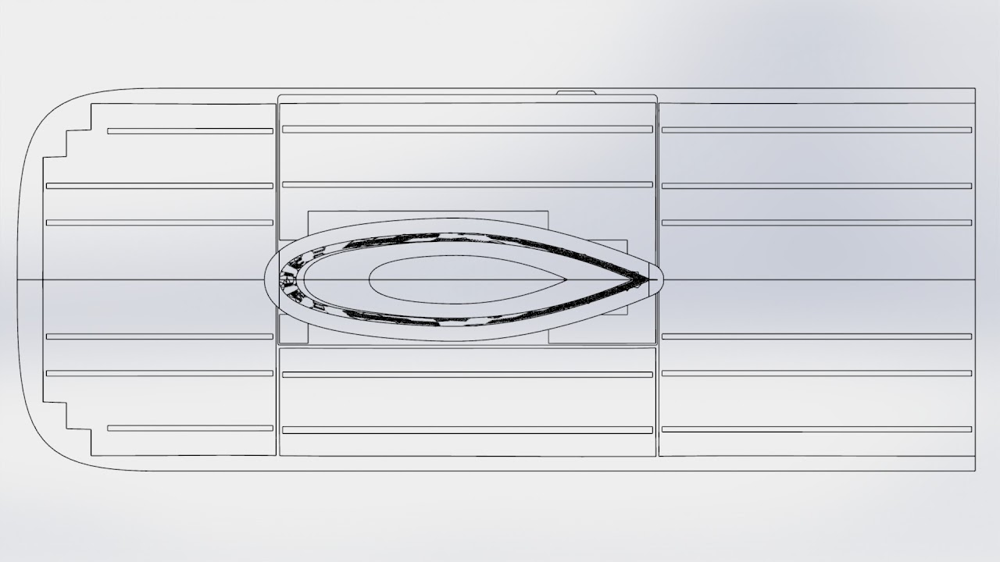
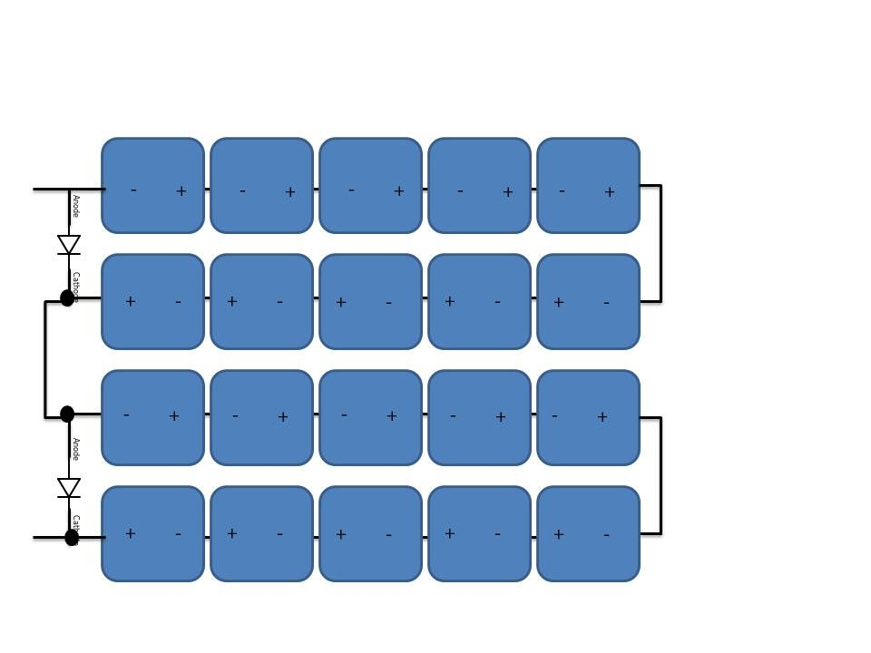
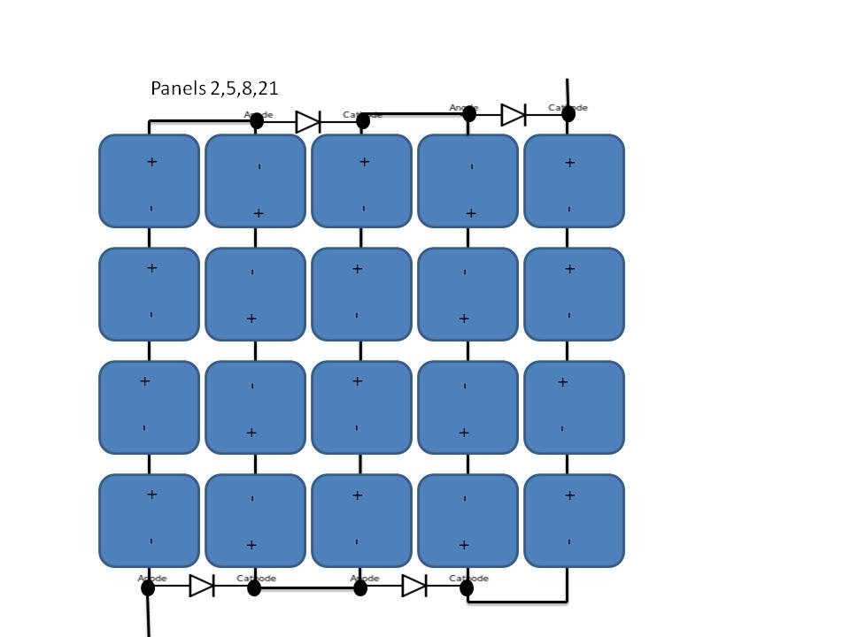

# sunbad-module-wiring

## SSCP - Sunbad Module Wiring

## Sunbad Module Wiring

In the top shell of sunbad, there are channels that are 1" across that accomodate the array ribbons. The ribbons from each module will be bussed down to one end of the top shell where they will be connected to the battery pack.

Each individual module has 2 bypass diodes. Engineering design and CAD compliments of Erin Antono

When looking at the array from the back of the cells (i.e. when soldering) with the tabs on the left, the positive is the top tab and negative is the bottom tab

Here's what it look likes schematically.&#x20;

The diode that we chose to use for its slim package and low turn-on voltage is

http://www.digikey.com/product-detail/en/STPS30L30DJF-TR/497-12867-1-ND/3043778

[http://www.digikey.com/product-detail/en/STPS30L30DJF-TR/497-12867-1-ND/3043778](http://www.digikey.com/product-detail/en/STPS30L30DJF-TR/497-12867-1-ND/3043778)

For arrays 2,5,and 8, the wiring is a little different

