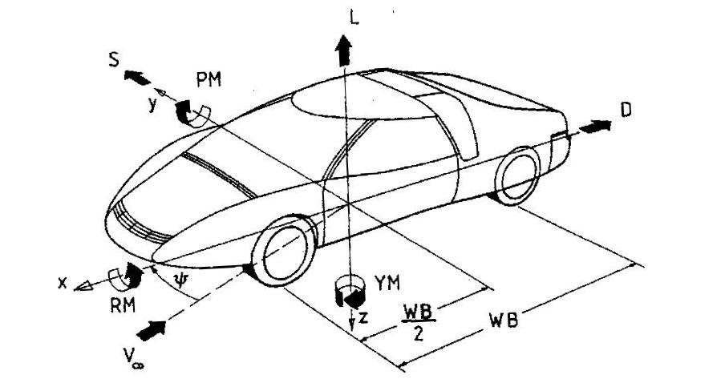
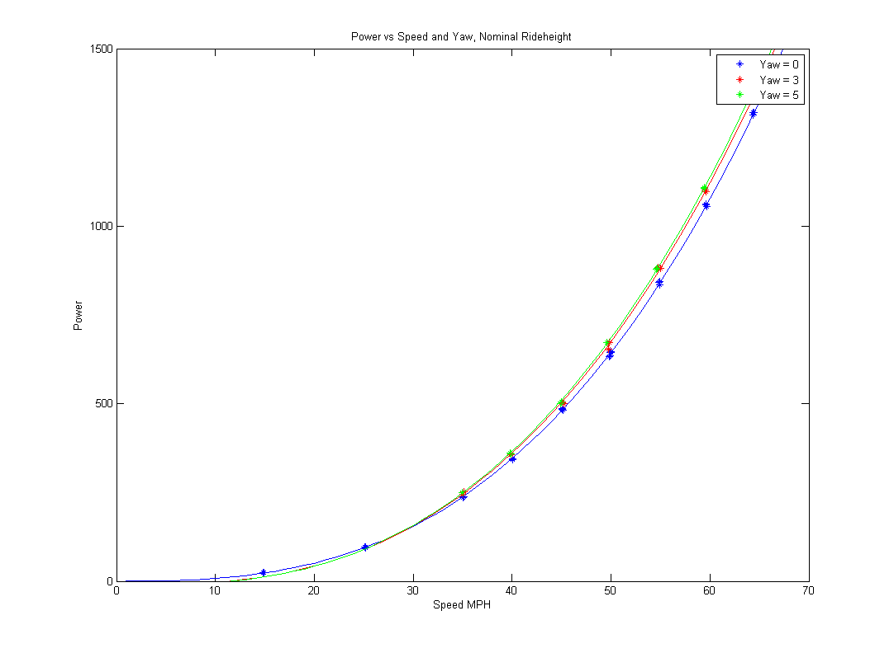
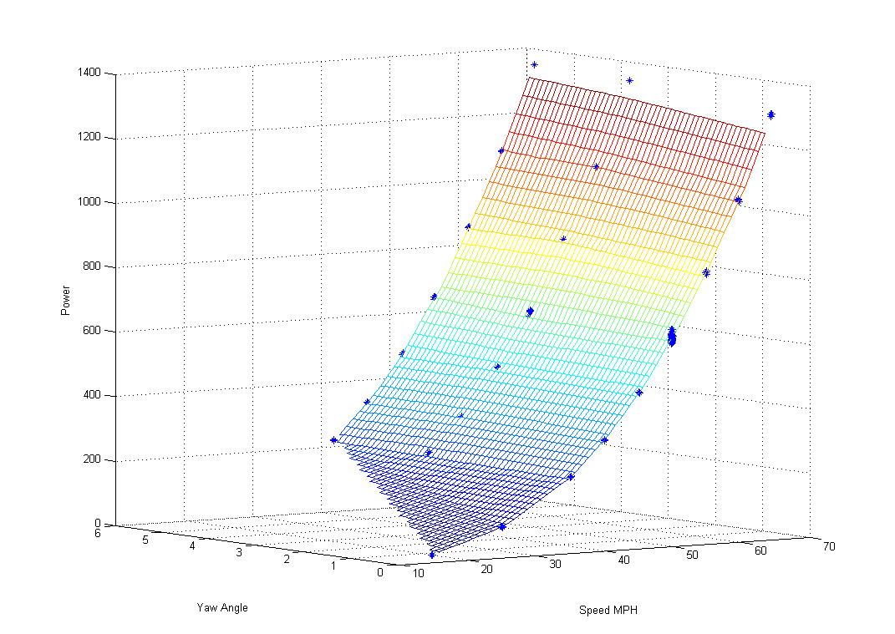
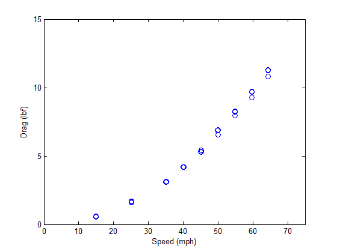
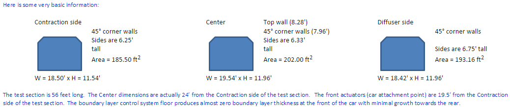
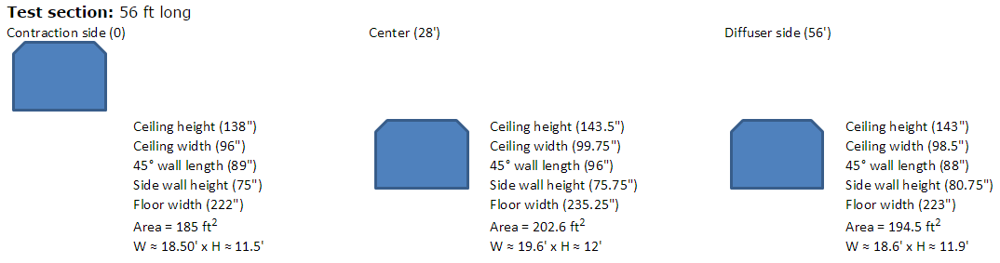

# SSCP - Aerodyn, North Carolina, Test Driving The Car, FSGP 2013

# Aerodyn, North Carolina, Test Driving The Car, FSGP 2013

Glossary of Aero Coefficients

Cd - Coefficient of Drag

Cl - Coefficient of Lift

Clf - Coefficient of Lift (front wheels)

Clr - Coefficient of Lift (rear wheels)

Cs - Coefficient of Sideforce

Cpm - Coefficient of Pitch Moment

Cym - Coefficient of Yaw Moment

Crm - Coefficient of Roll Moment

Q - Dynamic Pressure

LF / RF / LR / RR - Left front / right front / left rear / right rear

Notes about Excel File

* Use the "Stanford Luminos 16 2013.xlsx" file, not the one in the .zip. The one in the .zip is saved as a flat CSV (no formulas)Force values are calculated from the speed entered at the top of the sheet.Coefficients are calculated assuming a 7.3ft^2 area (so we could compare directly to Xenith when in the wind tunnel)Anemometer and duct values should be ignored: they are for NASCAR teams to use when they instrument parts of their carsMapping of floor pressure sensors is shown in an attached document.
* Use the "Stanford Luminos 16 2013.xlsx" file, not the one in the .zip. The one in the .zip is saved as a flat CSV (no formulas)
* Force values are calculated from the speed entered at the top of the sheet.
* Coefficients are calculated assuming a 7.3ft^2 area (so we could compare directly to Xenith when in the wind tunnel)
* Anemometer and duct values should be ignored: they are for NASCAR teams to use when they instrument parts of their cars
* Mapping of floor pressure sensors is shown in an attached document.

* Use the "Stanford Luminos 16 2013.xlsx" file, not the one in the .zip. The one in the .zip is saved as a flat CSV (no formulas)
* Force values are calculated from the speed entered at the top of the sheet.
* Coefficients are calculated assuming a 7.3ft^2 area (so we could compare directly to Xenith when in the wind tunnel)
* Anemometer and duct values should be ignored: they are for NASCAR teams to use when they instrument parts of their cars
* Mapping of floor pressure sensors is shown in an attached document.

Use the "Stanford Luminos 16 2013.xlsx" file, not the one in the .zip. The one in the .zip is saved as a flat CSV (no formulas)

Force values are calculated from the speed entered at the top of the sheet.

Coefficients are calculated assuming a 7.3ft^2 area (so we could compare directly to Xenith when in the wind tunnel)

Anemometer and duct values should be ignored: they are for NASCAR teams to use when they instrument parts of their cars

Mapping of floor pressure sensors is shown in an attached document.

### Embedded Content

Embedded content: [Embedded Content]()

<iframe width="100%" height="400" src="" frameborder="0"></iframe>

The car wasn't ready in time for Aerodyn in 2013. We shipped the most complex parts of the car too late for our machinists to reasonably finish everything in time and we didn't everything have a chance to pre-drive the car in California before going to North Carolina. The team brought the key wind tunnel people to North Carolina and left the key MEs, code, and EE people on campus to get everything ready to finish the car after our return.

The team got a late start: left Saturday evening and arrived in NC Tuesday morning. Stayed in Utah at the Hall-Snyder's home. Stayed in Kentucky at the Zbrozek's home. Stayed at the Econo Lodge in NC. The hotel was nice for our budget with clean rooms, a pool, AC, free internet, free business center, free breakfast, and free cookies.

Final optimal ride height. These values are measured from trailing edge and lowest point on lights. Make sure car has correct ballast.

* Left rear 13.9in
* Right rear 14.5
* Left light 16.9
* Right light 16.75

Left rear 13.9in

Right rear 14.5

Left light 16.9

Right light 16.75

Notes

Lift/drag (a measure went up with nonzero yaw 

The map of the pressure gauges on the floor matched CFD. High pressure in front of nose of car. low pressure between front fairings

drag coefficient * times q * times area = drag force

Coefficients are a function of input from sensors

Drag force is calculated using the coefficient

We used Xenith's frontal area 7.3 ft^2, so the coefficients will be wrong. However the force will still be correct regardless of what the frontal area input is

The speed that the tunnel is at is less than the speed that we set the test at. Look at the wind tunnel speed column

If you take the pressure sensors data and arrange them into a color coded grid you can get a pressure distribution of the car on the ground surface

 

Hi all,

I've made some updates to our schedule for driving back after North Carolina.

Wednesday the 19th: Windtunnel session at Aerodyn

20th: Check out of hotel. Use garage space at A2 to convert the car from wind tunnel setup to driving setup. Drive out of Mooresville towards South Carolina

21th: Drive Luminos

22nd: Drive Luminos

23rd: Drive Luminos

24th: Make it to Austin by the mid afternoon. Meet the teams checking in for FSGP. Spend the night in Austin

25th: Meet with teams in the morning going through FSGP scrutineering. Leave Austin in the afternoon

26th: Drive to Phoenix

27th: Drive to Stanford

28th: Do needed repairs at Stanford

29th: Do needed repairs at Stanford

30th: Attend Refuel at Mazda Laguna Seca Speedway

The new timeline gives us less time on the road driving the car, but it allows us to have a chance to work on the car at Stanford before Refuel.

If I make additional schedule changes before we get to North Carolina I'll put the on the team calendar (or this link if the first one is private).

[ team calendar](https://www.google.com/calendar/b/2/render?cid=stanfordsolar%40gmail.com)

[ link](/home/administrative-files/sscp-calendars)

Two additional packing notes:

1: Please bring your red team uniform if you have one. We'll wear our team shirts at Aerodyn for media purposes.

2: Please bring a comfortable pair of noise isolating in-ear earphones if you own them. We'll be swapping off with driving Luminos, and you'll want a pair of comfortable earphones to hear the radio. Any earphones that plug into a 3.5" female audio jack and fit with a helmet on will work.

-Wesley

--

T. Wesley Ford

NEW EMAIL: twsford@gmail.com

[ twsford@gmail.com](mailto:twsford@gmail.com)

650-387-6374

PO Box 14243

Stanford, CA 94309

T. Wesley Ford wrote:

Hi all,

Here are a few updates on the trip to North Carolina.

We are moving the departure date to June 15th to give us a buffer for Gonsels and Pro Eng to get us our last parts. I think Nathan and Rachel should be able to start driving the Jetta the same day, so everyone can drive together. The driving schedule that you need to maintain is:

Saturday: Stanford to Salt Lake City 13 hours

Sunday: Salt Lake City to Kansas City 16 hours

Monday: Kansas City to Lexington 9 hours.

(Tuesday Lexington to Charlotte 6 hours)

Please make sure you make it to Lexington before 7pm local time since John Zbrozek is preparing dinner for you all.

His cell number is 865 278 3441. Their home number is 859 552 0635. Their email address is 902 Granville Court Lexington KY 40503.

After Lexington the drive to Charlotte will take 6 hours. The hotel address in Charlotte is 3415 Queen City Drive, Charlotte, NC, 28208 United States of America. It is the Econo Lodge and Suites.

I'll try to find out if we can park the trailer at the hotel when Denis and I arrive. If we can't then you'll have to park the trailer at the Charlotte International Airport RV parking area. This was in lot 4 last year. You'll have to call the parking managers at 704-359-4038 and explain that you want to park a tailer. They will tell you where to park it. Last year they had us park next to the white trailer in the center of the image below. If long term parking lot 4 is full the will have to send an attendant to let you in. Otherwise you may be able to just drive in yourselves. Call the number before you get to the airport/hotel area.

This year we haven't had time to do wind tunnel prep work in California since we are building the car. We will spend Tuesday evening setting up the car for the wind tunnel and talking through everyone's roles and responsibilities. We are paying $1000 an hour for the tunnel, so we need to be especially efficient. I will hopefully send an update on the tests we plan to complete and an overview of responsibilities later this week, but I have other solar car priorities first.

Make sure you bring a warm weather sleeping bag and pad. You can sleep in the van while we drive and at rest stops. It may be chilly at night in Wyoming and Nebraska, but it will be hot in the South and the Southwest on the way back.

Try to pack light, but be ready for car camping every night except for the nights at the hotel in Charlotte. Let me know if you need to do laundry and we could try to stop at a laundromat in Charlotte.

Last time the team concluded that it was uncomfortably hot to car camp in the south on the way back. The team doesn't have the funds to pay for hotel/motel rooms on the way back, but if individuals are willing to chip in for room expenses we can rent rooms as a group. Please send me an email to say if splitting the cost of a motel room would be prohibitively expensive for you. It would probably be $10-$20 per night per person.

There are still some unknowns regarding the delivery of parts, the CNC instal, and people staying behind on campus. Gonsels and Pro Engineering know that we need parts by the 13th, but they could miss that deadline. The motor instal will take a while, so Denis and I may fly parts out. If we need more time then we may have Michael fly parts out. The CNC instal may happen while we are gone, but that is still TBD.

I'll be back on campus Friday night, so I can do a spot check to see if you all missed any items to pack for the trip, but you all need to do the majority of packing earlier in the week. We need supplies for the wind tunnel session and car repairs for the drive back. I'll start a packing list here.

[ here.](https://docs.google.com/spreadsheet/ccc?key=0AmGjGoaxVlX0dFBINEpVcnQ2eFE0WjJpalNqdWhpRWc#gid=0)

Let me know if you have any questions about the trip. I'll send updates throughout the week.

-Wesley

--

T. Wesley Ford

NEW EMAIL: twsford@gmail.com

[ twsford@gmail.com](mailto:twsford@gmail.com)

650-387-6374

PO Box 14243

Stanford, CA 94309

-------- Original Message --------

Here is the last reminder to let me know if you plan to come to Aerodyn and FSGP in Texas. I'll start searching for hotel rooms in Charlotte and Austin Wednesday evening.

-Wesley

--

T. Wesley Ford

NEW EMAIL: twsford@gmail.com

[ twsford@gmail.com](mailto:twsford@gmail.com)

650-387-6374

PO Box 14243

Stanford, CA 94309

T. Wesley Ford wrote:

Here is a reminder to sign up for the Aerodyn trip if you haven't already.

We will try to stop by FSGP at the Circuit of the Americas in Austin Texas on our way back. FSGP is a solar car race that happens in the US. The Circuit of the Americas is a brand spanking new racetrack in Austin and the newest addition to the F1 Grands Prix circuit.

[ FSGP](http://americansolarchallenge.org)

[ Circuit of the Americas](http://circuitoftheamericas.com)

Our team won't be racing in FSGP since our car doesn't qualify, but it will be a great chance to see a solar car race if you haven't seen one before or if you are going to miss the World Solar Challenge this fall.

You've probably seen this: http://www.youtube.com/watch?v=0tEHQJn_hxo

[ http://www.youtube.com/watch?v=0tEHQJn_hxo](http://www.youtube.com/watch?v=0tEHQJn_hxo)

Now you can see it yourself with tarmac: http://www.youtube.com/watch?v=S5gLoxNE7ms

[ http://www.youtube.com/watch?v=S5gLoxNE7ms](http://www.youtube.com/watch?v=S5gLoxNE7ms)

Horsepower--, so it will be more like this: http://www.youtube.com/watch?v=1MOe_WPJq08  and this http://www.youtube.com/watch?v=9rkFlyFRcQw (I think I know that guy)

[ http://www.youtube.com/watch?v=1MOe_WPJq08](http://www.youtube.com/watch?v=1MOe_WPJq08)

[ http://www.youtube.com/watch?v=9rkFlyFRcQw](http://www.youtube.com/watch?v=9rkFlyFRcQw)

PS: Thanks to Greg for paying attention to the FSGP schedule.

--

T. Wesley Ford

NEW EMAIL: twsford@gmail.com

[ twsford@gmail.com](mailto:twsford@gmail.com)

650-387-6374

PO Box 14243

Stanford, CA 94309

T. Wesley Ford wrote:

Hi all,

We have a reservation for Aerodyn wind tunnel for June 19th. I expect everyone on a summer stipend to come on the trip. Everyone else is welcome to come, but I realize that you may have conflicts. The trip will be immediately after finals end, so you could potentially drive with the team to North Carolina for the testing session and then fly somewhere else after the trip if you need to get to a summer internship.

Here is the schedule for the trip:

June 12: Last day of finals (possibly start moving into the summer house)

June 13: Move into the summer house and drive the van (with trailer and solar car) and Jetta from Stanford to Bakersfield (5 hours driving)

June 14: Drive from Bakersfield to Albuquerque (13 hours)

June 15: Drive from Albuquerque to Fort Smith (12 hours)

June 16: Drive from Fort Smith to Knoxville  (11 hours). Graduation ceremony for Seniors

June 17: Drive from Knoxville to Charlotte (4 hours). Denis, Wesley, and any other graduating seniors fly from SFO to CLT

June 18: Do any last minute wind tunnel prep work in Charlotte. Party in the finance capital of the south and the home of NASCAR

June 19th: 9 hour wind tunnel reservation starting at 3:40PM EST

June 20th: People who need to get back quickly fly from CLT. Prep day for drive back to California

June 20th to ???: Drive Luminos across the US!

Here are some additional notes:

* If you plan to go and you want to walk through the graduation ceremony please let me know. You'll have to buy yourself a plane ticket to get yourself to Charlotte. If you want to be on the same flight as me I can give you my travel plansPlease let me know if you plan to come on the tripThe team will be staying at America's Best Value Inn near the Charlotte Airport or a similar hotel. I'll try to get a place with a free airport shuttle and possibly free breakfastThe team will probably buy a couple of dinners along the trip, but students will be responsible for most of the meal expenses. I'm going to try to get Gerdes to start paying the stipend receiving students during this trip, so you have plenty of funds to buy your own meals and snacks.The team will pay for lodging in Charlotte. During the drives lodging is up to the team members. If enough people want a roof over their head you can book hotel rooms, but the team probably can't pay for them. Otherwise we will be car camping.
* If you plan to go and you want to walk through the graduation ceremony please let me know. You'll have to buy yourself a plane ticket to get yourself to Charlotte. If you want to be on the same flight as me I can give you my travel plans
* Please let me know if you plan to come on the trip
* The team will be staying at America's Best Value Inn near the Charlotte Airport or a similar hotel. I'll try to get a place with a free airport shuttle and possibly free breakfast
* The team will probably buy a couple of dinners along the trip, but students will be responsible for most of the meal expenses. I'm going to try to get Gerdes to start paying the stipend receiving students during this trip, so you have plenty of funds to buy your own meals and snacks.
* The team will pay for lodging in Charlotte. During the drives lodging is up to the team members. If enough people want a roof over their head you can book hotel rooms, but the team probably can't pay for them. Otherwise we will be car camping.

* If you plan to go and you want to walk through the graduation ceremony please let me know. You'll have to buy yourself a plane ticket to get yourself to Charlotte. If you want to be on the same flight as me I can give you my travel plans
* Please let me know if you plan to come on the trip
* The team will be staying at America's Best Value Inn near the Charlotte Airport or a similar hotel. I'll try to get a place with a free airport shuttle and possibly free breakfast
* The team will probably buy a couple of dinners along the trip, but students will be responsible for most of the meal expenses. I'm going to try to get Gerdes to start paying the stipend receiving students during this trip, so you have plenty of funds to buy your own meals and snacks.
* The team will pay for lodging in Charlotte. During the drives lodging is up to the team members. If enough people want a roof over their head you can book hotel rooms, but the team probably can't pay for them. Otherwise we will be car camping.

If you plan to go and you want to walk through the graduation ceremony please let me know. You'll have to buy yourself a plane ticket to get yourself to Charlotte. If you want to be on the same flight as me I can give you my travel plans

Please let me know if you plan to come on the trip

The team will be staying at America's Best Value Inn near the Charlotte Airport or a similar hotel. I'll try to get a place with a free airport shuttle and possibly free breakfast

The team will probably buy a couple of dinners along the trip, but students will be responsible for most of the meal expenses. I'm going to try to get Gerdes to start paying the stipend receiving students during this trip, so you have plenty of funds to buy your own meals and snacks.

The team will pay for lodging in Charlotte. During the drives lodging is up to the team members. If enough people want a roof over their head you can book hotel rooms, but the team probably can't pay for them. Otherwise we will be car camping.

* Deadline to sign up for the trip is May 8.

Deadline to sign up for the trip is May 8.

TLDR: We are going to North Carolina to use a wind tunnel. Leaving on June 13th. Testing on June 19th. Arriving back in CA whenever Luminos makes it home. Let me know if you plan to attend. The deadline to sign up is May 8.

-Wesley

--

T. Wesley Ford

NEW EMAIL: twsford@gmail.com

[ twsford@gmail.com](mailto:twsford@gmail.com)

650-387-6374

PO Box 14243

Stanford, CA 94309

### Embedded Content

Embedded content: [Custom embed]()

<iframe width="100%" height="400" src="" frameborder="0"></iframe>

### Embedded Google Drive File

Google Drive File: [Embedded Content](https://drive.google.com/embeddedfolderview?id=1awBFq11f1kmokreQ2HPO9R5-sVSKdB8X#list)

<iframe width="100%" height="400" src="https://drive.google.com/embeddedfolderview?id=1awBFq11f1kmokreQ2HPO9R5-sVSKdB8X#list" frameborder="0"></iframe>

