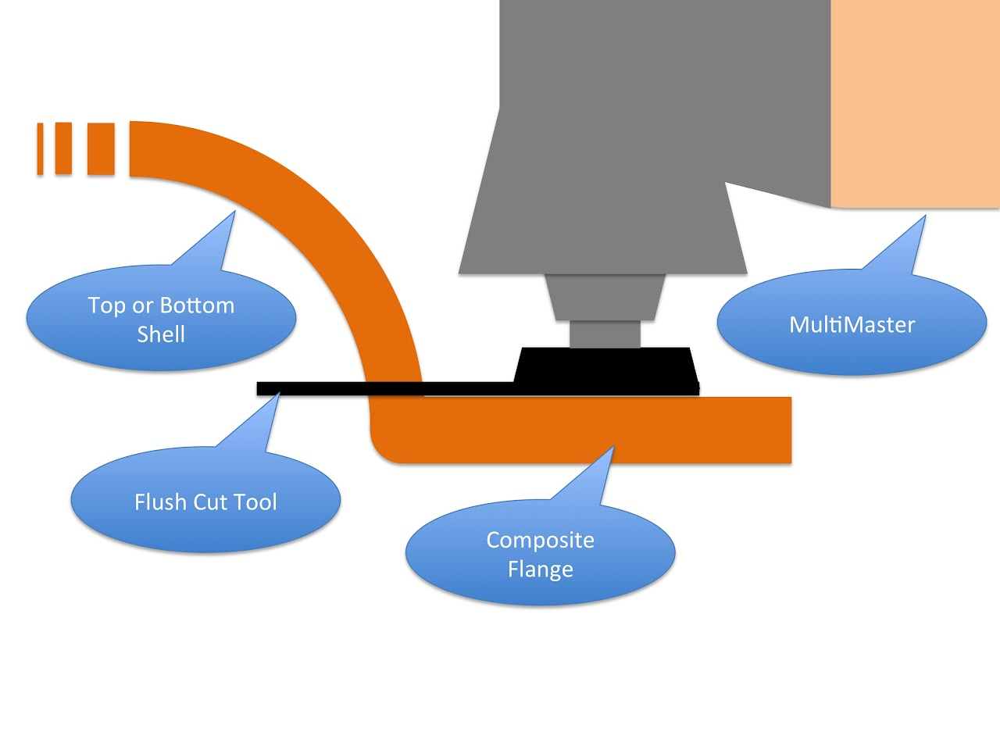

# SSCP - Composites Fundamentals

# Composites Fundamentals

## Composite Resources

Manufacturing Processes for Advanced Composites found for free via Stanford Library on sciences direct is a GREAT resource. Of praticular intrests are chapters 8 and 13 which go over adhesives and assembly techniques respectively. 

[ sciences direct](http://www.sciencedirect.com/science/book/9781856174152)

Hexels Technical Resources Guides pay attention ot the one about sandwich panel, and honeycomb design. They have useful hand equations for doing simple, but powerful, analysis. 

[Hexels Technical Resources Guides](http://www.hexcel.com/Resources)

ACP Composites in Livermore is probably the closest well stocked composites vendor in the Bay Area. They give us a 10% discount.

## Other Team's Composites

University of Minnesoto: http://solarcar.wikia.com/wiki/UMNSVP_Composite_Chassis_Design

[http://solarcar.wikia.com/wiki/UMNSVP_Composite_Chassis_Design](http://solarcar.wikia.com/wiki/UMNSVP_Composite_Chassis_Design)

How we do composites: http://www.youtube.com/watch?v=-ppB7n7Zig4&feature=related

[http://www.youtube.com/watch?v=-ppB7n7Zig4&feature=related](http://www.youtube.com/watch?v=-ppB7n7Zig4&feature=related)

Nuon Solar Team: http://www.youtube.com/watch?feature=player_embedded&v=eDkp54DZoxw

[http://www.youtube.com/watch?feature=player_embedded&v=eDkp54DZoxw](http://www.youtube.com/watch?feature=player_embedded&v=eDkp54DZoxw)

## SSCP Composites Best Practices 

### Team Organization

It takes a lot of person-hours to do composites and it is easy for new people to make mistakes. Have one person who is assigned to stay in the room to oversee the composites layup process for the entire layup day. They should only leave for bathroom breaks and they shouldn't be super distracted with laying or cutting composites themselves. Their job will be to ensure that no one forgets a layer and that there won't be surface failures or bonding failures in the layup. They should have a checklist and they should be quick to correct people's mistakes. This person should probably be the team lead or the composites lead. 

### Foaming Adhesive

Using foaming adhesive will largely prevent you from needing to use bondo to repair surface failures on your carbon work. Foaming adhesive has limited structural strength, but it does a great job of filling voids. When you are filling voids in the outer shell of your car you will want to place surface master directly on your molds. Then you can place thin strips of foaming adhesive in any places where you think you will not get carbon to conform perfectly to your mold. Examples include:

* Any places where core above the carbon will encourage the carbon to lift off the mold surfaceAlong array panel and array wiring insetsAlong small radius (i.e. less than 2in radius) curves where students are likely to do a bad job of rolling in carbon.Along door seamsIn between core piecesYou can also place foaming adhesive under core in tight radius bends. It if you heat the foaming adhesive with a hair dryer it will tack the core in place while you add on other layers. One strip in with the fairing filler in the back of your fairings to force the filler into the backs of your fairings if you are capping the backs of your fairings with carbon over the filler.
* Any places where core above the carbon will encourage the carbon to lift off the mold surface
* Along array panel and array wiring insets
* Along small radius (i.e. less than 2in radius) curves where students are likely to do a bad job of rolling in carbon.
* Along door seams
* In between core pieces
* You can also place foaming adhesive under core in tight radius bends. It if you heat the foaming adhesive with a hair dryer it will tack the core in place while you add on other layers. 
* One strip in with the fairing filler in the back of your fairings to force the filler into the backs of your fairings if you are capping the backs of your fairings with carbon over the filler.

* Any places where core above the carbon will encourage the carbon to lift off the mold surface
* Along array panel and array wiring insets
* Along small radius (i.e. less than 2in radius) curves where students are likely to do a bad job of rolling in carbon.
* Along door seams
* In between core pieces
* You can also place foaming adhesive under core in tight radius bends. It if you heat the foaming adhesive with a hair dryer it will tack the core in place while you add on other layers. 
* One strip in with the fairing filler in the back of your fairings to force the filler into the backs of your fairings if you are capping the backs of your fairings with carbon over the filler.

Any places where core above the carbon will encourage the carbon to lift off the mold surface

Along array panel and array wiring insets

Along small radius (i.e. less than 2in radius) curves where students are likely to do a bad job of rolling in carbon.

Along door seams

In between core pieces

You can also place foaming adhesive under core in tight radius bends. It if you heat the foaming adhesive with a hair dryer it will tack the core in place while you add on other layers. 

One strip in with the fairing filler in the back of your fairings to force the filler into the backs of your fairings if you are capping the backs of your fairings with carbon over the filler.

After you have placed the foaming adhesive you can cover it up with carbon and proceed as usual.

You will also use foaming adhesive under the exposed core of chassis panels.

You can easialy chop foaming adhesive if you cut it when it is cold (somewhere between freezer temperature and room temperature). Use the paper chopper in the shop. First wax the blades of the chopper with mold release wax. Then cut the foaming adhesive with quick chops.

You can use foaming adhesive to bevel thin core. Instead of trying to cut the core at a 45 degree angle you can do a right angle cut and then place a strip of foaming adhesive along the end of the core. The foaming adhesive will fill the void where the carbon drapes down at the end of the core. Make sure you use a thick enough piece of foaming adhesive or use two pieces of foaming adhesive on top of one another. This technique may not necessarily work for thick pieces of core, but we have yet to try it as of January 2013.

### Fairing Filler

It is probably not worthwhile to try to get a perfect carbon trailing edge on your fairings. Just run carbon towards the trailing edge of your fairings. Then cut a slit in the carbon so it conforms to the molds nicely. Mix West System epoxy with West System fairing filler and use an empty caulk gun tubes or pastry icing bags to apply the mix into your fairing trailing edge. Mix a ratio of fairing filler with epoxy so the resulting paste has the consistency of cold honey. It should still flow a little bit but not so much that it will flow down your fairings. Make sure you did a really good job freekoting the trailing edge of your fairings or the epoxy will sick to the trailing edge and break off your fairings.

The fairing filler will likely be brittle once you bake it so you will want to cover the fairing filler with layers of prepreg carbon. The carbon will give structual strength to the back of the fairings and it will prevent your vacuum bag, release film, and breather from sticking to the epoxy fairing filler. Ripping release film and peel ply out of a large glob of epoxy is difficult and you will likely break the epoxy. 

If you place a strip of foaming adhesive between the epoxy fairing filler and the carbon cap the foaming adhesive will press the epoxy into the trailing edge eliminating any voids. 

The carbon can also be used to keep a runny consistency fairing filler in place as long as the carbon forms a good seal. 

If you decide to place multiple layers of carbon in the trailing edge of your fairings you should put a layer of foaming adhesive between the layers of carbon. It will be difficult to properly press the layers of carbon together in the back of the fairings without leaving voids, but the foaming adhesive will fill any voids.

Do the fairing filler part as the very last step since the large volume of fairing filler may form an exothermic reaction curing the fairing filler before you pull vacuum. Go ahead and lay the peel ply, release film, breather, and vacuum bag over the entire fairing. Don't vacuum tape the vacuum bag in the back two feet of the fairings. When everything else is ready to go peel back the last four layers to expose your fairings. Put in the fairing filler, cover it with layers of carbon as described above. Place the peel ply etc back on the fairing trailing edge. Tape the last section of vacuum bag down. Find any leaks and get it in the oven relatively quickly. (note in 2013 the team spent 2 hours finding leaks in the vacuum tape, but the fairings still came out ok. Granted, the team made an effort to firmly press the capping piece of carbon against the epoxy below to force the epoxy into the back of the fairings. They also used pastry icing tubes to force the epoxy into the backs of the fairings instead of just pouring the epoxy into the general area.)

### Econotac

This works pretty well for holding breather, film adhesive, and peel ply in place. Do not use it to hold composite materials like carbon, core, or adhesives in place. Econotac is not structural.

### Making Templates

Buy a large roll of tracing paper to make templates before you cut core. You can place the tracing paper on the mold to layout the shape you need before transferring it to the core to cut.

### Film Adhesive

You will be using film adhesive to add epoxy to glue carbon to surfaces that aren't pre-impregnated with epoxy. Cover core in film adhesive. Cover foam and foam fillets in epoxy. You should also add a layer of film adhesive on any exterior surfaces that you plan to sand after the layup cures (e.g. in places on the top shell where you will sand before gluing on chassis panels. You don't want to sand the outer carbon layer directly because sanding can cut carbon threads and your outermost carbon is the most structural carbon. 

### Cutting Core

Get a brand new razor blade every time you start to cut core. You can recycle the blade to use for cutting carbon or other materials, but you need super sharp blades to cut core. You will probably not want to use a razor blade holder while you are cutting core. Have someone help you by holding a strait edge while you cut the core. First make a vertical cut against the straight edge. Make fast cuts to prevent the core from bunching up. If you plan to fillet your core (This is a bad idea. Use foam fillets if you can). Make a second cut after you have made your first cut cutting the core to the correct size. Have your partner shift your straight edge in so that you can easily cut at a 45 degree angle. Make another quick cut with the razor blade. If you tug slightly on the strand of excess core that you are cutting off you will prevent the core from bunching up while you cut. If you have a hard time cutting the core get a new razor blade. 

### Cutting Carbon

Months before you start cutting carbon you should have designed scribe lines into your molds from your mold manufacturer. The scribe lines will transfer onto any carbon parts that cover the scribe lines. In places where you plan to cut you should add 3-5 extra layers of carbon. This will prevent the part from rattling while you try to cut it and it will make stronger edges. After you have cured the part take a black sharpie to carefully retrace the faint scribe line in your part. Then take your part outside to cut. Put on a white tyvex suit, a dust mask, an eye protection mask, and ear protection. You may also want to find a way to prevent dust from getting all over your face and hair. Asking a friend to hold a vacuum cleaner (while also wearing a tyvex suit, dust mask, eye protection, and ear protection) could work. You could also find a cheap balaclava or just be prepared to take a shower at VAIL when you are done. Carbon dust is super itchy. Cutting a clean line will take care and precision. An angle grinder with a diamond coated blade will do the trick, but you still have to take your time. If you have a rough carbon edge do a preliminary cut 1-2 inches from the cut you will eventually make. This will give you a smooth surface to run your hand along while you guide the angle grinder. It will be difficult to hold a smooth line with a tattered edge. While you are cutting focus on the leading edge of the angle grinder blade and make sure the back edge of the angle grinder doesn't remove material from your good surface while you aren't looking. You can even slowly plow through the carbon with the blade at a slight angle to ensure that you only cut with one part of the blade. Take your time; spending 20 minutes on a fairing or door will make your life easier in the future. Also placing the object you plan to cut on a cheap table and placing weights on the part you are cutting to hold it still will help. If you intend to make a straight cut you can sand off any imperfections by taping sand paper to the concrete floor and sliding your part over the sand paper to get a straight edge. Finish off any cuts you make with the sander to remove sharp corners.  

### Drying Panels after Jetting

After reading some NASA space documentation, I realized that the method SSCP has used to clean composite panels after waterjetting might have some problems. The objective is to minimize the amount of water that touches the panels - what we've done in the past doesn't accomplish that goal. Previous method (one day) - Used on Xenith and Luminos Morning: Hose down with water to remove sand Afternoon: IPA/Acetone spray with spray paint gun to clean core Evening: Acetone/MEK wipe before gluing Suggested new method (1 week) Day of waterjetting: hose down to remove sand. Place panels in dry area to dry 1 week later: IPA/Acetone spray to clean core. Wait at least one hour for solvent to fully evaporate Evening: Final Acetone wipedown before bonding Accelerated method Morning: Hose down with water or IPA. Morning: Place composite component in oven for bakeout (to accelerate evaporation) for several hours. This only works if the component is small enough to put in the oven. Afternoon: Final Acetone wipedown before bonding The final bonding should be done in as dry an area as possible - for example, gluing together the chassis on a rainy day would not be advised. The epoxy-panel bonds will not be as strong as they otherwise could be. Inline image 1 Structural Composite Materials By F. C. Campbell Cheers, Nathan

### Surface Preparation

If you have to ask, you probably haven't done enough. Read the SSCP Best Practices Structural Bonding Guide for instructions about how to successfully bond materials. For more information and information on more materials, see the Hysol Surface Preparation Guide. Through and correct surface preparation is imperative to good structural glue joints. 

[ SSCP Best Practices Structural Bonding Guide](/stanford.edu/testduplicationsscp/home/sscp-2012-2013/composites-2012-2013/structural-bonding-guide)

[ Hysol Surface Preparation Guide](http://www.henkel.com/com/content_data/14258_LT4536_TT_Aerospace_Surface_Preparation_Guide.pdf)

Surface Prep for Aluminum, Carbon, Titanium, Stainless Steel, and Structural Plastics

* See the Structural Bonding Guide --> here <-- for information about how to make structural bonds between various materials and carbon/epoxy matrix composites
* Note due to CTE differences between Aluminum and Carbon DO NOT CO CURE
* A graph from a USAF report on carbon bonding showing the tensile strength with different types of surface preparation. Note that the peel ply bond strength is highly dependent on peel ply.

See the Structural Bonding Guide --> here <-- for information about how to make structural bonds between various materials and carbon/epoxy matrix composites

[here](/stanford.edu/testduplicationsscp/home/sscp-2012-2013/composites-2012-2013/structural-bonding-guide)

Note due to CTE differences between Aluminum and Carbon DO NOT CO CURE

A graph from a USAF report on carbon bonding showing the tensile strength with different types of surface preparation. Note that the peel ply bond strength is highly dependent on peel ply.

### Vacuum Bagging Tips:

* Vacuum bagging on large molds: put stress-releaving dog ears every 2-3 ft along the mold in addition to large dog ears near areas where more bag will be needed (fairings)While assembling large vacuum bags, DO NOT STEP ON THE BAG OR LET IT DRAG ON THE FLOOR. This will cause micro-tears and holes which are really hard to find.When joining vacuum bags, do not use an overlap joint - use a butt joint so that the vacuum tape can be inspected at each point.If you are pulling vacuum on four fairings at a time and you plan to use one pump place the pump so that it is near the center of the string of the four fairings. I.e. don't daisy chain four fairings and put the pump at the end of the line. Place the pump in the middle.Place the vacuum pump at one end of your large vacuum bag and place the vacuum gauge at the other end. Sometime vacuum failure will not propagate to the pump on the vacuum.Hardened carbon can easily pierce AirTech Stretchlon stretchy vacuum bagPlace a fan to blow on the vacuum pump so it does not overheat.When you have vacuum failures spend a few minutes with the entire team searching for the failure, but then you should send everyone out of the room except for one careful person with good hearing. Turn off all noise sources in the room so it is silent. Have them pull vacuum on the mold, but then turn off the pump. Have that person search alone for the hissing noise of vacuum failures. Using a stethoscope may help, but sometimes it is a hinderance. Don't forget that you can have punctures in the vacuum bag in the center of your mold in addition to gaps in the vacuum tape around the perimeter of your mold. You could even have cracks in your mold itself, but if you didn't realize you had cracks in your mold before you laid down carbon you should just go cry or something. 
* Vacuum bagging on large molds: put stress-releaving dog ears every 2-3 ft along the mold in addition to large dog ears near areas where more bag will be needed (fairings)
* While assembling large vacuum bags, DO NOT STEP ON THE BAG OR LET IT DRAG ON THE FLOOR. This will cause micro-tears and holes which are really hard to find.
* When joining vacuum bags, do not use an overlap joint - use a butt joint so that the vacuum tape can be inspected at each point.
* If you are pulling vacuum on four fairings at a time and you plan to use one pump place the pump so that it is near the center of the string of the four fairings. I.e. don't daisy chain four fairings and put the pump at the end of the line. Place the pump in the middle.
* Place the vacuum pump at one end of your large vacuum bag and place the vacuum gauge at the other end. Sometime vacuum failure will not propagate to the pump on the vacuum.
* Hardened carbon can easily pierce AirTech Stretchlon stretchy vacuum bag
* Place a fan to blow on the vacuum pump so it does not overheat.
* When you have vacuum failures spend a few minutes with the entire team searching for the failure, but then you should send everyone out of the room except for one careful person with good hearing. Turn off all noise sources in the room so it is silent. Have them pull vacuum on the mold, but then turn off the pump. Have that person search alone for the hissing noise of vacuum failures. Using a stethoscope may help, but sometimes it is a hinderance. Don't forget that you can have punctures in the vacuum bag in the center of your mold in addition to gaps in the vacuum tape around the perimeter of your mold. You could even have cracks in your mold itself, but if you didn't realize you had cracks in your mold before you laid down carbon you should just go cry or something. 

* Vacuum bagging on large molds: put stress-releaving dog ears every 2-3 ft along the mold in addition to large dog ears near areas where more bag will be needed (fairings)
* While assembling large vacuum bags, DO NOT STEP ON THE BAG OR LET IT DRAG ON THE FLOOR. This will cause micro-tears and holes which are really hard to find.
* When joining vacuum bags, do not use an overlap joint - use a butt joint so that the vacuum tape can be inspected at each point.
* If you are pulling vacuum on four fairings at a time and you plan to use one pump place the pump so that it is near the center of the string of the four fairings. I.e. don't daisy chain four fairings and put the pump at the end of the line. Place the pump in the middle.
* Place the vacuum pump at one end of your large vacuum bag and place the vacuum gauge at the other end. Sometime vacuum failure will not propagate to the pump on the vacuum.
* Hardened carbon can easily pierce AirTech Stretchlon stretchy vacuum bag
* Place a fan to blow on the vacuum pump so it does not overheat.
* When you have vacuum failures spend a few minutes with the entire team searching for the failure, but then you should send everyone out of the room except for one careful person with good hearing. Turn off all noise sources in the room so it is silent. Have them pull vacuum on the mold, but then turn off the pump. Have that person search alone for the hissing noise of vacuum failures. Using a stethoscope may help, but sometimes it is a hinderance. Don't forget that you can have punctures in the vacuum bag in the center of your mold in addition to gaps in the vacuum tape around the perimeter of your mold. You could even have cracks in your mold itself, but if you didn't realize you had cracks in your mold before you laid down carbon you should just go cry or something. 

Vacuum bagging on large molds: put stress-releaving dog ears every 2-3 ft along the mold in addition to large dog ears near areas where more bag will be needed (fairings)

While assembling large vacuum bags, DO NOT STEP ON THE BAG OR LET IT DRAG ON THE FLOOR. This will cause micro-tears and holes which are really hard to find.

When joining vacuum bags, do not use an overlap joint - use a butt joint so that the vacuum tape can be inspected at each point.

If you are pulling vacuum on four fairings at a time and you plan to use one pump place the pump so that it is near the center of the string of the four fairings. I.e. don't daisy chain four fairings and put the pump at the end of the line. Place the pump in the middle.

Place the vacuum pump at one end of your large vacuum bag and place the vacuum gauge at the other end. Sometime vacuum failure will not propagate to the pump on the vacuum.

Hardened carbon can easily pierce AirTech Stretchlon stretchy vacuum bag

Place a fan to blow on the vacuum pump so it does not overheat.

When you have vacuum failures spend a few minutes with the entire team searching for the failure, but then you should send everyone out of the room except for one careful person with good hearing. Turn off all noise sources in the room so it is silent. Have them pull vacuum on the mold, but then turn off the pump. Have that person search alone for the hissing noise of vacuum failures. Using a stethoscope may help, but sometimes it is a hinderance. Don't forget that you can have punctures in the vacuum bag in the center of your mold in addition to gaps in the vacuum tape around the perimeter of your mold. You could even have cracks in your mold itself, but if you didn't realize you had cracks in your mold before you laid down carbon you should just go cry or something. 

### Glue Joint Tips:

### Mold Preperation and Release 

* Apply Chemlease 15 in two coats to remove porosityApply 3-5 coats of Frekote 700-NCInspect the mold for cracks. If you have already pulled parts and you noticie cracking have someone vacuum bag the entire mold to see how bad the cracks are. If it looks like the cracks will cause vacuum failure you need to seal the cracks now before you start laying carbon down. Also check to see if the cracks get worse when you heat or cool the molds. 
* Apply Chemlease 15 in two coats to remove porosity
* Apply 3-5 coats of Frekote 700-NC
* Inspect the mold for cracks. If you have already pulled parts and you noticie cracking have someone vacuum bag the entire mold to see how bad the cracks are. If it looks like the cracks will cause vacuum failure you need to seal the cracks now before you start laying carbon down. Also check to see if the cracks get worse when you heat or cool the molds. 

* Apply Chemlease 15 in two coats to remove porosity
* Apply 3-5 coats of Frekote 700-NC
* Inspect the mold for cracks. If you have already pulled parts and you noticie cracking have someone vacuum bag the entire mold to see how bad the cracks are. If it looks like the cracks will cause vacuum failure you need to seal the cracks now before you start laying carbon down. Also check to see if the cracks get worse when you heat or cool the molds. 

Apply Chemlease 15 in two coats to remove porosity

Apply 3-5 coats of Frekote 700-NC

Inspect the mold for cracks. If you have already pulled parts and you noticie cracking have someone vacuum bag the entire mold to see how bad the cracks are. If it looks like the cracks will cause vacuum failure you need to seal the cracks now before you start laying carbon down. Also check to see if the cracks get worse when you heat or cool the molds. 

### Storing Finished Panels

* The surface master will yellow quickly if exposed to sunlight. Leave your panels indoors, in the oven, or elsewhere where they will not receive direct sunlight.
* The surface master will yellow quickly if exposed to sunlight. Leave your panels indoors, in the oven, or elsewhere where they will not receive direct sunlight.

* The surface master will yellow quickly if exposed to sunlight. Leave your panels indoors, in the oven, or elsewhere where they will not receive direct sunlight.

The surface master will yellow quickly if exposed to sunlight. Leave your panels indoors, in the oven, or elsewhere where they will not receive direct sunlight.

### Trimming Panels After Curing

* Months before you start cutting carbon you should have designed scribe lines into your molds from your mold manufacturer. The scribe lines will transfer onto any carbon parts that cover the scribe lines. In places where you plan to cut you should add 3-5 extra layers of carbon. This will prevent the part from rattling while you try to cut it and it will make stronger edges. After you have cured the part take a black sharpie or a paint pen to carefully retrace the faint scribe line in your part. Then take your part outside to cut. Put on a white tyvex suit, a dust mask, an eye protection mask, and ear protection. You may also want to find a way to prevent dust from getting all over your face and hair. Asking a friend to hold a vacuum cleaner (while also wearing a tyvex suit, dust mask, eye protection, and ear protection) could work. You could also find a cheap balaclava or just be prepared to take a shower at VAIL when you are done. Carbon dust is super itchy. 
* Take a permanent pen or a paint marker to redraw your scribe lines if they are difficult to see on the finished composite panels
* Wear a bunny suit, gloves, and brand new goggles. The carbon dust is itchy and it will get everywhere. Do not just wear safety glasses. Wear goggles. You don't want carbon dust in your eyes.
* When cutting straight edges (i.e doors and fairings) the diamond tipped cutting tool on a angle grinder makes quick work of cutting through carbon. Still, it cuts easily enough that someone with a steady hand can actually make a very straight and uniform cutting edge. Only let someone on the team with a great sense of craftsmanship and dexterity do your cutting job. If you have a rough carbon edge do a preliminary cut 1-2 inches from the cut you will eventually make. This will give you a smooth surface to run your hand along while you guide the angle grinder. It will be difficult to hold a smooth line with a tattered edge. While you are cutting focus on the leading edge of the angle grinder blade and make sure the back edge of the angle grinder doesn't remove material from your good surface while you aren't looking. You can even slowly plow through the carbon with the blade at a slight angle to ensure that you only cut with one part of the blade. Take your time; spending 20 minutes on a fairing or door will make your life easier in the future. Also placing the object you plan to cut on a cheap table and placing weights on the part you are cutting to hold it still will help. Finish off any cuts you make with the sander to remove sharp corners.  
* Also, if you tape sheets of sand paper to the concrete floor and then slide the straight edges of the door along the sandpaper, the sandpaper on the concrete will sand the door to a straight line.
* When cutting the scrap material off of you top shell and bottom shell you can use a flush cut tool on the multimaster. This type of tool also works. The flange of your molds should produce a matching excess flange on your top shell and bottom shell when you pull your parts out of the oven. If you place the flush cut tool along this flange and then plunge through the carbon composite you should be able to cut an edge that is perfectly parallel to the flange (and consequently perpendicular to the remaining surface of the top or bottom shell). See the image below. If you cut the top and bottom shell with this method then the top and bottom shell rough cut edges will mate nicely when you glue the top and bottom shell together.

Months before you start cutting carbon you should have designed scribe lines into your molds from your mold manufacturer. The scribe lines will transfer onto any carbon parts that cover the scribe lines. In places where you plan to cut you should add 3-5 extra layers of carbon. This will prevent the part from rattling while you try to cut it and it will make stronger edges. After you have cured the part take a black sharpie or a paint pen to carefully retrace the faint scribe line in your part. Then take your part outside to cut. Put on a white tyvex suit, a dust mask, an eye protection mask, and ear protection. You may also want to find a way to prevent dust from getting all over your face and hair. Asking a friend to hold a vacuum cleaner (while also wearing a tyvex suit, dust mask, eye protection, and ear protection) could work. You could also find a cheap balaclava or just be prepared to take a shower at VAIL when you are done. Carbon dust is super itchy. 

Take a permanent pen or a paint marker to redraw your scribe lines if they are difficult to see on the finished composite panels

Wear a bunny suit, gloves, and brand new goggles. The carbon dust is itchy and it will get everywhere. Do not just wear safety glasses. Wear goggles. You don't want carbon dust in your eyes.

When cutting straight edges (i.e doors and fairings) the diamond tipped cutting tool on a angle grinder makes quick work of cutting through carbon. Still, it cuts easily enough that someone with a steady hand can actually make a very straight and uniform cutting edge. Only let someone on the team with a great sense of craftsmanship and dexterity do your cutting job. If you have a rough carbon edge do a preliminary cut 1-2 inches from the cut you will eventually make. This will give you a smooth surface to run your hand along while you guide the angle grinder. It will be difficult to hold a smooth line with a tattered edge. While you are cutting focus on the leading edge of the angle grinder blade and make sure the back edge of the angle grinder doesn't remove material from your good surface while you aren't looking. You can even slowly plow through the carbon with the blade at a slight angle to ensure that you only cut with one part of the blade. Take your time; spending 20 minutes on a fairing or door will make your life easier in the future. Also placing the object you plan to cut on a cheap table and placing weights on the part you are cutting to hold it still will help. Finish off any cuts you make with the sander to remove sharp corners.  

[ diamond tipped cutting tool](http://www.amazon.com/Rockwell-RW9283-60-Grit-Diamond-Circular/dp/B00KQOMU62/ref=sr_1_7?ie=UTF8&qid=1427854985&sr=8-7&keywords=diamond+saw+blade)

[ angle grinder](http://www.amazon.com/DEWALT-D28402K-2-Inch-Small-Angle-Grinder/dp/B000BM6BMI/ref=sr_1_3?ie=UTF8&qid=1427855021&sr=8-3&keywords=angle+grinder)

Also, if you tape sheets of sand paper to the concrete floor and then slide the straight edges of the door along the sandpaper, the sandpaper on the concrete will sand the door to a straight line.

When cutting the scrap material off of you top shell and bottom shell you can use a flush cut tool on the multimaster. This type of tool also works. The flange of your molds should produce a matching excess flange on your top shell and bottom shell when you pull your parts out of the oven. If you place the flush cut tool along this flange and then plunge through the carbon composite you should be able to cut an edge that is perfectly parallel to the flange (and consequently perpendicular to the remaining surface of the top or bottom shell). See the image below. If you cut the top and bottom shell with this method then the top and bottom shell rough cut edges will mate nicely when you glue the top and bottom shell together.

[ flush cut](http://www.amazon.com/Fein-63502113019-16-Inch-Flush-Blade/dp/B0000223P1/ref=pd_bxgy_hi_img_y)

[multimaster](http://www.amazon.com/Fein-72293768090-MultiMaster-Oscillating-Multi-Tool/dp/B00B4OCTX2/ref=sr_1_1?s=hi&ie=UTF8&qid=1427855148&sr=1-1&keywords=multimaster)

[ This](http://www.amazon.com/Fein-63502133170-MultiMaster-E-Cut-Advantage/dp/B00KFW25WY/ref=sr_1_2?ie=UTF8&qid=1427854439&sr=8-2&keywords=multimaster+blade)

Filling Exposed Core with Epoxy

We used system west epoxy with the fast cure hardener, black dye, and fairing filler/micro bubbles. 

Remember to press peel ply onto the exposed epoxy before it cures. Then wipe over the peel ply with a squeegee to squeeze excess epoxy out making a nice flat surface. The peel ply gives the epoxy the same matte texture as the rest of your composites. As the epoxy starts to harden I would peel the peel ply off and then cut off any excess blobs of epoxy with a razor blade. There will be blobs that squeezed out when you ran the squeegee over the peel ply. There is a short window of time where the epoxy is soft enough to cut with a razor blade but cured well enough that peeling the peel ply off doesn't rip the epoxy out of the core. 

## Core and Humidity Testing

## Xenith Bottomshell Stackup 

## Xenith Composite Materials  BOM

### Sunbad 2013 Composite Materials BOM

### Embedded Content

Embedded content: [Embedded Content]()

<iframe width="100%" height="400" src="" frameborder="0"></iframe>

### Embedded Google Drive File

Google Drive File: [Embedded Content](https://drive.google.com/embeddedfolderview?id=1ALyV-ayxw--Bxb-74fdqm2qmepJxF3xU#list)

<iframe width="100%" height="400" src="https://drive.google.com/embeddedfolderview?id=1ALyV-ayxw--Bxb-74fdqm2qmepJxF3xU#list" frameborder="0"></iframe>

