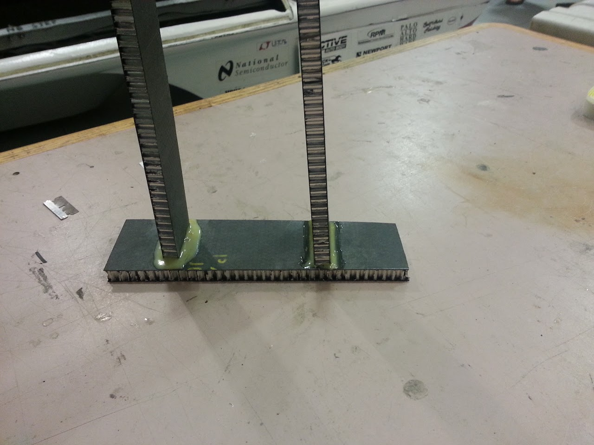
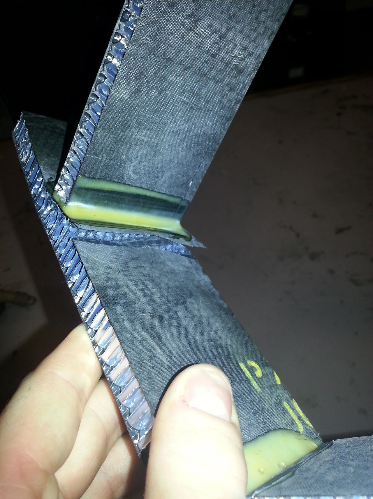
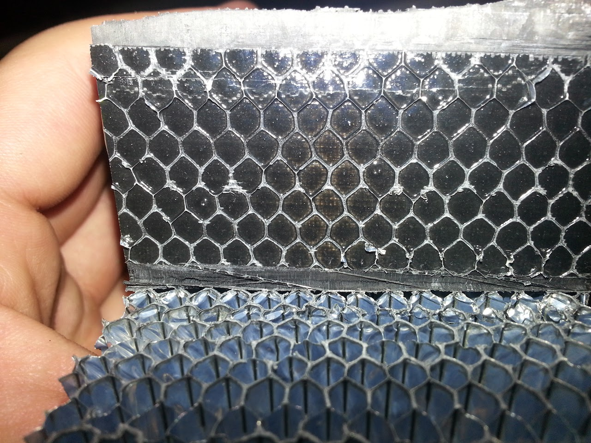
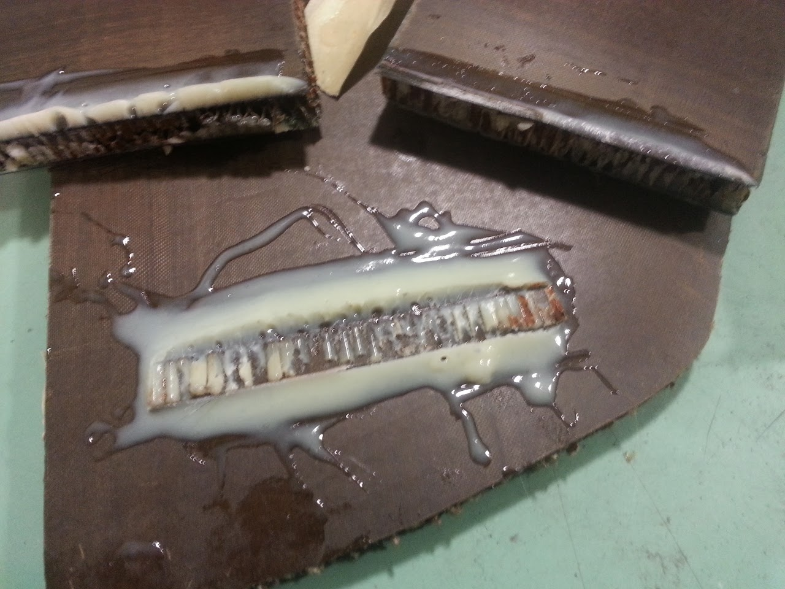

# SSCP - Chassis Panel End Bonding

# Chassis Panel End Bonding

## Xenith Teklam Panel

### Test Setup

### Results

### Analysis 

From the pictures you can see that the failure occurred at the film adhesive aluminum core bond line. Previous aluminum core samples have been phosporic acid etched like the TYE inserts the team the used on Xenith but this core shows no signs of chemical etch. Its possible that over time moisture caused the aluminum to oxidize and the bond to fail. Using nomex core, which is much lighter, for the same area, provides a greater core bond area for the same weight of core. Unfortunately, nomex core is much more sensitive to moisture. 

## Apogee Teklam Panel 

## Test 1

This test failed due to glue mixing problems. Partially used DP package can have occlusions in the nozzle which prevent the ideal mixing ratio. All partially used bottles of DP should be cleared for occlusions before being used again.

