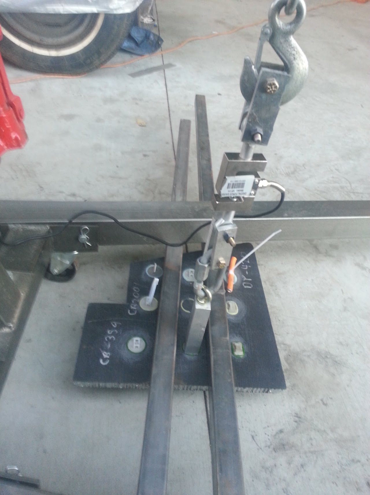

# click-bond-product-testing

## SSCP - Click Bond Product Testing

## Click Bond Product Testing

### Test Description

The click bond products under test were laminated to a 1in Aluminum core uni pannel from Teklam from the Xenith.&#x20;

The products under test were 1.25in 10-32 etched A286 super alloy studs from Click Bond. Three different types of glue were tested, DP-420, Henkel adhesive from Apogee, and a urathane adhesive that came from clickbond.&#x20;

[10-32 etched A286 super alloy studs](http://www.clickbond.com/modules.php?name=Products2\&op=category_view\&categoryid=29)

### Test Fixture

### Results

For the two types of glue tested, the Henkel and DP-420 adhesives both failed in the same way. The ply to ply bond on the carbon on the skin of the chassis panel failed before the either the glue used to bond the studs down failed. This left a carbon film over the bottom of the stud when it was pulled out. The DP-420 was tested without the force sensor, the Henkel adhesive used a force sensor and measured 2500N of force when it failed.

### Suggestions

For mounting any electronics or boxes the pull studs will not fail for any reasonable force and are to be preferred over vhb or velcro.  For applications that are more structural a progressively larger lays of carbon over the top of the insert would spread the shear load on the carbon panel out and increase the strength necessary for it to fail.&#x20;

### Click Bond Products that we have considered in the past

Studs

CS983 for grounding our composite chassis

CN125 - If there are any gluable standoffs with a  female thread with an OD around .280" and height around .1" we could definitely use them to hold down our electronics enclosures. We use these, modified for vibration grommets: http://www.cinch.com/pdfs/5810130065S%20rev%20A.pdf and http://www.laddinc.com/images/stories/drawings/EEC-325X4AB-E016RevA.pdf, and having a way to glue down mounts for these would be awesome.&#x20;

&#x20;

Nuts

CN609 style for testing, for epoxy bonding to carbon fiber

CB6012, for epoxy bonding to carbon fiber

CB6209 with L (sleeve depth) in the .0625" to .125" range, for epoxy bonding to carbon fiber

&#x20;

Cable tie mounts

CM920V5

CM319

&#x20;
