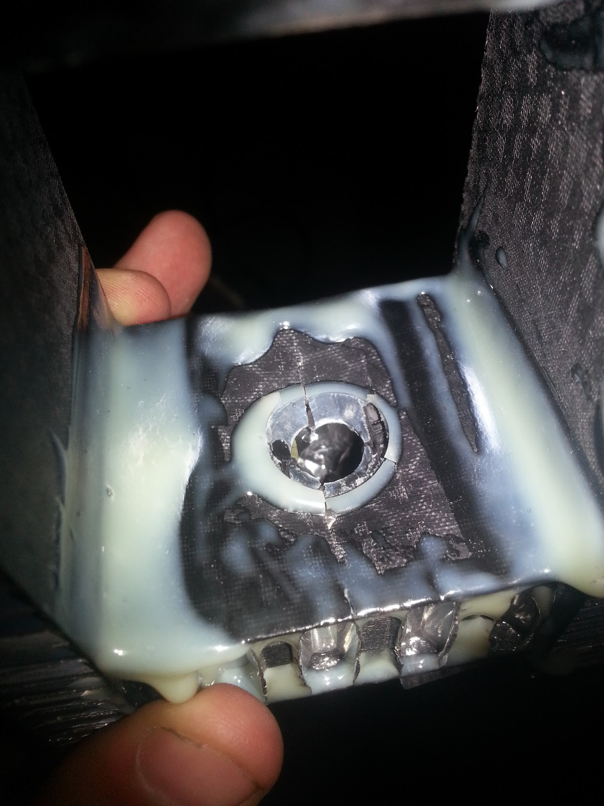

# SSCP - Insert Testing

# Insert Testing

## 10-32 TYE Pull Test

### Test Setup

This test used the engine lift, and two aluminum bars as a lever arm so that the force could be measured with the force sensor which has a maximum rated load of only 1kN. 

### Results

The insert failed at 1klbs of force

Showing the top of the insert which failed when the glue joint from the insert face to the carbon failed. 

Showing blowout of carbon on bottom of of carbon sandwich panel. 

Showing the bent side of the insert that failed and the large crack between the head and shaft of the insert. 

## Analysis

The insert failed because the top glue joint failed in shear to the carbon on the top face failed or the edge between the shank and face of the insert failed. To increase the strength of this laminate an insert with a larger face would be required. 

## TYE 10-32 Shear Testing

### Test Setup

To apply force to the shear bolt two aluminum blocks were placed on either side of the bolt and the assembly was placed in a vice.

### Test Results

### Analysis

Again the failure was in the shear bond to the insert. Unlike the pull test pulling through the actual chassis panel the failure was gradual as pulling the insert through the carbon itself absorbs quite a bit of energy. The take away is that the strength of the insert is entirely dependent on the strength of the glue joint between the face of the insert and the carbon. As the glue joint between the aluminum and the carbon was the element that failed. Increasing the strength would mean using a glue with an increased shear strength or increasing the surface area of the insert head. 

