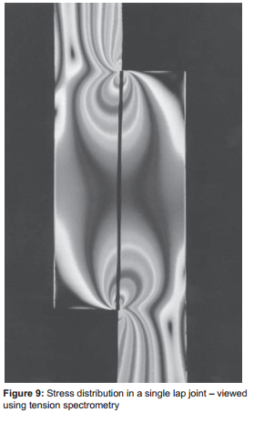
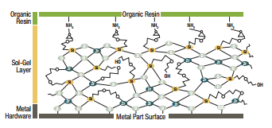
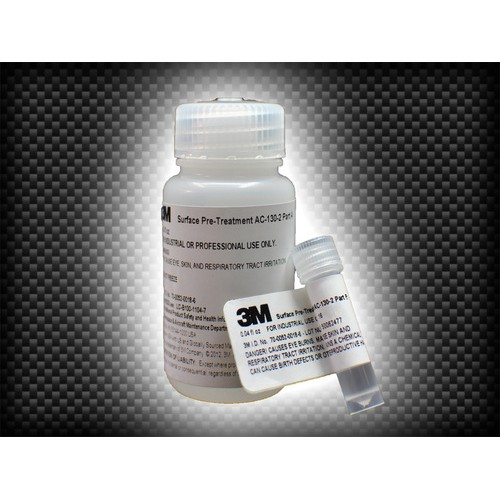
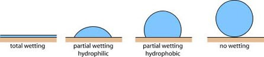
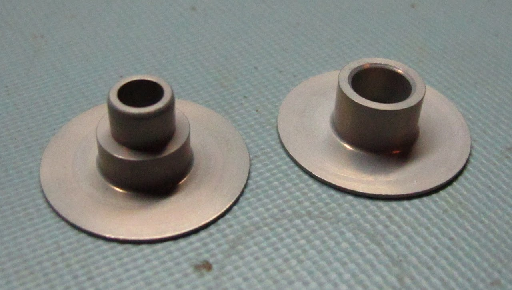
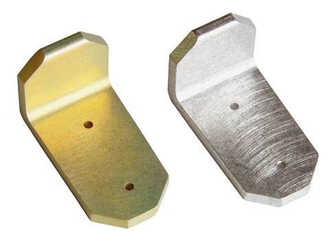

# SSCP - Structural Bonding Guide

# Structural Bonding Guide

## How do I join things?

### Bonding Matrix

This guide covers the bonding of various structural materials with carbon/epoxy matrix components. 

This guide only covers structural bonds - bonds intended to take safety critical high forces, such as those in a suspension, driver restraint, drivetrain, battery, or steering system. Materials omitted from this guide have either not been tested or are not considered to be structural.

For instructions, consult the matrix here:

Matrix Key:

* Epoxy with basic surface prep: see sections 1 and 3 belowEpoxy with advanced surface prep: see sections 1, 2, and 3 belowFlexible CA - use flexible cyanoacrylates such as 3M CA-50 or Loctite 4861Super 77 - Spray adhesive excellent for fabrics and foamsBolts only - ultra-low surface energy plastic extremely difficult to glueAbrade + Soap/water + Epoxy - solvents such as alcohols and acetones will craze/crack acrylics, so only gentle solves can be used to clean the surface before bonding.
* Epoxy with basic surface prep: see sections 1 and 3 below
* Epoxy with advanced surface prep: see sections 1, 2, and 3 below
* Flexible CA - use flexible cyanoacrylates such as 3M CA-50 or Loctite 4861
* Super 77 - Spray adhesive excellent for fabrics and foams
* Bolts only - ultra-low surface energy plastic extremely difficult to glue
* Abrade + Soap/water + Epoxy - solvents such as alcohols and acetones will craze/crack acrylics, so only gentle solves can be used to clean the surface before bonding.

* Epoxy with basic surface prep: see sections 1 and 3 below
* Epoxy with advanced surface prep: see sections 1, 2, and 3 below
* Flexible CA - use flexible cyanoacrylates such as 3M CA-50 or Loctite 4861
* Super 77 - Spray adhesive excellent for fabrics and foams
* Bolts only - ultra-low surface energy plastic extremely difficult to glue
* Abrade + Soap/water + Epoxy - solvents such as alcohols and acetones will craze/crack acrylics, so only gentle solves can be used to clean the surface before bonding.

Epoxy with basic surface prep: see sections 1 and 3 below

Epoxy with advanced surface prep: see sections 1, 2, and 3 below

Flexible CA - use flexible cyanoacrylates such as 3M CA-50 or Loctite 4861

Super 77 - Spray adhesive excellent for fabrics and foams

Bolts only - ultra-low surface energy plastic extremely difficult to glue

Abrade + Soap/water + Epoxy - solvents such as alcohols and acetones will craze/crack acrylics, so only gentle solves can be used to clean the surface before bonding.

## Bonding Chemistry Overview

Epoxy Bonding Theory

Epoxy makes a number of different types of bonds during the curing process. The mechanism that epoxy uses to bond is an area of active research, and varies by material. As relevant to this article, epoxy will bond materials which have high surface energy. If a material does not have high surface energy, then operations are undertaken to increase the surface energy of the material being bonded. In general, the surface energy of a material can be determined with a quick internet search. However, it can also be determined experimentally with a drop of de-ionized water. If the drop beads up, then the 

[ high surface energy](http://en.wikipedia.org/wiki/Surface_energy)

material is low surface energy. If it pulls flat and wets the surface, then the material is high surface energy.

Epoxy normally only makes ionic and Van der Waals bonds with stainless and titanium. Epoxy will not form covalent bonds with Stainless or Titanium. Epoxy will absorb moisture, and the internal stress will crack the bond. The glue joint will "pop" in high moisture. This is very bad, and likely to happen in Darwin.

Epoxy bonds are affected negatively during application and curing by: moisture, oil, dust, grit. Epoxy bonds are affected negatively after curing by moisture, brake fluid, thermal coefficient mismatch.

Most surface preparation compounds provide an interface layer to which epoxy can covalently bond. AC-130 (a Sol-gel), phosphoric acid anodizing, and chromate conversion conversion coatings are all examples of coatings that use this principle. See the image to the right for some chemistry!

History of Aluminum Bonding at SSCP

Traditionally, SSCP has abraded the aluminum oxide layer off of aluminum, used MEK to remove sanding particles, and then glued to this. This works fine, but under humidity/water the oxide layer will creep back under the bond surface and cause the glue joint to crack/fail. This happened with glue joints on Apogee after 2-3 years. In particular, Apogee's door fell off in the prep for ASC 2010.

For Xenith, we used two different operations, phosphoric acid anodizing and West 860. Phosphoric acid anodizing, defined by a number of different military specs, is used by many manufacturers to provide a very strong, stable bonding surface. If a part has been phosphoric acid anodized, simply MEK the bonding surface, apply structural epoxy, install the part, and allow to cure. See "Alternative methods for surface preparation" below for engineering callout. West 860 is a two part chromic acid conversion coating. Step one chemically cleans the surface, Step 2 is chromic acid, which etches the surface and places chromium atoms inside the oxide layer, creating a "chromated primer surface." This allows the epoxy to covalently bond to the surface, forming a very strong bond. This is great, except for chromic acid is highly toxic/carcinogen, and cannot be disposed of easily. This is why we're switching to the below solution:

Warning: Normal aluminum anodizing is sulfuric acid based and can not be used on structurally bonded parts. (Handbook of Aluminum Bonding Technology and Data, Page 94)

Bonding Instructions

### Required Materials for Bonding Aluminum/Stainless/Titanium

* Clean work surface free of dust, oils, and waterNitrile glovesAC-130-2 Metal Surface Preparation, available from 3M or online suppliers3M Scotchbrite pads (clean) or grit blasting equipment (180 grit aluminum oxide, relatively clean)De-ionized water and clean De-ionized water sprayerMEK/AcetoneLint-free cloth and/or clean air sourceBrand new foam brushEW5000 AS epoxy primer (Optional, not needed if bonding within 24 hours of ac-130 application and in low humidity environment. Store in refrigerator (DO NOT FREEZE, 35-45 F)DP420, DP460, or equivalent Henkel Product Structural EpoxyCheck Pack-n-Tape for competitive prices on 3M products. Krayden has Henkel products, but they don't always have them in stock. Most other options will either have longer lead times or worse prices than these options. 3M and Henkel Sponsorships can take 4 - 7+ months to process, so start requesting product in January or Febuary after the race. If you start in the summer it will be too late.
* Clean work surface free of dust, oils, and water
* Nitrile gloves
* AC-130-2 Metal Surface Preparation, available from 3M or online suppliers
* 3M Scotchbrite pads (clean) or grit blasting equipment (180 grit aluminum oxide, relatively clean)
* De-ionized water and clean De-ionized water sprayer
* MEK/Acetone
* Lint-free cloth and/or clean air source
* Brand new foam brush
* EW5000 AS epoxy primer (Optional, not needed if bonding within 24 hours of ac-130 application and in low humidity environment. Store in refrigerator (DO NOT FREEZE, 35-45 F)
* DP420, DP460, or equivalent Henkel Product Structural EpoxyCheck Pack-n-Tape for competitive prices on 3M products. Krayden has Henkel products, but they don't always have them in stock. Most other options will either have longer lead times or worse prices than these options. 3M and Henkel Sponsorships can take 4 - 7+ months to process, so start requesting product in January or Febuary after the race. If you start in the summer it will be too late.
* Check Pack-n-Tape for competitive prices on 3M products. Krayden has Henkel products, but they don't always have them in stock. Most other options will either have longer lead times or worse prices than these options. 3M and Henkel Sponsorships can take 4 - 7+ months to process, so start requesting product in January or Febuary after the race. If you start in the summer it will be too late.

* Clean work surface free of dust, oils, and water
* Nitrile gloves
* AC-130-2 Metal Surface Preparation, available from 3M or online suppliers
* 3M Scotchbrite pads (clean) or grit blasting equipment (180 grit aluminum oxide, relatively clean)
* De-ionized water and clean De-ionized water sprayer
* MEK/Acetone
* Lint-free cloth and/or clean air source
* Brand new foam brush
* EW5000 AS epoxy primer (Optional, not needed if bonding within 24 hours of ac-130 application and in low humidity environment. Store in refrigerator (DO NOT FREEZE, 35-45 F)
* DP420, DP460, or equivalent Henkel Product Structural EpoxyCheck Pack-n-Tape for competitive prices on 3M products. Krayden has Henkel products, but they don't always have them in stock. Most other options will either have longer lead times or worse prices than these options. 3M and Henkel Sponsorships can take 4 - 7+ months to process, so start requesting product in January or Febuary after the race. If you start in the summer it will be too late.
* Check Pack-n-Tape for competitive prices on 3M products. Krayden has Henkel products, but they don't always have them in stock. Most other options will either have longer lead times or worse prices than these options. 3M and Henkel Sponsorships can take 4 - 7+ months to process, so start requesting product in January or Febuary after the race. If you start in the summer it will be too late.

Clean work surface free of dust, oils, and water

Nitrile gloves

AC-130-2 Metal Surface Preparation, available from 3M or online suppliers

3M Scotchbrite pads (clean) or grit blasting equipment (180 grit aluminum oxide, relatively clean)

De-ionized water and clean De-ionized water sprayer

MEK/Acetone

Lint-free cloth and/or clean air source

Brand new foam brush

EW5000 AS epoxy primer (Optional, not needed if bonding within 24 hours of ac-130 application and in low humidity environment. Store in refrigerator (DO NOT FREEZE, 35-45 F)

DP420, DP460, or equivalent Henkel Product Structural Epoxy

* Check Pack-n-Tape for competitive prices on 3M products. Krayden has Henkel products, but they don't always have them in stock. Most other options will either have longer lead times or worse prices than these options. 3M and Henkel Sponsorships can take 4 - 7+ months to process, so start requesting product in January or Febuary after the race. If you start in the summer it will be too late.

Check Pack-n-Tape for competitive prices on 3M products. Krayden has Henkel products, but they don't always have them in stock. Most other options will either have longer lead times or worse prices than these options. 3M and Henkel Sponsorships can take 4 - 7+ months to process, so start requesting product in January or Febuary after the race. If you start in the summer it will be too late.

[ Pack-n-Tape](https://3m.pack-n-tape.com/home.php)

[ Krayden](http://krayden.com/)

### Required Materials for Bonding Carbon/Fiberglass/Torlon/Ultem

* Clean work surface free of dust, oils, and waterNitrile gloves3M Scotchbrite pads (clean) or grit blasting equipment (180 grit aluminum oxide, relatively clean)MEK/AcetoneLint-free cloth and/or clean air sourceDP420, DP460, or equivalent Henkel Product Structural EpoxyCheck Pack-n-Tape for competitive prices on 3M products. Krayden has Henkel products, but they don't always have them in stock. Most other options will either have longer lead times or worse prices than these options. 3M and Henkel Sponsorships can take 4 - 7+ months to process, so start requesting product in January or Febuary after the race. If you start in the summer it will be too late.
* Clean work surface free of dust, oils, and water
* Nitrile gloves
* 3M Scotchbrite pads (clean) or grit blasting equipment (180 grit aluminum oxide, relatively clean)
* MEK/Acetone
* Lint-free cloth and/or clean air source
* DP420, DP460, or equivalent Henkel Product Structural EpoxyCheck Pack-n-Tape for competitive prices on 3M products. Krayden has Henkel products, but they don't always have them in stock. Most other options will either have longer lead times or worse prices than these options. 3M and Henkel Sponsorships can take 4 - 7+ months to process, so start requesting product in January or Febuary after the race. If you start in the summer it will be too late.
* Check Pack-n-Tape for competitive prices on 3M products. Krayden has Henkel products, but they don't always have them in stock. Most other options will either have longer lead times or worse prices than these options. 3M and Henkel Sponsorships can take 4 - 7+ months to process, so start requesting product in January or Febuary after the race. If you start in the summer it will be too late.

* Clean work surface free of dust, oils, and water
* Nitrile gloves
* 3M Scotchbrite pads (clean) or grit blasting equipment (180 grit aluminum oxide, relatively clean)
* MEK/Acetone
* Lint-free cloth and/or clean air source
* DP420, DP460, or equivalent Henkel Product Structural EpoxyCheck Pack-n-Tape for competitive prices on 3M products. Krayden has Henkel products, but they don't always have them in stock. Most other options will either have longer lead times or worse prices than these options. 3M and Henkel Sponsorships can take 4 - 7+ months to process, so start requesting product in January or Febuary after the race. If you start in the summer it will be too late.
* Check Pack-n-Tape for competitive prices on 3M products. Krayden has Henkel products, but they don't always have them in stock. Most other options will either have longer lead times or worse prices than these options. 3M and Henkel Sponsorships can take 4 - 7+ months to process, so start requesting product in January or Febuary after the race. If you start in the summer it will be too late.

Clean work surface free of dust, oils, and water

Nitrile gloves

3M Scotchbrite pads (clean) or grit blasting equipment (180 grit aluminum oxide, relatively clean)

MEK/Acetone

Lint-free cloth and/or clean air source

DP420, DP460, or equivalent Henkel Product Structural Epoxy

* Check Pack-n-Tape for competitive prices on 3M products. Krayden has Henkel products, but they don't always have them in stock. Most other options will either have longer lead times or worse prices than these options. 3M and Henkel Sponsorships can take 4 - 7+ months to process, so start requesting product in January or Febuary after the race. If you start in the summer it will be too late.

Check Pack-n-Tape for competitive prices on 3M products. Krayden has Henkel products, but they don't always have them in stock. Most other options will either have longer lead times or worse prices than these options. 3M and Henkel Sponsorships can take 4 - 7+ months to process, so start requesting product in January or Febuary after the race. If you start in the summer it will be too late.

[Pack-n-Tape](https://3m.pack-n-tape.com/home.php)

[Krayden](http://krayden.com/)

### Instructions

Section 1: Basic Surface Preparation For Carbon/Epoxy/Torlon/Ultem/High Surface Energy Plastics Surfaces:

* Acetone Wipe
* Acetone Wipe

1. Acetone Wipe

Acetone Wipe

1. Abrade with 180 grit sand paper or scotchbrite. See this image to find out how different abrasion techniques affect bonding strength.
2. Acetone Wipe with Lint-Free Cloth
3. DO NOT TOUCH AFTER LAST SOLVENT WIPE
4. Bond as soon as possible. Re-cleaning is required if anyone touches the surface with their bare skin or contaminated gloves.

Abrade with 180 grit sand paper or scotchbrite. See this image to find out how different abrasion techniques affect bonding strength.

Acetone Wipe with Lint-Free Cloth

DO NOT TOUCH AFTER LAST SOLVENT WIPE

Bond as soon as possible. Re-cleaning is required if anyone touches the surface with their bare skin or contaminated gloves.

Section 2: Advanced Surface Preparation for Stainless Steel, Aluminum, Titanium Surfaces only (Not steel, brass, copper, carbon fiber)

1. Clear a work area, put on gloves
2. MEK Wipe with lint-free cloth
3. Abrade with scotchbrite, sandpaper, or 180 grit aluminum oxide blast until water doesn't bead up on the surface. EXAMPLE VIDEO. This means that water droplets will pull flat. See the image below. A single drop of water should wet most of the surface like the left-most example in the image below. Take this step seriously - removal of the oxide is critical for the following steps to work. Remember the oxide will re-form in 30 minutes, less if the ambient temperature is high.

Clear a work area, put on gloves

MEK Wipe with lint-free cloth

Abrade with scotchbrite, sandpaper, or 180 grit aluminum oxide blast until water doesn't bead up on the surface. EXAMPLE VIDEO. This means that water droplets will pull flat. See the image below. A single drop of water should wet most of the surface like the left-most example in the image below. Take this step seriously - removal of the oxide is critical for the following steps to work. Remember the oxide will re-form in 30 minutes, less if the ambient temperature is high.

[ EXAMPLE VIDEO.](https://youtu.be/x7onZGqrYyY?t=442)

### Embedded Content

Embedded content: [Custom embed]()

<iframe width="100%" height="400" src="" frameborder="0"></iframe>

1.  
2. Scrub off the sand with a clean foam brush
3. Clean with De-ionized waterBlow off excess water with clean, dry air
4. Blow off excess water with clean, dry air
5. If bonding aluminum, apply AC-130 within 30 Minutes - the oxide layer will otherwise reform

 

Scrub off the sand with a clean foam brush

Clean with De-ionized water

1. Blow off excess water with clean, dry air

Blow off excess water with clean, dry air

If bonding aluminum, apply AC-130 within 30 Minutes - the oxide layer will otherwise reform

* Mix AC-130 in a polypropylene container with a 50:1 by volume mix ratio, parts A:BBefore applying AC-130, verify that liquids do not bead up on the surface with a couple drops of De-ionized water. Air-blast this water off.
* Mix AC-130 in a polypropylene container with a 50:1 by volume mix ratio, parts A:B
* Before applying AC-130, verify that liquids do not bead up on the surface with a couple drops of De-ionized water. Air-blast this water off.

1. Mix AC-130 in a polypropylene container with a 50:1 by volume mix ratio, parts A:B
2. Before applying AC-130, verify that liquids do not bead up on the surface with a couple drops of De-ionized water. Air-blast this water off.

Mix AC-130 in a polypropylene container with a 50:1 by volume mix ratio, parts A:B

Before applying AC-130, verify that liquids do not bead up on the surface with a couple drops of De-ionized water. Air-blast this water off.

1. Apply AC-130-2 following AC-130-2 instructions ( brush on with new brush, make sure that every surface is drenched for at least 1 minute)
2. Hang up to drain for 5-6 minutes
3. Blow off excess with air
4. Allow to dry (60 min or more at room temperature, more if colder, less if warmer)
5. DO NOT TOUCH AC-130 SURFACE AFTER DRYING!!!!!
6. Bond within 24 hours of applying AC-130 and drying OR apply Epoxy primer EW5000 AS:

Apply AC-130-2 following AC-130-2 instructions ( brush on with new brush, make sure that every surface is drenched for at least 1 minute)

Hang up to drain for 5-6 minutes

Blow off excess with air

Allow to dry (60 min or more at room temperature, more if colder, less if warmer)

DO NOT TOUCH AC-130 SURFACE AFTER DRYING!!!!!

Bond within 24 hours of applying AC-130 and drying OR apply Epoxy primer EW5000 AS:

* Datasheet: EW5000ASStir EW5000AS very well - several minutes with a stirring stickApply EW5000AS with a brush or spray. See 3M datasheet for spray tips.Cure EW5000AS30 minutes in Room Temp Air60 Minutes at (121 +/- 3C)You're done!
* Datasheet: EW5000AS
* Stir EW5000AS very well - several minutes with a stirring stick
* Apply EW5000AS with a brush or spray. See 3M datasheet for spray tips.
* Cure EW5000AS30 minutes in Room Temp Air60 Minutes at (121 +/- 3C)
* 30 minutes in Room Temp Air
* 60 Minutes at (121 +/- 3C)
* You're done!

1. Datasheet: EW5000AS
2. Stir EW5000AS very well - several minutes with a stirring stick
3. Apply EW5000AS with a brush or spray. See 3M datasheet for spray tips.
4. Cure EW5000AS30 minutes in Room Temp Air60 Minutes at (121 +/- 3C)
5. 30 minutes in Room Temp Air
6. 60 Minutes at (121 +/- 3C)
7. You're done!

Datasheet: EW5000AS

[ EW5000AS](http://multimedia.3m.com/mws/mediawebserver?mwsId=SSSSSufSevTsZxtUmY_Ul8tBevUqevTSevTSevTSeSSSSSS--&fn=TDS_EW5000AS.pdf)

Stir EW5000AS very well - several minutes with a stirring stick

Apply EW5000AS with a brush or spray. See 3M datasheet for spray tips.

Cure EW5000AS

1. 30 minutes in Room Temp Air
2. 60 Minutes at (121 +/- 3C)

30 minutes in Room Temp Air

60 Minutes at (121 +/- 3C)

You're done!

Section 3: Standard Bonding Instructions for both Section I and Section II

* If EW5000 AS has been applied some time ago, then lightly wipe the bonding surface with MEK. Otherwise, skip this step.Apply structural epoxy to both surfaces.3M DP-460NS for applications where sag is important3M DP-460 for the strongest bond3M DP-420 for a fast work time3M DP-105 for a flexible bond and high peel force applicationsHeat-cure epoxy film ahesive for surface laminationWest 105 or Rhino Epoxy for non-heatable surface laminationCure under heat, preferring 3 hrs at 49C for maximum strength, not exceeding 135C. Joints must be fixtured during heating, as heated air bubbles can cause movement of parts.
* If EW5000 AS has been applied some time ago, then lightly wipe the bonding surface with MEK. Otherwise, skip this step.
* Apply structural epoxy to both surfaces.3M DP-460NS for applications where sag is important3M DP-460 for the strongest bond3M DP-420 for a fast work time3M DP-105 for a flexible bond and high peel force applicationsHeat-cure epoxy film ahesive for surface laminationWest 105 or Rhino Epoxy for non-heatable surface lamination
* 3M DP-460NS for applications where sag is important
* 3M DP-460 for the strongest bond
* 3M DP-420 for a fast work time
* 3M DP-105 for a flexible bond and high peel force applications
* Heat-cure epoxy film ahesive for surface lamination
* West 105 or Rhino Epoxy for non-heatable surface lamination
* Cure under heat, preferring 3 hrs at 49C for maximum strength, not exceeding 135C. Joints must be fixtured during heating, as heated air bubbles can cause movement of parts.

1. If EW5000 AS has been applied some time ago, then lightly wipe the bonding surface with MEK. Otherwise, skip this step.
2. Apply structural epoxy to both surfaces.3M DP-460NS for applications where sag is important3M DP-460 for the strongest bond3M DP-420 for a fast work time3M DP-105 for a flexible bond and high peel force applicationsHeat-cure epoxy film ahesive for surface laminationWest 105 or Rhino Epoxy for non-heatable surface lamination
3. 3M DP-460NS for applications where sag is important
4. 3M DP-460 for the strongest bond
5. 3M DP-420 for a fast work time
6. 3M DP-105 for a flexible bond and high peel force applications
7. Heat-cure epoxy film ahesive for surface lamination
8. West 105 or Rhino Epoxy for non-heatable surface lamination
9. Cure under heat, preferring 3 hrs at 49C for maximum strength, not exceeding 135C. Joints must be fixtured during heating, as heated air bubbles can cause movement of parts.

If EW5000 AS has been applied some time ago, then lightly wipe the bonding surface with MEK. Otherwise, skip this step.

Apply structural epoxy to both surfaces.

1. 3M DP-460NS for applications where sag is important
2. 3M DP-460 for the strongest bond
3. 3M DP-420 for a fast work time
4. 3M DP-105 for a flexible bond and high peel force applications
5. Heat-cure epoxy film ahesive for surface lamination
6. West 105 or Rhino Epoxy for non-heatable surface lamination

3M DP-460NS for applications where sag is important

3M DP-460 for the strongest bond

3M DP-420 for a fast work time

3M DP-105 for a flexible bond and high peel force applications

Heat-cure epoxy film ahesive for surface lamination

West 105 or Rhino Epoxy for non-heatable surface lamination

Cure under heat, preferring 3 hrs at 49C for maximum strength, not exceeding 135C. Joints must be fixtured during heating, as heated air bubbles can cause movement of parts.

## Alternative Methods for Surface Preparation for Aluminum

There are a number of industry accepted methods for structural bonding of aluminum. "Section 2 Advanced Surface Prep" is the recommended practice for SSCP because of its low toxicity and ease of scheduling/coating. However, if there is more time available, then other techniques can be used. These are listed below.

### Chromic Acid Anodizing

Chromic Acid Anodizing is an an adequate substitute to the below process. It was used by TYE on the aluminum inserts for Xenith. If a part has been chromic acid anodized, simply IPA/MEK the bonding surface, apply structural epoxy, install the part, and allow to cure. Chromic acid anodizing makes excellent bonds but does not provide excellent corrosion protection like Alodine. This process is generally preferable for alloys with high magnesium content versus Alodine. If you want a part to be anodized with the proper materials for a strong, stable bonding surface, put this in the coating callout in the engineering drawing: ANODIZE PER MIL-A-8625 TYPE I, CLASS 1.

Note: this paragraph formerly recommended phosphoric acid anodizing, but listed the wrong specification. The datasheet for Xenith's inserts (TYE102 series aluminum) indicates that the inserts were actually chromic acid anodized, not phosphoric. Phosphoric acid anodizing was recommended by 3M as a surface prep method with a good shelf life (as apposed to AC130). If you still want to use phosphoric acid anodizing, reference the BAC5555 or ASTM D3933-98 standards.

[BAC5555 or ASTM D3933-98](http://www.finishing.com/4200-4399/4379.shtml)

### Alodine Type III and VI

Alodine is a surface coating process developed for aerospace that etches away the oxide coating on aluminum and replaces it with a chromated oxide. Epoxy and other adhesives will covalently bond to the chromium atoms, forming an excellent bond. This class of coatings also provides excellent corrosion protection against moisture and salt and is extremely thin, hence its extensive use on aircraft. Hexavalent chromate coatings leave parts with a gold coating. Hexavalent chromium is a known carcinogen and should be avoided - this coating is being phased out worldwide. Trivalent or "clear" alodine is much less toxic the accepted technique. In order to have this coating applied to a part, put the callout: "ALODINE PER MIL-DTL-5541 Type II Class 3" on the engineering drawing. This technique has not been used on any Stanford solar car for structural bonding so should be tested before use. However, this coating is commonly used on aircraft for structural bonding. 

[ much less toxic](http://www.epa.gov/iris/toxreviews/0028tr.pdf)

The same coating is available in stick form for easy application from Henkel: Alodine® 871™Touch-N-Prep® Coating. If the link breaks, the pdf is attached to this page. This product also has not been tested, but might be an excellent way of doing field repairs of structural bonds.

[Alodine® 871™Touch-N-Prep® Coating](http://henk0008.home.xs4all.nl/Alodine/Alodine_871_Brochure.pdf)

## References

### Reading Material

Handbook of Aluminum Bonding and Data, J. D. Minford

Papers by Kay Blohowiak are good reading on bonding stainless:

Read this paper: http://www.asetsdefense.org/documents/Workshops/SURF-FIN-TempeAZ-02-08/Briefings/Blohowiak-SERDP-ESTCP_Surface_Prep_for_Adhesive_Bonding-2-08.pdf

and this one: http://www.dtic.mil/dtic/tr/fulltext/u2/a448095.pdf

### Contact with questions about AC130:

David W. Jordan | Product Specialist

3M Aerospace and Aircraft Maintenance Division

3M Garden Grove, 7341 Anaconda Ave | Garden Grove, CA 92841

Office: 714 373 2837 ext 115 | Mobile: 818 253 6336

[714 373 2837 ext 115](tel:714%20373%202837%20ext%20115)

[818 253 6336](tel:818%20253%206336)

dwjordan@mmm.com | www.3M.com/aerospacesealants

[dwjordan@mmm.com](mailto:dwjordan@mmm.com)

[www.3M.com/aerospacesealants](http://www.3m.com/aerospacesealants)

### Embedded Google Drive File

Google Drive File: [Embedded Content](https://drive.google.com/embeddedfolderview?id=1DONzoNMF2dlBgVNzUc9IpmIIRQVBTDFl#list)

<iframe width="100%" height="400" src="https://drive.google.com/embeddedfolderview?id=1DONzoNMF2dlBgVNzUc9IpmIIRQVBTDFl#list" frameborder="0"></iframe>

