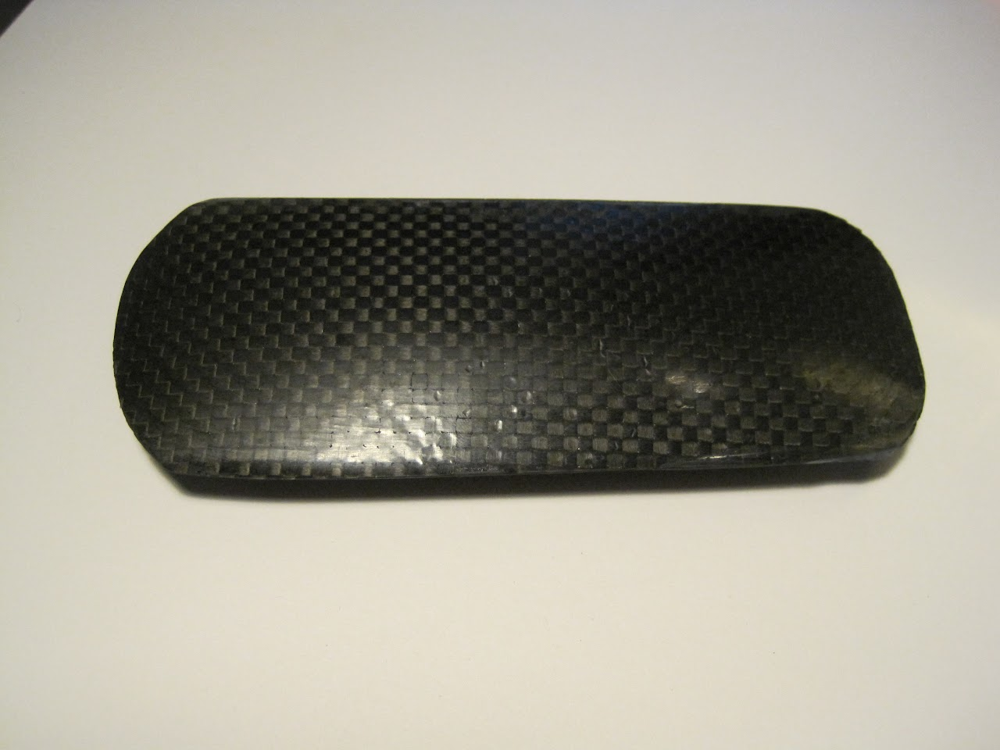
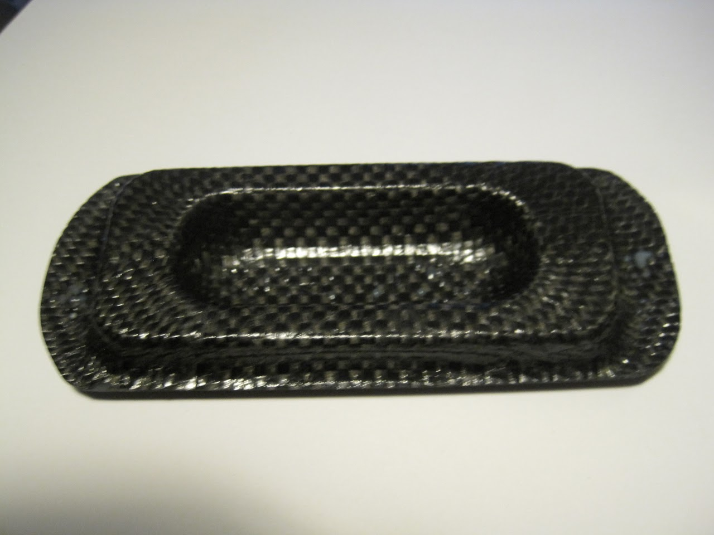
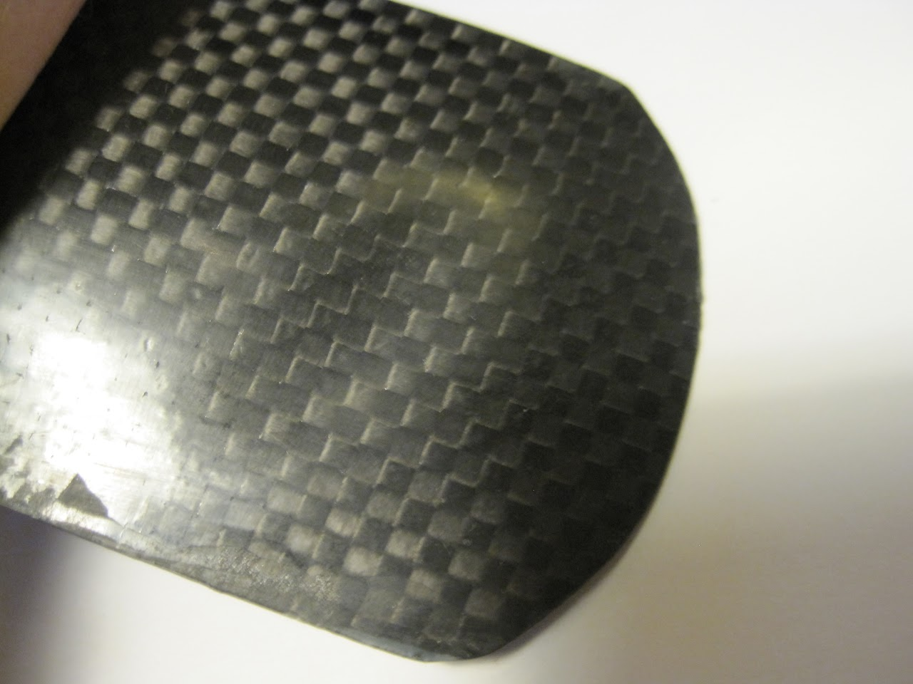

# SSCP - Sunbad Chassis

# Sunbad Chassis

e

## Cad Concepts

### Concept 1

Goals

* Create a chassis that could be made in a separate mold that used no preformed chassis panelDesign the area where the suspension mounts such that all suspension inserts would be loaded in shear. Eliminate the need for core by designing a structure where the geometry provides stiffness Eliminate the need for a roll bar
* Create a chassis that could be made in a separate mold that used no preformed chassis panel
* Design the area where the suspension mounts such that all suspension inserts would be loaded in shear. 
* Eliminate the need for core by designing a structure where the geometry provides stiffness 
* Eliminate the need for a roll bar

* Create a chassis that could be made in a separate mold that used no preformed chassis panel
* Design the area where the suspension mounts such that all suspension inserts would be loaded in shear. 
* Eliminate the need for core by designing a structure where the geometry provides stiffness 
* Eliminate the need for a roll bar

Create a chassis that could be made in a separate mold that used no preformed chassis panel

Design the area where the suspension mounts such that all suspension inserts would be loaded in shear. 

Eliminate the need for core by designing a structure where the geometry provides stiffness 

Eliminate the need for a roll bar

Problems

* The A arms have to be designed asymmetrically such that all the compressive loads go to the outside part of the a armsthe inside section of the a arm mounts will be weak to in plane forces if core is not usedmolding the U requires more laying of carbon around curves which is more complicated because the edges have to be cutMaking a chassis without core is theoretically less good than making a chassis with core
* The A arms have to be designed asymmetrically such that all the compressive loads go to the outside part of the a arms
* the inside section of the a arm mounts will be weak to in plane forces if core is not used
* molding the U requires more laying of carbon around curves which is more complicated because the edges have to be cut
* Making a chassis without core is theoretically less good than making a chassis with core

* The A arms have to be designed asymmetrically such that all the compressive loads go to the outside part of the a arms
* the inside section of the a arm mounts will be weak to in plane forces if core is not used
* molding the U requires more laying of carbon around curves which is more complicated because the edges have to be cut
* Making a chassis without core is theoretically less good than making a chassis with core

The A arms have to be designed asymmetrically such that all the compressive loads go to the outside part of the a arms

the inside section of the a arm mounts will be weak to in plane forces if core is not used

molding the U requires more laying of carbon around curves which is more complicated because the edges have to be cut

Making a chassis without core is theoretically less good than making a chassis with core

### Concept 2

Goals

* Use core to provide stiffness instead of geometry in an effort to make a stiffer lighter carincorporate the same dece rollbar design as concept 1use a more simple geometry that is easier to actually make
* Use core to provide stiffness instead of geometry in an effort to make a stiffer lighter car
* incorporate the same dece rollbar design as concept 1
* use a more simple geometry that is easier to actually make

* Use core to provide stiffness instead of geometry in an effort to make a stiffer lighter car
* incorporate the same dece rollbar design as concept 1
* use a more simple geometry that is easier to actually make

Use core to provide stiffness instead of geometry in an effort to make a stiffer lighter car

incorporate the same dece rollbar design as concept 1

use a more simple geometry that is easier to actually make

Problems encountered

* The design relies on the stiffness of the core in the box beam for strength which to work requires the core to be contiguousThis presents a great challenge in gluing the chassis to the bottom shell which comes out of a different moldOne option is to glue the chassis to the completed bottom shell and mold both after the come out of the moldSince the core is not contiguous for the bottom panel any loads will be transferred into the shearing the bond between the top layer of carbon and core which is not ideal
* The design relies on the stiffness of the core in the box beam for strength which to work requires the core to be contiguousThis presents a great challenge in gluing the chassis to the bottom shell which comes out of a different moldOne option is to glue the chassis to the completed bottom shell and mold both after the come out of the moldSince the core is not contiguous for the bottom panel any loads will be transferred into the shearing the bond between the top layer of carbon and core which is not ideal
* This presents a great challenge in gluing the chassis to the bottom shell which comes out of a different moldOne option is to glue the chassis to the completed bottom shell and mold both after the come out of the moldSince the core is not contiguous for the bottom panel any loads will be transferred into the shearing the bond between the top layer of carbon and core which is not ideal
* One option is to glue the chassis to the completed bottom shell and mold both after the come out of the mold
* Since the core is not contiguous for the bottom panel any loads will be transferred into the shearing the bond between the top layer of carbon and core which is not ideal

* The design relies on the stiffness of the core in the box beam for strength which to work requires the core to be contiguousThis presents a great challenge in gluing the chassis to the bottom shell which comes out of a different moldOne option is to glue the chassis to the completed bottom shell and mold both after the come out of the moldSince the core is not contiguous for the bottom panel any loads will be transferred into the shearing the bond between the top layer of carbon and core which is not ideal
* This presents a great challenge in gluing the chassis to the bottom shell which comes out of a different moldOne option is to glue the chassis to the completed bottom shell and mold both after the come out of the moldSince the core is not contiguous for the bottom panel any loads will be transferred into the shearing the bond between the top layer of carbon and core which is not ideal
* One option is to glue the chassis to the completed bottom shell and mold both after the come out of the mold
* Since the core is not contiguous for the bottom panel any loads will be transferred into the shearing the bond between the top layer of carbon and core which is not ideal

The design relies on the stiffness of the core in the box beam for strength which to work requires the core to be contiguous

* This presents a great challenge in gluing the chassis to the bottom shell which comes out of a different moldOne option is to glue the chassis to the completed bottom shell and mold both after the come out of the moldSince the core is not contiguous for the bottom panel any loads will be transferred into the shearing the bond between the top layer of carbon and core which is not ideal
* One option is to glue the chassis to the completed bottom shell and mold both after the come out of the mold
* Since the core is not contiguous for the bottom panel any loads will be transferred into the shearing the bond between the top layer of carbon and core which is not ideal

This presents a great challenge in gluing the chassis to the bottom shell which comes out of a different mold

* One option is to glue the chassis to the completed bottom shell and mold both after the come out of the mold
* Since the core is not contiguous for the bottom panel any loads will be transferred into the shearing the bond between the top layer of carbon and core which is not ideal

One option is to glue the chassis to the completed bottom shell and mold both after the come out of the mold

Since the core is not contiguous for the bottom panel any loads will be transferred into the shearing the bond between the top layer of carbon and core which is not ideal

## Carbon Prototypes

### Tub Concept 1

Picture shows collapsing under front u beam under bending of the chassis

### Final Concept

## Manufacturing Techniques

### Chassis Panel

The chassis panel tequnique is the traditional one used by our team and most other American teams.

### Tub Mold

This tequnique required a third mold. 

### Dual Sided CNC Foam

Contact Scale 

## Chassis Panel Selection

## Sunbad Chassis Panels

### Embedded Content

Embedded content: [Custom embed]()

<iframe width="100%" height="400" src="" frameborder="0"></iframe>

### Panel Tolerences

### Embedded Content

Embedded content: [Embedded Content]()

<iframe width="100%" height="400" src="" frameborder="0"></iframe>

## Chassis Offset Analysis

### Embedded Content

Embedded content: [Embedded Content]()

<iframe width="100%" height="400" src="" frameborder="0"></iframe>

## Modeling Strategies

## Crash Safety Calculations 

### Relevant Panel Properties

### Frontal Impact

### Rear Impact

### Side Impact    

### Embedded Google Drive File

Google Drive File: [Embedded Content](https://drive.google.com/embeddedfolderview?id=1f9-BesU_q01J9TLCyYUKinUpB57t2HFN#list)

<iframe width="100%" height="400" src="https://drive.google.com/embeddedfolderview?id=1f9-BesU_q01J9TLCyYUKinUpB57t2HFN#list" frameborder="0"></iframe>

