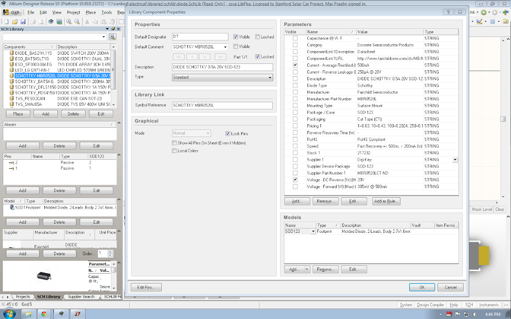

# component-library-style-guide

## SSCP - Component library style guide

## Component library style guide

### Schematic symbols

Schematic symbols are the logical definition of a component, providing pin names and functions. Much like the code readability that we value so much here at Google, it's important to standardize on design styles. Consistent style makes it easier to read schematics, find mistakes, do bringup, and communicate intent to a technician. Some of these goals are somewhat at odds with one another, and so it's important to balance our interests as a design team.

Naming and organization

One of the major benefits of shared libraries is to encourage parts reuse within a group. Organizing the component symbols by category and naming (where name is really "symbol\_reference") them first by function and then by manufacturer part number helps encourage reuse by making it easier to find relevant components. For example, naming an IC "LT3010" is less useful than naming it "LDO\_LT3010". Similarly, naming something "AD8548" is less useful than naming it "OPAMP\_AD8548".

Please untick "Visible" and clear the field for "Default comment". This field replaces the description in the BOM and is super annoying, especially since by default when empty Altium uses the first parameter in the parameter table for this field ("\*").

For polarized two-pin devices, pin 1 is the forward-biased most-positive pin. This means anodes are pin 1 for diodes.

Templates

Many schematic classes have a few templates already provided. The goal is to use the template to provide consistent artwork and pin numbering between many components of a class. For example, capacitors have four templates providing all combinations of polarized/unpolarized and automotive/non-automotive. Copy and paste the schematic symbol from the template in to your newly created component.

Pin spacing

Component pins should be centered on multiple-of-10 unit grid coordinates. Pins should be spaced on a 20-unit grid wherever possible. This enables the designer to put passives between IC pins without ugly routing.

Pin numbering

Pins should be numbered in a consistent manner between the datasheet, the schematic, and the footprint. This enables easier debugging and communication. For a component with n pins, please designate any exposed tabs on the bottom of the component as {n + 1, n + 2, ...} rather than 0. This is useful because some components have two or even three bottom-side exposed pads that are often not on the same electrical net.

Pin ordering and placement

My (Sasha) personal religion says that symbols should exactly match the part's physical layout whenever possible. Fundamentally 3D components are obviously impossible to represent in a 2D editor, but there should be very few cases where a nearly 1:1 mapping is unreasonable.

This can sometimes be a minor nuisance for the designer or the review team, but is usually very beneficial when doing bench bringup and debugging. It also helps when trying to find pin-compatible replacement parts when previously designed-in components inevitably go out of stock.

Pin function labels

Please label all pins as passive. It's really annoying to have Altium creating massive piles of complaints while compiling schematics. In this era of multi-use pins on ICs and processors, there are only a handful of simple cases where labels like "input" or "output" or "hi-z" are actually useful.

Parameters and descriptions

For the most part I (Sasha) don't much care which parameters go in to a component symbol. That said, organization and information are very useful and it's worth having as much of it in our component libraries as possible. Diodes, for example, should have their blocking voltage and their current rating as part of the symbol. So should MOSFETs. Most ICs will be labeled only with their manufacturer's part number. Some ICs whose function are not immediately clear from the symbol might be labeled with part classes, like "Line driver" or "AND" etc.

Importing all of the parameters from Digikey when starting a new component symbol works rather well. Doing so ensures some level of availability of the component and Digikey does a reasonably good job of keeping a parametric database of components. This task is automated by using the "Supplier Search" function built within Altium. It also supports Mouser and some other vendors.

Be sure to add components that are labeled as cut tape or bulk, rather than as Digi-Reel or tape and reel. We do not want minimum order quantities of 5000 parts.

Please note, however, that when importing component parameters from Digikey that the "ComponentLink1Description" field is just a duplicate of the link to the datasheet. Please manually change this field to "Datasheet" so that it is accurate.

Comment field

Altium has a "comment" field that seems to serve no purpose. Please copy and paste the component description in to the comment field. This is counter-intuitive, but will help tremendously when using the PCB editor during board assembly and debugging. The comment field is visible in the editor but the description field is not. In absence of explicit instruction, Altium will use the schematic reference designation. That's not useful for resistors and capacitors, all of which have \_\_template\_resistor or \_\_template\_capacitor.

The below screenshot may be useful in understanding how the fields should be filled in:

### Footprints

Use this website to find 3-D STEP models of the component you are trying to find: http://www.3dcontentcentral.com/Default.aspx

Consistency in footprint design is less critical than for schematic symbol design, but following some rules can help streamline footprint search and reuse, improve board aesthetics, and reduce the time a board is on-hold with the contract manufacturer.

Use the built-in IPC footprint generator whenever possible. It creates fairly reasonable geometry in all of the relevant layers with a minimum of fuss.

Naming and numbering

For the most part, there will be prior examples of footprint classes in the libraries. Notice the naming structures in each file. For example, "TSSOP" for TSSOPs or "{C,R}" for two-pin passives. Please follow them or create something similarly sensible. There's little incentive to use a footprint description other than what Altium generates, especially since nobody ever really looks at it.

When numbering pads, please follow the datasheet and schematic symbol so we have a completely consistent set of libraries. Number exposed pads as outlined above.

Density

This is largely irrelevant. For the most part we use the high-density settings. It does not appear to cause any problems.

Silkscreen

The silk layer helps to identify components on a board in CAD, on a bench, or after an explosion. It should be as unobtrusive as possible, never making a component bigger than its mechanical outline, but should also be as helpful as possible in avoiding collisions and providing identification.

Put a dot by pin 1. Chamfered corners are hard to see on real, physical boards. Use bars or dots to mark polarity.

Don't draw silkscreen over the pads. Doing so creates a huge number of DRC errors (\~2 per pin). It's OK to have a broken silkscreen. Many nonstandard footprints are good examples, like packaged oscillators.

ThreeDee

For basic components (passives, ICs, sensors, etc) a simple box placed on the component to define its bounds is adequate. For connectors and oddly shaped bits, please download the IGES or STEP file from the manufacturer and align it with the footprint so that we can be sure to avoid clearance issues as we prepare boards for fabrication.

Editing Existing Footprint Files

Most footprints including SMD caps, inductors, and resistors as well as SOT, and SOIC parts are auto-generated from an XML file in the 'autogen' folder. DO not edit these from Altium without asking Sasha first. The only permissible edit is changing the 3d model. Auto-generated footprints reduce the opportunity for errors and enforce a consistent style.&#x20;

Another big no-no is renaming parts in the PCB library as it will break all links from the schematic library for parts that use that footprint, as well as breaking existing designs that use that part. If you must edit the name of a footprint, change all component links in the schematic library and notify other members on the EE team that may have used that part as they will need to update their designs.&#x20;

Mechanical layers

Altium does not predefine the meanings of mechanical layers, except for the part generator which outputs to layers 1, 13, 15. We will standardize the meanings of the following mechanical layers:

* M2 - Board outline. Emitting M2 to a gerber file will produce an outline for a CNC router.
* M3 - Documentation. Various notes and instructions that will never be emitted to gerber files.
* M13 - Component 3D body and mechanical outline
* M15 - Courtyard and crosshair for centroid

M2 - Board outline. Emitting M2 to a gerber file will produce an outline for a CNC router.

M3 - Documentation. Various notes and instructions that will never be emitted to gerber files.

M13 - Component 3D body and mechanical outline

M15 - Courtyard and crosshair for centroid
