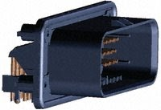

# SSCP - Connector Selection Matrices

# Connector Selection Matrices

Warning: work in progress, not done yet

### Wire to Board, Unsealed

Tiny (<1A)

Hirose DF50 - New connector designed to replace the DF13, it has high-vibration two-finger contacts and an easy to remove, positive latch. Difficult to crimp by hand due to small pitch

Molex Picoblade - Avoid like the plague due to very small size, lack of strain relief, and very low (<3) cycle life. Cause of numerous failures on any number of projects and solar cars.

Small (<5A)

Hirose DF3 - Small PCB connector designed for appliances. Pin-style contacts, easy to crimp, with positive lock. High pullout force.

Hirose GT8E - Used in the Nissan Leaf motor controller for all signals, this ultra-high vibration resistant connector has everything good - positive latch, good housing, good crimps, reasonable area for strain relief, but has medium availability

Molex Microfit - Not recommended by Nathan due to failures on Xenith and Luminos (battery sense lines during a drive on Xenith, and a motor interface board on Luminos). Used extensively on the Tesla Roadster...according to Dorian West, this type of connector was "systematically purged" from later versions due to poor reliability. Note that proper strain relief and equal wire lengths are a requirement for using this connector.

Medium (<20A)

Deutsch DT (with box) - Used extensively on Luminos with no known failures, this connector system is excellent due to the great pcb-mount connectors and matching boxes. Use self-adhesive heat-shrink to make boots for the connectors. Also, make sure the correct four-indent crimper is used.

Large (<40A)

TE ET Power - Used successfully on Xenith and Luminos, this is the the best high-current wire-to-board

Molex Mini-fit Sr - Used on several projects (not at solar car) successfully. Solar car designs have preferred the ET power connector or ring terminals.

Keystone or Wurth Terminal - Used successfully on Luminos, this is the best way to get power to a board. Bolting a wire directly onto a PCB risks compression set of the PCB plastic, causing variations in contact resistance. Using a bolted ring terminal on a Keystone or Wurth Terminal solves this problem. Just make sure to use loctite or other thread locking method on the bolt. Wurth terminals have higher current ratings and better threads, but are more expensive.

### Wire to Board, Sealed to Panel

Tiny (1A)

Small wire to board connectors are difficult to seal because they're so tiny, so don't usually exist.

Small (<5A)

Phoenix or Binder USA M8 PCB mount Connectors (RA and Straight)

Phoenix M12 Connectors - Used extensively in both Xenith and Luminos with zero failures, these are the gold standard for reliable, sealed, impossible-to-fuck-up connector systems. A large array of premade cables are available for this connector system.

Medium (<20A)

TE Ampseal - Used at Mission Motors for motor controller applications,

Large (<40A)

Molex MX150L - used successfully on the Warp Motor project for 35A currents in high vibration. Pin insertion is a difficult, confusing process. Maximally rated to 40A

DEUTSCH DTP13-4P - An option instead of the MX150L. Not used on any known project, but Deutsch connectors are usually very high quality. Rated for 25A/pin

### Wire to Wire, Sealed to Panel

Tiny

Small connectors are typically not available

Small (<5A)

Phoenix M8

Hirose HR30

Phoenix M12

Lemo Redel - Well designed waterproof plastic connectors that are much cheaper than normal LEMO connectors. Rated for extremely high cycles (1000).

Medium (<20A)

Deutsch DT - See above

Large (<40A)

Molex MX150L - See above

Amphenol Eco-mate - Used successfully for the Xenith motor hall sensor wires. Used with Igus high-flex cable.

TE CPC - Used successfully for the array umbilical for Xenith, this style of connector is highly reliable, but difficult to repair and assemble, even for a skilled assembler. These connectors generally come with excellent strain relief and sealing.

Hella (+40A)

TE HVA280 - Used on the Luminos battery pack with mixed success. No problems with electrical connection or strain relief, but the latching mechanism failed after a number of cycles (50?) and a screwdriver had to be used. The connector is available with excellent panel-mount keyed connector arrays

Harting Han-Eco Connector - Used on the Eindhoven family saloon car, this configurable connector can be configured with two very large (100A?) contacts, is fully sealed, and designed for high cycles. It is quite large.

### Wire to Wire, Sealed

Note - wire to wire connectors MUST have excellent strain relief for solar car races. Any connector used for repeated use will suffer significant wear and tear - any connector without awesome strain relief WILL fail. MX150L connectors DO not meet this requirement. Amphenol Eco-mates or Amphenol CPC connectors do.

Small (<5A)

M5 Connectors

Hirose HR30

Phoenix M12

Medium (<20A)

Large (<40A)

MX150L - See above

Amphenol Eco-mate - Used successfully for Xenith's motor hall sensor wires.

MUST HAVE STRAIN RELIEF!!!!

Don't use wire to wire connectors if you can avoid it

### Wire to Wire, Unsealed

Anderson Power Poles - NOT RECOMMENDED for high vibration environments. Numerous failures on the Xenith motor resulted in one phase not being connected.

In general, unsealed wire to wire connectors are not recommended for high-reliability environments.

