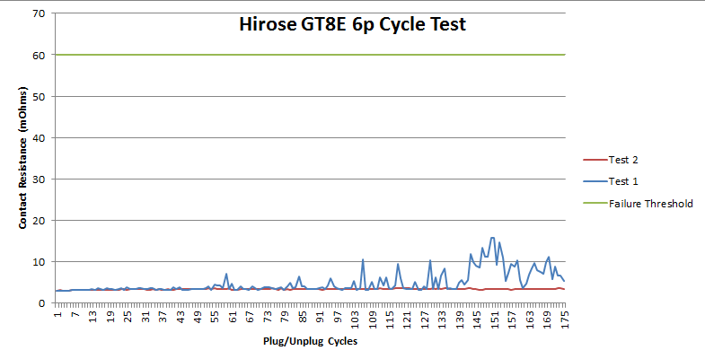
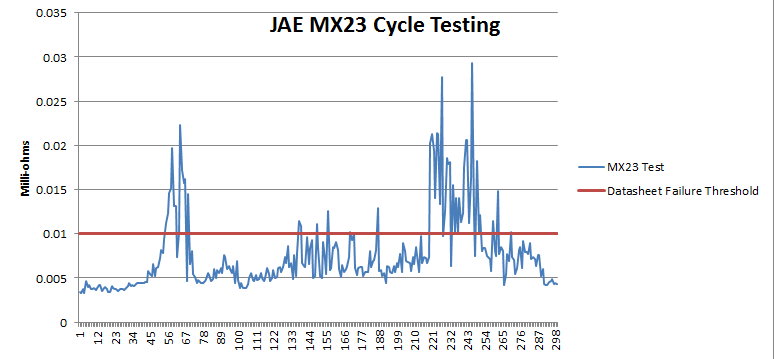
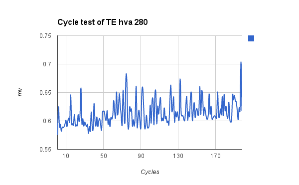

# SSCP - Connector Wisdom

# Connector Wisdom

"No matter how much time you spend doing connectors right, it's worth it." - Nathan Hall-Snyder

Connector Checklist

Does your connector:

1. Have sufficient cycle ratings for use on solar car (generally you want >100, though connector datasheets will often under-rate their cycle life. Buy it and test it if you're not sure)
2. Require cutting down the cable to fit in the crimp size? If so, it's a hack...redesign your system.
3. Have cable strain relief? Examples of strain relief include a screw-down clamp on the end or a rubber seal that holds the wire
4. Can it be purchased with a credit card online (digikey, mouser, newark, others)? While not required, sticking to purchasable connectors lets us get to a working board faster.
5. Is it made by Molex? ghall1@stanford.edu for approval.
6. Do we have a crimper that can crimp the contacts? We have several universal crimpers which do an OK job. Application specific crimpers are always better. Most contacts will have a rated pull-out strength (how much you can tug on the wire before it breaks). Make sure that you test so that a crimp with your crimper meets this spec. Do a pull test of at least 1/2 the rated force on every crimp you do.

Have sufficient cycle ratings for use on solar car (generally you want >100, though connector datasheets will often under-rate their cycle life. Buy it and test it if you're not sure)

Require cutting down the cable to fit in the crimp size? If so, it's a hack...redesign your system.

Have cable strain relief? Examples of strain relief include a screw-down clamp on the end or a rubber seal that holds the wire

Can it be purchased with a credit card online (digikey, mouser, newark, others)? While not required, sticking to purchasable connectors lets us get to a working board faster.

Is it made by Molex? ghall1@stanford.edu for approval.

[ ghall1@stanford.edu](mailto:ghall1@stanford.edu)

Do we have a crimper that can crimp the contacts? We have several universal crimpers which do an OK job. Application specific crimpers are always better. Most contacts will have a rated pull-out strength (how much you can tug on the wire before it breaks). Make sure that you test so that a crimp with your crimper meets this spec. Do a pull test of at least 1/2 the rated force on every crimp you do.

If your connector is inside a box:

* Is it PCB mount? If it's not, it's wrong. Go redesign your system. PCB mount connectors remove ambiguity and lessen the chance of wire harnesses being made wrong.Does the PCB mount side have THROUGH HOLE strain relief, SEPARATE FROM THE PINS. Experiences with microfits have shown that surface mount strain relief is often insufficient and causes broken connectors and ripped traces. No-one wants that...use a real connector.If it has screw terminals, go choose another connector. Screw terminals are known to fail even when seemingly designed properly. Phoenix screw terminals are designed for industrial equipment, not vehicles.Are the contacts gold plated? Gold contacts generally have higher cycle life and don't usually cost that much more than other coatings. Silver platings are generally used for high power contacts.
* Is it PCB mount? If it's not, it's wrong. Go redesign your system. PCB mount connectors remove ambiguity and lessen the chance of wire harnesses being made wrong.
* Does the PCB mount side have THROUGH HOLE strain relief, SEPARATE FROM THE PINS. Experiences with microfits have shown that surface mount strain relief is often insufficient and causes broken connectors and ripped traces. No-one wants that...use a real connector.
* If it has screw terminals, go choose another connector. Screw terminals are known to fail even when seemingly designed properly. Phoenix screw terminals are designed for industrial equipment, not vehicles.
* Are the contacts gold plated? Gold contacts generally have higher cycle life and don't usually cost that much more than other coatings. Silver platings are generally used for high power contacts.

1. Is it PCB mount? If it's not, it's wrong. Go redesign your system. PCB mount connectors remove ambiguity and lessen the chance of wire harnesses being made wrong.
2. Does the PCB mount side have THROUGH HOLE strain relief, SEPARATE FROM THE PINS. Experiences with microfits have shown that surface mount strain relief is often insufficient and causes broken connectors and ripped traces. No-one wants that...use a real connector.
3. If it has screw terminals, go choose another connector. Screw terminals are known to fail even when seemingly designed properly. Phoenix screw terminals are designed for industrial equipment, not vehicles.
4. Are the contacts gold plated? Gold contacts generally have higher cycle life and don't usually cost that much more than other coatings. Silver platings are generally used for high power contacts.

Is it PCB mount? If it's not, it's wrong. Go redesign your system. PCB mount connectors remove ambiguity and lessen the chance of wire harnesses being made wrong.

Does the PCB mount side have THROUGH HOLE strain relief, SEPARATE FROM THE PINS. Experiences with microfits have shown that surface mount strain relief is often insufficient and causes broken connectors and ripped traces. No-one wants that...use a real connector.

If it has screw terminals, go choose another connector. Screw terminals are known to fail even when seemingly designed properly. Phoenix screw terminals are designed for industrial equipment, not vehicles.

Are the contacts gold plated? Gold contacts generally have higher cycle life and don't usually cost that much more than other coatings. Silver platings are generally used for high power contacts.

If your connector is outside a box:

* Does it have cable strain relief? Examples of strain relief include a screw-down clamp on the end or a rubber seal that holds the wire.
* Does it have cable strain relief? Examples of strain relief include a screw-down clamp on the end or a rubber seal that holds the wire.

1. Does it have cable strain relief? Examples of strain relief include a screw-down clamp on the end or a rubber seal that holds the wire.

Does it have cable strain relief? Examples of strain relief include a screw-down clamp on the end or a rubber seal that holds the wire.

1. Does it have panel strain relief? Examples of panel strain relief include a bolt pattern for mounting the connector. Hot glue does not count, epoxy might count in some circumstances
2. Is it IP67, IP68, IP69K, IP6K9K? Dust and humidity can cause problems, but we require this mostly because almost all connectors with these specifications have a good locking scheme. Locking connectors are important for vibration.Prefer the crimp version - while solder cups seem nice, they always end up messy.
3. Prefer the crimp version - while solder cups seem nice, they always end up messy.

Does it have panel strain relief? Examples of panel strain relief include a bolt pattern for mounting the connector. Hot glue does not count, epoxy might count in some circumstances

Is it IP67, IP68, IP69K, IP6K9K? Dust and humidity can cause problems, but we require this mostly because almost all connectors with these specifications have a good locking scheme. Locking connectors are important for vibration.

1. Prefer the crimp version - while solder cups seem nice, they always end up messy.

Prefer the crimp version - while solder cups seem nice, they always end up messy.

If your connector is a power or high voltage connector:

1. Have the correct gauge for the current you'd like to run? Do a quick calculation to determine the voltage drop and power dissipation across your connector and across your wire. Make sure that the power loss is acceptable to the system designer.
2. Is it made by Anderson Power Products? Email  ghall1@stanford.edu for approval.
3. Is it rated for the voltages you plan on using? Sometimes automotive 12V connectors will not be rated for high voltages. Make sure your pin to pin voltages do not exceed the rating.
4. Is it positive locking? Positive locking means that if you yanked on a cable, something would actually physically be damaged before it comes undone. Anderson Power Poles do not fit this requirement. An example of a positive locking connector
5. Does it support for HVIL? HVIL is High Voltage Interlock. The idea is that if a high voltage connector is unplugged, the device supplying the high voltage will open the contactor and remove the high voltage. This is important from a safety perspective. While generally only EV-specific connectors have this, two pins can be shorted on a 4 pin connector to achieve HVIL.

Have the correct gauge for the current you'd like to run? Do a quick calculation to determine the voltage drop and power dissipation across your connector and across your wire. Make sure that the power loss is acceptable to the system designer.

Is it made by Anderson Power Products? Email  ghall1@stanford.edu for approval.

[ ghall1@stanford.edu](mailto:ghall1@stanford.edu)

Is it rated for the voltages you plan on using? Sometimes automotive 12V connectors will not be rated for high voltages. Make sure your pin to pin voltages do not exceed the rating.

Is it positive locking? Positive locking means that if you yanked on a cable, something would actually physically be damaged before it comes undone. Anderson Power Poles do not fit this requirement. An example of a positive locking connector

[ positive locking connector](http://www.te.com/content/dam/te/global/english/industries/hybrid-electric-mobility-solutions/amp-med-low-curr-hva-280.pdf)

Does it support for HVIL? HVIL is High Voltage Interlock. The idea is that if a high voltage connector is unplugged, the device supplying the high voltage will open the contactor and remove the high voltage. This is important from a safety perspective. While generally only EV-specific connectors have this, two pins can be shorted on a 4 pin connector to achieve HVIL.

Hirose GT8E Cycle Life Testing

In the interest of learning whether the cycle life rating listed on a datasheet is valid, we did cycle testing on two Hirose GT8E 8p connectors using a milli-ohm meter. The result is here:

The rated cycle life on this connector is 30 cycles. As you can see, the connector is far below its rated "failure point, even after six times its rated cycle life. Perhaps oxidation time and temperature can affect the performance.

JAE MX23 Cycle TEsting

An 18p connector was cycled with a .5A test current. The datasheet lists 10 mOhm as the maximum contact resistance...this connector reached that after 50 cycles. However, the connector continued to have reasonably low contact resistance as long as the test was measured. For comparison, the Hirose GT8E lists its failure point at 60 mOhm.

the hva 280 connector was tested at 1 amp  for 200 cycles. The connector is officially rated to 10 cycles, but survived for at least 200 cycles.

Good Connector Catalogs:

http://www.amphenol.info/downloads/28_ecomate_052009_e.pdf Eco Mate

[http://www.amphenol.info/downloads/28_ecomate_052009_e.pdf](http://www.amphenol.info/downloads/28_ecomate_052009_e.pdf)

http://www.te.com/automotive/pdf/1654294-3.pdf TE EV Stuff

[http://www.te.com/automotive/pdf/1654294-3.pdf](http://www.te.com/automotive/pdf/1654294-3.pdf)

Connector Companies (in no particular order)

Molex (www.molex.com): 

[www.molex.com](http://i.imgur.com/vcfRl.gif)

Provides mostly shitty connectors and a few good ones. Molex products were used with limited success on Apogee and Xenith. Apogee had a number of crippling failures due to Molex mini-fit. Xenith had a number of annoying failures due to the use if microfit connectors. Microfit failures included cycle life failures, crimp failures, and connectors-ripping-pads-off-the-board failures. We traditionally use molex stuff because it's easy to get.

Connectors used successfully: none

Connectors that caused problems: Molex Mini-fit, Molex Micro-fit.

Suggested Connectors: Molex CMC, Molex MX150, Ring terminals

TE Connectivity:

Multinational company that provides generally expensive, hard to get, and generally awesome connectors. Notable for how extraordinarily terrible their catalog is.

Connectors used successfully on solar car: ET power connector, Xenith Umbilical Connector

Connectors that caused problems: none

Suggested Connectors: ET Power connector, HVA280 EV connector, CPC connectors

Amphenol:

Connectors used successfully:  eco-mate sealed connectors

Suggested Connectors: Eco-mate

Find other waterproof products here: http://www.amphenolltw.com/p2-products.php

[ http://www.amphenolltw.com/p2-products.php](http://www.amphenolltw.com/p2-products.php)

JST:

Japanese company that supplies large quantities of connectors to Japanese Automotive OEMs and consumer electronics companies. Sells very high quality connectors that are near impossible to actually buy due to minimum quantities of 500 in most cases.

JAE:

Japanese company that supplies automotive and aerospace connectors. Almost their entire catalog is available on Digikey

Suggested Connectors: MX34, MX23

Deutsch (now TE)

Company that sells waterproof racing connectors. Used extensively by Mission Motors and Formula 1 teams. Also sells boxes

Connectors used successfully: Deutsch DT, used on an MPPT

Connectors that caused problems: none

Suggested Connectors: all

Neutrik:

Manufacturer of quick-change audio cables. Notable for very cheap, easy to assembly power connectors. No sealing.

Connectors used successfully: 4pos speak-on connectors

Connectors that caused problems: if the screw terminals are not properly done, they will fail

Suggested Connectors: none, these are connectors for speakers, not for cars.

Switchcraft (www.switchcraft.com):

[www.switchcraft.com](http://www.switchcraft.com)

Sells small, high quality connectors with a hobbyist intent.

Connectors used successfully: en3 circular plastic connectors

Connectors that caused problems: none

Suggested connectors: none

Anderson Power Products (Anderson Power Products):

[Anderson Power Products](http://i.imgur.com/ql0Rx.gif)

Sells a wide range of shitty products

Connectors used successfully:  APP SB 50 Connector

Connectors that caused problems: APP PowerPole. Avoid these at all costs.

Suggested connectors: none, avoid anderson power pole

Delphi/FCI:

FCI is a French company that makes a wide array of very high quality automotive connectors. Their EV specific connectors are used extensively by Nissan in the Leaf. Their products are difficult to source.

Samtec:

Company that sells .1" headers and rugged board-to-board and wire-to-board connectors. Very friendly and fast sample service.

Connectors used successfully: STM programming header

Connectors that caused problems: none

Phoenix Contact:

German mega-corporation that sells industrial connectors. Phoenix sponsored our team for a large quantity of M12 sensor connectors for Xenith.

Connectors used successfully: M12 pcb mount, m12 sensor cables.

Connectors that caused problems: phoenix screw terminals.

Hirose:

Japanese company that makes high quality automotive connectors. While we have not used any hirose parts, there is talk about using Hirose GT8E connectors to replace Molex Micro-fits

### Souriau:

French aerospace company: http://www.souriau.com/index.php?id=intro 

[http://www.souriau.com/index.php?id=intro](http://www.souriau.com/index.php?id=intro)

Turck:

Competitor to Phoenix Contact. Sells machined (instead of die cast) M12 components. Used extensively on the Google Self Driving Car Project

Huber+Suhner:

Makes cabling and pass-through connectors for electric vehicles http://ipaper.ipapercms.dk/HUBERSUHNER/Marketsegments/Transportation/AutoProductCatalogueEN/

[http://ipaper.ipapercms.dk/HUBERSUHNER/Marketsegments/Transportation/AutoProductCatalogueEN/](http://ipaper.ipapercms.dk/HUBERSUHNER/Marketsegments/Transportation/AutoProductCatalogueEN/)

Coroplast:

Makes very, very nice electric vehicle cables. Sample part number: FLR2G2GCB2G http://www.coroplast.de/uploads/tx_shtcorodownloads/CP_Brosch_e_Mobility_engl.pdf

[ http://www.coroplast.de/uploads/tx_shtcorodownloads/CP_Brosch_e_Mobility_engl.pdf](http://www.coroplast.de/uploads/tx_shtcorodownloads/CP_Brosch_e_Mobility_engl.pdf)

Staubli

CEB Connectors for motorsports: http://www.staubli.com/index.php?eID=tx_nawsecuredl&u=0&file=fileadmin/user_upload/staublicom/connectors/products/CEB/pdf/CEB_staubli_Z422e.pdf&t=1346367478&hash=13b5b61fc902761cf073881dd5878d1ae4a46fbc

[http://www.staubli.com/index.php?eID=tx_nawsecuredl&u=0&file=fileadmin/user_upload/staublicom/connectors/products/CEB/pdf/CEB_staubli_Z422e.pdf&t=1346367478&hash=13b5b61fc902761cf073881dd5878d1ae4a46fbc](http://www.staubli.com/index.php?eID=tx_nawsecuredl&u=0&file=fileadmin/user_upload/staublicom/connectors/products/CEB/pdf/CEB_staubli_Z422e.pdf&t=1346367478&hash=13b5b61fc902761cf073881dd5878d1ae4a46fbc)

Yamaichi

Company which makes small data connectors as well as an array of solar connectors and boxes, as well as high current connectors for processors. http://www.yamaichi.com/

[ http://www.yamaichi.com/](http://www.yamaichi.com/)

Hypertronics

Maker of nice plastic connectors with hyperboloid contacts good for 100000+ cycles. 8A max. http://www.hypertronics.com/en/Default.aspx

Yazaki

Japanese automotive connector manufacturer. Used commonly in all sorts of production vehicles.

LS Cable

Cable manufacturer, also makes HV electric vehicle connectors: http://m.lscns.com/catalogs/LS_HV_Components_for_EV_EN_0905.pdf

[http://m.lscns.com/catalogs/LS_HV_Components_for_EV_EN_0905.pdf](http://m.lscns.com/catalogs/LS_HV_Components_for_EV_EN_0905.pdf)

### Chogori

Makes waterproof connectors used on the Gogoro electric scooter: http://www.chogoriusa.com/standard.html

[http://www.chogoriusa.com/standard.html](http://www.chogoriusa.com/standard.html)

### Embedded Google Drive File

Google Drive File: [Embedded Content](https://drive.google.com/embeddedfolderview?id=106eAnBP5fBvPPV6cnR9qXw2qbGQPk4Og#list)

<iframe width="100%" height="400" src="https://drive.google.com/embeddedfolderview?id=106eAnBP5fBvPPV6cnR9qXw2qbGQPk4Og#list" frameborder="0"></iframe>

