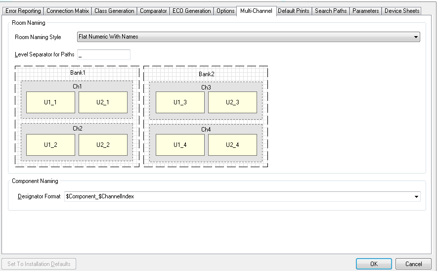

# SSCP - Multi-Channel Design

# Multi-Channel Design

Altium has the powerful feature of duplicating blocks of schematic or layout. 

When imported into a PCB, though, the silkscreen is extremely unwieldy. Changing the Project Options as shown below provides a designator such as "Q1_1", rather than "Q1_U_BLEEDER_1":

