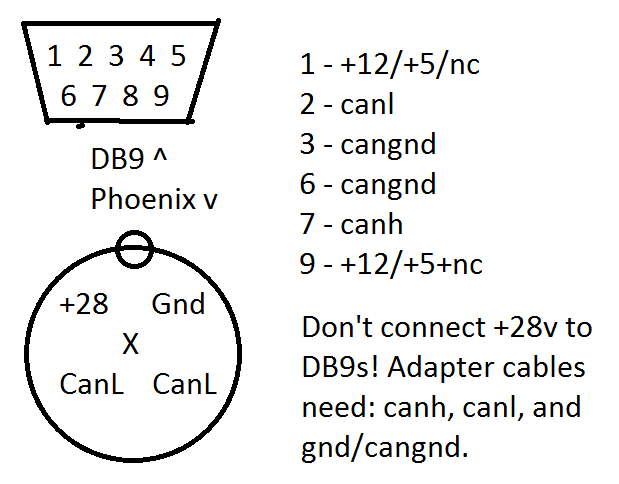

# SSCP - Standards+Connectors

# Standards+Connectors

DEPRECATED. NEW STANDARDS HERE Sunbad External Connector Pin Reference

[Sunbad External Connector Pin Reference](/stanford.edu/testduplicationsscp/home/sscp-2012-2013/electrical-2012-2013/luminos-pinouts-and-connector-part-numbers)

Xenith CAN

* The main canbus uses Phoenix 5-pin b-coated M12 circular connectors. It carries CANH, CANL, GND, and +28volts.The colors for Phoenix contact cables are:Green +28VYellow: GNDPink: CanHGray: CanLBrown: EDiscWhite: ShieldThe battery pack no longer has a canbus, temp and voltage module sensors are wired directly into the bps motherboard.The tritium canbus uses a Phoenix 5-pin a-coated M12 circular connectors. It carries CANH, CANL, GND, and +12volts. These are purposely incompatible with the main canbus cables, so that we never accidentally connect one to the other and explode the tritium.Pinout for both the main and tritium can cables, and, for comparision, the CANUSB adapter
* The main canbus uses Phoenix 5-pin b-coated M12 circular connectors. It carries CANH, CANL, GND, and +28volts.
* The colors for Phoenix contact cables are:Green +28VYellow: GNDPink: CanHGray: CanLBrown: EDiscWhite: Shield
* Green +28V
* Yellow: GND
* Pink: CanH
* Gray: CanL
* Brown: EDisc
* White: Shield
* The battery pack no longer has a canbus, temp and voltage module sensors are wired directly into the bps motherboard.
* The tritium canbus uses a Phoenix 5-pin a-coated M12 circular connectors. It carries CANH, CANL, GND, and +12volts. These are purposely incompatible with the main canbus cables, so that we never accidentally connect one to the other and explode the tritium.
* Pinout for both the main and tritium can cables, and, for comparision, the CANUSB adapter

* The main canbus uses Phoenix 5-pin b-coated M12 circular connectors. It carries CANH, CANL, GND, and +28volts.
* The colors for Phoenix contact cables are:Green +28VYellow: GNDPink: CanHGray: CanLBrown: EDiscWhite: Shield
* Green +28V
* Yellow: GND
* Pink: CanH
* Gray: CanL
* Brown: EDisc
* White: Shield
* The battery pack no longer has a canbus, temp and voltage module sensors are wired directly into the bps motherboard.
* The tritium canbus uses a Phoenix 5-pin a-coated M12 circular connectors. It carries CANH, CANL, GND, and +12volts. These are purposely incompatible with the main canbus cables, so that we never accidentally connect one to the other and explode the tritium.
* Pinout for both the main and tritium can cables, and, for comparision, the CANUSB adapter

The main canbus uses Phoenix 5-pin b-coated M12 circular connectors. It carries CANH, CANL, GND, and +28volts.

The colors for Phoenix contact cables are:

* Green +28V
* Yellow: GND
* Pink: CanH
* Gray: CanL
* Brown: EDisc
* White: Shield

Green +28V

Yellow: GND

Pink: CanH

Gray: CanL

Brown: EDisc

White: Shield

The battery pack no longer has a canbus, temp and voltage module sensors are wired directly into the bps motherboard.

The tritium canbus uses a Phoenix 5-pin a-coated M12 circular connectors. It carries CANH, CANL, GND, and +12volts. These are purposely incompatible with the main canbus cables, so that we never accidentally connect one to the other and explode the tritium.

Pinout for both the main and tritium can cables, and, for comparision, the CANUSB adapter

* CANUSB to Phoenix adapters are simple. We currently have two. They can be used with both the Tritium and main canbuses. They only connect CANH, CANL, and GND. Don't connect power!
* CANUSB to Phoenix adapters are simple. We currently have two. They can be used with both the Tritium and main canbuses. They only connect CANH, CANL, and GND. Don't connect power!

* CANUSB to Phoenix adapters are simple. We currently have two. They can be used with both the Tritium and main canbuses. They only connect CANH, CANL, and GND. Don't connect power!

CANUSB to Phoenix adapters are simple. We currently have two. They can be used with both the Tritium and main canbuses. They only connect CANH, CANL, and GND. Don't connect power!

